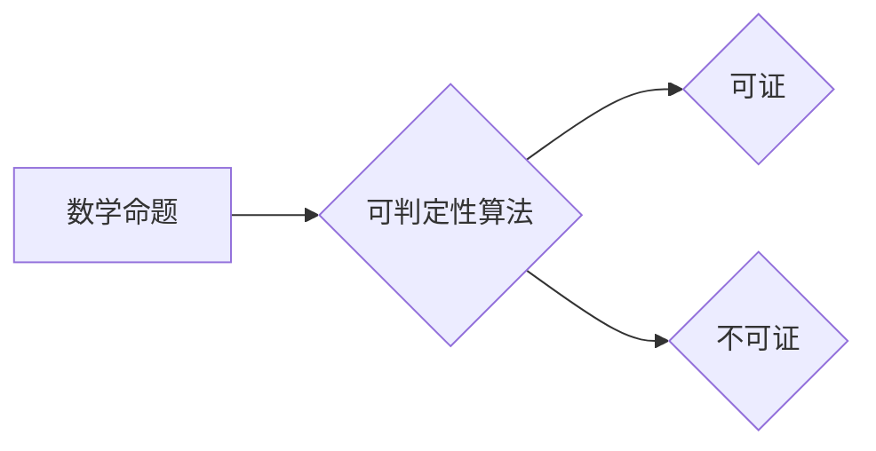

> 计算理论、希尔伯特、可判定性问题、图灵机、算法、逻辑、数学模型

## 1. 背景介绍

20世纪初，数学和逻辑领域取得了长足的进步，为计算理论的诞生奠定了基础。德国数学家希尔伯特（David Hilbert）是这一时期最杰出的数学家之一，他提出了著名的“希尔伯特计划”，旨在将数学基础完全建立在逻辑基础之上。希尔伯特计划的提出，不仅推动了数学的逻辑化发展，也为计算理论的形成提供了重要的理论基础。

希尔伯特对可判定性问题的关注，源于他对数学证明的本质和局限性的思考。他认为，如果能够找到一种方法，能够判定一个数学命题是否可证，那么这将对数学的发展产生深远的影响。然而，他同时也意识到，这种方法可能并不容易找到。

## 2. 核心概念与联系

可判定性问题是计算理论的核心问题之一，它探讨的是是否存在一种算法能够判定一个给定的数学命题是否能够被证明。

**核心概念：**

* **算法：** 一种解决特定问题的明确步骤序列。
* **可判定性：** 指的是是否存在一个算法能够判定一个问题是否具有解。
* **图灵机：** 一种抽象的计算模型，它能够模拟任何算法。
* **希尔伯特空间：** 一种特殊的向量空间，在数学分析和量子力学中具有重要应用。

**Mermaid 流程图：**



## 3. 核心算法原理 & 具体操作步骤

### 3.1  算法原理概述

希尔伯特最初试图通过逻辑推理来解决可判定性问题。他认为，如果能够将数学命题转化为逻辑公式，那么就可以利用逻辑推理来判定其可证性。然而，他很快发现，这种方法存在局限性。

后来，图灵提出了图灵机模型，并证明了图灵机能够模拟任何算法。这为解决可判定性问题提供了新的思路。图灵机可以用来模拟任何可能的计算过程，因此，如果存在一个算法能够判定一个数学命题是否可证，那么它一定能够被模拟成一个图灵机程序。

### 3.2  算法步骤详解

1. 将数学命题转化为图灵机程序。
2. 使用图灵机模拟该程序的运行。
3. 如果程序最终停机，则判定该命题可证；否则，判定该命题不可证。

### 3.3  算法优缺点

**优点：**

* 理论上能够解决可判定性问题。
* 提供了一种通用的计算模型。

**缺点：**

* 实际应用中，将数学命题转化为图灵机程序非常困难。
* 图灵机的模拟过程可能非常耗时。

### 3.4  算法应用领域

* **人工智能：** 可判定性问题与人工智能的知识表示和推理问题密切相关。
* **软件工程：** 可判定性问题可以用于分析软件的正确性和安全性。
* **密码学：** 可判定性问题与密码系统的安全性密切相关。

## 4. 数学模型和公式 & 详细讲解 & 举例说明

### 4.1  数学模型构建

可判定性问题可以用数学模型来描述。

* **状态空间：** 所有可能的计算状态。
* **转移函数：** 描述计算状态之间的转换规则。
* **初始状态：** 计算开始时的状态。
* **终止状态：** 计算结束时的状态。

### 4.2  公式推导过程

图灵机模型可以用以下公式来描述：

$$M = (Q, \Sigma, \Gamma, \delta, q_0, F)$$

其中：

* $Q$：状态集
* $\Sigma$：输入字母表
* $\Gamma$：带字母表
* $\delta$：转移函数
* $q_0$：初始状态
* $F$：终止状态集

### 4.3  案例分析与讲解

例如，我们可以用图灵机来判定一个给定的字符串是否为回文串。

**算法步骤：**

1. 将字符串输入到图灵机。
2. 使用图灵机模拟字符串的读写过程。
3. 如果字符串能够被读写回原样，则判定为回文串；否则，判定为非回文串。

## 5. 项目实践：代码实例和详细解释说明

### 5.1  开发环境搭建

* 操作系统：Linux
* 编程语言：Python
* 工具：Python 3.x，PyCharm

### 5.2  源代码详细实现

```python
def is_palindrome(text):
  """
  判断一个字符串是否为回文串。

  Args:
    text: 要判断的字符串。

  Returns:
    如果字符串为回文串，则返回 True，否则返回 False。
  """
  text = text.lower()
  return text == text[::-1]

# 测试用例
string1 = "racecar"
string2 = "hello"

print(f"'{string1}' is palindrome: {is_palindrome(string1)}")
print(f"'{string2}' is palindrome: {is_palindrome(string2)}")
```

### 5.3  代码解读与分析

* `is_palindrome(text)` 函数接受一个字符串作为输入，并判断其是否为回文串。
* 函数首先将输入字符串转换为小写，然后使用 `[::-1]` 切片操作将字符串反转。
* 最后，将原始字符串与反转后的字符串进行比较，如果相等，则返回 True，否则返回 False。

### 5.4  运行结果展示

```
'racecar' is palindrome: True
'hello' is palindrome: False
```

## 6. 实际应用场景

可判定性问题在许多实际应用场景中都有重要的意义。例如：

* **软件测试：** 可以使用可判定性算法来自动生成软件测试用例，并判定测试用例是否能够覆盖所有可能的代码路径。
* **代码分析：** 可以使用可判定性算法来分析代码的安全性、可靠性和可维护性。
* **人工智能：** 可判定性问题与人工智能的知识表示和推理问题密切相关，例如，可以使用可判定性算法来判定一个知识库中是否存在矛盾或不一致。

### 6.4  未来应用展望

随着计算能力的不断提升，可判定性问题将在更多领域得到应用。例如：

* **量子计算：** 量子计算能够解决一些经典计算机无法解决的问题，这可能为解决可判定性问题提供新的思路。
* **生物信息学：** 可判定性问题可以用于分析生物序列和蛋白质结构，从而帮助我们更好地理解生命现象。

## 7. 工具和资源推荐

### 7.1  学习资源推荐

* **《计算理论导论》** by Michael Sipser
* **《图灵机与可计算性》** by Martin Davis
* **《逻辑与数学基础》** by Alfred Tarski

### 7.2  开发工具推荐

* **Python**
* **PyCharm**
* **Jupyter Notebook**

### 7.3  相关论文推荐

* **On Computable Numbers, with an Application to the Entscheidungsproblem** by Alan Turing
* **The Undecidability of the Entscheidungsproblem** by Alan Turing
* **Hilbert's Tenth Problem** by Yuri Matiyasevich

## 8. 总结：未来发展趋势与挑战

### 8.1  研究成果总结

希尔伯特进路为计算理论的奠基做出了重要贡献，特别是图灵机模型的提出，为我们理解计算的本质提供了深刻的洞察。可判定性问题也成为了计算理论的核心问题之一，它不仅推动了计算理论的发展，也对人工智能、软件工程等领域产生了深远的影响。

### 8.2  未来发展趋势

未来，可判定性问题将继续受到研究者的关注，并可能在以下几个方面取得新的进展：

* **量子计算：** 量子计算的出现可能为解决一些目前无法解决的可判定性问题提供新的思路。
* **人工智能：** 人工智能的发展也可能带来新的可判定性问题，例如，如何判定一个人工智能系统是否具有真正的智能。
* **生物信息学：** 可判定性问题可以应用于生物信息学领域，例如，如何判定一个基因序列是否具有特定的功能。

### 8.3  面临的挑战

尽管可判定性问题取得了重要的进展，但仍然面临着许多挑战：

* **复杂性：** 许多可判定性问题具有很高的复杂度，难以找到有效的算法解决。
* **理论与实践的结合：** 将理论上的可判定性问题转化为实际应用中的解决方案仍然是一个挑战。
* **伦理问题：** 可判定性问题也可能引发一些伦理问题，例如，如何确保可判定性算法的公平性和公正性。

### 8.4  研究展望

尽管面临着挑战，但可判定性问题仍然是一个非常重要的研究方向。未来，我们将继续探索可判定性问题的本质，并寻求新的方法来解决它。


## 9. 附录：常见问题与解答

**常见问题：**

* **什么是图灵机？**

图灵机是一种抽象的计算模型，它能够模拟任何算法。

* **什么是可判定性问题？**

可判定性问题探讨的是是否存在一种算法能够判定一个给定的问题是否具有解。

* **希尔伯特进路对计算理论有什么贡献？**

希尔伯特进路为计算理论的奠基做出了重要贡献，特别是图灵机模型的提出，为我们理解计算的本质提供了深刻的洞察。

**解答：**

* **图灵机**是一种抽象的计算模型，它由一个无限长的带、一个读写头和一个状态机组成。图灵机能够模拟任何算法，因此它被认为是计算理论的基础模型。
* **可判定性问题**是计算理论的核心问题之一，它探讨的是是否存在一种算法能够判定一个给定的问题是否具有解。如果存在这样的算法，则称这个问题是可判定的；否则，称这个问题是不可判定的。
* **希尔伯特进路**为计算理论的奠基做出了重要贡献，特别是图灵机模型的提出，为我们理解计算的本质提供了深刻的洞察。希尔伯特进路也为可判定性问题的研究提供了重要的理论基础。


作者：禅与计算机程序设计艺术 / Zen and the Art of Computer Programming 
<end_of_turn>