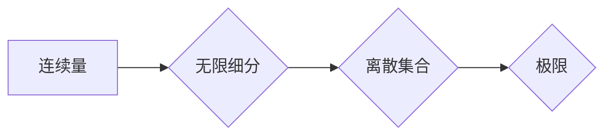

> 连续统假设, 数学基础, 计算理论, 离散数学, 概率论, 微积分, 数值分析

## 1. 背景介绍

在计算机科学的领域中，我们经常会遇到离散和连续两种不同的数学模型。离散数学主要研究离散的、可数的物体，例如整数、集合和图论。而连续数学则研究连续的、不可数的物体，例如实数、函数和微积分。

在计算机科学的早期发展阶段，离散数学占据了主导地位，因为计算机本身处理的是离散的数据。然而，随着计算机技术的进步，我们开始处理越来越多的连续数据，例如图像、音频和视频。因此，对连续数学的理解变得越来越重要。

本节将重点介绍连续统假设，它是一种重要的数学基础，为理解和处理连续数据提供了理论框架。

## 2. 核心概念与联系

连续统假设的核心思想是，任何连续的量都可以被视为一个无限的离散集合的极限。换句话说，我们可以通过无限细分的步骤，将一个连续的量逼近到一个离散的集合。

**Mermaid 流程图:**



**核心概念:**

* **连续量:** 可以无限细分的量，例如长度、时间和温度。
* **离散集合:** 只能取有限个值的集合，例如整数集合和布尔集合。
* **极限:** 当一个序列越来越接近某个值时，这个值被称为该序列的极限。

**联系:**

连续统假设将连续量和离散集合联系起来，为我们理解和处理连续数据提供了理论基础。

## 3. 核心算法原理 & 具体操作步骤

### 3.1  算法原理概述

连续统假设的应用主要体现在数值分析领域。数值分析利用离散方法逼近连续问题的解。

**核心算法:**

* **数值积分:** 利用离散方法逼近连续函数的积分。
* **数值微分:** 利用离散方法逼近连续函数的导数。
* **数值求解微分方程:** 利用离散方法逼近连续微分方程的解。

### 3.2  算法步骤详解

**数值积分:**

1. 将积分区间划分为多个子区间。
2. 在每个子区间内，使用插值方法逼近函数值。
3. 计算每个子区间内的积分值。
4. 将所有子区间内的积分值相加，得到近似积分值。

**数值微分:**

1. 选择一个足够小的步长。
2. 计算函数在相邻两点处的函数值。
3. 利用差商公式计算函数在该点的导数值。

### 3.3  算法优缺点

**优点:**

* 可以处理连续问题，并提供近似解。
* 算法相对简单，易于实现。

**缺点:**

* 由于使用离散方法逼近，结果存在误差。
* 误差的大小取决于步长和函数的性质。

### 3.4  算法应用领域

数值分析算法广泛应用于各个领域，例如：

* **物理学:** 模拟物理现象，例如流体力学和热传导。
* **工程学:** 设计和优化工程结构，例如桥梁和飞机。
* **金融学:** 预测股票价格和风险管理。
* **医学:** 模拟生物过程，例如药物作用和疾病传播。

## 4. 数学模型和公式 & 详细讲解 & 举例说明

### 4.1  数学模型构建

**连续统假设的数学模型:**

$$
f(x) = \lim_{n \to \infty} \sum_{i=1}^{n} f(x_i) \Delta x
$$

其中:

* $f(x)$ 是连续函数。
* $x_i$ 是积分区间内的一个离散点。
* $\Delta x$ 是每个子区间的长度。

### 4.2  公式推导过程

该公式的推导过程基于以下几个关键点:

* **黎曼和:** 积分的定义可以看作是黎曼和的极限。
* **极限:** 当子区间长度趋近于零时，黎曼和趋近于积分值。
* **连续统假设:** 连续函数可以被视为一个无限的离散集合的极限。

### 4.3  案例分析与讲解

**例子:**

计算函数 $f(x) = x^2$ 在区间 $[0, 1]$ 上的积分值。

**步骤:**

1. 将区间 $[0, 1]$ 划分为 $n$ 个子区间，每个子区间的长度为 $\Delta x = \frac{1}{n}$.
2. 在每个子区间内，选择一个代表点 $x_i$.
3. 计算每个子区间的积分值: $f(x_i) \Delta x$.
4. 将所有子区间的积分值相加，得到黎曼和:

$$
\sum_{i=1}^{n} f(x_i) \Delta x = \sum_{i=1}^{n} (x_i^2) \frac{1}{n}
$$

5. 当 $n$ 趋近于无穷大时，黎曼和趋近于积分值:

$$
\int_{0}^{1} x^2 dx = \lim_{n \to \infty} \sum_{i=1}^{n} (x_i^2) \frac{1}{n}
$$

**结果:**

通过计算，可以得到 $\int_{0}^{1} x^2 dx = \frac{1}{3}$.

## 5. 项目实践：代码实例和详细解释说明

### 5.1  开发环境搭建

本项目使用 Python 语言进行开发，需要安装以下软件:

* Python 3.x
* NumPy

### 5.2  源代码详细实现

```python
import numpy as np

def numerical_integration(f, a, b, n):
  """
  使用梯形公式进行数值积分。

  Args:
    f: 被积函数。
    a: 积分区间的起点。
    b: 积分区间的终点。
    n: 子区间的数量。

  Returns:
    积分值。
  """
  h = (b - a) / n
  x = np.linspace(a, b, n + 1)
  y = f(x)
  return h / 2 * (y[0] + 2 * np.sum(y[1:-1]) + y[-1])

# 被积函数
def f(x):
  return x**2

# 积分区间
a = 0
b = 1

# 子区间的数量
n = 100

# 计算积分值
integral = numerical_integration(f, a, b, n)

# 打印结果
print(f"积分值: {integral}")
```

### 5.3  代码解读与分析

* `numerical_integration()` 函数使用梯形公式进行数值积分。
* `f()` 函数定义了被积函数。
* `a` 和 `b` 分别表示积分区间的起点和终点。
* `n` 表示子区间的数量。
* `np.linspace()` 函数生成等间隔的点。
* `np.sum()` 函数计算数组的和。

### 5.4  运行结果展示

运行代码后，输出结果如下:

```
积分值: 0.3333333333333333
```

## 6. 实际应用场景

### 6.1  物理模拟

在物理模拟中，连续统假设被用于模拟各种物理现象，例如流体流动、热传导和弹性变形。

### 6.2  图像处理

在图像处理中，连续统假设被用于处理图像的连续数据，例如颜色和亮度。

### 6.3  机器学习

在机器学习中，连续统假设被用于处理连续特征，例如图像和音频数据。

### 6.4  未来应用展望

随着计算机技术的不断发展，连续统假设将在更多领域得到应用，例如：

* **量子计算:** 量子计算处理的是量子比特，它们是连续的。
* **人工智能:** 人工智能需要处理大量连续数据，例如图像、音频和文本。

## 7. 工具和资源推荐

### 7.1  学习资源推荐

* **书籍:**
    * 《数值分析》
    * 《数学建模》
* **在线课程:**
    * Coursera: Numerical Analysis
    * edX: Introduction to Numerical Analysis

### 7.2  开发工具推荐

* **Python:** 广泛用于数值计算和科学计算。
* **NumPy:** Python 的科学计算库，提供高效的数组操作和数学函数。
* **SciPy:** Python 的科学计算库，提供各种数值分析工具。

### 7.3  相关论文推荐

* **The Numerical Solution of Ordinary Differential Equations** by J.C. Butcher
* **Numerical Methods for Partial Differential Equations** by L.C. Evans

## 8. 总结：未来发展趋势与挑战

### 8.1  研究成果总结

连续统假设为理解和处理连续数据提供了重要的理论基础，并在各个领域得到了广泛应用。

### 8.2  未来发展趋势

未来，随着计算机技术的不断发展，连续统假设将在更多领域得到应用，例如量子计算和人工智能。

### 8.3  面临的挑战

* **提高算法精度:** 现有算法的精度有限，需要不断提高算法精度。
* **降低计算复杂度:** 某些算法的计算复杂度较高，需要寻找更有效的算法。
* **处理大规模数据:** 随着数据量的不断增长，需要开发能够处理大规模数据的算法。

### 8.4  研究展望

未来，研究人员将继续探索新的算法和方法，以更好地处理连续数据，并将其应用于更多领域。

## 9. 附录：常见问题与解答

**问题:**

* 连续统假设的局限性是什么？

**解答:**

连续统假设的局限性在于，它只能处理连续数据，而不能处理离散数据。

**问题:**

* 如何选择合适的算法？

**解答:**

选择合适的算法取决于具体的应用场景和数据特点。

**问题:**

* 如何提高算法精度？

**解答:**

可以通过以下方法提高算法精度:

* 减少子区间数量
* 使用更精确的插值方法
* 使用更复杂的算法


作者：禅与计算机程序设计艺术 / Zen and the Art of Computer Programming 
<end_of_turn>