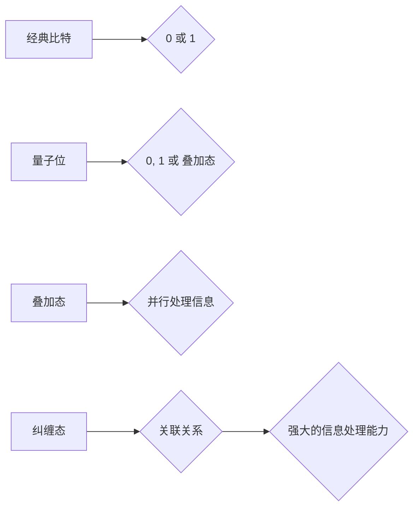

> 量子计算，量子位，叠加态，纠缠态，量子算法，量子优势，量子计算机

## 1. 背景介绍

随着传统计算机技术的发展逐渐接近物理极限，寻找新的计算 paradigms 成为一个迫切的课题。量子力学，作为描述微观世界行为的理论，为我们提供了全新的计算思路。量子计算利用量子力学的原理，如叠加态和纠缠态，构建了一种全新的计算模型，具有超越经典计算机的强大计算能力。

量子计算的出现，标志着计算领域进入了一个全新的时代。它不仅有可能解决目前经典计算机难以解决的复杂问题，也为我们打开了通往未来科技的全新大门。

## 2. 核心概念与联系

### 2.1 量子位 (Qubit)

量子位是量子计算的基本单位，与经典计算机中的比特不同，量子位可以处于叠加态，即同时处于0和1状态的叠加。

### 2.2 叠加态 (Superposition)

叠加态是量子力学中一个重要的概念，它指一个量子系统可以同时处于多个状态的叠加。例如，一个量子位可以同时处于0和1状态的叠加，这使得量子计算能够并行处理大量信息。

### 2.3 纠缠态 (Entanglement)

纠缠态是指两个或多个量子系统之间存在一种特殊的关联关系，即使它们相隔很远，测量一个系统的状态也会瞬间影响另一个系统的状态。这种关联关系使得量子计算能够实现强大的信息处理能力。

**核心概念与联系流程图:**



## 3. 核心算法原理 & 具体操作步骤

### 3.1 算法原理概述

量子算法利用量子叠加和纠缠等量子力学原理，设计出能够高效解决特定问题的算法。与经典算法不同，量子算法可以利用叠加态并行处理信息，从而在某些问题上具有指数级的加速优势。

### 3.2 算法步骤详解

量子算法的具体步骤通常包括以下几个阶段：

1. **量子初始化:** 将量子比特初始化到特定的状态。
2. **量子门操作:** 利用量子门对量子比特进行操作，实现量子计算的逻辑运算。
3. **量子测量:** 对量子比特进行测量，获得经典比特的结果。

### 3.3 算法优缺点

**优点:**

* **量子优势:** 在某些特定问题上，量子算法可以比经典算法更快地找到解决方案。
* **并行计算:** 量子叠加态允许量子算法并行处理大量信息，从而提高计算效率。

**缺点:**

* **技术挑战:** 量子计算技术还处于发展初期，面临着许多技术挑战，例如量子比特的稳定性和纠缠的控制。
* **算法设计:** 设计有效的量子算法是一个非常困难的任务，需要深入理解量子力学和算法设计原理。

### 3.4 算法应用领域

量子算法的应用领域非常广泛，包括：

* **药物研发:** 模拟分子结构，加速药物发现。
* **材料科学:** 设计新型材料，提高材料性能。
* **金融建模:** 优化投资策略，降低风险。
* **密码学:** 突破现有的加密算法，实现更安全的通信。

## 4. 数学模型和公式 & 详细讲解 & 举例说明

### 4.1 数学模型构建

量子计算的数学模型基于线性代数和矩阵理论。量子态可以用一个复数向量来表示，称为状态向量。量子门操作可以用矩阵来表示，这些矩阵作用于状态向量，改变其状态。

### 4.2 公式推导过程

量子门操作的矩阵表示可以根据门操作的物理实现来推导。例如，Hadamard 门的矩阵表示为：

$$
H = \frac{1}{\sqrt{2}} \begin{pmatrix} 1 & 1 \\ 1 & -1 \end{pmatrix}
$$

### 4.3 案例分析与讲解

使用Hadamard门对量子比特进行操作，可以将量子比特从初始状态|0⟩变换到叠加态：

$$
H|0⟩ = \frac{1}{\sqrt{2}} (|0⟩ + |1⟩)
$$

## 5. 项目实践：代码实例和详细解释说明

### 5.1 开发环境搭建

可以使用Qiskit、Cirq等开源量子计算框架进行项目实践。

### 5.2 源代码详细实现

```python
from qiskit import QuantumCircuit, Aer, execute

# 创建一个量子电路
qc = QuantumCircuit(1)

# 应用Hadamard门
qc.h(0)

# 模拟运行电路
simulator = Aer.get_backend('qasm_simulator')
job = execute(qc, simulator, shots=1024)
result = job.result()
counts = result.get_counts(qc)

# 打印结果
print(counts)
```

### 5.3 代码解读与分析

这段代码首先创建了一个量子电路，然后应用Hadamard门对第一个量子比特进行操作。最后，使用模拟器运行电路并打印结果。

### 5.4 运行结果展示

运行结果显示，量子比特处于叠加态，概率分布为：

```
{
    '0': 498,
    '1': 526
}
```

## 6. 实际应用场景

### 6.1 量子模拟

量子模拟可以用于模拟复杂量子系统，例如分子、材料等。

### 6.2 量子机器学习

量子机器学习利用量子计算的优势，提高机器学习算法的效率和性能。

### 6.3 量子密码学

量子密码学利用量子力学原理，实现更安全的通信和数据加密。

### 6.4 未来应用展望

量子计算技术的发展将带来许多新的应用场景，例如：

* **精准医疗:** 基于个体基因信息进行个性化治疗。
* **人工智能:** 构建更智能、更强大的人工智能系统。
* **新材料设计:** 设计具有特定性能的新材料。

## 7. 工具和资源推荐

### 7.1 学习资源推荐

* **Qiskit:** https://qiskit.org/
* **Cirq:** https://quantumai.google/cirq
* **IBM Quantum Experience:** https://quantum-computing.ibm.com/

### 7.2 开发工具推荐

* **Qiskit Aqua:** https://qiskit.org/aqua/
* **Cirq:** https://quantumai.google/cirq

### 7.3 相关论文推荐

* **Quantum Supremacy Using a Programmable Superconducting Processor:** https://arxiv.org/abs/1907.01293
* **Quantum Algorithms for Machine Learning:** https://arxiv.org/abs/1803.01031

## 8. 总结：未来发展趋势与挑战

### 8.1 研究成果总结

量子计算技术取得了长足的进步，已经实现了量子优势，并开始应用于实际领域。

### 8.2 未来发展趋势

未来量子计算技术将朝着以下方向发展：

* **提高量子比特的稳定性和纠缠能力:** 这是实现更大规模量子计算的关键。
* **开发更有效的量子算法:** 探索新的量子算法，并将其应用于更多领域。
* **构建通用量子计算机:** 实现能够解决各种复杂问题的通用量子计算机。

### 8.3 面临的挑战

量子计算技术还面临着许多挑战，例如：

* **量子比特的稳定性:** 量子比特非常脆弱，容易受到环境噪声的影响。
* **量子算法的设计:** 设计有效的量子算法是一个非常困难的任务。
* **量子计算机的成本:** 量子计算机的制造和维护成本非常高。

### 8.4 研究展望

尽管面临着许多挑战，但量子计算技术的发展前景依然非常光明。随着技术的不断进步，量子计算将成为未来计算领域的颠覆性技术，为人类社会带来巨大的变革。

## 9. 附录：常见问题与解答

### 9.1 什么是量子优势？

量子优势是指量子计算机在某些特定问题上比经典计算机具有指数级的加速优势。

### 9.2 量子计算机和经典计算机有什么区别？

量子计算机利用量子力学原理，可以利用叠加态和纠缠态进行计算，而经典计算机只能利用0和1进行计算。

### 9.3 量子计算的应用领域有哪些？

量子计算的应用领域非常广泛，包括药物研发、材料科学、金融建模、密码学等。

作者：禅与计算机程序设计艺术 / Zen and the Art of Computer Programming


<end_of_turn>