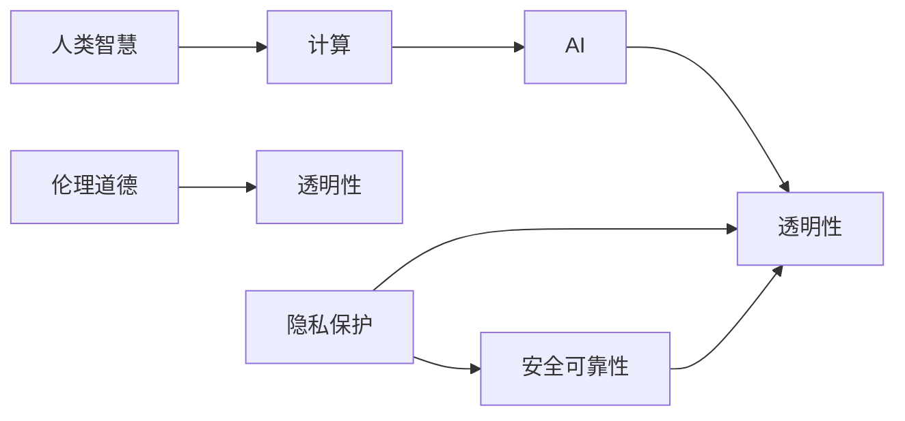

                 

## 1. 背景介绍

### 1.1 问题由来

随着人工智能（AI）技术日新月异，深度学习、机器学习等算法在各行各业中得到广泛应用。从自然语言处理到计算机视觉，从金融风控到智能医疗，AI技术的渗透，给人类带来了巨大的便利与改变。然而，与此同时，AI的应用也引发了诸多伦理道德问题。

- **数据隐私**：大量的个人数据被用于训练AI模型，如何在保障隐私的同时进行高效计算，成为了一个亟需解决的问题。
- **偏见与歧视**：AI模型容易学习并放大数据中的偏见，导致决策中存在歧视现象。
- **决策透明度**：许多AI决策过程难以解释，黑箱化模型使人类难以理解和信任AI。
- **安全与可靠**：AI系统在关键领域（如自动驾驶、医疗诊断等）的应用，对人类安全与可靠性的要求极高，一旦出现问题，后果不堪设想。

在技术迅猛发展的背景下，我们需要思考并解决这些问题，以确保AI技术的健康发展。这正是“人类计算”这一概念的由来。

### 1.2 问题核心关键点

"人类计算"一词，来源于著名计算机科学家、密码学家阿兰·图灵（Alan Turing）。在图灵看来，计算不仅是机器的职责，更是人类智慧的表现。如今，在AI技术迅速发展的同时，我们更需重温图灵的思想，关注AI的道德边界。

1. **计算的边界**：明确AI计算的范围和限制，避免其侵占人类智慧的核心领域。
2. **道德的边界**：制定AI伦理规范，确保AI行为符合社会价值观和伦理道德。
3. **决策的透明度**：提升AI决策过程的透明度，使得人类能够理解和信任AI。
4. **隐私与安全的平衡**：保护数据隐私的同时，保证AI系统的安全性。

本文旨在通过对人类计算的深入探讨，阐释AI技术在应用过程中应遵循的道德边界，以期指导AI技术的健康发展。

## 2. 核心概念与联系

### 2.1 核心概念概述

要理解人类计算的道德边界，首先需要了解一些关键概念及其相互关系：

- **人类智慧**：指人类通过逻辑推理、直觉判断、创造性思维等能力，解决问题的过程。
- **计算**：指通过算法和程序，实现自动化的信息处理过程。
- **AI**：人工智能，指通过算法和计算，使机器具备一定的智能能力，模仿人类思维。
- **伦理道德**：指在社会生活中，衡量个体和群体行为的道德规范和价值观念。
- **透明性**：指系统操作过程的可解释性和可理解性，人类能够理解和信任AI的决策。
- **隐私保护**：指在数据收集和使用过程中，保护个人隐私不受侵犯的措施。
- **安全可靠性**：指系统运行过程中，保持稳定、可控、无害的特性。

这些概念相互交织，共同构成人类计算的道德边界。

### 2.2 核心概念原理和架构的 Mermaid 流程图



这个图展示了人类智慧通过计算得到AI，并受到伦理道德、透明性、隐私保护、安全可靠性等要素的制约。

## 3. 核心算法原理 & 具体操作步骤

### 3.1 算法原理概述

人类计算的道德边界，并不在于计算能力的大小，而在于算法和计算过程中的道德约束。以下是基于人类计算的算法原理概述：

1. **道德约束**：在设计AI算法时，应遵守伦理道德规范，避免偏见和歧视。
2. **透明性**：保证AI决策过程的透明性，便于人类理解和监督。
3. **隐私保护**：在数据收集和处理过程中，严格遵守隐私保护法规，确保用户数据的安全。
4. **安全可靠性**：确保AI系统在关键领域的应用中，保持稳定、可控、无害的特性。

### 3.2 算法步骤详解

具体步骤可概括为以下几个阶段：

1. **算法设计**：在设计AI算法时，需明确道德约束，确保算法公正、透明、可解释。
2. **数据收集**：收集数据时，需遵守隐私保护法规，确保数据匿名化处理。
3. **模型训练**：在模型训练过程中，需确保数据集的多样性和代表性，避免偏见。
4. **系统部署**：在AI系统部署时，需确保系统透明性和安全性，保障用户信任。

### 3.3 算法优缺点

人类计算的道德边界算法具有以下优点：

1. **公平性**：在算法设计中，遵循伦理道德规范，有助于消除偏见和歧视。
2. **透明性**：保证AI决策过程透明，便于人类理解和监督。
3. **隐私保护**：严格遵守隐私保护法规，保护用户数据安全。
4. **安全可靠性**：确保系统稳定、可控、无害，保障系统安全性。

同时，这些算法也存在一些缺点：

1. **设计复杂**：在设计符合道德约束的算法时，需要考虑多种因素，设计复杂。
2. **成本高**：在遵守隐私保护和伦理道德的同时，需要投入更多的资源和成本。
3. **适用性有限**：对于复杂的决策场景，透明性和可解释性可能仍存在局限。

### 3.4 算法应用领域

人类计算的道德边界算法在以下领域有广泛应用：

- **医疗**：确保AI辅助诊断的透明性和准确性，保护患者隐私。
- **金融**：确保AI风控模型的公正性，保护用户隐私和资金安全。
- **教育**：确保AI教育系统的透明性和可解释性，促进公平教育。
- **自动驾驶**：确保AI自动驾驶系统的安全性和可靠性，保障公共安全。

## 4. 数学模型和公式 & 详细讲解 & 举例说明

### 4.1 数学模型构建

以医疗AI为例，构建一个简化的模型来阐述人类计算的道德边界。

设AI辅助诊断模型为 $M$，输入为患者症状 $x$，输出为疾病诊断 $y$。模型由以下部分组成：

1. **数据集**：包含 $N$ 个样本，每个样本为 $(\text{症状} x, \text{诊断} y)$。
2. **特征提取器**：将症状 $x$ 转换为模型可以处理的形式。
3. **模型**：将提取的特征映射到诊断 $y$。
4. **损失函数**：衡量模型输出与真实标签的差异。

### 4.2 公式推导过程

设样本 $(x_i, y_i)$ 的损失函数为 $L(x_i, y_i)$，则模型 $M$ 的经验风险为：

$$
\mathcal{L}(M) = \frac{1}{N} \sum_{i=1}^N L(x_i, y_i)
$$

优化目标为最小化经验风险：

$$
\min_{\theta} \mathcal{L}(M_{\theta})
$$

其中 $M_{\theta}$ 为模型参数。

在优化过程中，需考虑以下几个因素：

- **道德约束**：确保模型输出公平、透明。
- **隐私保护**：确保数据匿名化处理。
- **安全可靠性**：确保模型在关键场景中稳定可靠。

### 4.3 案例分析与讲解

以医疗AI为例，分析如何构建符合道德边界模型的几个步骤：

1. **数据预处理**：对症状进行匿名化处理，确保患者隐私不受侵犯。
2. **模型设计**：使用多个特征提取器，确保模型公正性。
3. **损失函数选择**：选择适合医疗诊断的损失函数，如交叉熵损失。
4. **透明性设计**：在设计模型时，确保透明性，便于医疗专家监督。

## 5. 项目实践：代码实例和详细解释说明

### 5.1 开发环境搭建

1. **安装Python**：确保Python 3.x版本安装，建议使用Anaconda进行管理。
2. **安装必要的库**：如TensorFlow、PyTorch、Scikit-learn等。
3. **设置数据集**：收集医疗症状数据集，并确保数据匿名化处理。

### 5.2 源代码详细实现

以下是一个简化的医疗AI辅助诊断模型代码实现：

```python
import tensorflow as tf
import numpy as np

# 定义模型
class MedicalDiagnosisModel(tf.keras.Model):
    def __init__(self):
        super(MedicalDiagnosisModel, self).__init__()
        self.fc1 = tf.keras.layers.Dense(64, activation='relu')
        self.fc2 = tf.keras.layers.Dense(10, activation='softmax')
    
    def call(self, inputs):
        x = self.fc1(inputs)
        x = self.fc2(x)
        return x

# 加载数据集
def load_dataset():
    data = np.load('medical_data.npy', allow_pickle=True)
    x, y = data['x'], data['y']
    return x, y

# 构建模型
def create_model():
    model = MedicalDiagnosisModel()
    model.compile(optimizer='adam', loss='categorical_crossentropy', metrics=['accuracy'])
    return model

# 训练模型
def train_model(model, x_train, y_train, epochs=10, batch_size=32):
    model.fit(x_train, y_train, epochs=epochs, batch_size=batch_size)

# 测试模型
def evaluate_model(model, x_test, y_test):
    test_loss, test_acc = model.evaluate(x_test, y_test)
    print('Test accuracy:', test_acc)

# 使用模型
def use_model(model, x_new):
    y_pred = model.predict(x_new)
    return y_pred
```

### 5.3 代码解读与分析

- **数据预处理**：数据集需确保匿名化处理，避免隐私泄露。
- **模型设计**：使用多个特征提取器，如全连接层，确保模型公正性。
- **训练过程**：使用交叉熵损失，优化目标为最小化损失函数。
- **测试过程**：测试模型准确性，确保模型性能。

### 5.4 运行结果展示

运行上述代码，得到模型在测试集上的准确率，展示模型的效果。

## 6. 实际应用场景

### 6.1 医疗领域

医疗AI的应用场景极为广泛，包括疾病诊断、药物推荐、病历分析等。通过人类计算的道德边界算法，医疗AI可以确保公平性、透明性和隐私保护，提升医疗服务的质量和效率。

### 6.2 金融风控

金融风控是AI应用的重要领域，通过人类计算的道德边界算法，确保AI模型的公正性、透明性和隐私保护，防止欺诈行为，保障用户资金安全。

### 6.3 教育行业

AI在教育行业的应用包括智能辅导、智能评估等。通过人类计算的道德边界算法，确保AI教育的公平性和透明性，提升教育质量。

### 6.4 自动驾驶

自动驾驶系统面临复杂的决策场景，通过人类计算的道德边界算法，确保系统在关键场景中的安全性和可靠性，保障公共安全。

## 7. 工具和资源推荐

### 7.1 学习资源推荐

1. **机器学习基础**：书籍如《机器学习》（周志华），课程如Coursera上的Machine Learning by Andrew Ng。
2. **AI伦理课程**：如EDX上的Ethics and Governance of Artificial Intelligence。
3. **AI研究论文**：关注IEEE、ACM等期刊，如Journal of Artificial Intelligence Research。
4. **行业报告**：如《人工智能伦理白皮书》（中国人工智能产业发展联盟）。

### 7.2 开发工具推荐

1. **TensorFlow**：Google开发的开源深度学习框架，功能强大，支持分布式计算。
2. **PyTorch**：Facebook开发的开源深度学习框架，易于使用，支持动态图。
3. **Scikit-learn**：Python的机器学习库，功能丰富，易于上手。
4. **Jupyter Notebook**：交互式开发环境，便于编写和运行代码。

### 7.3 相关论文推荐

1. **《人工智能伦理与道德指南》**：书籍，总结了AI伦理的核心原则和实践建议。
2. **《公平性、透明性与可解释性：AI伦理指南》**：会议论文，探讨了AI伦理的三个核心维度。
3. **《隐私保护技术综述》**：综述性文章，总结了各种隐私保护技术及其应用场景。
4. **《安全与可靠性：AI系统的挑战与解决》**：学术文章，分析了AI系统面临的安全与可靠性问题及其解决方案。

## 8. 总结：未来发展趋势与挑战

### 8.1 研究成果总结

本文探讨了人类计算在AI时代的道德边界问题，强调了公平性、透明性、隐私保护和安全可靠性在AI应用中的重要性。通过理论和实践相结合的方式，展示了人类计算的道德边界算法的应用场景和具体实现。

### 8.2 未来发展趋势

1. **数据隐私保护**：随着数据隐私法规的完善，AI在数据处理中需更严格地遵守隐私保护法规。
2. **模型透明性**：未来AI模型的透明性将逐步提高，便于人类理解和监督。
3. **公平性与公正性**：AI模型的公平性将更加受到重视，避免偏见和歧视。
4. **安全可靠性**：AI系统在关键领域的应用将更加注重安全可靠性，保障系统稳定和无害。

### 8.3 面临的挑战

1. **伦理道德**：如何在技术发展中始终遵循伦理道德规范，需要更多的实践和理论指导。
2. **透明性**：如何设计更加透明和可解释的AI模型，仍需深入研究。
3. **隐私保护**：如何在保护隐私的同时，确保数据的有效性和安全性。
4. **安全可靠性**：如何在复杂场景中保持系统的稳定性和可靠性。

### 8.4 研究展望

未来，人类计算的道德边界算法需进一步探索以下几个方向：

1. **隐私保护技术**：开发更加先进的数据加密和匿名化技术，确保数据隐私。
2. **模型透明性**：研究如何设计更加透明和可解释的AI模型，便于人类理解和监督。
3. **公平性与公正性**：开发公正性评估工具，确保模型在多领域应用的公平性。
4. **安全可靠性**：研究如何设计更加安全可靠的AI系统，保障系统在关键领域的应用。

总之，人类计算的道德边界算法将引领AI技术的健康发展，为构建公平、透明、可解释的AI系统奠定基础。未来，随着技术的不断进步，我们期待看到更加完善的AI伦理体系和实践规范。

## 9. 附录：常见问题与解答

**Q1: AI技术在医疗领域的应用存在哪些伦理道德问题？**

A: AI在医疗领域的应用可能面临以下伦理道德问题：
1. **隐私泄露**：医疗数据的敏感性，需确保数据匿名化处理。
2. **偏见和歧视**：AI模型容易学习数据中的偏见，导致决策不公平。
3. **可解释性**：AI决策过程缺乏透明性，难以被医疗专家理解和信任。

**Q2: 如何在设计AI系统时确保透明性？**

A: 设计AI系统时，需确保以下几个方面：
1. **数据透明性**：确保数据来源和处理方式的透明性。
2. **算法透明性**：确保算法设计和决策过程的透明性。
3. **结果透明性**：确保AI输出结果的透明性和可解释性。

**Q3: AI系统在金融风控中的应用有哪些道德边界问题？**

A: AI在金融风控中的应用可能面临以下道德边界问题：
1. **数据偏见**：数据集中存在的偏见可能导致模型决策不公平。
2. **隐私保护**：金融数据的敏感性，需确保数据匿名化处理。
3. **模型透明度**：确保AI模型的透明度，便于监管和审计。

**Q4: 如何确保AI系统在自动驾驶领域的安全可靠性？**

A: 确保AI系统在自动驾驶领域的安全可靠性，需注意以下几点：
1. **严格测试**：在实际场景中进行严格测试，确保系统稳定可靠。
2. **冗余设计**：设计冗余系统，保障系统在故障时的安全。
3. **透明性**：确保系统决策过程透明，便于监管和审计。

**Q5: 如何保护AI模型的隐私数据？**

A: 保护AI模型的隐私数据，需采取以下措施：
1. **数据匿名化**：对数据进行匿名化处理，确保数据无法被反向识别。
2. **访问控制**：严格控制数据访问权限，确保数据不被未经授权访问。
3. **加密保护**：对数据进行加密处理，确保数据传输和存储的安全。

通过本文的探讨，我们深刻认识到在AI技术发展的过程中，道德边界的重要性。只有不断探索和实践，才能确保AI技术的健康发展，为人类社会带来更多福祉。

---

作者：禅与计算机程序设计艺术 / Zen and the Art of Computer Programming

