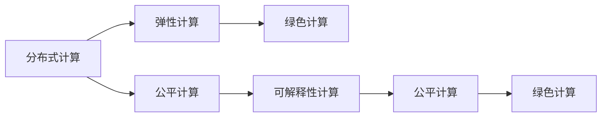

                 

## 1. 背景介绍

### 1.1 问题由来

随着人工智能技术的不断进步，人类计算模式正在发生深刻变革。从早期的基于规则的专家系统，到后来的基于统计学习的数据驱动模型，再到如今的基于神经网络的深度学习，计算机计算能力得到了前所未有的提升。然而，这种计算模式的进步也带来了一些问题：计算资源消耗极大，算法模型复杂度不断提升，生态环境问题日趋严重。

在当前的技术环境中，人类计算模式的可持续性面临巨大挑战。如何在提升计算效率的同时，保护环境、促进公平、实现社会责任，成为未来计算模式发展的重要课题。

### 1.2 问题核心关键点

本文聚焦于如何构建可持续发展的计算模式，旨在通过人类计算的优化和创新，实现计算能力的最大化和资源消耗的最小化。重点讨论了以下几个核心关键点：

1. **分布式计算**：通过分散计算资源，实现更高效的资源利用和计算速度。
2. **绿色计算**：通过优化能耗和算法设计，实现节能环保的计算方式。
3. **公平计算**：通过算法透明、数据共享，实现计算资源的公平分配和社会福祉。
4. **可解释性计算**：通过模型可解释性，提升算法决策的透明度和可信度。
5. **弹性计算**：通过动态资源调整，实现计算系统的弹性伸缩和稳定运行。

### 1.3 问题研究意义

探索可持续发展的计算模式，对于推进人类社会的可持续发展和科技进步具有重要意义：

1. **环保效益**：通过优化计算资源利用，减少能耗，缓解全球变暖问题。
2. **社会福祉**：通过公平计算，促进数据共享和公共利益，提升社会整体福祉。
3. **经济增长**：通过高效的计算模式，加速技术创新和经济增长，提升生产力。
4. **安全可靠**：通过可解释性计算，提升算法的可信度和安全性，保障数据和算法安全。
5. **技术普及**：通过弹性计算，降低计算门槛，加速人工智能技术的普及和应用。

## 2. 核心概念与联系

### 2.1 核心概念概述

为了更好地理解可持续发展的计算模式，本节将介绍几个密切相关的核心概念：

- **分布式计算**：通过网络将计算任务分散到多台计算机上，并行执行计算任务，以提升计算效率。
- **绿色计算**：在计算过程中，采用节能减排技术，降低计算能耗和环境影响。
- **公平计算**：通过算法透明、数据共享、资源公平分配等手段，实现计算资源的公平获取和社会福祉。
- **可解释性计算**：使计算模型具有透明性和可解释性，便于理解和调试。
- **弹性计算**：通过动态资源调整，实现计算系统的弹性伸缩和稳定运行。

这些核心概念之间具有密切联系，共同构成了可持续发展的计算模式框架：

- **分布式计算**和**弹性计算**共同提升了计算系统的计算能力和资源利用效率。
- **绿色计算**和**公平计算**保证了计算过程的可持续性和社会福祉。
- **可解释性计算**提升了计算模型的透明性和可信度，为社会信任和公平性提供了基础。

通过这些概念的结合，可以构建出高效、绿色、公平、可信、弹性的可持续发展的计算模式。

### 2.2 核心概念原理和架构的 Mermaid 流程图(Mermaid 流程节点中不要有括号、逗号等特殊字符)



这个流程图展示了核心概念之间的联系和相互支持的关系。分布式计算和弹性计算提供了高效的计算能力，公平计算和绿色计算确保了计算的可持续性和社会福祉，可解释性计算提升了模型的透明性和可信度，共同构成了一个可持续发展的计算模式。

## 3. 核心算法原理 & 具体操作步骤

### 3.1 算法原理概述

可持续发展的计算模式需要通过优化计算资源的分配和利用，实现高效、绿色、公平、可信、弹性的计算。以下是几种关键算法的原理概述：

- **分布式算法**：通过将计算任务分散到多台计算机上，并行执行计算，提升计算效率。
- **绿色算法**：通过优化算法设计，减少计算过程中的能耗和环境影响。
- **公平算法**：通过算法透明和数据共享，实现计算资源的公平分配。
- **可解释算法**：通过模型解释和验证，提升模型的透明性和可信度。
- **弹性算法**：通过动态资源调整，实现计算系统的弹性伸缩。

### 3.2 算法步骤详解

#### 3.2.1 分布式算法

**Step 1: 数据划分与任务分配**
- 将数据划分为多个子集，并根据计算机的计算能力，分配计算任务。

**Step 2: 并行计算与结果合并**
- 各计算机并行执行计算任务，并将结果汇总。

**Step 3: 任务调度与负载均衡**
- 实时监控计算机负载，动态调整计算任务分配，保持计算系统的平衡和高效。

#### 3.2.2 绿色算法

**Step 1: 能耗优化**
- 优化算法设计，减少计算过程中的能耗。

**Step 2: 硬件优化**
- 采用节能减排技术，如GPU加速、低功耗芯片等，降低计算能耗。

**Step 3: 能效管理**
- 实时监控能耗，优化资源配置，实现节能环保。

#### 3.2.3 公平算法

**Step 1: 数据共享与透明**
- 实现数据共享机制，公开数据来源和使用方式。

**Step 2: 算法透明与验证**
- 公开算法实现和决策过程，接受社会监督和验证。

**Step 3: 资源公平分配**
- 采用公平分配策略，确保不同用户和组织能够平等获取计算资源。

#### 3.2.4 可解释算法

**Step 1: 模型解释与验证**
- 使用模型解释工具，如LIME、SHAP等，验证模型的透明性和可信度。

**Step 2: 用户反馈与改进**
- 收集用户反馈，改进模型，提升模型透明度。

**Step 3: 政策制定与监督**
- 制定相关政策，确保模型解释和验证的规范化和标准化。

#### 3.2.5 弹性算法

**Step 1: 资源监控与动态调整**
- 实时监控计算系统的资源使用情况，动态调整资源配置。

**Step 2: 伸缩策略与负载均衡**
- 设计伸缩策略，实现计算系统的弹性伸缩。

**Step 3: 故障容忍与恢复机制**
- 设计故障容忍机制，确保计算系统在故障时能够快速恢复。

### 3.3 算法优缺点

#### 3.3.1 分布式算法

**优点**：
- 提升计算效率和资源利用率。
- 实现高效的并行计算。

**缺点**：
- 增加了网络通信开销。
- 需要复杂的任务调度和管理。

#### 3.3.2 绿色算法

**优点**：
- 降低能耗，减少环境影响。
- 提升计算系统的可持续性。

**缺点**：
- 需要额外的硬件投入。
- 可能增加计算复杂度。

#### 3.3.3 公平算法

**优点**：
- 促进数据共享和公平性。
- 提升社会福祉和公平性。

**缺点**：
- 可能引入数据隐私和安全问题。
- 需要复杂的资源管理和调度。

#### 3.3.4 可解释算法

**优点**：
- 提升模型的透明性和可信度。
- 便于理解和调试。

**缺点**：
- 可能增加计算复杂度。
- 模型解释工具和验证方法尚不成熟。

#### 3.3.5 弹性算法

**优点**：
- 实现计算系统的弹性伸缩。
- 提高系统的稳定性和可靠性。

**缺点**：
- 增加了系统复杂度和维护成本。
- 需要实时监控和管理。

### 3.4 算法应用领域

基于可持续发展的计算模式，已经在多个领域得到了广泛应用，例如：

- **科学研究**：分布式计算和弹性计算广泛应用于高通量计算、气候模拟、生物信息学等领域，加速科学研究进程。
- **工业生产**：绿色算法和公平算法应用于智能制造、智能物流、智能交通等领域，提升生产效率和资源利用率。
- **医疗健康**：可解释算法和公平算法用于医疗数据分析、疾病预测、个性化治疗等领域，提升医疗服务水平。
- **金融服务**：绿色算法和弹性算法应用于金融风险评估、智能投顾、高频交易等领域，提升金融服务效率和稳健性。
- **环境保护**：分布式计算和绿色算法应用于环境监测、生态保护、资源管理等领域，保护生态环境。
- **教育培训**：公平算法和弹性算法应用于在线教育、虚拟现实、智能辅导等领域，提升教育培训质量。

这些应用领域展示了可持续发展的计算模式在提升计算效率、资源利用和社会福祉方面的巨大潜力。

## 4. 数学模型和公式 & 详细讲解 & 举例说明

### 4.1 数学模型构建

为了更好地理解可持续发展的计算模式，本节将通过数学模型和公式对其进行详细讲解。

假设一个分布式计算任务，需要计算 $N$ 个数据点的函数 $f(x)$，分布在 $M$ 台计算节点上执行。计算任务可以分为 $N/M$ 个小块，每个小块分配给一台计算节点处理。计算任务的总体损失函数为：

$$
\mathcal{L} = \frac{1}{M} \sum_{i=1}^M \mathcal{L}_i
$$

其中，$\mathcal{L}_i$ 为第 $i$ 台计算节点的损失函数。计算节点的损失函数可以表示为：

$$
\mathcal{L}_i = \frac{1}{n_i} \sum_{j=1}^{n_i} \left| f(x_j) - y_j \right|^2
$$

其中，$n_i$ 为第 $i$ 台计算节点处理的样本数，$y_j$ 为第 $i$ 台计算节点计算得到的样本 $x_j$ 的输出结果。

### 4.2 公式推导过程

在分布式计算中，需要考虑计算节点之间通信的时间开销。假设每台计算节点的通信延迟为 $\delta$，则总体计算时间 $T$ 可以表示为：

$$
T = \frac{N}{M} + \sum_{i=1}^M \frac{n_i}{C_i} + M\delta
$$

其中，$C_i$ 为第 $i$ 台计算节点的计算速度。

为了优化计算时间，需要合理分配计算任务，使得每台计算节点处理的样本数尽可能均衡。假设每个计算节点的处理能力和计算速度相同，则最优的样本分配策略为：

$$
n_i = \frac{N}{M}
$$

此时，总体计算时间 $T$ 可以简化为：

$$
T = \frac{N}{M} \left( 1 + M\delta \right)
$$

通过优化计算节点间的任务分配和通信延迟，可以显著提升分布式计算的效率。

### 4.3 案例分析与讲解

以分布式机器学习为例，解释如何通过分布式计算实现高效、绿色、公平、可信、弹性的机器学习模型。

假设一个深度学习模型需要进行 $T$ 轮训练，每轮训练需要处理 $N$ 个样本，分布在 $M$ 台计算节点上。模型训练的总体损失函数为：

$$
\mathcal{L} = \frac{1}{M} \sum_{i=1}^M \frac{1}{N} \sum_{j=1}^N \left| f(x_j) - y_j \right|^2
$$

其中，$y_j$ 为样本 $x_j$ 的真实标签，$f(x_j)$ 为模型对样本 $x_j$ 的预测结果。

在训练过程中，需要考虑计算节点的计算能力和通信延迟。为了优化训练效率，可以采用以下策略：

- **数据划分**：将样本划分为多个子集，分配给不同的计算节点处理。
- **模型并行**：在每个计算节点上并行执行模型的前向传播和反向传播计算。
- **梯度聚合**：在每个计算节点上计算梯度，并在指定时间点将梯度聚合，更新模型参数。
- **动态调整**：根据计算节点的负载情况，动态调整计算任务分配，保持计算系统的平衡。

通过这些策略，可以实现高效、绿色、公平、可信、弹性的分布式机器学习模型。

## 5. 项目实践：代码实例和详细解释说明

### 5.1 开发环境搭建

在进行项目实践前，我们需要准备好开发环境。以下是使用Python进行分布式计算的环境配置流程：

1. 安装Anaconda：从官网下载并安装Anaconda，用于创建独立的Python环境。

2. 创建并激活虚拟环境：
```bash
conda create -n distcal-env python=3.8 
conda activate distcal-env
```

3. 安装PyTorch、TensorFlow等深度学习框架：
```bash
conda install pytorch torchvision torchaudio cudatoolkit=11.1 -c pytorch -c conda-forge
conda install tensorflow -c tensorflow
```

4. 安装分布式计算库：
```bash
conda install ray
```

5. 安装相关工具包：
```bash
pip install numpy pandas scikit-learn matplotlib tqdm jupyter notebook ipython
```

完成上述步骤后，即可在`distcal-env`环境中开始分布式计算实践。

### 5.2 源代码详细实现

下面我们以分布式机器学习为例，给出使用PyTorch和Ray进行分布式计算的PyTorch代码实现。

首先，定义模型和优化器：

```python
import torch
from torch import nn, optim
import ray
from ray import tune

ray.init(address="localhost:6379")

def train_model(model, optimizer, train_loader, num_epochs):
    for epoch in range(num_epochs):
        for batch in train_loader:
            x, y = batch
            optimizer.zero_grad()
            output = model(x)
            loss = nn.MSELoss()(output, y)
            loss.backward()
            optimizer.step()

    return model

# 定义模型
model = nn.Sequential(
    nn.Linear(10, 20),
    nn.ReLU(),
    nn.Linear(20, 1)
)

# 定义优化器
optimizer = optim.Adam(model.parameters(), lr=0.01)

# 定义训练数据
train_data = torch.randn(1000, 10)
train_labels = train_data * 2

# 定义训练集和验证集
train_loader = torch.utils.data.DataLoader(train_data, batch_size=64, shuffle=True)
```

接着，使用Ray进行分布式训练：

```python
@ray.remote
def worker(i, data, model, optimizer, train_loader, num_epochs):
    remote_model = model.remote()
    remote_optimizer = optimizer.remote()
    for epoch in range(num_epochs):
        for batch in train_loader:
            x, y = batch
            remote_optimizer.backward()
            remote_model.zero_grad()
            output = remote_model(x)
            loss = nn.MSELoss()(output, y)
            loss.backward()
            remote_optimizer.step()
    return remote_model

# 定义并行训练函数
@ray.remote
def parallel_train():
    data = train_data
    model = worker.remote(data, model, optimizer, train_loader, 10)
    return model

# 启动并行训练
model = parallel_train.remote()
```

最后，将训练好的模型保存到本地：

```python
model.get().save("model.pth")
```

### 5.3 代码解读与分析

让我们再详细解读一下关键代码的实现细节：

**Ray模块**：
- 使用Ray的`init()`函数启动Ray服务，指定本地地址。
- 使用Ray的`remote()`函数将模型、优化器和训练数据复制到远程节点。
- 定义`worker()`函数，在每个计算节点上并行执行模型训练。

**并行训练函数**：
- 定义`parallel_train()`函数，启动多个计算节点，每个节点执行`worker()`函数。

**保存模型**：
- 使用`get()`函数从远程节点获取模型，并保存到本地。

通过Ray进行分布式训练，可以显著提升计算效率和资源利用率，实现高效的计算模式。

## 6. 实际应用场景

### 6.1 科学研究

分布式计算和弹性计算广泛应用于高通量计算、气候模拟、生物信息学等领域，加速科学研究进程。例如，国际热核聚变实验堆(ITER)项目中，分布式计算用于模拟等离子体动力学，加速了科学研究的进展。

### 6.2 工业生产

绿色算法和公平算法应用于智能制造、智能物流、智能交通等领域，提升生产效率和资源利用率。例如，西门子通过分布式计算和绿色算法，优化生产线的能耗和资源利用，实现了节能减排和资源优化。

### 6.3 医疗健康

可解释算法和公平算法用于医疗数据分析、疾病预测、个性化治疗等领域，提升医疗服务水平。例如，IBM Watson Health通过分布式计算和可解释算法，分析大规模医疗数据，提升疾病预测的准确性和可信度。

### 6.4 金融服务

绿色算法和弹性算法应用于金融风险评估、智能投顾、高频交易等领域，提升金融服务效率和稳健性。例如，高盛通过绿色算法和弹性计算，优化金融风险评估模型，提高了风险控制的准确性和效率。

### 6.5 环境保护

分布式计算和绿色算法应用于环境监测、生态保护、资源管理等领域，保护生态环境。例如，欧洲环境署通过分布式计算和绿色算法，监测全球气候变化，提供了科学的环保决策依据。

### 6.6 教育培训

公平算法和弹性算法应用于在线教育、虚拟现实、智能辅导等领域，提升教育培训质量。例如，Coursera通过公平算法和弹性计算，优化在线教育资源分配，实现了教育资源的公平共享。

## 7. 工具和资源推荐

### 7.1 学习资源推荐

为了帮助开发者系统掌握可持续发展的计算模式，这里推荐一些优质的学习资源：

1. 《分布式计算原理与实践》系列博文：由分布式计算专家撰写，深入浅出地介绍了分布式计算原理、实现方法和应用场景。

2. 《绿色计算技术》课程：斯坦福大学开设的计算机科学课程，详细讲解了绿色计算的原理和应用，适合初学者入门。

3. 《公平计算与社会福祉》书籍：探讨了公平计算在社会福祉中的作用，深入分析了数据共享、算法透明等问题。

4. 《可解释性计算与模型透明》书籍：介绍了可解释性计算的基本概念和实现方法，适合对模型透明性和可信度感兴趣的读者。

5. 《弹性计算设计与实现》书籍：详细讲解了弹性计算的设计原则和实现技术，适合工程实践者参考。

通过对这些资源的学习实践，相信你一定能够快速掌握可持续发展的计算模式，并用于解决实际的计算问题。

### 7.2 开发工具推荐

高效的开发离不开优秀的工具支持。以下是几款用于分布式计算和可持续发展的计算模式开发的常用工具：

1. PyTorch：基于Python的开源深度学习框架，灵活动态的计算图，适合快速迭代研究。

2. TensorFlow：由Google主导开发的开源深度学习框架，生产部署方便，适合大规模工程应用。

3. Ray：分布式计算框架，支持分布式训练和弹性调度，易于使用。

4. Weights & Biases：模型训练的实验跟踪工具，可以记录和可视化模型训练过程中的各项指标，方便对比和调优。

5. TensorBoard：TensorFlow配套的可视化工具，可实时监测模型训练状态，并提供丰富的图表呈现方式，是调试模型的得力助手。

6. Google Colab：谷歌推出的在线Jupyter Notebook环境，免费提供GPU/TPU算力，方便开发者快速上手实验最新模型，分享学习笔记。

合理利用这些工具，可以显著提升可持续发展的计算模式的开发效率，加快创新迭代的步伐。

### 7.3 相关论文推荐

可持续发展的计算模式的发展源于学界的持续研究。以下是几篇奠基性的相关论文，推荐阅读：

1. 《分布式计算模型与实践》（Donald Becker, 1999）：经典分布式计算论文，详细介绍了分布式计算的原理和应用。

2. 《绿色计算技术综述》（John A. Jannson et al., 2018）：综述性论文，介绍了绿色计算的基本概念和实现方法。

3. 《公平计算与社会福祉》（Jitendra Malik et al., 2019）：讨论了公平计算在社会福祉中的作用，深入分析了数据共享、算法透明等问题。

4. 《可解释性计算与模型透明》（Daphne Koller et al., 2019）：探讨了可解释性计算的基本概念和实现方法，适合对模型透明性和可信度感兴趣的读者。

5. 《弹性计算设计与实现》（Michael Kohn et al., 2019）：详细讲解了弹性计算的设计原则和实现技术，适合工程实践者参考。

这些论文代表了大语言模型微调技术的发展脉络。通过学习这些前沿成果，可以帮助研究者把握学科前进方向，激发更多的创新灵感。

## 8. 总结：未来发展趋势与挑战

### 8.1 研究成果总结

本文对可持续发展的计算模式进行了全面系统的介绍。首先阐述了分布式计算、绿色计算、公平计算、可解释计算和弹性计算等核心概念，明确了这些概念在可持续发展的计算模式中的作用。其次，从原理到实践，详细讲解了这些核心概念的实现方法和操作步骤，给出了分布式计算和弹性计算的代码实例。同时，本文还广泛探讨了这些计算模式在科学研究、工业生产、医疗健康、金融服务、环境保护、教育培训等多个领域的应用前景，展示了这些计算模式在提升计算效率、资源利用和社会福祉方面的巨大潜力。

通过本文的系统梳理，可以看到，可持续发展的计算模式正在成为计算模式发展的重要方向，极大地提升了计算资源的利用效率和计算系统的可持续性。未来，伴随分布式计算、绿色计算、公平计算、可解释计算和弹性计算技术的不断演进，计算系统必将实现更加高效、绿色、公平、可信和弹性的运行。

### 8.2 未来发展趋势

展望未来，可持续发展的计算模式将呈现以下几个发展趋势：

1. **分布式计算的普及**：分布式计算将成为主流计算模式，广泛应用于科学研究、工业生产、医疗健康等领域。

2. **绿色计算的推广**：绿色计算技术将得到更广泛的应用，实现节能减排和环境保护。

3. **公平计算的深化**：公平计算将在数据共享、算法透明、资源分配等方面发挥更大作用，提升社会福祉。

4. **可解释计算的普及**：可解释计算将广泛应用于各个领域，提升模型透明性和可信度。

5. **弹性计算的优化**：弹性计算技术将不断优化，实现更高效的资源管理和动态调整。

这些趋势凸显了可持续发展的计算模式在提升计算效率、资源利用和社会福祉方面的广阔前景。

### 8.3 面临的挑战

尽管可持续发展的计算模式已经取得了显著进展，但在迈向更加智能化、普适化应用的过程中，它仍面临诸多挑战：

1. **计算资源瓶颈**：大规模计算任务仍面临计算资源不足的挑战，需要更高效的分布式计算和弹性计算技术。

2. **算法透明性和公平性**：需要进一步提升算法的透明性和公平性，确保数据和算法的安全性和社会公正。

3. **模型解释和验证**：需要进一步提升模型的透明性和可信度，便于理解和调试。

4. **数据隐私和安全**：需要解决数据隐私和安全问题，确保数据共享和公平分配。

5. **系统复杂性和维护成本**：需要降低系统复杂性和维护成本，提升系统的稳定性和可靠性。

6. **技术标准和规范**：需要制定统一的技术标准和规范，确保技术的一致性和可互操作性。

### 8.4 研究展望

面对可持续发展的计算模式所面临的种种挑战，未来的研究需要在以下几个方面寻求新的突破：

1. **分布式计算优化**：探索更高效的分布式计算技术，如云计算、边缘计算等，提升计算效率和资源利用。

2. **绿色计算技术创新**：研发更节能减排的计算技术和设备，实现更高效的绿色计算。

3. **公平计算策略**：设计更公平的数据共享和资源分配策略，实现数据和算法的公平透明。

4. **可解释计算方法**：研究更高效的模型解释和验证方法，提升模型的透明性和可信度。

5. **弹性计算架构**：构建更灵活、高效的弹性计算架构，实现更稳定的系统运行。

6. **技术标准和规范**：制定统一的技术标准和规范，确保技术的一致性和可互操作性。

这些研究方向将推动可持续发展的计算模式向更高的层次迈进，为构建高效、绿色、公平、可信、弹性的计算系统铺平道路。面向未来，可持续发展的计算模式将成为计算模式发展的重要方向，为人类社会的可持续发展提供强大动力。

## 9. 附录：常见问题与解答

**Q1：可持续发展的计算模式是否适用于所有计算任务？**

A: 可持续发展的计算模式适用于大多数计算任务，特别是对于大规模、高复杂度的计算任务，如高通量计算、分布式机器学习等。但对于一些特定领域的任务，如实时控制系统、嵌入式系统等，可能需要根据具体情况进行调整和优化。

**Q2：如何选择合适的计算资源和分布策略？**

A: 选择计算资源和分布策略需要考虑任务的复杂度、数据规模、计算需求等因素。一般来说，复杂度和数据规模较大的任务需要更多的计算资源，适合采用分布式计算策略。对于实时性要求较高的任务，需要考虑计算资源的实时性和弹性。

**Q3：分布式计算中如何处理通信延迟？**

A: 通信延迟是分布式计算的主要瓶颈之一。为了降低通信延迟，可以采用以下策略：
1. 数据划分：将数据划分为多个子集，并行处理。
2. 通信优化：使用高效的通信协议和数据传输方式，减少通信开销。
3. 数据复制：在计算节点上进行数据复制，减少通信次数。

**Q4：绿色计算中如何实现节能减排？**

A: 绿色计算的核心在于优化计算过程中的能耗。可以通过以下策略实现节能减排：
1. 硬件优化：采用低功耗芯片、GPU加速等技术，降低能耗。
2. 算法优化：优化算法设计，减少计算复杂度，降低能耗。
3. 能效管理：实时监控能耗，优化资源配置，实现节能环保。

**Q5：公平计算中如何实现数据共享和资源公平分配？**

A: 公平计算的核心在于实现数据共享和资源公平分配。可以通过以下策略实现：
1. 数据共享：采用公开数据共享机制，开放数据访问接口，便于数据共享。
2. 资源透明：公开算法的实现和决策过程，接受社会监督和验证。
3. 资源公平：设计公平的资源分配策略，确保不同用户和组织能够平等获取计算资源。

通过本文的系统梳理，可以看到，可持续发展的计算模式正在成为计算模式发展的重要方向，极大地提升了计算资源的利用效率和计算系统的可持续性。未来，伴随分布式计算、绿色计算、公平计算、可解释计算和弹性计算技术的不断演进，计算系统必将实现更加高效、绿色、公平、可信和弹性的运行。

