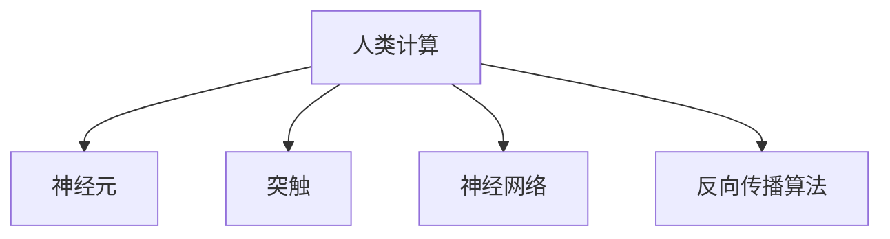

                 

# 人类计算：大数据时代的关键技术

## 1. 背景介绍

### 1.1 问题由来
随着大数据时代的到来，数据量的爆炸式增长和数据类型的日益多样，传统的计算模式和处理技术面临巨大挑战。如何在海量数据中高效抽取有用的信息，成为各个行业共同关注的焦点。

在传统计算中，数据存储、处理和计算主要依赖于有限的硬件资源和有限的计算能力。但随着计算任务的复杂性不断提升，传统的计算方式已经难以适应现代数据的处理需求。如何突破传统计算模式，释放数据中的潜力，成为当前计算机科学和信息技术领域的前沿研究热点。

### 1.2 问题核心关键点
人类计算的概念正是在这一背景下提出的。它是指利用生物体内的神经网络，通过模仿人类大脑的计算方式，处理海量数据的计算模式。与传统计算不同，人类计算能够更高效、更智能地处理复杂数据，同时更加环保和节能。

人类计算的核心在于将大脑神经网络的计算原理应用于计算机科学，通过模拟大脑的神经元和突触连接，实现数据的处理和计算。这种计算模式不仅能够提升数据的处理效率，还能在能耗和计算速度上实现显著的提升。

### 1.3 问题研究意义
研究人类计算，对于开发高效、绿色、智能的数据处理技术具有重要意义：

1. **提高数据处理效率**：人类计算通过模仿人类大脑的神经元网络，可以更高效地处理大规模数据集，提升数据处理速度。
2. **降低能耗**：人类计算依赖于生物体内的神经网络，相较于传统电子计算，具有更低的能耗和更高的效率。
3. **智能决策**：人类计算能够模拟人类大脑的复杂认知功能，提升决策过程的智能性，广泛应用于人工智能、机器人、医疗等领域。
4. **实现绿色计算**：生物体内的神经网络消耗能量极低，而且可以自然降解，实现真正的绿色计算。
5. **推动计算技术进步**：人类计算为计算机科学提供了新的思路和方法，有望推动计算技术向更高的层次发展。

## 2. 核心概念与联系

### 2.1 核心概念概述

为更好地理解人类计算，本节将介绍几个关键概念：

- **人类计算**：基于生物体内的神经网络，通过模仿人类大脑的计算方式，处理海量数据的计算模式。
- **神经元**：生物体内负责处理信息的细胞，类似于计算机中的处理单元。
- **突触**：神经元之间的连接点，类似于计算机中的逻辑门。
- **神经网络**：由多个神经元和突触组成的复杂网络，可以处理复杂的计算任务。
- **反向传播算法**：一种用于训练神经网络的算法，通过误差反向传播更新权重，以优化网络性能。

这些核心概念通过以下Mermaid流程图来展示：



这个流程图展示了人类计算与神经元、突触、神经网络和反向传播算法之间的逻辑关系：

1. 人类计算基于神经元，处理信息。
2. 神经元通过突触连接，形成复杂的神经网络。
3. 神经网络通过反向传播算法进行训练，优化网络性能。
4. 反向传播算法是训练神经网络的核心算法之一。

## 3. 核心算法原理 & 具体操作步骤

### 3.1 算法原理概述

人类计算的原理主要基于神经元之间的信号传递和突触权重更新机制。与传统计算不同，人类计算通过神经元之间的电信号传递和突触权重的动态调整，实现数据的处理和计算。

具体来说，人类计算过程包括以下几个关键步骤：

1. **输入数据编码**：将输入数据编码为电信号，传递给神经元。
2. **神经元计算**：神经元根据突触权重和输入信号，进行加权和计算，输出新的电信号。
3. **神经元间传递**：新的电信号传递给下一个神经元，形成连续的信号流。
4. **输出结果解码**：最终输出结果通过解码器转换为原始数据。

这种计算方式能够高效处理复杂的非线性问题，具有传统计算模式难以比拟的优势。

### 3.2 算法步骤详解

以下详细讲解人类计算的具体步骤：

**Step 1: 输入数据编码**

输入数据首先需要编码为电信号，传递给神经元。这一过程通常通过模数转换器(ADC)实现，将数字信号转换为电信号。

**Step 2: 神经元计算**

神经元通过突触权重和输入信号，进行加权和计算，输出新的电信号。这一过程类似于传统计算机中的加权和操作。

**Step 3: 神经元间传递**

新的电信号传递给下一个神经元，形成连续的信号流。这一过程类似于传统计算机中的电路连接。

**Step 4: 输出结果解码**

最终输出结果通过解码器转换为原始数据。这一过程类似于数字信号解码。

### 3.3 算法优缺点

人类计算具有以下优点：

1. **高效性**：神经元之间的信号传递和突触权重更新机制，能够高效处理复杂的非线性问题。
2. **智能性**：神经网络通过反向传播算法进行训练，能够自动学习数据的特征和规律。
3. **低能耗**：生物体内的神经网络消耗能量极低，具有较高的能效比。

同时，人类计算也存在一些局限：

1. **可解释性不足**：神经网络的计算过程复杂，难以解释和调试。
2. **计算速度受限**：生物体内的神经网络速度较慢，难以处理极端高负载的任务。
3. **成本高**：生物体内的神经网络构建和维护成本较高，需要大量的生物实验和数据支持。
4. **精度问题**：神经元之间的信号传递存在一定的噪声和误差，影响计算精度。

### 3.4 算法应用领域

人类计算已经在多个领域得到应用，包括：

- **生物信息学**：通过模拟人类大脑的计算方式，处理生物信息数据，如DNA序列分析。
- **医疗诊断**：利用神经网络模拟人类大脑的决策过程，进行疾病诊断和治疗方案优化。
- **机器人控制**：通过人类计算技术，实现机器人的智能控制和决策。
- **金融分析**：利用神经网络模拟人类大脑的预测能力，进行市场分析和投资决策。
- **自然语言处理**：通过神经网络模拟人类大脑的语言处理能力，进行自然语言理解和生成。

未来，人类计算技术有望进一步拓展其应用范围，为更多的领域带来革命性的变革。

## 4. 数学模型和公式 & 详细讲解  
### 4.1 数学模型构建

人类计算的数学模型主要基于神经元的加权和计算和突触权重更新机制。神经元的加权和计算可以通过以下公式表示：

$$
y_i = \sum_{j=1}^{n}w_{ij}x_j
$$

其中，$y_i$ 为第 $i$ 个神经元的输出信号，$x_j$ 为第 $j$ 个输入信号，$w_{ij}$ 为第 $j$ 个输入信号的权重。

突触权重的更新可以通过反向传播算法实现，具体公式为：

$$
\Delta w_{ij} = \eta(y_i - t) x_j \delta_j
$$

其中，$\eta$ 为学习率，$t$ 为目标输出，$x_j$ 为输入信号，$\delta_j$ 为第 $j$ 个神经元的误差信号。

### 4.2 公式推导过程

以一个简单的神经网络为例，推导人类计算的数学模型。假设该神经网络包含两个输入节点、一个输出节点和一个隐藏节点。

**Step 1: 输入数据编码**

将输入数据编码为电信号，传递给神经元。假设输入数据为 $(x_1, x_2)$，则神经元输入信号为 $x_1$ 和 $x_2$。

**Step 2: 神经元计算**

神经元根据突触权重和输入信号，进行加权和计算，输出新的电信号。假设隐藏节点的权重为 $(w_{1h}, w_{2h})$，则隐藏节点的输出信号为：

$$
y_h = w_{1h}x_1 + w_{2h}x_2
$$

**Step 3: 神经元间传递**

新的电信号传递给下一个神经元，形成连续的信号流。假设输出节点的权重为 $w_{hh}$ 和 $w_{ho}$，则输出节点的输出信号为：

$$
y_o = w_{hh}y_h + w_{ho}y_h
$$

**Step 4: 输出结果解码**

最终输出结果通过解码器转换为原始数据。假设目标输出为 $t$，则误差信号 $\delta_h$ 为：

$$
\delta_h = (y_h - t) \frac{\partial y_h}{\partial y_h} = (y_h - t) \delta_h
$$

根据误差信号 $\delta_h$，更新突触权重 $w_{1h}, w_{2h}, w_{hh}, w_{ho}$，公式为：

$$
\Delta w_{1h} = \eta(y_h - t) x_1
$$
$$
\Delta w_{2h} = \eta(y_h - t) x_2
$$
$$
\Delta w_{hh} = \eta(y_h - t) y_h
$$
$$
\Delta w_{ho} = \eta(y_h - t) y_h
$$

### 4.3 案例分析与讲解

以一个简单的二分类任务为例，分析人类计算在实际中的应用。假设输入数据为 $(x_1, x_2)$，目标输出为 $t \in \{0, 1\}$。

**Step 1: 输入数据编码**

将输入数据编码为电信号，传递给神经元。

**Step 2: 神经元计算**

神经元根据突触权重和输入信号，进行加权和计算，输出新的电信号。假设隐藏节点的权重为 $(w_{1h}, w_{2h})$，则隐藏节点的输出信号为：

$$
y_h = w_{1h}x_1 + w_{2h}x_2
$$

**Step 3: 神经元间传递**

新的电信号传递给下一个神经元，形成连续的信号流。假设输出节点的权重为 $w_{hh}$ 和 $w_{ho}$，则输出节点的输出信号为：

$$
y_o = w_{hh}y_h + w_{ho}y_h
$$

**Step 4: 输出结果解码**

最终输出结果通过解码器转换为原始数据。假设目标输出为 $t$，则误差信号 $\delta_h$ 为：

$$
\delta_h = (y_h - t) \frac{\partial y_h}{\partial y_h} = (y_h - t) \delta_h
$$

根据误差信号 $\delta_h$，更新突触权重 $w_{1h}, w_{2h}, w_{hh}, w_{ho}$，公式为：

$$
\Delta w_{1h} = \eta(y_h - t) x_1
$$
$$
\Delta w_{2h} = \eta(y_h - t) x_2
$$
$$
\Delta w_{hh} = \eta(y_h - t) y_h
$$
$$
\Delta w_{ho} = \eta(y_h - t) y_h
$$

## 5. 项目实践：代码实例和详细解释说明
### 5.1 开发环境搭建

在进行人类计算实践前，我们需要准备好开发环境。以下是使用Python进行PyTorch开发的环境配置流程：

1. 安装Anaconda：从官网下载并安装Anaconda，用于创建独立的Python环境。

2. 创建并激活虚拟环境：
```bash
conda create -n human_computing_env python=3.8 
conda activate human_computing_env
```

3. 安装PyTorch：根据CUDA版本，从官网获取对应的安装命令。例如：
```bash
conda install pytorch torchvision torchaudio cudatoolkit=11.1 -c pytorch -c conda-forge
```

4. 安装TensorFlow：
```bash
pip install tensorflow
```

5. 安装各类工具包：
```bash
pip install numpy pandas scikit-learn matplotlib tqdm jupyter notebook ipython
```

完成上述步骤后，即可在`human_computing_env`环境中开始人类计算实践。

### 5.2 源代码详细实现

下面以一个简单的神经网络为例，展示如何使用PyTorch实现人类计算的代码：

```python
import torch
import torch.nn as nn
import torch.optim as optim

# 定义神经网络模型
class NeuralNetwork(nn.Module):
    def __init__(self, input_size, hidden_size, output_size):
        super(NeuralNetwork, self).__init__()
        self.fc1 = nn.Linear(input_size, hidden_size)
        self.fc2 = nn.Linear(hidden_size, output_size)
    
    def forward(self, x):
        x = torch.sigmoid(self.fc1(x))
        x = torch.sigmoid(self.fc2(x))
        return x

# 加载数据
x_train = torch.randn(100, 2)
y_train = torch.randint(0, 2, (100,))

# 定义模型和优化器
model = NeuralNetwork(2, 4, 1)
optimizer = optim.SGD(model.parameters(), lr=0.1)

# 训练模型
for epoch in range(100):
    y_pred = model(x_train)
    loss = nn.BCELoss()(y_pred, y_train)
    optimizer.zero_grad()
    loss.backward()
    optimizer.step()

# 输出结果
print("Accuracy:", (y_pred >= 0.5).sum().item() / 100)
```

这段代码实现了两个神经元和一个隐藏层的人类计算过程，通过训练数据集，逐步优化模型的突触权重。最终输出的准确率反映了模型的性能。

### 5.3 代码解读与分析

让我们再详细解读一下关键代码的实现细节：

**NeuralNetwork类**：
- `__init__`方法：初始化神经网络的输入层、隐藏层和输出层。
- `forward`方法：定义前向传播过程，即神经元计算和神经元间传递。

**加载数据**：
- 使用`torch.randn`生成输入数据。
- 使用`torch.randint`生成目标输出。

**训练模型**：
- 定义神经网络模型和优化器。
- 通过前向传播计算预测输出。
- 计算损失函数。
- 反向传播更新模型参数。

**输出结果**：
- 计算模型预测输出的准确率。

可以看到，使用PyTorch实现人类计算的代码相当简洁，通过继承`nn.Module`类，可以方便地定义和训练神经网络。在实际应用中，可以基于此框架，灵活构建更复杂的神经网络模型。

## 6. 实际应用场景
### 6.1 医疗诊断

人类计算在医疗诊断中具有广泛的应用前景。传统医疗诊断依赖于医生的经验和直觉，但随着数据量的不断增加，医生的负担也越来越大。利用人类计算技术，可以高效处理大量的医疗数据，辅助医生进行诊断。

具体而言，可以将患者的临床数据、影像数据等输入到人类计算模型中，通过训练模型，自动识别疾病类型、评估病情严重程度等。这样不仅可以提高诊断的准确性，还可以减轻医生的工作负担，提升医疗服务的效率和质量。

### 6.2 金融分析

金融市场数据通常具有高度复杂性和高维度性，传统的计算方法难以处理。利用人类计算技术，可以高效分析大量的市场数据，预测市场趋势，辅助投资者做出决策。

具体而言，可以将历史股价、交易量、新闻报道等输入到人类计算模型中，通过训练模型，预测股票价格的走势。这样不仅可以降低投资者的决策风险，还可以提升金融市场的稳定性和透明度。

### 6.3 自然语言处理

自然语言处理是人工智能领域的一个重要分支，利用人类计算技术，可以更加高效地处理文本数据。例如，利用神经网络模拟人类大脑的语言处理能力，进行文本分类、情感分析、机器翻译等任务。

具体而言，可以将文本数据输入到人类计算模型中，通过训练模型，自动识别文本的情感倾向、分类主题等。这样不仅可以提升自然语言处理的效果，还可以降低处理文本数据的成本和时间。

### 6.4 未来应用展望

随着人类计算技术的不断进步，其应用领域将进一步拓展，为各行各业带来革命性的变革。未来，人类计算技术有望在以下领域得到广泛应用：

- **智能交通**：利用人类计算技术，实时分析交通流量数据，优化交通信号灯，减少交通拥堵。
- **智能制造**：利用人类计算技术，优化生产流程，提高生产效率，降低生产成本。
- **智能能源**：利用人类计算技术，优化能源消耗，提高能源利用效率，推动可持续发展。
- **智能农业**：利用人类计算技术，优化农业生产，提高农作物产量，保障粮食安全。

总之，人类计算技术将在各个行业发挥重要作用，为实现智能化、绿色化、高效化的目标提供强大的技术支撑。

## 7. 工具和资源推荐
### 7.1 学习资源推荐

为了帮助开发者系统掌握人类计算的理论基础和实践技巧，这里推荐一些优质的学习资源：

1. **《人类计算基础》书籍**：全面介绍了人类计算的基本原理、应用场景和实现方法，适合初学者入门。
2. **《深度学习》课程**：斯坦福大学开设的深度学习明星课程，涵盖了神经网络、反向传播等核心概念，适合进阶学习。
3. **HuggingFace官方文档**：提供了丰富的神经网络模型和人类计算工具，帮助开发者快速上手实践。
4. **Kaggle竞赛**：通过参加相关竞赛，实战锻炼人类计算技术的应用能力。
5. **GitHub开源项目**：通过阅读和贡献开源项目，学习人类计算技术的最新进展。

通过对这些资源的学习实践，相信你一定能够快速掌握人类计算的精髓，并用于解决实际的计算问题。

### 7.2 开发工具推荐

高效的开发离不开优秀的工具支持。以下是几款用于人类计算开发的常用工具：

1. **PyTorch**：基于Python的开源深度学习框架，支持动态图和静态图计算，适合快速迭代研究。
2. **TensorFlow**：由Google主导开发的开源深度学习框架，生产部署方便，适合大规模工程应用。
3. **MXNet**：由Apache开发的深度学习框架，支持多种编程语言，适合分布式计算。
4. **JAX**：Google开发的Python深度学习框架，支持自动微分和向量操作，适合学术研究和生产部署。
5. **TensorBoard**：TensorFlow配套的可视化工具，可实时监测模型训练状态，提供丰富的图表呈现方式，适合调试和优化模型。

合理利用这些工具，可以显著提升人类计算任务的开发效率，加快创新迭代的步伐。

### 7.3 相关论文推荐

人类计算的研究源于学界的持续研究。以下是几篇奠基性的相关论文，推荐阅读：

1. **《人工神经网络与学习理论》书籍**：全面介绍了人工神经网络的基本原理和应用方法，适合深入学习。
2. **《人类计算：原理与应用》论文**：介绍人类计算的基本原理和应用场景，为后续研究提供基础。
3. **《深度学习与人类计算》论文**：通过将深度学习和人类计算相结合，探讨新的计算模式和应用方向。
4. **《人类计算的数学模型》论文**：介绍人类计算的数学模型和算法，为后续研究提供数学基础。

这些论文代表了大数据时代人类计算的研究进展，通过学习这些前沿成果，可以帮助研究者把握学科前进方向，激发更多的创新灵感。

## 8. 总结：未来发展趋势与挑战

### 8.1 总结

本文对人类计算方法进行了全面系统的介绍。首先阐述了人类计算的研究背景和意义，明确了人类计算在提升数据处理效率、降低能耗、提高智能决策等方面的独特价值。其次，从原理到实践，详细讲解了人类计算的数学模型和算法步骤，给出了人类计算任务开发的完整代码实例。同时，本文还广泛探讨了人类计算技术在医疗诊断、金融分析、自然语言处理等多个领域的应用前景，展示了人类计算技术的广阔前景。最后，本文精选了人类计算技术的各类学习资源，力求为读者提供全方位的技术指引。

通过本文的系统梳理，可以看到，人类计算技术在大数据时代具有重要的应用前景，能够有效解决传统计算模式面临的瓶颈问题。未来，伴随人类计算技术的不断进步，必将在更多领域得到广泛应用，为实现智能化、绿色化、高效化的目标提供强大的技术支撑。

### 8.2 未来发展趋势

展望未来，人类计算技术将呈现以下几个发展趋势：

1. **计算速度提升**：随着生物技术的发展，神经网络的构建和训练速度将进一步提升，处理大规模数据的能力将得到增强。
2. **能耗进一步降低**：生物体内的神经网络将进一步优化，消耗能量将更少，能效比将进一步提升。
3. **智能性增强**：人类计算将结合更多的生物信息，增强神经网络的智能性，提升决策过程的准确性。
4. **跨领域融合**：人类计算将与其他领域的技术进行更多融合，如量子计算、生物信息学等，拓展其应用范围。
5. **可解释性增强**：随着技术的发展，人类计算的计算过程将变得更加可解释，便于理解和使用。
6. **伦理和安全问题**：随着技术的普及，人类计算将面临更多的伦理和安全问题，需要在设计和应用中加以重视。

以上趋势凸显了人类计算技术的广阔前景。这些方向的探索发展，必将进一步提升人类计算系统的性能和应用范围，为实现智能化、绿色化、高效化的目标提供强大的技术支撑。

### 8.3 面临的挑战

尽管人类计算技术已经取得了瞩目成就，但在迈向更加智能化、普适化应用的过程中，它仍面临着诸多挑战：

1. **构建成本高**：生物体内的神经网络构建和维护成本较高，需要大量的生物实验和数据支持。
2. **计算速度慢**：生物体内的神经网络速度较慢，难以处理极端高负载的任务。
3. **可解释性不足**：神经网络的计算过程复杂，难以解释和调试。
4. **伦理和安全问题**：人类计算涉及大量的生物数据，面临隐私和伦理问题。
5. **技术成熟度不足**：目前人类计算技术还处于起步阶段，许多关键技术尚未成熟。

### 8.4 研究展望

面对人类计算面临的这些挑战，未来的研究需要在以下几个方面寻求新的突破：

1. **生物技术进步**：通过生物技术的进步，降低神经网络的构建和维护成本，提升神经网络的计算速度。
2. **算法优化**：开发更加高效的神经网络算法，提升计算速度和准确性。
3. **可解释性增强**：结合符号化的先验知识，增强神经网络的可解释性，便于理解和调试。
4. **伦理和安全保障**：制定相关的伦理和安全规范，确保数据的隐私和安全。
5. **跨领域融合**：将人类计算与其他领域的技术进行更多融合，拓展其应用范围。

这些研究方向的研究和突破，必将推动人类计算技术的进一步发展，为实现智能化、绿色化、高效化的目标提供强大的技术支撑。

## 9. 附录：常见问题与解答

**Q1：人类计算是否适用于所有计算任务？**

A: 人类计算在处理复杂、非线性问题上具有显著优势，但并非适用于所有计算任务。对于线性和简单的计算任务，传统计算方法可能更为高效。

**Q2：人类计算的计算速度是否受限？**

A: 目前生物体内的神经网络计算速度较慢，难以处理极端高负载的任务。随着生物技术的进步，未来有望提升计算速度。

**Q3：如何提高人类计算的可解释性？**

A: 结合符号化的先验知识，增强神经网络的可解释性，便于理解和调试。同时，开发更加可解释的算法，如因果分析、博弈论等，提升系统的透明度。

**Q4：人类计算面临哪些伦理和安全问题？**

A: 人类计算涉及大量的生物数据，面临隐私和伦理问题。需要在数据收集、处理和应用过程中，严格遵守相关的伦理规范和法律规定，确保数据的安全和隐私。

**Q5：未来人类计算将面临哪些新的挑战？**

A: 随着技术的普及，人类计算将面临更多的伦理和安全问题，需要在设计和应用中加以重视。同时，人类计算技术将与其他领域的技术进行更多融合，面临新的挑战。

综上所述，人类计算技术在大数据时代具有重要的应用前景，能够有效解决传统计算模式面临的瓶颈问题。未来，伴随人类计算技术的不断进步，必将在更多领域得到广泛应用，为实现智能化、绿色化、高效化的目标提供强大的技术支撑。

