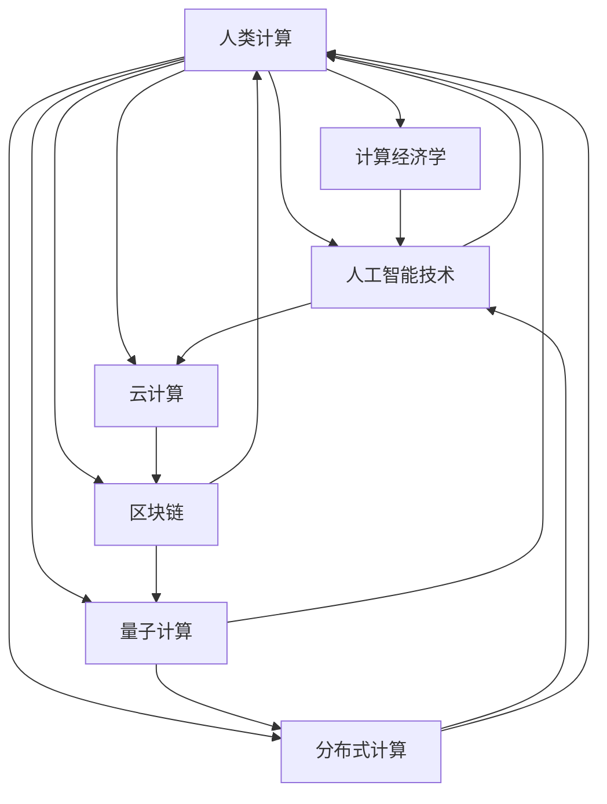

                 

# 人类计算：应用与案例分析

> 关键词：
  - 人类计算
  - 计算经济学
  - 人工智慧(AI)技术
  - 云计算
  - 区块链
  - 量子计算
  - 分布式计算

## 1. 背景介绍

### 1.1 问题由来

21世纪以来，随着信息技术、计算机技术的飞速发展，人类社会已经进入了数字化、网络化的全新时代。然而，计算机和人工智能(AI)技术的进步，也带来了新的挑战：数据的爆炸式增长、计算的巨量需求、隐私的严密保护、伦理的深层次探讨等等。如何在海量数据和复杂计算任务中，找到最优的解决方案，成为了摆在我们面前的重大课题。

人类计算（Human Computing），作为应对这一挑战的策略，开始受到越来越多的关注。它通过结合人类智慧和机器智能，实现数据计算、问题解决、决策优化等任务，为解决上述问题提供了一种全新路径。

### 1.2 问题核心关键点

人类计算的核心在于充分利用人类智慧与AI技术结合的优势。它要求通过智能机器与人类之间的协作，完成一些对人类特别有价值但又难以用传统计算机求解的问题。人类计算的实现过程主要包括以下几个环节：

1. **任务划分**：将复杂问题分解为适合人类解决和机器处理的小任务。
2. **人类求解**：通过在线调查、众包平台等方式收集人类的解决方案，以获得多样化的数据。
3. **机器处理**：利用机器学习算法，从收集到的数据中提取出规律和模式，生成最终解决方案。
4. **评估优化**：对机器处理的结果进行人工验证和优化，确保结果的准确性和有效性。

人类计算范式的提出，旨在将人类智慧和计算能力有机结合起来，充分发挥各自优势，提升问题解决的效率和质量。

### 1.3 问题研究意义

研究人类计算，对于推动人工智能、大数据、云计算等新兴技术的普及和应用，提升社会福祉，具有重要意义：

1. **提升计算效率**：利用人类智慧和机器学习，在处理复杂问题时，可以获得比传统计算更快的解决方案。
2. **优化决策过程**：在数据分析、预测模型构建等方面，通过人机协作，生成更为精准的预测和决策。
3. **增强数据质量**：通过人类标注、校验等手段，提升数据的准确性和可靠性。
4. **保护隐私安全**：将部分计算任务交由人类完成，可以降低数据隐私泄露的风险。
5. **促进技术普及**：利用廉价、便捷的众包平台，使得更多人能够参与计算任务，普及AI技术。
6. **推动创新发展**：结合人机协作模式，加速新技术、新应用的研究和开发。

## 2. 核心概念与联系

### 2.1 核心概念概述

为更好地理解人类计算的工作原理和应用场景，本节将介绍几个关键概念及其联系：

- **人类计算**：一种结合人类智慧与机器智能的计算模式，旨在通过智能机器与人类之间的协作，完成复杂任务。

- **计算经济学**：研究如何通过计算和通信资源的优化配置，提升生产效率和社会福利，并降低成本的经济学分支。

- **人工智能(AI)技术**：通过机器学习、深度学习等方法，模拟人类智能解决问题、学习和决策的计算机技术。

- **云计算**：一种基于互联网的计算模式，通过将计算任务分布到大量的远程计算节点上，实现计算资源的按需分配和使用。

- **区块链**：一种分布式账本技术，通过去中心化、加密和共识机制，保证数据的安全、透明和不可篡改。

- **量子计算**：一种新型的计算模式，利用量子叠加和量子纠缠等特性，实现信息处理的强大能力和高效性。

- **分布式计算**：通过将计算任务分布在多个计算节点上进行并行计算，提升计算效率和系统可靠性。

这些概念之间相互联系，共同构成了人类计算的技术基础和应用范式。理解这些核心概念及其联系，有助于我们更好地把握人类计算的发展趋势和应用场景。

### 2.2 核心概念原理和架构的 Mermaid 流程图



## 3. 核心算法原理 & 具体操作步骤

### 3.1 算法原理概述

人类计算的算法原理，主要围绕以下几个关键点：任务划分、求解与验证、模型训练与优化。

1. **任务划分**：将复杂问题分解为可人工处理和机器处理的小任务，使得人类和机器各自发挥优势。

2. **求解与验证**：通过智能机器处理，生成初步解决方案，并交由人类进行验证和优化，确保结果的准确性。

3. **模型训练与优化**：利用人类数据进行模型训练，通过机器学习算法生成最终解决方案。

### 3.2 算法步骤详解

#### 3.2.1 任务划分

任务划分是人机协作计算的第一步。常见的方法包括：

- **任务分解**：将问题分解为多个子任务，每个子任务独立处理。
- **任务分配**：根据任务复杂度和机器性能，将任务分配到合适的人类和机器进行处理。
- **任务优化**：在任务分配过程中，优化资源配置，提高计算效率。

以图像识别任务为例，可以将其分解为图像预处理、特征提取、分类器训练等子任务，分别由机器和人类处理。

#### 3.2.2 求解与验证

求解与验证过程涉及智能机器和人类的协作。具体步骤如下：

- **数据收集**：通过在线调查、众包平台等方式，收集人类对问题的解决方案。
- **数据预处理**：清洗、整理收集到的数据，生成适合机器处理的形式。
- **机器处理**：利用机器学习算法，对预处理后的数据进行建模和预测。
- **结果验证**：将机器处理的结果返回给人类，由人工进行验证和修正。
- **优化反馈**：根据人类反馈，对机器模型进行优化和调整。

#### 3.2.3 模型训练与优化

模型训练与优化是机器处理的核心环节。具体步骤如下：

- **数据标注**：收集人类对问题的标注数据，用于训练机器模型。
- **模型训练**：利用机器学习算法，训练模型对标注数据进行学习和预测。
- **模型评估**：对训练好的模型进行评估，选择性能最优的模型进行优化。
- **参数调整**：调整模型参数，提升模型的准确性和泛化能力。
- **模型部署**：将优化后的模型部署到实际应用中，进行大规模计算。

### 3.3 算法优缺点

人类计算的优势在于结合了人类的智慧和机器的处理能力，可以处理更加复杂、具有创造性的问题。具体优势包括：

1. **高效性**：结合机器和人类资源，可以大幅提升计算效率。
2. **灵活性**：通过任务划分和优化，可以适应不同规模和复杂度的问题。
3. **准确性**：通过人类验证和优化，可以保证最终结果的准确性和可靠性。
4. **隐私性**：部分计算任务交由人类完成，可以保护数据的隐私安全。

然而，人类计算也存在一些局限性：

1. **成本高**：需要组织大规模的人力参与，成本较高。
2. **一致性差**：人类处理结果的一致性和准确性可能存在差异。
3. **依赖性强**：依赖于数据收集和标注的质量，数据偏差可能影响结果。
4. **可解释性差**：机器处理的结果往往缺乏可解释性，难以理解其内部工作机制。

### 3.4 算法应用领域

人类计算已经在多个领域得到了广泛应用，以下是几个典型案例：

#### 3.4.1 图像识别

在图像识别任务中，人类计算通过将图像预处理、特征提取和分类器训练等子任务分别分配给机器和人类，实现了高效准确的图像识别结果。

#### 3.4.2 自然语言处理

自然语言处理任务中，通过智能机器处理和人类验证相结合，可以提升机器翻译、情感分析、问答系统等应用的准确性和鲁棒性。

#### 3.4.3 医学诊断

医学诊断中，结合机器学习和人类经验，可以提升疾病预测和诊断的准确性，帮助医生制定更好的治疗方案。

#### 3.4.4 金融风控

在金融风控领域，通过结合机器学习和人类经验，可以实现信用评分、欺诈检测、市场预测等任务，提升金融机构的决策效率和风险控制能力。

#### 3.4.5 工业生产

工业生产中，利用人类计算技术，可以提升设备故障预测、工艺优化、质量控制等应用的效果。

## 4. 数学模型和公式 & 详细讲解 & 举例说明

### 4.1 数学模型构建

假设有一项复杂任务 $T$，需要将其分解为 $n$ 个子任务，每个子任务由机器处理的概率为 $p$，由人类处理的概率为 $1-p$。定义机器处理函数 $f$，人类处理函数 $g$，则任务处理的整体函数为：

$$ T_{total} = \sum_{i=1}^{n} \alpha_i T_i $$

其中 $T_i$ 为第 $i$ 个子任务，$\alpha_i$ 为第 $i$ 个子任务的权重，即其在整体任务中的重要程度。

### 4.2 公式推导过程

对于任务 $T$ 的求解与验证过程，可以表示为：

$$ R = \sum_{i=1}^{n} \alpha_i (f_i + g_i + \delta_i) $$

其中 $f_i$ 表示机器处理第 $i$ 个子任务的结果，$g_i$ 表示人类处理第 $i$ 个子任务的结果，$\delta_i$ 表示人类对机器处理结果的修正。

### 4.3 案例分析与讲解

以医学诊断为例，假设某项疾病诊断任务 $T$ 分解为三个子任务 $T_1$、$T_2$、$T_3$，分别代表病历分析、症状匹配、实验室检查。机器处理每个子任务的概率为 $p=0.7$，人类处理概率为 $1-p=0.3$。机器处理函数为 $f_i = f_i(T_i)$，人类处理函数为 $g_i = g_i(T_i)$，人类修正函数为 $\delta_i = \delta_i(f_i(T_i),g_i(T_i))$。

具体求解步骤如下：

1. 收集病历数据，生成 $T_1$ 的训练集。
2. 使用机器学习算法，训练 $f_1$ 对 $T_1$ 进行初步预测。
3. 将 $f_1$ 的预测结果返回给医生，由医生进行验证和修正，生成 $g_1$。
4. 根据医生的修正结果，生成 $\delta_1$，并对 $f_1$ 进行优化。
5. 重复步骤 1-4，直到所有子任务处理完毕。
6. 将 $T_1$、$T_2$、$T_3$ 的结果进行综合，生成最终的诊断结果。

## 5. 项目实践：代码实例和详细解释说明

### 5.1 开发环境搭建

在进行人类计算实践前，我们需要准备好开发环境。以下是使用Python进行人类计算开发的典型环境配置：

1. 安装Python 3.7及以上版本。
2. 安装必要的Python库，如TensorFlow、PyTorch、Pandas等。
3. 安装在线调查、众包平台等工具，如Google Forms、Amazon Mechanical Turk等。
4. 搭建开发服务器，提供计算资源的分配和调度。

### 5.2 源代码详细实现

下面以图像识别任务为例，给出使用Python和TensorFlow实现人类计算的代码示例。

```python
import tensorflow as tf
import numpy as np

# 定义图像处理函数
def preprocess_image(image):
    # 图像预处理步骤，如缩放、归一化等
    return processed_image

# 定义特征提取函数
def extract_features(image):
    # 使用卷积神经网络提取图像特征
    return feature_vector

# 定义分类器训练函数
def train_classifier(features, labels):
    # 使用机器学习算法训练分类器
    return trained_model

# 定义人类处理函数
def human_annotate(image, features, trained_model):
    # 收集人类对图像的标注
    return human_annotations

# 定义机器处理函数
def machine_annotate(image, features, trained_model):
    # 使用机器学习算法生成图像标注
    return machine_annotations

# 定义人类计算函数
def human_computing(image):
    processed_image = preprocess_image(image)
    feature_vector = extract_features(processed_image)
    human_annotations = human_annotate(feature_vector, trained_model)
    machine_annotations = machine_annotate(feature_vector, trained_model)
    return human_annotations, machine_annotations

# 定义最终处理函数
def final_processing(human_annotations, machine_annotations):
    # 对人类和机器标注结果进行综合，生成最终结果
    return final_result

# 示例数据
image_data = ...
train_features = ...
train_labels = ...
test_features = ...

# 预训练模型
trained_model = ...

# 数据预处理
train_features = preprocess_image(train_features)
test_features = preprocess_image(test_features)

# 特征提取
train_features = extract_features(train_features)
test_features = extract_features(test_features)

# 训练分类器
trained_model = train_classifier(train_features, train_labels)

# 进行人类计算
human_annotations, machine_annotations = human_computing(image_data)

# 综合结果
final_result = final_processing(human_annotations, machine_annotations)

# 输出最终结果
print(final_result)
```

### 5.3 代码解读与分析

让我们再详细解读一下代码的实现细节：

**preprocess_image**：定义了图像预处理函数，包括缩放、归一化、降噪等预处理步骤。

**extract_features**：定义了特征提取函数，使用卷积神经网络对图像进行特征提取。

**train_classifier**：定义了分类器训练函数，使用机器学习算法对特征进行分类。

**human_annotate**：定义了人类处理函数，通过在线调查或众包平台收集人类对图像的标注。

**machine_annotate**：定义了机器处理函数，使用机器学习算法对图像进行自动标注。

**human_computing**：定义了人类计算函数，将预处理、特征提取、分类器训练等子任务分别交给人类和机器处理。

**final_processing**：定义了最终处理函数，对人类和机器标注结果进行综合，生成最终结果。

**主程序**：根据示例数据和预训练模型，进行图像处理和标注，最终输出处理结果。

## 6. 实际应用场景

### 6.1 医学诊断

在医学诊断领域，利用人类计算技术，可以提升疾病预测和诊断的准确性，帮助医生制定更好的治疗方案。例如，某医院可以利用人类计算技术，对病人病历、实验室检查结果等数据进行处理和分析，辅助医生进行疾病诊断。

### 6.2 金融风控

在金融风控领域，通过结合机器学习和人类经验，可以实现信用评分、欺诈检测、市场预测等任务，提升金融机构的决策效率和风险控制能力。例如，某银行可以利用人类计算技术，对客户消费记录、信用历史等数据进行处理和分析，辅助银行进行贷款审批和风险评估。

### 6.3 工业生产

在工业生产中，利用人类计算技术，可以提升设备故障预测、工艺优化、质量控制等应用的效果。例如，某制造企业可以利用人类计算技术，对设备运行数据进行处理和分析，预测设备故障，优化生产工艺，提升产品质量。

## 7. 工具和资源推荐

### 7.1 学习资源推荐

为了帮助开发者系统掌握人类计算的理论基础和实践技巧，这里推荐一些优质的学习资源：

1. 《Human Computing: The Future of Work in a Machine-Driven World》书籍：系统介绍了人类计算的原理、应用和未来发展方向。

2. 《Human-AI Collaboration: Bridging the Gap Between Humans and Machines》论文：探讨了人机协作的计算模式，及其在多个领域的应用案例。

3. 《Human-Computer Interaction: Towards a New Era of Collaboration》课程：通过线上课程，学习人机协作的计算模式和实际应用。

4. 《Human Computing: An Interdisciplinary Approach to Information and Systems》会议：汇集了多个领域的专家学者，探讨了人机协作计算的理论和应用。

5. 《Human-Computer Interaction Journal》期刊：发表了关于人机协作计算的最新研究成果和应用案例。

通过学习这些资源，相信你一定能够快速掌握人类计算的精髓，并用于解决实际的计算问题。

### 7.2 开发工具推荐

高效的开发离不开优秀的工具支持。以下是几款用于人类计算开发的常用工具：

1. Python 编程语言：功能强大、灵活性高，适合快速迭代研究。
2. TensorFlow：谷歌开源的深度学习框架，生产部署方便，适合大规模工程应用。
3. PyTorch：Facebook开源的深度学习框架，灵活性高，适合研究性项目开发。
4. Google Forms：在线调查工具，方便收集人类标注数据。
5. Amazon Mechanical Turk：众包平台，方便组织大规模人类标注任务。

合理利用这些工具，可以显著提升人类计算任务的开发效率，加快创新迭代的步伐。

### 7.3 相关论文推荐

人类计算研究源于学界的持续研究。以下是几篇奠基性的相关论文，推荐阅读：

1. "Human-Computer Interaction: Cooperative, Adaptive, and Inclusive Design" 论文：探讨了人机协作设计原则，及其实际应用案例。
2. "Human Computing in the Age of AI: Trends, Challenges, and Opportunities" 报告：分析了人类计算的发展趋势，及其在多个领域的应用。
3. "Human-AI Collaboration: A Survey of Techniques and Applications" 综述：总结了人机协作计算的多种技术和应用方法。
4. "Human Computing: The Next Steps in Machine-Aided Human Thought" 论文：探讨了未来人机协作计算的发展方向和应用前景。
5. "Human-Computer Interaction: Concepts, Models, Paradigms, and Architectures" 书籍：全面介绍了人机交互的原理和设计方法。

这些论文代表了大规模人类计算技术的发展脉络。通过学习这些前沿成果，可以帮助研究者把握学科前进方向，激发更多的创新灵感。

## 8. 总结：未来发展趋势与挑战

### 8.1 研究成果总结

本文对人类计算的算法原理、操作步骤和应用场景进行了全面系统的介绍。首先阐述了人类计算的研究背景和意义，明确了其在提升计算效率、优化决策过程、增强数据质量等方面的独特价值。其次，从原理到实践，详细讲解了人类计算的数学模型、公式推导和关键步骤，给出了人类计算任务开发的完整代码实例。同时，本文还广泛探讨了人类计算技术在医学、金融、工业等多个行业领域的应用前景，展示了其巨大的潜力。最后，本文精选了人类计算技术的各类学习资源和开发工具，力求为开发者提供全方位的技术指引。

通过本文的系统梳理，可以看到，人类计算技术正在成为计算领域的新范式，极大地提升了问题解决的效率和质量。利用智能机器与人类智慧相结合的方式，将突破传统计算的边界，为解决复杂问题提供新的思路和方法。

### 8.2 未来发展趋势

展望未来，人类计算技术将呈现以下几个发展趋势：

1. **智能化**：结合更多人工智能技术，提升人机协作的智能化水平，增强任务处理的创造性和灵活性。
2. **多样化**：拓展人类计算的应用场景，涵盖更多领域和行业，推动跨领域、跨学科的协作。
3. **自动化**：通过自动化工具和平台，提升任务处理的效率和可操作性，降低人工干预的需求。
4. **智能化**：利用大数据和深度学习技术，提升任务处理的准确性和鲁棒性。
5. **可扩展性**：增强人类计算系统的可扩展性和灵活性，适应不同规模和复杂度的问题。

### 8.3 面临的挑战

尽管人类计算技术已经取得了显著进展，但在迈向更加智能化、普适化应用的过程中，仍面临诸多挑战：

1. **成本高**：大规模组织人力参与，需要较高的成本投入。
2. **一致性差**：人类处理结果的一致性和准确性可能存在差异。
3. **数据隐私**：部分计算任务交由人类完成，可能涉及数据隐私泄露的风险。
4. **可解释性差**：机器处理的结果往往缺乏可解释性，难以理解其内部工作机制。
5. **依赖性强**：依赖于数据收集和标注的质量，数据偏差可能影响结果。

### 8.4 研究展望

面对人类计算面临的挑战，未来的研究需要在以下几个方面寻求新的突破：

1. **降低成本**：探索无监督学习和半监督学习等方法，减少对大规模标注数据的依赖，降低成本。
2. **提高一致性**：通过模型优化和任务设计，提高处理结果的一致性和准确性。
3. **保护隐私**：利用区块链和分布式计算等技术，保护数据隐私安全。
4. **增强可解释性**：引入可解释性模型和工具，提高处理结果的可解释性。
5. **提升数据质量**：利用众包平台和在线调查等手段，提高数据收集和标注的质量。

这些研究方向的探索，必将引领人类计算技术迈向更高的台阶，为构建智能、高效、安全的计算系统提供新的思路和方法。面向未来，人类计算技术还需要与其他人工智能技术进行更深入的融合，如知识表示、因果推理、强化学习等，多路径协同发力，共同推动计算领域的发展。只有勇于创新、敢于突破，才能不断拓展人类计算的边界，让智能技术更好地造福人类社会。

## 9. 附录：常见问题与解答

**Q1：人类计算是否适用于所有计算任务？**

A: 人类计算适用于需要人类智慧和经验参与的计算任务，例如图像识别、自然语言处理、医学诊断等。但对于一些需要高度计算密集型或实时处理的任务，如天气预测、金融交易等，可能需要利用机器处理。

**Q2：如何进行任务划分和分配？**

A: 任务划分和分配可以通过任务分解和资源调度的方式进行。首先根据任务复杂度和机器性能，将任务分解为多个子任务，然后根据子任务的难度和重要性，进行资源调度，分配给合适的人类和机器进行处理。

**Q3：如何提高人类计算的效率？**

A: 提高人类计算的效率可以从以下几个方面入手：
1. 任务分解：将复杂任务分解为多个子任务，并行处理。
2. 任务调度：优化任务调度策略，减少等待时间和资源浪费。
3. 任务优化：优化任务处理过程，减少重复和冗余操作。
4. 任务合并：将相似的任务合并处理，提高处理效率。

**Q4：人类计算是否会受到数据偏差的影响？**

A: 人类计算中的数据偏差确实可能影响最终结果。因此，在数据收集和标注过程中，需要采取一些措施减少偏差，例如多标注、交叉验证等。同时，在模型训练和优化过程中，需要利用正则化等方法，防止过拟合和数据偏差的影响。

**Q5：人类计算是否可以应用于自动化和机器人领域？**

A: 人类计算可以应用于自动化和机器人领域，例如通过智能机器人和人类协作，完成复杂的操作任务。例如，在工业生产中，利用人类计算技术，可以提升设备故障预测、工艺优化、质量控制等应用的效果。

---

作者：禅与计算机程序设计艺术 / Zen and the Art of Computer Programming

