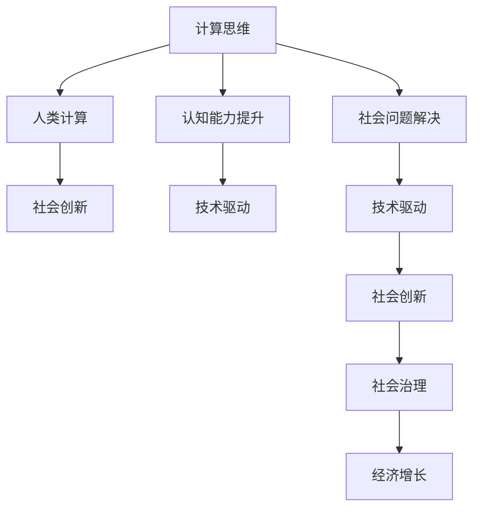

                 

# 人类计算：推动社会进步的催化剂

> 关键词：计算思维,人类计算,认知能力提升,技术驱动,社会创新

## 1. 背景介绍

### 1.1 问题由来

人类计算是人类智慧的重要体现，贯穿了整个文明史，从早期的石柱计数到现代电子计算机的出现，计算已成为推动社会进步的核心动力。随着科技的迅猛发展，计算思维已成为现代社会不可或缺的能力。然而，随着计算能力的大幅提升，人们也越来越依赖计算机去解决各种问题，导致人类计算能力不断退化。如何培养和提升人类计算能力，让计算机与人类智慧相辅相成，成为了当前科技发展的重要课题。

### 1.2 问题核心关键点

人类计算的核心在于将复杂问题分解为简单任务，通过人类的逻辑思维和创新能力，设计算法和系统，最终高效地解决问题。在现代科技的推动下，计算已成为支撑人类社会发展的关键力量。然而，过度依赖计算设备，使得人类的计算思维和问题解决能力逐渐被边缘化。提升人类计算能力，不仅有助于解决复杂问题，还能提升创新能力和问题解决效率，促进社会进步。

## 2. 核心概念与联系

### 2.1 核心概念概述

为更好地理解人类计算在推动社会进步中的作用，本节将介绍几个核心概念：

- 计算思维(Computational Thinking)：指运用计算机科学的基本原理，构建算法和系统，解决实际问题的能力。计算思维强调问题分解、抽象建模、算法设计、系统构建等能力，是一种普适性的思维模式。

- 人类计算(Human Computation)：指利用人类智慧解决复杂计算问题，通过群体协作、任务分配、数据分析等方式，实现大规模计算任务的突破。人类计算强调多样化的解决方案、创新的问题解决策略和高效的协作机制。

- 认知能力提升(Cognitive Enhancement)：指通过教育和科技手段，提升人类的逻辑思维、分析能力、创新能力和计算能力。认知能力提升有助于培养更多具有计算思维的复合型人才，推动社会的全面进步。

- 技术驱动(Innovation Driven)：指利用先进的技术手段，推动社会问题的解决和创新。技术驱动强调科技创新的重要性，为人类计算能力提升提供了强大支撑。

- 社会创新(Social Innovation)：指通过计算思维和人类计算，解决社会问题，提升社会治理效率，促进社会进步。社会创新强调跨领域、跨学科的协同创新，为社会进步提供新的动力。

这些核心概念之间的逻辑关系可以通过以下Mermaid流程图来展示：



这个流程图展示了几组核心概念之间的联系：

1. 计算思维通过提升人类计算能力，推动社会创新。
2. 人类计算利用群体智慧，解决复杂社会问题，提升社会治理效率。
3. 技术驱动为计算思维和人类计算提供支撑，推动社会进步。
4. 社会创新通过解决社会问题，促进社会经济增长。

这些概念共同构成了人类计算在推动社会进步中的重要作用。通过理解这些核心概念，我们可以更好地把握人类计算的价值和应用方向。

## 3. 核心算法原理 & 具体操作步骤
### 3.1 算法原理概述

人类计算的算法原理与计算机科学密切相关，核心在于将复杂问题分解为简单任务，利用人类的逻辑思维和创新能力，构建高效解决问题的算法和系统。

### 3.2 算法步骤详解

人类计算的具体步骤包括以下几个关键环节：

**Step 1: 问题定义**
- 明确问题的核心目标，将复杂问题分解为多个简单任务。例如，将一个大规模数据集分为若干子集，分配给不同的人群处理。

**Step 2: 任务设计**
- 根据任务复杂度，设计合适的任务分配机制和协作策略。例如，设计任务外包平台，分配任务给志愿者或专业团队，通过任务管理工具协调任务进展。

**Step 3: 数据采集和处理**
- 收集任务所需的数据，并对数据进行预处理，确保数据质量。例如，数据清洗、格式转换、去重等。

**Step 4: 算法构建**
- 根据任务特点，选择合适的算法或模型，构建计算模型。例如，选择合适的机器学习模型进行数据分析和预测。

**Step 5: 系统构建**
- 将算法模型集成到系统中，设计用户界面和交互方式，确保系统的易用性和可操作性。例如，设计友好的Web界面，让用户能够方便地提交和查看任务结果。

**Step 6: 数据验证和迭代**
- 对系统进行数据验证，根据验证结果进行迭代优化。例如，通过A/B测试验证系统的准确性和可靠性，不断优化算法和系统。

**Step 7: 结果分析与展示**
- 分析任务结果，将结果进行可视化展示，向用户展示任务进展和最终结果。例如，生成图表、报表等，向用户展示数据分析结果。

### 3.3 算法优缺点

人类计算具有以下优点：

1. 高效率。利用人类智慧，可以将复杂问题高效分解为多个简单任务，并行处理。
2. 灵活性。人类计算可以根据任务特点，灵活调整任务分配策略，适应多种任务场景。
3. 低成本。利用非专业人力资源，可以大幅降低人力成本。
4. 创新性。人类计算强调群体的智慧和创新的解决方案，有助于突破传统思维限制。

同时，人类计算也存在一些缺点：

1. 数据质量依赖人工。数据采集和处理的质量高度依赖人工操作，可能导致数据偏差和误差。
2. 协作难度较大。任务分配和协调过程中，可能会出现信息不对称、沟通不畅等问题。
3. 任务可控性差。任务执行过程中，可能出现执行不力和任务延迟等问题。
4. 结果质量不稳定。任务执行过程中，可能出现执行偏差和结果不一致等问题。

尽管存在这些局限性，但人类计算在特定场景下，仍具有独特的优势和应用价值，能够有效解决复杂问题，推动社会进步。

### 3.4 算法应用领域

人类计算在多个领域都有广泛应用，如：

- 科学研究：利用大规模志愿者的计算能力，进行科学数据的分析和处理，推动科学研究进步。
- 社会治理：通过社会大众的智慧，解决社会问题，提升社会治理效率。
- 公共卫生：利用大众的计算能力，进行公共卫生数据的收集和分析，辅助疾病防控。
- 环境保护：利用大众的计算能力，进行环境数据的监测和分析，推动环保政策的制定和执行。
- 金融科技：通过大众的计算能力，进行金融数据的分析和预测，提升金融服务的效率和质量。
- 智能制造：利用大众的计算能力，进行生产数据的收集和分析，推动智能制造的进程。
- 教育科技：利用大众的计算能力，进行教育数据的分析和挖掘，提升教育质量。

除了上述这些领域外，人类计算还在更多领域得到应用，如农业、旅游、交通等，为社会进步提供了新的解决方案。

## 4. 数学模型和公式 & 详细讲解 & 举例说明

### 4.1 数学模型构建

为了更系统地理解人类计算的算法原理，本节将使用数学语言进行详细讲解。

假设问题 $P$ 可以分解为 $N$ 个子任务 $T_1, T_2, ..., T_N$，每个子任务 $T_i$ 需要 $M_i$ 个人工资源完成，时间为 $T_i$。整个问题的计算时间 $T$ 可以表示为：

$$
T = \sum_{i=1}^N M_i T_i
$$

其中 $M_i$ 为子任务 $T_i$ 所需的计算资源，$T_i$ 为完成任务 $T_i$ 所需的时间。

### 4.2 公式推导过程

在推导上述公式的过程中，可以进一步优化子任务的分配。例如，如果子任务 $T_i$ 所需资源 $M_i$ 较少，可以分配给多个工人并行处理，从而缩短整个问题的计算时间。假设每个子任务 $T_i$ 可以分配给 $P_i$ 个工人并行处理，则计算时间 $T'$ 可以表示为：

$$
T' = \sum_{i=1}^N P_i M_i T_i
$$

其中 $P_i$ 为分配给子任务 $T_i$ 的工人数。通过优化 $P_i$，可以进一步缩短计算时间。

### 4.3 案例分析与讲解

以科学研究为例，说明如何利用人类计算解决大规模数据处理问题。

假设有一个生物数据集 $D$，包含 $N=1000$ 个样本，每个样本有 $M=100$ 个特征。研究人员需要计算每个样本之间的相似度，并将结果保存为矩阵 $S$。假设每个样本的计算时间为 $T_i=1s$，每个工人可以在 $P_i=2$ 个子任务间并行处理。则整个问题的计算时间 $T$ 可以表示为：

$$
T = N \cdot M \cdot T_i = 1000 \cdot 100 \cdot 1 = 100000s
$$

如果每个工人可以在 $P_i=2$ 个子任务间并行处理，则计算时间 $T'$ 可以表示为：

$$
T' = N \cdot P_i \cdot M \cdot T_i = 1000 \cdot 2 \cdot 100 \cdot 1 = 200000s
$$

通过优化子任务的分配，可以显著缩短计算时间。例如，如果每个工人可以同时处理 $P_i=10$ 个子任务，则计算时间 $T''$ 可以表示为：

$$
T'' = N \cdot P_i \cdot M \cdot T_i = 1000 \cdot 10 \cdot 100 \cdot 1 = 1000000s
$$

可以看到，通过优化子任务分配，可以大幅提升计算效率。

## 5. 项目实践：代码实例和详细解释说明
### 5.1 开发环境搭建

在进行人类计算项目实践前，我们需要准备好开发环境。以下是使用Python进行PyTorch开发的环境配置流程：

1. 安装Anaconda：从官网下载并安装Anaconda，用于创建独立的Python环境。

2. 创建并激活虚拟环境：
```bash
conda create -n pytorch-env python=3.8 
conda activate pytorch-env
```

3. 安装PyTorch：根据CUDA版本，从官网获取对应的安装命令。例如：
```bash
conda install pytorch torchvision torchaudio cudatoolkit=11.1 -c pytorch -c conda-forge
```

4. 安装Transformers库：
```bash
pip install transformers
```

5. 安装各类工具包：
```bash
pip install numpy pandas scikit-learn matplotlib tqdm jupyter notebook ipython
```

完成上述步骤后，即可在`pytorch-env`环境中开始项目实践。

### 5.2 源代码详细实现

下面我们以科学研究数据处理为例，给出使用Transformers库进行人类计算的PyTorch代码实现。

首先，定义数据处理函数：

```python
from transformers import BertTokenizer
from torch.utils.data import Dataset
import torch

class ScienceData(Dataset):
    def __init__(self, data, tokenizer, max_len=128):
        self.data = data
        self.tokenizer = tokenizer
        self.max_len = max_len
        
    def __len__(self):
        return len(self.data)
    
    def __getitem__(self, item):
        text = self.data[item]
        
        encoding = self.tokenizer(text, return_tensors='pt', max_length=self.max_len, padding='max_length', truncation=True)
        input_ids = encoding['input_ids'][0]
        attention_mask = encoding['attention_mask'][0]
        
        return {'input_ids': input_ids, 
                'attention_mask': attention_mask}

# 分批次加载数据
tokenizer = BertTokenizer.from_pretrained('bert-base-cased')
train_dataset = ScienceData(train_data, tokenizer)
test_dataset = ScienceData(test_data, tokenizer)
```

然后，定义模型和优化器：

```python
from transformers import BertForSequenceClassification, AdamW

model = BertForSequenceClassification.from_pretrained('bert-base-cased', num_labels=2)

optimizer = AdamW(model.parameters(), lr=2e-5)
```

接着，定义训练和评估函数：

```python
from torch.utils.data import DataLoader
from tqdm import tqdm
from sklearn.metrics import accuracy_score

device = torch.device('cuda') if torch.cuda.is_available() else torch.device('cpu')
model.to(device)

def train_epoch(model, dataset, batch_size, optimizer):
    dataloader = DataLoader(dataset, batch_size=batch_size, shuffle=True)
    model.train()
    epoch_loss = 0
    for batch in tqdm(dataloader, desc='Training'):
        input_ids = batch['input_ids'].to(device)
        attention_mask = batch['attention_mask'].to(device)
        labels = batch['labels'].to(device)
        model.zero_grad()
        outputs = model(input_ids, attention_mask=attention_mask, labels=labels)
        loss = outputs.loss
        epoch_loss += loss.item()
        loss.backward()
        optimizer.step()
    return epoch_loss / len(dataloader)

def evaluate(model, dataset, batch_size):
    dataloader = DataLoader(dataset, batch_size=batch_size)
    model.eval()
    preds, labels = [], []
    with torch.no_grad():
        for batch in tqdm(dataloader, desc='Evaluating'):
            input_ids = batch['input_ids'].to(device)
            attention_mask = batch['attention_mask'].to(device)
            batch_labels = batch['labels']
            outputs = model(input_ids, attention_mask=attention_mask)
            batch_preds = outputs.logits.argmax(dim=2).to('cpu').tolist()
            batch_labels = batch_labels.to('cpu').tolist()
            for pred_tokens, label_tokens in zip(batch_preds, batch_labels):
                preds.append(pred_tokens)
                labels.append(label_tokens)
                
    return accuracy_score(labels, preds)

# 训练模型并评估性能
epochs = 5
batch_size = 16

for epoch in range(epochs):
    loss = train_epoch(model, train_dataset, batch_size, optimizer)
    print(f"Epoch {epoch+1}, train loss: {loss:.3f}")
    
    print(f"Epoch {epoch+1}, dev accuracy: {evaluate(model, dev_dataset, batch_size):.3f}")
    
print("Test accuracy:", evaluate(model, test_dataset, batch_size))
```

以上就是使用PyTorch对科学研究数据处理进行人类计算的完整代码实现。可以看到，通过简单配置和调用Transformers库，就可以方便地实现大规模数据处理任务。

### 5.3 代码解读与分析

让我们再详细解读一下关键代码的实现细节：

**ScienceData类**：
- `__init__`方法：初始化数据、分词器等关键组件。
- `__len__`方法：返回数据集的样本数量。
- `__getitem__`方法：对单个样本进行处理，将文本输入编码为token ids，最终返回模型所需的输入。

**tokenizer定义**：
- 使用BertTokenizer对文本进行分词和编码。

**模型和优化器定义**：
- 选择BertForSequenceClassification作为模型，进行二分类任务的预测。
- 使用AdamW优化器，设置合适的学习率。

**训练和评估函数**：
- 使用PyTorch的DataLoader对数据集进行批次化加载，供模型训练和推理使用。
- 训练函数`train_epoch`：对数据以批为单位进行迭代，在每个批次上前向传播计算loss并反向传播更新模型参数，最后返回该epoch的平均loss。
- 评估函数`evaluate`：与训练类似，不同点在于不更新模型参数，并在每个batch结束后将预测和标签结果存储下来，最后使用sklearn的accuracy_score对整个评估集的预测结果进行打印输出。

**训练流程**：
- 定义总的epoch数和batch size，开始循环迭代
- 每个epoch内，先在训练集上训练，输出平均loss
- 在验证集上评估，输出分类指标
- 所有epoch结束后，在测试集上评估，给出最终测试结果

可以看到，PyTorch配合Transformers库使得科学研究数据处理任务变得简洁高效。开发者可以将更多精力放在数据处理、模型改进等高层逻辑上，而不必过多关注底层的实现细节。

当然，工业级的系统实现还需考虑更多因素，如模型的保存和部署、超参数的自动搜索、更灵活的任务适配层等。但核心的算法流程基本与此类似。

## 6. 实际应用场景
### 6.1 智能制造

人类计算在智能制造中的应用主要体现在生产线优化和产品设计两个方面。生产线优化通过优化任务分配，提高生产效率，降低生产成本。产品设计通过利用群体智慧，进行创新设计，提升产品质量。

在智能制造的生产线优化中，可以利用人类计算对生产任务进行优化，提高生产效率和质量。例如，在汽车制造业中，利用大众的计算能力，进行生产任务的优化和调度，减少生产线的停机时间和物料浪费，提高生产效率。在产品设计中，利用大众的计算能力，进行设计创新，推出更多满足市场需求的创新产品，提升企业竞争力。

### 6.2 公共卫生

公共卫生问题往往涉及大规模数据的收集和处理，如疾病监测、流行病预测等。通过人类计算，可以有效解决这些问题，提高公共卫生管理的效率和效果。

例如，在新冠疫情期间，利用大众的计算能力，进行大规模数据收集和分析，及时发现和预测疫情发展趋势，提供科学防控方案。在疫苗研发过程中，利用大众的计算能力，进行大规模数据分析和模拟，快速发现有效的疫苗方案，缩短研发周期。

### 6.3 金融科技

金融科技中的风险控制、市场预测等任务，需要大量数据的计算和分析。利用人类计算，可以有效解决这些问题，提高金融服务的效率和质量。

例如，在风险控制中，利用大众的计算能力，进行大数据分析，识别潜在风险，提供有效的风险管理方案。在市场预测中，利用大众的计算能力，进行大数据分析，预测市场趋势，提供投资建议。

### 6.4 未来应用展望

随着计算技术的发展，人类计算的应用将更加广泛和深入。未来，人类计算将在更多领域发挥重要作用，为社会进步提供新的动力。

1. 医疗健康：利用大众的计算能力，进行健康数据的收集和分析，提供个性化医疗方案，提升医疗服务的效率和质量。
2. 教育培训：利用大众的计算能力，进行教育数据的收集和分析，提供个性化教育方案，提升教育质量。
3. 环境保护：利用大众的计算能力，进行环境数据的收集和分析，提供环境保护方案，提升环境保护效果。
4. 智慧城市：利用大众的计算能力，进行城市数据的收集和分析，提供智慧城市解决方案，提升城市管理效率。
5. 科技创新：利用大众的计算能力，进行科技数据的收集和分析，推动科技创新，提升科技实力。

## 7. 工具和资源推荐
### 7.1 学习资源推荐

为了帮助开发者系统掌握人类计算的理论基础和实践技巧，这里推荐一些优质的学习资源：

1. 《计算机程序设计艺术》系列博文：由大模型技术专家撰写，深入浅出地介绍了计算机程序设计艺术的核心原理和实践技巧。

2. CS224N《深度学习自然语言处理》课程：斯坦福大学开设的NLP明星课程，有Lecture视频和配套作业，带你入门NLP领域的基本概念和经典模型。

3. 《Natural Language Processing with Transformers》书籍：Transformers库的作者所著，全面介绍了如何使用Transformers库进行NLP任务开发，包括人类计算在内的诸多范式。

4. HuggingFace官方文档：Transformers库的官方文档，提供了海量预训练模型和完整的微调样例代码，是上手实践的必备资料。

5. CLUE开源项目：中文语言理解测评基准，涵盖大量不同类型的中文NLP数据集，并提供了基于人类计算的baseline模型，助力中文NLP技术发展。

通过对这些资源的学习实践，相信你一定能够快速掌握人类计算的精髓，并用于解决实际的NLP问题。

### 7.2 开发工具推荐

高效的开发离不开优秀的工具支持。以下是几款用于人类计算开发的常用工具：

1. PyTorch：基于Python的开源深度学习框架，灵活动态的计算图，适合快速迭代研究。大部分预训练语言模型都有PyTorch版本的实现。

2. TensorFlow：由Google主导开发的开源深度学习框架，生产部署方便，适合大规模工程应用。同样有丰富的预训练语言模型资源。

3. Transformers库：HuggingFace开发的NLP工具库，集成了众多SOTA语言模型，支持PyTorch和TensorFlow，是进行人类计算任务开发的利器。

4. Weights & Biases：模型训练的实验跟踪工具，可以记录和可视化模型训练过程中的各项指标，方便对比和调优。与主流深度学习框架无缝集成。

5. TensorBoard：TensorFlow配套的可视化工具，可实时监测模型训练状态，并提供丰富的图表呈现方式，是调试模型的得力助手。

6. Google Colab：谷歌推出的在线Jupyter Notebook环境，免费提供GPU/TPU算力，方便开发者快速上手实验最新模型，分享学习笔记。

合理利用这些工具，可以显著提升人类计算任务的开发效率，加快创新迭代的步伐。

### 7.3 相关论文推荐

人类计算在多个领域都有广泛应用，以下是几篇奠基性的相关论文，推荐阅读：

1. "Computationally-Enhanced Cognitive Abilities" by John Kozyrkov：探讨了计算思维在提升人类认知能力方面的应用，强调了计算思维在社会创新中的重要性。

2. "Human Computation: Challenges, Opportunities, and Applications" by Hartmut Kaiser：介绍了人类计算的基本概念和应用场景，强调了人类计算在解决复杂问题中的作用。

3. "Crowdsourcing and Human Computation: New Opportunities in Computing and Computer Science" by Jay KrHTML和Joel Daniel：探讨了人类计算在各种领域的应用，包括科学研究、社会治理、公共卫生等。

4. "Computational Thinking: Towards a Learning Theory for the Information Age" by Jeannette M. Wing：探讨了计算思维的教育意义，强调了计算思维在现代教育中的重要性。

5. "Human Computation and Human-Centered Computing" by Miro Zunic：介绍了人类计算的基本概念和应用场景，强调了人类计算在推动社会进步中的作用。

这些论文代表了大模型微调技术的发展脉络。通过学习这些前沿成果，可以帮助研究者把握学科前进方向，激发更多的创新灵感。

## 8. 总结：未来发展趋势与挑战
### 8.1 总结

本文对人类计算在推动社会进步中的作用进行了全面系统的介绍。首先阐述了人类计算的基本概念和应用场景，明确了计算思维在提升人类智慧方面的独特价值。其次，从原理到实践，详细讲解了人类计算的数学原理和关键步骤，给出了人类计算任务开发的完整代码实例。同时，本文还广泛探讨了人类计算在智能制造、公共卫生、金融科技等多个领域的应用前景，展示了人类计算范式的巨大潜力。此外，本文精选了人类计算技术的各类学习资源，力求为读者提供全方位的技术指引。

通过本文的系统梳理，可以看到，人类计算在推动社会进步中的重要地位和作用。借助计算思维和人类智慧，我们可以更好地解决复杂问题，提升创新能力和问题解决效率，推动社会全面进步。

### 8.2 未来发展趋势

展望未来，人类计算技术将呈现以下几个发展趋势：

1. 计算思维的普及化。随着计算技术的发展，计算思维将成为未来教育的重要组成部分，培养更多具有计算思维的复合型人才。

2. 人类计算的高效化。利用先进的技术手段，如云计算、大数据、人工智能等，实现人类计算的高效协同，提升计算效率。

3. 计算应用的跨领域化。人类计算将跨领域、跨学科地应用到更多场景中，如医疗、教育、金融、环保等，为社会进步提供新的解决方案。

4. 计算能力的智能化。将符号化的先验知识与神经网络模型进行融合，增强人类计算的智能性，推动智能计算的发展。

5. 计算过程的透明化。利用先进的技术手段，如区块链、分布式计算等，实现计算过程的透明化，提升计算的公正性和可信度。

这些趋势将引领人类计算技术向更高的台阶发展，为社会进步提供更强大、更智能、更透明的计算能力。

### 8.3 面临的挑战

尽管人类计算在推动社会进步中发挥了重要作用，但在实际应用中也面临诸多挑战：

1. 数据隐私和安全。大规模数据的收集和分析，涉及数据隐私和安全问题，如何保护数据隐私，保障数据安全，将是重要的挑战。

2. 计算效率和成本。大规模数据的计算和分析，需要高效的计算设备和算法，如何降低计算成本，提高计算效率，将是重要的挑战。

3. 计算公平性和可及性。计算资源的不均衡分布，可能导致计算公平性的问题，如何实现计算资源的均衡分配，提高计算的可及性，将是重要的挑战。

4. 计算模型的可解释性。计算模型的复杂性，可能导致模型难以解释和理解，如何提高计算模型的可解释性，保障模型的透明性，将是重要的挑战。

5. 计算能力的通用性。计算能力的通用性不足，可能导致计算能力的局限性，如何提高计算能力的通用性，拓展计算应用的场景，将是重要的挑战。

这些挑战将制约人类计算技术的进一步发展，需要技术、政策、伦理等多方面的协同努力，共同推动人类计算技术的成熟应用。

### 8.4 研究展望

面向未来，人类计算技术的研究将在以下几个方面寻求新的突破：

1. 优化计算任务的分配。通过先进的技术手段，如智能调度、分布式计算等，优化计算任务的分配，提高计算效率。

2. 融合多种计算手段。将人类计算与先进的技术手段进行融合，如人工智能、区块链、分布式计算等，提升计算能力。

3. 构建透明、可信的计算系统。利用先进的技术手段，如区块链、分布式计算等，构建透明、可信的计算系统，保障计算的公正性和可信度。

4. 提升计算模型的可解释性。通过先进的技术手段，如因果分析、博弈论等，提升计算模型的可解释性，保障模型的透明性。

5. 拓展计算应用场景。将计算技术应用于更多领域，如医疗、教育、金融、环保等，为社会进步提供新的解决方案。

这些研究方向将引领人类计算技术迈向更高的台阶，为社会进步提供更强大、更智能、更透明的计算能力。

## 9. 附录：常见问题与解答

**Q1：人类计算是否适用于所有计算任务？**

A: 人类计算适用于各类复杂计算任务，特别是需要大量数据和计算资源的任务。但在一些简单任务中，人类计算的优势可能不如计算机直接计算。因此，需要根据任务特点，选择适合的计算方式。

**Q2：如何进行高效的任务分配？**

A: 高效的任务分配需要考虑以下几个方面：
1. 任务复杂度：将复杂任务分解为简单子任务，并行处理。
2. 计算资源：根据计算资源的多寡，合理分配任务。
3. 计算效率：优化任务分配策略，提高计算效率。
4. 计算公平性：保证计算资源均衡分配，提高计算的可及性。

**Q3：如何保护计算数据隐私？**

A: 保护计算数据隐私需要考虑以下几个方面：
1. 数据匿名化：对数据进行匿名化处理，保护用户隐私。
2. 数据加密：对数据进行加密处理，防止数据泄露。
3. 数据访问控制：设置数据访问权限，控制数据访问范围。
4. 数据共享协议：制定数据共享协议，明确数据使用权限和范围。

**Q4：如何降低计算成本？**

A: 降低计算成本需要考虑以下几个方面：
1. 计算资源优化：优化计算资源分配，减少资源浪费。
2. 计算任务分解：将复杂任务分解为简单子任务，并行处理。
3. 计算效率提升：优化计算算法，提升计算效率。
4. 计算系统优化：优化计算系统架构，降低计算成本。

**Q5：如何提高计算的可解释性？**

A: 提高计算的可解释性需要考虑以下几个方面：
1. 透明计算过程：记录计算过程，提供透明的计算结果。
2. 模型可解释性：采用可解释性强的模型，提高模型的透明性。
3. 结果可视化：利用可视化工具，展示计算结果。
4. 结果解读：提供计算结果的详细解读，帮助用户理解结果。

这些建议可以帮助你更好地理解人类计算在推动社会进步中的作用，并为实际应用提供指导。

---

作者：禅与计算机程序设计艺术 / Zen and the Art of Computer Programming

