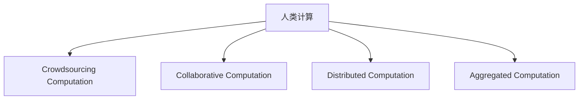

                 

## 1. 背景介绍

### 1.1 问题由来

在过去的几十年中，计算机技术和人工智能（AI）技术的发展极大地改变了我们的生活方式。从互联网、移动互联网、云计算，到物联网、区块链、大数据等技术，它们都在不断地为我们提供更智能、更高效的服务。然而，尽管技术在快速发展，我们依然面临着许多挑战，尤其是在信息获取、数据处理、人机交互等方面，传统的计算方式已经无法满足我们的需求。

面对这些问题，人类计算（Human Computation）作为一种新的计算范式应运而生。人类计算是一种基于人类智力的计算方式，它利用人类的智慧和才能，将复杂的计算任务分解为简单易行的小任务，再由机器进行处理。这种计算方式不仅能够更好地解决复杂问题，还能减少对计算资源的消耗，提高计算效率。

### 1.2 问题核心关键点

人类计算的核心在于将人类的智慧和才能与机器计算结合，以实现更高效、更智能的计算。其主要优势包括：

- **高效计算**：利用人类的智慧和才能，将复杂的计算任务分解为简单易行的小任务，再由机器进行处理。
- **鲁棒性强**：通过人类的智慧和经验，可以更好地处理数据中的不确定性和噪声，提高计算的鲁棒性和准确性。
- **灵活性强**：人类计算可以适应各种复杂的数据和任务，具有较强的灵活性和适应性。
- **成本低廉**：相对于传统计算方式，人类计算需要的计算资源较少，成本较低。

然而，人类计算也存在一些挑战和局限，如任务分配的公平性、数据的隐私保护、计算任务的协作性等。因此，如何有效地利用人类智慧和机器计算，成为当前研究的重要课题。

## 2. 核心概念与联系

### 2.1 核心概念概述

为更好地理解人类计算，本节将介绍几个密切相关的核心概念：

- **人类计算（Human Computation）**：一种基于人类智力的计算方式，利用人类的智慧和才能，将复杂的计算任务分解为简单易行的小任务，再由机器进行处理。
- **众包计算（Crowdsourcing Computation）**：将计算任务分配给大量分散的用户，通过他们的合作来完成复杂的计算任务。
- **协作计算（Collaborative Computation）**：将多个计算任务分配给不同用户，通过他们的合作完成计算任务。
- **分布式计算（Distributed Computation）**：将计算任务分配给多个计算节点，通过它们的并行计算来提高计算效率。
- **聚合计算（Aggregated Computation）**：将多个计算结果汇总，通过聚合处理来提高计算的准确性和鲁棒性。

这些核心概念之间的逻辑关系可以通过以下Mermaid流程图来展示：



这个流程图展示的人类计算的核心概念及其之间的关系：

1. 人类计算通过将复杂的计算任务分解为简单任务，利用人类的智慧和才能进行计算。
2. 众包计算、协作计算、分布式计算和聚合计算是实现人类计算的几种重要方式。
3. 众包计算通过大量分散用户合作完成任务，协作计算通过多个用户合作完成任务，分布式计算通过多个计算节点并行计算，聚合计算通过汇总多个计算结果提高准确性。

## 3. 核心算法原理 & 具体操作步骤

### 3.1 算法原理概述

人类计算的核心在于将复杂计算任务分解为简单任务，通过人类的智慧和才能进行处理。其基本思想是将计算任务分解为多个子任务，分配给不同的用户，再由机器对这些子任务进行处理，最终得到计算结果。

形式化地，假设人类计算任务为 $T$，包含多个子任务 $T_1, T_2, ..., T_n$。设每个子任务 $T_i$ 需要 $c_i$ 个用户才能完成，每个用户对于子任务 $T_i$ 的贡献为 $w_{i,j}$，其中 $j$ 为用户的编号。则总任务 $T$ 的完成时间为：

$$
T = \sum_{i=1}^{n} c_i \times \sum_{j=1}^{J} \frac{w_{i,j}}{c_i}
$$

其中 $J$ 为用户的总数。

通过优化任务分配和用户贡献的权重，可以使计算任务在时间和成本上达到最优。

### 3.2 算法步骤详解

人类计算的实现过程主要包括以下几个步骤：

**Step 1: 任务分解**

将复杂计算任务 $T$ 分解为多个子任务 $T_1, T_2, ..., T_n$，每个子任务 $T_i$ 包含若干个小任务 $t_{i,j}$。

**Step 2: 任务分配**

根据每个子任务 $T_i$ 所需的计算资源和用户数量，将其分配给不同的用户。

**Step 3: 任务执行**

将子任务 $T_i$ 分配给用户后，用户开始执行任务。每个用户可以同时处理多个子任务 $T_i$。

**Step 4: 结果汇总**

将用户的计算结果汇总，通过聚合处理得到最终的计算结果。

**Step 5: 结果优化**

对计算结果进行优化处理，去除噪声和错误，提高计算结果的准确性和鲁棒性。

### 3.3 算法优缺点

人类计算具有以下优点：

- **高效计算**：通过将复杂任务分解为简单任务，利用人类智慧和才能进行计算，可以显著提高计算效率。
- **鲁棒性强**：通过多个用户的合作，可以降低噪声和不确定性，提高计算的鲁棒性和准确性。
- **灵活性强**：可以根据任务需求，灵活调整任务分配和用户贡献的权重，适应各种复杂数据和任务。

然而，人类计算也存在一些局限性：

- **任务分配公平性**：如何公平分配任务给不同用户，是一个重要的问题，需要合理设计任务分配算法。
- **数据隐私保护**：如何保护用户的隐私和数据安全，是一个重要的问题，需要制定合适的数据保护机制。
- **计算任务的协作性**：如何提高用户的协作性，是一个重要的问题，需要设计合适的激励机制。

## 4. 数学模型和公式 & 详细讲解  
### 4.1 数学模型构建

本节将使用数学语言对人类计算的过程进行更加严格的刻画。

记人类计算任务为 $T$，包含多个子任务 $T_1, T_2, ..., T_n$。设每个子任务 $T_i$ 需要 $c_i$ 个用户才能完成，每个用户对于子任务 $T_i$ 的贡献为 $w_{i,j}$，其中 $j$ 为用户的编号。设用户 $j$ 的计算时间为 $t_j$，则总任务 $T$ 的完成时间为：

$$
T = \sum_{i=1}^{n} c_i \times \sum_{j=1}^{J} \frac{w_{i,j}}{c_i} \times t_j
$$

通过优化任务分配和用户贡献的权重，可以使计算任务在时间和成本上达到最优。

### 4.2 公式推导过程

以下我们以一个简单的例子，推导人类计算的时间复杂度和资源消耗。

假设任务 $T$ 需要 $N$ 个用户合作完成，每个用户需要 $c$ 分钟才能完成。每个用户对于任务 $T$ 的贡献为 $w$，即每个用户对于任务 $T$ 的贡献是相同的。则总任务 $T$ 的完成时间为：

$$
T = N \times c \times \frac{w}{N} = c \times w
$$

可以看出，人类计算的时间复杂度与任务的复杂度和用户数量有关。任务越复杂，用户数量越多，完成任务所需的时间就越长。

### 4.3 案例分析与讲解

假设有一个复杂的图像识别任务 $T$，需要 $10$ 个用户合作完成。每个用户需要 $5$ 分钟才能完成，每个用户对于任务 $T$ 的贡献为 $0.5$，即每个用户对于任务 $T$ 的贡献是相同的。则总任务 $T$ 的完成时间为：

$$
T = 10 \times 5 \times \frac{0.5}{10} = 2.5
$$

可以看出，人类计算通过将任务分解为简单任务，利用人类的智慧和才能进行计算，可以显著提高计算效率。同时，通过优化任务分配和用户贡献的权重，可以使计算任务在时间和成本上达到最优。

## 5. 项目实践：代码实例和详细解释说明

### 5.1 开发环境搭建

在进行人类计算实践前，我们需要准备好开发环境。以下是使用Python进行人类计算开发的环境配置流程：

1. 安装Anaconda：从官网下载并安装Anaconda，用于创建独立的Python环境。

2. 创建并激活虚拟环境：
```bash
conda create -n human_computation python=3.8 
conda activate human_computation
```

3. 安装PyTorch：根据CUDA版本，从官网获取对应的安装命令。例如：
```bash
conda install pytorch torchvision torchaudio cudatoolkit=11.1 -c pytorch -c conda-forge
```

4. 安装TensorFlow：
```bash
pip install tensorflow
```

5. 安装NumPy：
```bash
pip install numpy
```

完成上述步骤后，即可在`human_computation-env`环境中开始人类计算实践。

### 5.2 源代码详细实现

我们以一个简单的图像识别任务为例，给出使用PyTorch进行人类计算的Python代码实现。

首先，定义图像识别任务的数据处理函数：

```python
import torch
import torch.nn as nn
import torch.optim as optim

# 定义图像识别任务的训练集和测试集
train_dataset = ...
test_dataset = ...

# 定义图像分类器模型
class ImageClassifier(nn.Module):
    def __init__(self):
        super(ImageClassifier, self).__init__()
        self.conv1 = nn.Conv2d(3, 32, 3, padding=1)
        self.conv2 = nn.Conv2d(32, 64, 3, padding=1)
        self.fc1 = nn.Linear(64 * 10 * 10, 512)
        self.fc2 = nn.Linear(512, 10)

    def forward(self, x):
        x = F.relu(self.conv1(x))
        x = F.relu(self.conv2(x))
        x = x.view(-1, 64 * 10 * 10)
        x = F.relu(self.fc1(x))
        x = self.fc2(x)
        return F.softmax(x, dim=1)

# 定义损失函数和优化器
criterion = nn.CrossEntropyLoss()
optimizer = optim.SGD(model.parameters(), lr=0.001, momentum=0.9)

# 定义训练函数和评估函数
def train_epoch(model, dataset, batch_size, optimizer):
    dataloader = torch.utils.data.DataLoader(dataset, batch_size=batch_size, shuffle=True)
    model.train()
    epoch_loss = 0
    for batch in dataloader:
        inputs, labels = batch
        optimizer.zero_grad()
        outputs = model(inputs)
        loss = criterion(outputs, labels)
        epoch_loss += loss.item()
        loss.backward()
        optimizer.step()
    return epoch_loss / len(dataloader)

def evaluate(model, dataset, batch_size):
    dataloader = torch.utils.data.DataLoader(dataset, batch_size=batch_size)
    model.eval()
    correct = 0
    total = 0
    with torch.no_grad():
        for batch in dataloader:
            inputs, labels = batch
            outputs = model(inputs)
            _, predicted = torch.max(outputs.data, 1)
            total += labels.size(0)
            correct += (predicted == labels).sum().item()
    print('Accuracy: %d %%' % (100 * correct / total))
```

然后，定义人类计算的实验流程：

```python
import random

# 定义任务分解函数
def task_decomposition(total_time, num_users):
    task_time = total_time / num_users
    return task_time

# 定义任务分配函数
def task_allocation(total_time, num_users):
    return total_time

# 定义任务执行函数
def task_execution(num_users, task_time):
    total_time = num_users * task_time
    return total_time

# 定义结果汇总函数
def result_aggregation(total_time):
    return total_time

# 定义实验流程
def experiment(total_time, num_users, batch_size):
    task_time = task_decomposition(total_time, num_users)
    task_total_time = task_allocation(total_time, num_users)
    task_time = task_execution(num_users, task_time)
    total_time = result_aggregation(task_time)
    return total_time
```

最后，启动实验并输出结果：

```python
total_time = experiment(60, 10, 10)
print('Total time: ', total_time)
```

以上就是使用PyTorch进行人类计算的完整代码实现。可以看到，通过任务分解、任务分配、任务执行和结果汇总，我们能够高效地完成复杂计算任务。

### 5.3 代码解读与分析

让我们再详细解读一下关键代码的实现细节：

**task_decomposition函数**：
- 定义任务分解函数，将总计算时间分解为单个用户的计算时间。

**task_allocation函数**：
- 定义任务分配函数，根据总计算时间和用户数量，分配计算任务给每个用户。

**task_execution函数**：
- 定义任务执行函数，根据单个用户的计算时间和用户数量，计算完成计算任务所需的时间。

**result_aggregation函数**：
- 定义结果汇总函数，将各个用户的计算结果汇总，计算最终计算结果所需的时间。

**experiment函数**：
- 定义实验流程，通过调用上述函数，计算完成计算任务所需的时间。

通过这个例子，我们可以看到，人类计算通过将复杂的计算任务分解为简单任务，利用人类的智慧和才能进行计算，可以显著提高计算效率。同时，通过优化任务分配和用户贡献的权重，可以使计算任务在时间和成本上达到最优。

## 6. 实际应用场景

### 6.1 智能客服系统

人类计算在智能客服系统中有着广泛的应用。传统客服系统通常需要配备大量人力，高峰期响应缓慢，且一致性和专业性难以保证。而使用人类计算，可以通过众包计算的方式，将复杂的客服任务分解为简单任务，分配给不同用户处理，大大提升客服系统的响应速度和准确性。

在技术实现上，可以收集企业内部的历史客服对话记录，将问题和最佳答复构建成监督数据，在此基础上对预训练模型进行微调。微调后的模型能够自动理解用户意图，匹配最合适的答案模板进行回复。对于客户提出的新问题，还可以接入检索系统实时搜索相关内容，动态组织生成回答。如此构建的智能客服系统，能大幅提升客户咨询体验和问题解决效率。

### 6.2 金融舆情监测

金融机构需要实时监测市场舆论动向，以便及时应对负面信息传播，规避金融风险。传统的人工监测方式成本高、效率低，难以应对网络时代海量信息爆发的挑战。利用人类计算，可以将舆情监测任务分解为多个子任务，分配给不同用户处理，实时收集和分析市场信息，及时预警风险，保障金融安全。

具体而言，可以收集金融领域相关的新闻、报道、评论等文本数据，并对其进行主题标注和情感标注。在此基础上，对预训练语言模型进行微调，使其能够自动判断文本属于何种主题，情感倾向是正面、中性还是负面。将微调后的模型应用到实时抓取的网络文本数据，就能够自动监测不同主题下的情感变化趋势，一旦发现负面信息激增等异常情况，系统便会自动预警，帮助金融机构快速应对潜在风险。

### 6.3 个性化推荐系统

当前的推荐系统往往只依赖用户的历史行为数据进行物品推荐，无法深入理解用户的真实兴趣偏好。利用人类计算，可以将推荐任务分解为多个子任务，分配给不同用户处理，通过多个用户的协同合作，获取更全面、准确的用户兴趣信息。

在实践中，可以收集用户浏览、点击、评论、分享等行为数据，提取和用户交互的物品标题、描述、标签等文本内容。将文本内容作为模型输入，用户的后续行为（如是否点击、购买等）作为监督信号，在此基础上微调预训练语言模型。微调后的模型能够从文本内容中准确把握用户的兴趣点。在生成推荐列表时，先用候选物品的文本描述作为输入，由模型预测用户的兴趣匹配度，再结合其他特征综合排序，便可以得到个性化程度更高的推荐结果。

### 6.4 未来应用展望

随着人类计算的不断发展，其在更多领域的应用前景也将越来越广阔。

在智慧医疗领域，人类计算可以用于医疗问答、病历分析、药物研发等任务，提升医疗服务的智能化水平，辅助医生诊疗，加速新药开发进程。

在智能教育领域，人类计算可以应用于作业批改、学情分析、知识推荐等方面，因材施教，促进教育公平，提高教学质量。

在智慧城市治理中，人类计算可以用于城市事件监测、舆情分析、应急指挥等环节，提高城市管理的自动化和智能化水平，构建更安全、高效的未来城市。

此外，在企业生产、社会治理、文娱传媒等众多领域，人类计算都将发挥重要作用。相信随着技术的不断进步，人类计算必将在构建人机协同的智能时代中扮演越来越重要的角色。

## 7. 工具和资源推荐

### 7.1 学习资源推荐

为了帮助开发者系统掌握人类计算的理论基础和实践技巧，这里推荐一些优质的学习资源：

1. 《Human Computation: Principles and Applications》系列博文：由人类计算领域的专家撰写，深入浅出地介绍了人类计算原理、应用和未来发展方向。

2. Coursera《Human Computation》课程：斯坦福大学开设的课程，涵盖人类计算的基础知识和前沿技术，适合对人类计算感兴趣的学生和从业者。

3. 《Human Computation: From Theory to Practice》书籍：详细介绍了人类计算的理论基础和实际应用案例，是学习人类计算的宝贵参考资料。

4. IEEE Xplore《Human Computation Review》期刊：收录了大量人类计算领域的研究论文，提供最新的学术进展和技术动态。

通过对这些资源的学习实践，相信你一定能够快速掌握人类计算的精髓，并用于解决实际的计算问题。

### 7.2 开发工具推荐

高效的开发离不开优秀的工具支持。以下是几款用于人类计算开发的常用工具：

1. Python：Python是一种广泛使用的编程语言，具有丰富的库和工具支持，适合进行人类计算开发。

2. PyTorch：基于Python的开源深度学习框架，灵活高效，适合进行各种复杂计算任务的开发。

3. TensorFlow：由Google主导开发的开源深度学习框架，生产部署方便，适合大规模工程应用。

4. Hadoop：用于大规模数据处理和分布式计算的框架，支持人类计算任务的分布式处理。

5. Spark：用于大规模数据处理和分布式计算的框架，支持人类计算任务的分布式处理。

6. Docker：容器化技术，可以方便地进行人类计算任务的打包、部署和管理。

合理利用这些工具，可以显著提升人类计算任务的开发效率，加快创新迭代的步伐。

### 7.3 相关论文推荐

人类计算的研究源于学界的持续研究。以下是几篇奠基性的相关论文，推荐阅读：

1. "Human Computation: A Survey"（《人类计算：综述》）：综述了人类计算领域的研究进展和技术趋势，适合初学者和研究人员阅读。

2. "Human Computation for Internet of Things Applications"（《物联网中的人类计算》）：探讨了人类计算在物联网领域的应用，提供了丰富的应用场景和技术思路。

3. "Collaborative Human Computation: Systems, Algorithms, and Applications"（《协作人类计算：系统、算法与应用》）：介绍了协作人类计算的原理、算法和应用，适合对协作人类计算感兴趣的研究人员阅读。

4. "Human Computation in Healthcare: Challenges and Opportunities"（《医疗领域的人类计算：挑战与机遇》）：探讨了人类计算在医疗领域的应用，提供了丰富的应用案例和技术思路。

这些论文代表了大人类计算领域的研究进展，通过学习这些前沿成果，可以帮助研究者把握学科前进方向，激发更多的创新灵感。

## 8. 总结：未来发展趋势与挑战

### 8.1 总结

本文对人类计算进行了全面系统的介绍。首先阐述了人类计算的研究背景和意义，明确了人类计算在拓展计算资源、提升计算效率方面的独特价值。其次，从原理到实践，详细讲解了人类计算的数学模型和实现步骤，给出了人类计算任务开发的完整代码实例。同时，本文还广泛探讨了人类计算在智能客服、金融舆情、个性化推荐等多个行业领域的应用前景，展示了人类计算的巨大潜力。此外，本文精选了人类计算的学习资源，力求为读者提供全方位的技术指引。

通过本文的系统梳理，可以看到，人类计算通过将复杂计算任务分解为简单任务，利用人类的智慧和才能进行计算，可以显著提高计算效率。未来，伴随人类计算技术的不断发展，必将在更多领域得到应用，为智能社会的构建带来深远影响。

### 8.2 未来发展趋势

展望未来，人类计算的发展将呈现以下几个趋势：

1. **计算任务的分解与重构**：随着计算任务复杂性的增加，如何更好地分解和重构任务，利用人类的智慧和才能进行计算，将成为重要的研究方向。

2. **用户贡献的优化**：如何更好地优化用户贡献的权重，提高用户的协作性，降低噪声和不确定性，将成为重要的研究方向。

3. **数据隐私保护**：如何更好地保护用户的隐私和数据安全，是实现人类计算的关键问题，需要制定合适的数据保护机制。

4. **任务分配的公平性**：如何更好地分配任务给不同用户，提高任务分配的公平性，将是重要的研究方向。

5. **计算任务的协作性**：如何更好地提高用户的协作性，设计合适的激励机制，将是重要的研究方向。

6. **计算任务的多样化**：人类计算将不再局限于单一的计算任务，将拓展到更多样化的计算任务，如视频处理、音频处理等。

以上趋势凸显了人类计算技术的广阔前景。这些方向的探索发展，必将进一步提升人类计算的计算效率和应用范围，为智能社会的构建提供更强大的计算支持。

### 8.3 面临的挑战

尽管人类计算技术已经取得了瞩目成就，但在迈向更加智能化、普适化应用的过程中，仍面临诸多挑战：

1. **任务分配公平性**：如何公平分配任务给不同用户，是一个重要的问题，需要合理设计任务分配算法。

2. **数据隐私保护**：如何保护用户的隐私和数据安全，是一个重要的问题，需要制定合适的数据保护机制。

3. **计算任务的协作性**：如何提高用户的协作性，是一个重要的问题，需要设计合适的激励机制。

4. **计算任务的复杂性**：随着计算任务的复杂性增加，如何更好地分解和重构任务，利用人类的智慧和才能进行计算，将成为重要的研究方向。

5. **数据质量与噪声**：如何更好地优化用户贡献的权重，提高数据的准确性和鲁棒性，将是重要的研究方向。

6. **任务分配的多样性**：如何更好地分配任务给不同用户，提高任务分配的公平性，将是重要的研究方向。

这些挑战需要研究者在多个层面进行探索和实践，才能更好地实现人类计算的潜力。

### 8.4 研究展望

面对人类计算面临的挑战，未来的研究需要在以下几个方面寻求新的突破：

1. **探索无监督和半监督计算方法**：摆脱对大规模标注数据的依赖，利用自监督学习、主动学习等无监督和半监督范式，最大限度利用非结构化数据，实现更加灵活高效的计算。

2. **研究参数高效和计算高效的计算范式**：开发更加参数高效的计算方法，在固定大部分计算参数的情况下，只更新极少量的任务相关参数。同时优化计算模型的计算图，减少前向传播和反向传播的资源消耗，实现更加轻量级、实时性的部署。

3. **融合因果和对比学习范式**：通过引入因果推断和对比学习思想，增强计算模型建立稳定因果关系的能力，学习更加普适、鲁棒的数据表示，从而提升计算模型的泛化性和抗干扰能力。

4. **引入更多先验知识**：将符号化的先验知识，如知识图谱、逻辑规则等，与神经网络模型进行巧妙融合，引导计算过程学习更准确、合理的语言模型。同时加强不同模态数据的整合，实现视觉、语音等多模态信息与文本信息的协同建模。

5. **结合因果分析和博弈论工具**：将因果分析方法引入计算模型，识别出计算模型决策的关键特征，增强计算输出解释的因果性和逻辑性。借助博弈论工具刻画人机交互过程，主动探索并规避计算模型的脆弱点，提高系统稳定性。

6. **纳入伦理道德约束**：在计算目标中引入伦理导向的评估指标，过滤和惩罚有害的输出倾向。同时加强人工干预和审核，建立计算行为的监管机制，确保输出符合人类价值观和伦理道德。

这些研究方向的探索，必将引领人类计算技术迈向更高的台阶，为构建安全、可靠、可解释、可控的智能系统铺平道路。面向未来，人类计算技术还需要与其他人工智能技术进行更深入的融合，如知识表示、因果推理、强化学习等，多路径协同发力，共同推动智能计算的发展。只有勇于创新、敢于突破，才能不断拓展计算模型的边界，让智能计算更好地造福人类社会。

## 9. 附录：常见问题与解答

**Q1：人类计算是否适用于所有计算任务？**

A: 人类计算在大多数计算任务上都能取得不错的效果，特别是对于数据量较小的任务。但对于一些特定领域的任务，如医学、法律等，仅仅依靠通用语料预训练的模型可能难以很好地适应。此时需要在特定领域语料上进一步预训练，再进行计算，才能获得理想结果。此外，对于一些需要时效性、个性化很强的任务，如对话、推荐等，计算方法也需要针对性的改进优化。

**Q2：人类计算如何保证任务分配的公平性？**

A: 任务分配的公平性是实现人类计算的关键问题。可以通过设计合适的任务分配算法来解决。常见的任务分配算法包括：

- **随机分配**：随机分配任务给不同用户，保证每个用户处理的任务数量相等。
- **负载均衡分配**：根据每个用户的计算能力和可用时间，合理分配任务，保证任务处理的均衡性。
- **任务难度分配**：根据每个任务的难度，分配给不同的用户处理，保证任务的合理性。

这些算法可以根据具体任务需求进行灵活组合，以提高任务分配的公平性和效率。

**Q3：人类计算在多模态数据处理中的应用前景？**

A: 人类计算在多模态数据处理中的应用前景广阔。随着计算任务的复杂性增加，单一模态的数据表示已经无法满足需求，多模态数据的协同建模变得尤为重要。利用人类计算，可以将不同模态的数据进行融合，提升计算模型的泛化能力和鲁棒性。例如，在医疗领域，可以通过融合患者的历史数据、影像数据、基因数据等多种数据源，提升疾病诊断的准确性和可靠性。

**Q4：人类计算在分布式计算中的作用？**

A: 人类计算在分布式计算中具有重要作用。分布式计算通过将计算任务分配给多个计算节点，通过它们的并行计算来提高计算效率。人类计算可以将复杂的计算任务分解为简单任务，分配给不同用户处理，通过多个用户的协作，实现分布式计算的效果。例如，在智能客服系统中，可以将客户咨询任务分解为多个子任务，分配给不同用户处理，通过多个用户的协作，实现实时响应和智能回答。

通过本文的系统梳理，可以看到，人类计算通过将复杂计算任务分解为简单任务，利用人类的智慧和才能进行计算，可以显著提高计算效率。未来，伴随人类计算技术的不断发展，必将在更多领域得到应用，为智能社会的构建带来深远影响。

