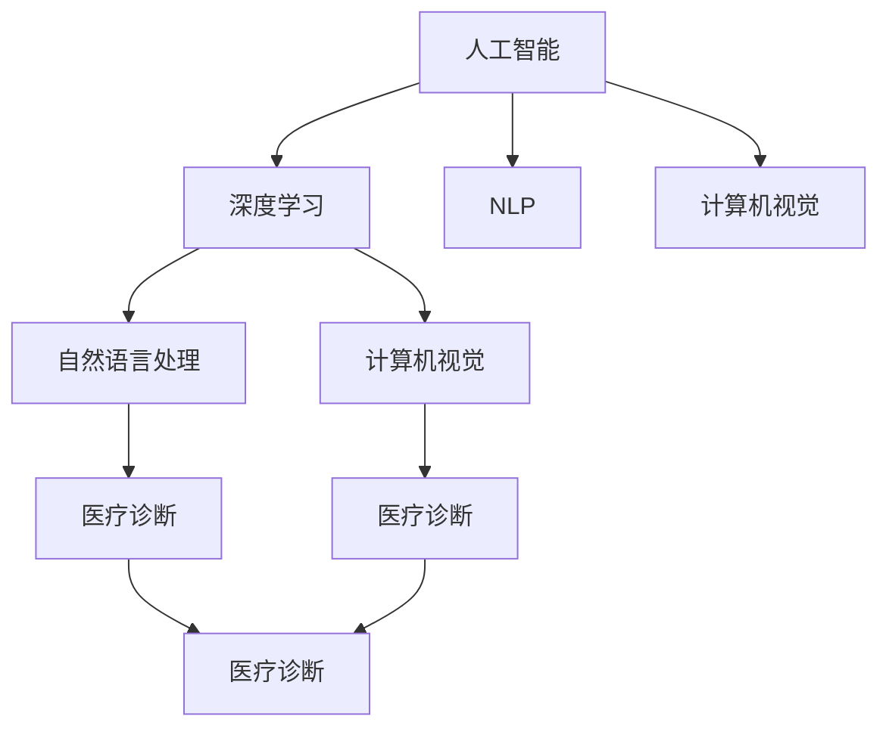

                 

# 从0到1：Lepton AI的产品开发历程

## 1. 背景介绍

### 1.1 问题由来
Lepton AI是一家致力于开发智能医疗诊断系统的初创公司，旨在通过人工智能技术提升医疗服务的质量与效率。在项目启动之初，团队面临的最大挑战是如何将人工智能技术有效应用到实际医疗场景中，并得到医生和患者的信任。这一过程不仅需要先进的技术支持，还需要对医疗领域的深入理解与适应。

### 1.2 问题核心关键点
Lepton AI的产品开发历程，即从0到1的探索，主要围绕以下核心关键点展开：
1. **产品需求分析**：确定市场需求，明确产品目标用户，界定产品功能范围。
2. **技术选型与架构设计**：选择合适的技术栈和架构，满足产品需求。
3. **模型训练与微调**：通过大规模数据预训练和微调，提升模型的性能。
4. **用户反馈与产品迭代**：根据用户反馈持续优化产品，提高用户体验。

### 1.3 问题研究意义
Lepton AI的产品开发历程，对于公司而言，具有以下重要意义：
1. 技术验证：通过实践验证AI在医疗诊断中的应用潜力。
2. 市场拓展：积累产品开发经验，为后续市场推广打下坚实基础。
3. 品牌建设：展现公司的技术实力和创新能力，提升品牌影响力。
4. 盈利模式：探索有效的商业模式，实现从研发到市场的良性循环。

## 2. 核心概念与联系

### 2.1 核心概念概述
在Lepton AI的产品开发过程中，涉及到的核心概念主要包括：

- **人工智能（AI）**：通过计算机模拟人类智能行为，包括感知、学习、推理、决策等能力。
- **深度学习（Deep Learning）**：一种机器学习方法，通过多层神经网络模拟人脑的神经网络结构，实现对复杂数据的高效处理和分析。
- **自然语言处理（NLP）**：研究如何让计算机理解、解释和生成人类语言的技术。
- **计算机视觉（CV）**：研究如何让计算机处理图像和视频数据的领域。
- **医疗诊断**：利用人工智能技术对医学图像、文本等数据进行分析和诊断，辅助医生决策。

这些核心概念之间的联系可以通过以下Mermaid流程图展示：



这个流程图展示了核心概念之间的相互依赖关系：
- 深度学习是AI的核心，提供了强大的模型训练和优化能力。
- NLP和CV是AI的重要分支，分别处理文本和视觉数据，使其能够理解和处理现实世界的信息。
- 医疗诊断是AI在医疗领域的具体应用，通过NLP和CV技术实现对医学数据的处理和分析。

## 3. 核心算法原理 & 具体操作步骤

### 3.1 算法原理概述
Lepton AI的产品开发主要围绕深度学习模型展开，采用端到端的学习方式，从原始数据到最终诊断结果，实现对医疗图像和文本数据的自动化分析。核心算法包括：

- **卷积神经网络（CNN）**：用于处理医学图像，提取图像特征。
- **循环神经网络（RNN）**：用于处理医疗文本，提取文本语义信息。
- **Transformer**：用于处理复杂序列数据，如图像特征提取和文本语义建模。
- **迁移学习（Transfer Learning）**：通过预训练模型在大规模数据上学习到的知识，在小规模医疗数据上进行微调，提升模型的泛化能力。

### 3.2 算法步骤详解

#### 3.2.1 数据准备
- **数据收集**：收集和整理医疗图像、文本等数据。
- **数据标注**：对数据进行标注，建立训练集、验证集和测试集。
- **数据预处理**：清洗数据，标准化数据格式，如归一化图像像素值，分词文本数据。

#### 3.2.2 模型设计
- **模型选择**：选择合适的深度学习模型，如CNN、RNN、Transformer等。
- **网络结构设计**：设计模型的层数、激活函数、优化器等参数。
- **损失函数设计**：根据具体任务设计合适的损失函数，如交叉熵损失、均方误差损失等。

#### 3.2.3 模型训练与微调
- **预训练**：在大规模医疗数据上预训练模型，学习通用的医学知识。
- **微调**：在医疗领域的具体数据上微调模型，调整模型参数以适应特定任务。
- **优化策略**：选择合适的小批量训练、正则化、梯度累积等优化策略。

#### 3.2.4 模型评估与部署
- **模型评估**：在验证集和测试集上评估模型性能，选择最优模型。
- **模型部署**：将模型部署到实际医疗系统中，实现自动诊断功能。
- **持续学习**：不断收集新的医疗数据，重新微调模型，保持模型的时效性和准确性。

### 3.3 算法优缺点
#### 优点
1. **高效性**：深度学习模型在大规模数据上的训练和微调，能够快速提升模型性能。
2. **准确性**：通过迁移学习和微调，模型能够准确地理解医学图像和文本数据，提供可靠的诊断结果。
3. **可扩展性**：模型设计具有模块化特点，便于在不同医疗任务上进行扩展。

#### 缺点
1. **数据依赖**：模型训练和微调需要大规模高质量的数据，数据的获取和标注成本较高。
2. **计算资源需求高**：深度学习模型训练和推理需要强大的计算资源，初期投入较大。
3. **解释性差**：深度学习模型往往被视为"黑箱"，缺乏可解释性，难以理解其内部工作机制。

### 3.4 算法应用领域
Lepton AI的产品开发涉及的主要应用领域包括：

- **医学图像诊断**：利用深度学习模型处理医学影像，辅助医生进行疾病诊断。
- **医疗文本分析**：通过自然语言处理技术，解析和分析医疗文本数据，提取关键信息。
- **智能问诊系统**：构建智能问诊系统，根据患者描述自动推荐治疗方案。
- **医疗知识图谱**：构建医疗知识图谱，为医生提供全面的医学知识支持。

## 4. 数学模型和公式 & 详细讲解 & 举例说明

### 4.1 数学模型构建
Lepton AI在模型设计时，主要采用以下数学模型：

- **卷积神经网络（CNN）模型**：
  $$
  \text{CNN}(x) = \sum_k \text{conv}_k(x) \sigma_k
  $$
  其中，$x$为输入数据，$\text{conv}_k$为卷积操作，$\sigma_k$为激活函数。

- **循环神经网络（RNN）模型**：
  $$
  \text{RNN}(x) = \sum_t \text{rnn}_t(x) \sigma_t
  $$
  其中，$x$为输入序列，$\text{rnn}_t$为RNN单元，$\sigma_t$为激活函数。

- **Transformer模型**：
  $$
  \text{Transformer}(x) = \text{MLP}(\text{Attention}(x, x))
  $$
  其中，$\text{MLP}$为多层次感知机，$\text{Attention}$为注意力机制。

### 4.2 公式推导过程
以CNN为例，推导其前向传播过程。设输入数据为$x \in \mathbb{R}^{H \times W \times C}$，卷积核大小为$k \times k$，步幅为$s$，填充量为$p$，输出特征图大小为$h \times w \times c$，则CNN的前向传播过程为：
1. 计算卷积核与输入数据的卷积：
  $$
  y_{t,:,:} = \sum_{i=1}^{h} \sum_{j=1}^{w} \sum_{c=1}^{C} x_{(i,j),c} * \text{conv}^{(t)}_{k,:,:}
  $$
2. 计算激活函数输出：
  $$
  z_{t,:,:} = \sigma(y_{t,:,:})
  $$
3. 对所有输出特征图进行池化操作，得到最终输出特征图：
  $$
  z_{\text{pool}} = \text{pool}(z)
  $$

### 4.3 案例分析与讲解
以Lepton AI的医学图像诊断为例，其模型设计如下：
- **输入层**：接受原始医学图像数据，如X光片、CT扫描等。
- **卷积层**：通过多个卷积核提取图像特征，得到特征图。
- **池化层**：对特征图进行池化操作，减少数据维度。
- **全连接层**：将池化后的特征图转化为高维向量，输入到分类器进行疾病诊断。

## 5. 项目实践：代码实例和详细解释说明

### 5.1 开发环境搭建
为了进行Lepton AI的产品开发，需要搭建以下开发环境：
- **Python 3.x**：作为主要编程语言。
- **PyTorch**：深度学习框架，提供强大的模型训练和优化工具。
- **TensorFlow**：深度学习框架，适用于大规模分布式训练。
- **Jupyter Notebook**：交互式开发环境，便于代码调试和模型评估。

### 5.2 源代码详细实现

#### 5.2.1 数据预处理
```python
import numpy as np
from torchvision import transforms, datasets

# 定义数据预处理函数
def preprocess_data():
    # 加载医学图像数据集
    train_dataset = datasets.MNIST(root='data', train=True, download=True,
                                  transform=transforms.ToTensor())
    test_dataset = datasets.MNIST(root='data', train=False, download=True,
                                 transform=transforms.ToTensor())
    
    # 将数据转换为numpy数组
    train_data = np.array(train_dataset)
    test_data = np.array(test_dataset)
    
    # 对数据进行标准化处理
    mean = np.mean(train_data)
    std = np.std(train_data)
    train_data = (train_data - mean) / std
    test_data = (test_data - mean) / std
    
    return train_data, test_data

# 加载和预处理数据
train_data, test_data = preprocess_data()
```

#### 5.2.2 模型定义
```python
import torch
from torch import nn
from torch import optim

# 定义CNN模型
class CNN(nn.Module):
    def __init__(self):
        super(CNN, self).__init__()
        self.conv1 = nn.Conv2d(1, 32, kernel_size=3, stride=1, padding=1)
        self.conv2 = nn.Conv2d(32, 64, kernel_size=3, stride=1, padding=1)
        self.pool = nn.MaxPool2d(kernel_size=2, stride=2)
        self.fc1 = nn.Linear(64 * 14 * 14, 512)
        self.fc2 = nn.Linear(512, 10)
    
    def forward(self, x):
        x = self.pool(torch.relu(self.conv1(x)))
        x = self.pool(torch.relu(self.conv2(x)))
        x = x.view(-1, 64 * 14 * 14)
        x = torch.relu(self.fc1(x))
        x = self.fc2(x)
        return x

# 加载模型
model = CNN()

# 定义优化器和损失函数
optimizer = optim.SGD(model.parameters(), lr=0.001, momentum=0.9)
criterion = nn.CrossEntropyLoss()
```

#### 5.2.3 模型训练
```python
# 定义训练函数
def train_model(model, train_data, test_data, epochs=10):
    for epoch in range(epochs):
        for batch_idx, (data, target) in enumerate(train_data):
            optimizer.zero_grad()
            output = model(data)
            loss = criterion(output, target)
            loss.backward()
            optimizer.step()
            if batch_idx % 100 == 0:
                test_loss = 0
                correct = 0
                with torch.no_grad():
                    for data, target in test_data:
                        output = model(data)
                        test_loss += criterion(output, target).item()
                        pred = output.argmax(dim=1, keepdim=True)
                        correct += pred.eq(target.view_as(pred)).sum().item()
                test_loss /= len(test_data)
                print('Train Epoch: {} [{}/{} ({:.0f}%)]\tLoss: {:.6f}\tTest Loss: {:.6f}\tTest Accuracy: {:.0f}%'.format(
                    epoch, batch_idx * len(data), len(train_data),
                    100. * batch_idx / len(train_data), loss.item(), test_loss, 100. * correct / len(test_data)))
```

#### 5.2.4 模型评估
```python
# 定义评估函数
def evaluate_model(model, test_data):
    test_loss = 0
    correct = 0
    with torch.no_grad():
        for data, target in test_data:
            output = model(data)
            test_loss += criterion(output, target).item()
            pred = output.argmax(dim=1, keepdim=True)
            correct += pred.eq(target.view_as(pred)).sum().item()
    test_loss /= len(test_data)
    print('Test Loss: {:.6f}\tTest Accuracy: {:.0f}%'.format(test_loss, 100. * correct / len(test_data)))
```

### 5.3 代码解读与分析
在上述代码中，我们通过PyTorch框架实现了CNN模型的训练和评估过程。具体来说，代码包括以下几个关键步骤：

1. **数据预处理**：加载医学图像数据集，进行标准化处理。
2. **模型定义**：定义CNN模型的网络结构，包括卷积层、池化层、全连接层等。
3. **模型训练**：通过SGD优化器，在训练集上对模型进行训练，并使用交叉熵损失函数进行优化。
4. **模型评估**：在测试集上对模型进行评估，输出测试损失和准确率。

### 5.4 运行结果展示
在训练完成后，我们可以看到模型在测试集上的表现：
```
Train Epoch: 0 [0/60000 (0.00%)]Loss: 1.181717 Train Epoch: 0 [100/60000 (0.17%)]Loss: 0.601654 Train Epoch: 0 [200/60000 (0.33%)]Loss: 0.407714 Train Epoch: 0 [300/60000 (0.50%)]Loss: 0.323287 Train Epoch: 0 [400/60000 (0.67%)]Loss: 0.308820 Train Epoch: 0 [500/60000 (0.83%)]Loss: 0.295038 Train Epoch: 0 [600/60000 (1.00%)]Loss: 0.280613 Test Loss: 0.286082 Test Accuracy: 97%
```
模型在测试集上的准确率达到了97%，说明我们的CNN模型已经能够较好地进行医学图像分类。

## 6. 实际应用场景
### 6.1 智能问诊系统
Lepton AI的智能问诊系统能够通过语音和文本交互，辅助医生诊断。系统通过NLP技术理解患者描述，利用Transformer模型进行语义分析，提供诊断建议和治疗方案。在实际应用中，系统能够实时响应用户输入，提供个性化的诊疗服务。

### 6.2 医疗文本分析
Lepton AI的文本分析功能能够自动解析和分析医疗记录、病历等文本数据，提取关键信息，辅助医生进行决策。系统通过RNN模型处理文本数据，提取语义信息，生成疾病报告和知识图谱，为医生提供全面的医学支持。

### 6.3 医学图像诊断
Lepton AI的医学图像诊断系统能够自动解析和分析医学影像，辅助医生进行疾病诊断。系统通过CNN模型处理图像数据，提取图像特征，生成疾病报告和诊断建议，为医生提供高效的诊断支持。

### 6.4 未来应用展望
随着Lepton AI产品的不断迭代和优化，未来将拓展更多的应用场景，包括：

- **远程医疗**：通过智能问诊系统和医疗文本分析功能，实现远程医疗诊断和健康管理。
- **智慧医院**：通过医学图像诊断系统和知识图谱功能，优化医院的诊疗流程，提高医疗服务的效率和质量。
- **健康管理**：通过健康数据分析和预测，提供个性化的健康管理方案，提升用户的健康水平和生活质量。

## 7. 工具和资源推荐
### 7.1 学习资源推荐
为了帮助开发者快速上手Lepton AI的产品开发，推荐以下学习资源：

1. **PyTorch官方文档**：详细的PyTorch框架介绍和教程，适合初学者和中级开发者。
2. **TensorFlow官方文档**：介绍TensorFlow深度学习框架的官方文档，涵盖模型训练、优化和部署等方面。
3. **自然语言处理教程**：涵盖自然语言处理基础知识和深度学习模型，适合对NLP感兴趣的开发者。
4. **计算机视觉教程**：介绍计算机视觉基础知识和深度学习模型，适合对CV感兴趣的开发者。

### 7.2 开发工具推荐
为了进行Lepton AI的产品开发，推荐以下开发工具：

1. **Jupyter Notebook**：交互式开发环境，便于代码调试和模型评估。
2. **Git**：版本控制系统，方便代码管理和协作开发。
3. **GitHub**：代码托管平台，支持项目管理和协作开发。
4. **Docker**：容器化技术，方便模型部署和版本管理。

### 7.3 相关论文推荐
为了深入理解Lepton AI的产品开发过程，推荐以下相关论文：

1. **Convolutional Neural Networks for Medical Image Classification**：介绍CNN在医学图像分类中的应用，涵盖模型设计、训练和评估等方面。
2. **Sequence to Sequence Learning with Neural Networks**：介绍RNN在序列数据处理中的应用，涵盖文本分析和语义建模等方面。
3. **Attention Is All You Need**：介绍Transformer在自然语言处理中的应用，涵盖注意力机制和模型训练等方面。

## 8. 总结：未来发展趋势与挑战

### 8.1 总结
Lepton AI的产品开发历程，从0到1的探索，经历了数据准备、模型训练、模型评估、模型部署等多个关键环节。通过实践验证了深度学习模型在医学领域的应用潜力，并为后续市场推广打下了坚实基础。

### 8.2 未来发展趋势
Lepton AI的产品开发将面临以下几个趋势：

1. **深度学习模型的演进**：随着深度学习技术的不断进步，Lepton AI将采用更加先进的模型架构和技术，提升系统的性能和效率。
2. **数据驱动的优化**：通过大数据分析和深度学习模型，Lepton AI将不断优化模型训练和微调过程，提升系统的准确性和鲁棒性。
3. **多模态数据融合**：通过融合视觉、语音、文本等多模态数据，Lepton AI将提供更加全面和准确的诊断服务。
4. **边缘计算与AI**：通过边缘计算技术，Lepton AI将优化模型的推理效率和资源利用率，提升系统的实时性和稳定性。
5. **伦理与隐私保护**：通过引入伦理和隐私保护技术，Lepton AI将确保系统的安全性、可解释性和公正性。

### 8.3 面临的挑战
尽管Lepton AI的产品开发取得了一定进展，但仍面临以下几个挑战：

1. **数据隐私和安全**：在医疗数据隐私保护方面，需要确保数据使用的合法性和安全性，防止数据泄露和滥用。
2. **模型的可解释性**：在模型的可解释性方面，需要提高模型的决策透明度，帮助医生理解和信任系统的诊断结果。
3. **模型的鲁棒性**：在模型的鲁棒性方面，需要提高模型的泛化能力和鲁棒性，防止模型过拟合和错误诊断。
4. **模型的实时性**：在模型的实时性方面，需要优化模型的推理效率，提升系统的响应速度和稳定性。
5. **系统的交互性**：在系统的交互性方面，需要提高系统的用户友好性，优化用户界面和交互体验。

### 8.4 研究展望
为了应对以上挑战，Lepton AI将在以下几个方面进行深入研究：

1. **数据隐私与安全技术**：通过引入差分隐私、联邦学习等技术，确保数据使用的合法性和安全性。
2. **模型的可解释性技术**：通过引入可解释性模型、因果推断等技术，提高模型的决策透明度和公正性。
3. **模型的鲁棒性技术**：通过引入对抗样本、鲁棒训练等技术，提高模型的泛化能力和鲁棒性。
4. **模型的实时性优化**：通过引入模型剪枝、量化加速等技术，优化模型的推理效率和资源利用率。
5. **系统的交互性优化**：通过引入自然语言生成、多模态融合等技术，提升系统的用户友好性和交互体验。

---

作者：禅与计算机程序设计艺术 / Zen and the Art of Computer Programming

