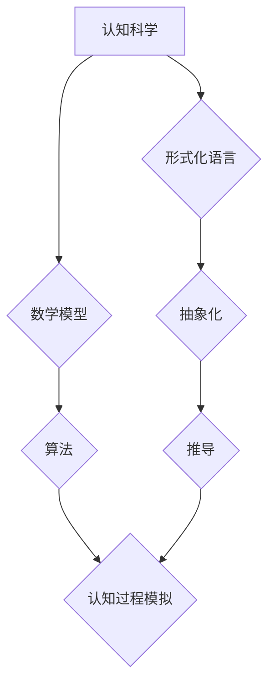

> 认知科学，形式化，数学，物理空间，算法，模型，应用

## 1. 背景介绍

认知科学作为一门跨学科研究人类认知过程的科学，试图揭示我们如何感知、学习、记忆、推理和决策。而数学，作为一种逻辑严谨、抽象精炼的语言，为认知科学提供了强大的工具和框架。

从古至今，人类一直在试图用数学语言描述和理解世界。从毕达哥拉斯将数字视为宇宙的基石，到牛顿用数学公式揭示了万有引力定律，数学始终扮演着探索和认知世界的重要角色。

在认知科学领域，数学的应用也日益广泛。例如，神经科学利用数学模型来模拟大脑神经元的活动，心理学运用统计学方法来分析心理实验数据，人工智能则借鉴数学原理来构建智能算法。

## 2. 核心概念与联系

**2.1 认知科学与数学的联系**

认知科学试图理解人类的思维过程，而数学提供了一种形式化的语言和工具来描述这些过程。

* **形式化：** 数学通过符号和逻辑规则来精确地表达概念和关系，使得认知过程可以被量化和分析。
* **抽象化：** 数学可以将复杂的认知现象抽象成简单的模型，从而更容易理解和研究。
* **推导：** 数学的逻辑推理能力可以帮助我们从已知的事实推导出新的认知规律。

**2.2 数学模型与认知过程**

数学模型可以用来模拟和解释各种认知过程，例如：

* **记忆模型：** 描述记忆的形成、存储和检索过程。
* **决策模型：** 模拟人们在面对选择时如何进行决策。
* **语言模型：** 解释人们如何理解和生成语言。

**2.3 算法与认知过程**

算法是解决特定问题的步骤序列，在认知科学中，算法可以用来模拟认知过程，例如：

* **搜索算法：** 模拟人们在记忆中搜索信息的过程。
* **分类算法：** 模拟人们对信息进行分类和组织的过程。
* **学习算法：** 模拟人们从经验中学习和改进的过程。

**Mermaid 流程图**



## 3. 核心算法原理 & 具体操作步骤

**3.1 算法原理概述**

在认知科学中，常用的算法包括搜索算法、分类算法和学习算法。这些算法都基于数学原理，并通过特定的步骤来解决认知问题。

**3.2 算法步骤详解**

* **搜索算法：**

    1. 定义搜索空间：确定需要搜索的信息范围。
    2. 选择搜索策略：例如深度优先搜索、广度优先搜索等。
    3. 迭代搜索：根据搜索策略，逐个检查搜索空间中的元素，直到找到目标信息。

* **分类算法：**

    1. 收集训练数据：收集包含已知类别信息的样本数据。
    2. 选择分类模型：例如决策树、支持向量机等。
    3. 训练模型：根据训练数据，调整模型参数，使模型能够准确地将新样本分类。
    4. 对新样本进行分类：将新样本输入到训练好的模型中，得到其类别预测。

* **学习算法：**

    1. 收集训练数据：收集包含输入和输出信息的样本数据。
    2. 选择学习模型：例如神经网络、支持向量机等。
    3. 训练模型：根据训练数据，调整模型参数，使模型能够从数据中学习到规律。
    4. 对新数据进行预测：将新数据输入到训练好的模型中，得到其输出预测。

**3.3 算法优缺点**

* **搜索算法：**

    优点：简单易懂，易于实现。
    缺点：效率较低，对于大型搜索空间可能无法找到最优解。

* **分类算法：**

    优点：能够准确地将数据分类，应用广泛。
    缺点：需要大量的训练数据，对数据质量要求较高。

* **学习算法：**

    优点：能够从数据中学习到复杂的规律，具有较强的泛化能力。
    缺点：训练复杂度高，需要大量的计算资源。

**3.4 算法应用领域**

* **搜索引擎：** 使用搜索算法来检索网页信息。
* **推荐系统：** 使用分类算法和学习算法来推荐用户感兴趣的内容。
* **语音识别：** 使用学习算法来识别语音信号。
* **机器翻译：** 使用学习算法来翻译文本。

## 4. 数学模型和公式 & 详细讲解 & 举例说明

**4.1 数学模型构建**

在认知科学中，数学模型可以用来模拟和解释各种认知过程。例如，记忆模型可以用来描述记忆的形成、存储和检索过程。

**4.2 公式推导过程**

记忆模型通常使用指数衰减函数来描述记忆强度随时间的变化。

$$
M(t) = M_0 * e^{-kt}
$$

其中：

* $M(t)$ 是记忆强度在时间 $t$ 的值。
* $M_0$ 是记忆强度在初始时刻的值。
* $k$ 是衰减系数，表示记忆强度衰减的速度。

**4.3 案例分析与讲解**

假设一个人在学习新知识时，初始记忆强度为 $M_0 = 100$，衰减系数为 $k = 0.1$。

* 在学习后 1 小时，记忆强度为 $M(1) = 100 * e^{-0.1 * 1} \approx 90.5$。
* 在学习后 10 小时，记忆强度为 $M(10) = 100 * e^{-0.1 * 10} \approx 36.8$。

从公式可以看出，记忆强度随着时间的推移呈指数衰减。

## 5. 项目实践：代码实例和详细解释说明

**5.1 开发环境搭建**

* Python 3.x
* NumPy
* Matplotlib

**5.2 源代码详细实现**

```python
import numpy as np
import matplotlib.pyplot as plt

# 设置参数
M0 = 100
k = 0.1
t = np.arange(0, 15, 0.1)

# 计算记忆强度
M = M0 * np.exp(-k * t)

# 绘制曲线
plt.plot(t, M)
plt.xlabel('时间 (小时)')
plt.ylabel('记忆强度')
plt.title('记忆强度随时间变化')
plt.show()
```

**5.3 代码解读与分析**

* 首先，导入必要的库函数。
* 然后，设置记忆强度初始值 $M_0$ 和衰减系数 $k$。
* 使用 NumPy 的 `arange` 函数生成时间序列 $t$。
* 计算记忆强度 $M$，并使用 Matplotlib 的 `plot` 函数绘制曲线。

**5.4 运行结果展示**

运行代码后，会生成一个曲线图，展示记忆强度随时间的变化趋势。

## 6. 实际应用场景

**6.1 记忆增强**

* 通过理解记忆衰减机制，可以开发记忆增强技术，例如间隔重复学习、主动回忆等。

**6.2 个性化教育**

* 根据学生的学习进度和记忆能力，定制个性化的学习方案。

**6.3 医疗诊断**

* 利用认知模型分析患者的认知行为，辅助医生进行诊断和治疗。

**6.4 未来应用展望**

* 人工智能的进一步发展，将使认知科学和数学的结合更加深入，为我们带来更多创新应用。

## 7. 工具和资源推荐

**7.1 学习资源推荐**

* 《认知科学导论》
* 《数学与认知科学》
* 《深度学习》

**7.2 开发工具推荐**

* Python
* NumPy
* Matplotlib
* TensorFlow

**7.3 相关论文推荐**

* 《The Role of Mathematics in Cognitive Science》
* 《A Mathematical Model of Memory》
* 《Deep Learning for Cognitive Science》

## 8. 总结：未来发展趋势与挑战

**8.1 研究成果总结**

* 数学为认知科学提供了强大的工具和框架。
* 认知模型和算法可以模拟和解释各种认知过程。
* 认知科学和数学的结合为我们带来了许多创新应用。

**8.2 未来发展趋势**

* 人工智能的进一步发展将推动认知科学和数学的结合更加深入。
* 脑科学的进步将为认知模型提供更丰富的基础。
* 跨学科合作将促进认知科学的快速发展。

**8.3 面临的挑战**

* 认知过程的复杂性使得建模和分析面临挑战。
* 数据获取和隐私保护是认知科学研究面临的重要问题。
* 伦理问题需要得到充分的关注。

**8.4 研究展望**

* 建立更精确和全面的认知模型。
* 开发更有效的认知增强技术。
* 探索认知科学与人工智能的融合发展。

## 9. 附录：常见问题与解答

* **Q1：数学模型是否能够完全准确地描述认知过程？**

* **A1：** 目前，数学模型只能模拟和解释部分认知过程，并不能完全准确地描述认知过程的复杂性。

* **Q2：认知科学和数学的结合有哪些伦理问题？**

* **A2：** 认知科学研究涉及到个人隐私和数据安全，需要谨慎处理。此外，认知增强技术可能会带来社会不平等问题，需要进行伦理评估。


作者：禅与计算机程序设计艺术 / Zen and the Art of Computer Programming 
<end_of_turn>