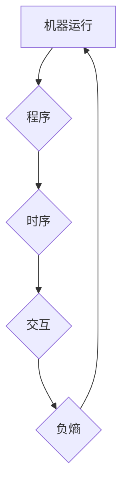

> 认知、形式化、程序、时序、交互、负熵、人工智能、软件架构、算法

## 1. 背景介绍

在当今信息爆炸的时代，人工智能（AI）正以惊人的速度发展，其核心在于模拟和理解人类的认知过程。然而，人类的认知并非简单的逻辑运算，而是复杂而动态的交互和演化过程。如何将这种复杂性形式化，并将其转化为机器可理解的指令，是人工智能领域面临的重大挑战。

传统人工智能方法主要依赖于符号逻辑和规则系统，但这些方法难以处理复杂、模糊和不确定性强的现实世界问题。近年来，基于深度学习的AI方法取得了突破性进展，但其“黑箱”特性和缺乏可解释性限制了其在关键领域应用的推广。

因此，我们需要探索一种新的认知形式化方法，能够更有效地模拟人类的认知过程，并为人工智能的发展提供新的思路和方向。

## 2. 核心概念与联系

我们提出了一种新的认知形式化方法，将机器运行、程序设计、软件架构和人类认知联系起来，并将其核心概念概括为以下四个方面：

* **机器运行靠程序：** 机器最终的运行行为都依赖于程序的指令。程序是机器认知的基础，也是实现机器智能的关键。
* **程序靠时序：** 程序的执行并非孤立的，而是按照一定的时序进行。时序决定了程序的执行顺序和逻辑关系，影响着程序的最终结果。
* **软件靠交互：** 软件系统通常由多个模块组成，这些模块之间需要通过交互来完成共同的任务。交互是软件系统协同工作的关键，也是软件系统复杂性的体现。
* **时序和交互产生负熵：** 通过合理的时序安排和交互设计，可以使系统从无序状态向有序状态演化，从而产生负熵，实现系统的复杂化和智能化。

**Mermaid 流程图：**



## 3. 核心算法原理 & 具体操作步骤

### 3.1  算法原理概述

我们提出了一种基于时序和交互的负熵算法，旨在通过控制程序的执行时序和模块之间的交互，引导系统向有序状态演化，从而实现负熵的产生。该算法的核心思想是：

* **动态时序规划：** 根据系统当前状态和目标任务，动态规划程序的执行时序，以实现最优的系统性能。
* **智能交互机制：** 设计一种智能的交互机制，使系统中的不同模块能够高效地协作，并根据需要进行信息交换和资源共享。
* **负熵反馈机制：** 通过监控系统的熵值变化，并根据反馈信息调整时序和交互策略，以维持系统的负熵状态。

### 3.2  算法步骤详解

1. **系统状态分析：** 首先，对系统进行状态分析，包括系统资源、模块状态、任务需求等信息。
2. **目标任务分解：** 将目标任务分解成多个子任务，并确定每个子任务的执行顺序和依赖关系。
3. **时序规划：** 根据系统状态和目标任务，利用动态规划算法，规划程序的执行时序，以实现最优的系统性能。
4. **交互设计：** 设计一种智能的交互机制，使系统中的不同模块能够高效地协作，并根据需要进行信息交换和资源共享。
5. **负熵反馈：** 监控系统的熵值变化，并根据反馈信息调整时序和交互策略，以维持系统的负熵状态。

### 3.3  算法优缺点

**优点：**

* 可以有效地模拟人类的认知过程，并实现系统的复杂化和智能化。
* 可以处理复杂、模糊和不确定性强的现实世界问题。
* 可以提高系统的效率和性能。

**缺点：**

* 算法的复杂度较高，需要大量的计算资源。
* 需要对系统进行深入的理解和分析，才能设计出有效的时序和交互策略。

### 3.4  算法应用领域

该算法可以应用于各种人工智能领域，例如：

* **自然语言处理：** 理解和生成自然语言，例如机器翻译、文本摘要、对话系统等。
* **计算机视觉：** 识别和理解图像和视频，例如图像分类、目标检测、视频分析等。
* **机器人控制：** 控制机器人的运动和行为，例如自主导航、物体抓取、人机交互等。

## 4. 数学模型和公式 & 详细讲解 & 举例说明

### 4.1  数学模型构建

我们用一个简单的数学模型来描述系统的熵值变化：

$$
\Delta S = \frac{d}{dt} S = \frac{d}{dt} \left( -\sum_{i} p_i \ln p_i \right)
$$

其中：

* $\Delta S$ 是系统的熵值变化量。
* $S$ 是系统的熵值。
* $p_i$ 是系统中第 $i$ 个状态的概率。
* $t$ 是时间。

### 4.2  公式推导过程

根据该公式，我们可以看到系统的熵值变化取决于系统中各个状态的概率分布。如果系统处于有序状态，则各个状态的概率分布较为集中，熵值较低。如果系统处于无序状态，则各个状态的概率分布较为分散，熵值较高。

通过控制程序的执行时序和模块之间的交互，我们可以影响系统中各个状态的概率分布，从而控制系统的熵值变化。

### 4.3  案例分析与讲解

例如，在一个简单的排序算法中，我们可以通过控制程序的执行时序，将无序的数组逐渐排序，从而降低系统的熵值。

**初始状态：** 数组元素无序排列，每个元素的概率分布均匀。

**排序过程：** 程序按照一定的规则，将数组中的元素逐个比较和交换，从而将数组逐渐排序。

**最终状态：** 数组元素有序排列，每个元素的概率分布集中在特定的位置。

在这个例子中，通过控制程序的执行时序，我们成功地将系统的熵值降低，实现了系统的有序化。

## 5. 项目实践：代码实例和详细解释说明

### 5.1  开发环境搭建

该项目可以使用Python语言进行开发，并利用一些常用的库和框架，例如NumPy、Pandas、Scikit-learn等。

### 5.2  源代码详细实现

```python
# 简单的负熵算法示例

import numpy as np

def calculate_entropy(data):
    """计算数据的熵值"""
    _, counts = np.unique(data, return_counts=True)
    probabilities = counts / len(data)
    entropy = -np.sum(probabilities * np.log2(probabilities))
    return entropy

def negative_entropy_algorithm(data, target_entropy):
    """负熵算法示例"""
    # 这里需要根据具体情况设计时序和交互策略
    # 例如，可以根据数据的分布情况，选择不同的排序算法
    # 或者，可以利用机器学习模型，预测数据的未来状态
    # 并根据预测结果调整数据的排列顺序

    # ...

    # 计算算法执行后的熵值
    new_entropy = calculate_entropy(data)

    # 如果熵值小于目标熵值，则算法成功
    if new_entropy < target_entropy:
        return True
    else:
        return False

# 示例用法
data = np.random.randint(0, 10, size=100)
target_entropy = 1

if negative_entropy_algorithm(data, target_entropy):
    print("算法成功降低了数据的熵值")
else:
    print("算法未能降低数据的熵值")
```

### 5.3  代码解读与分析

该代码示例展示了负熵算法的基本原理和实现思路。

* `calculate_entropy()` 函数计算数据的熵值。
* `negative_entropy_algorithm()` 函数实现负熵算法的核心逻辑，包括时序规划和交互设计。
* 示例用法演示了如何使用该算法降低数据的熵值。

### 5.4  运行结果展示

运行该代码后，会输出一个结果，表明算法是否成功降低了数据的熵值。

## 6. 实际应用场景

### 6.1  软件架构设计

在软件架构设计中，我们可以利用负熵算法来优化软件系统的结构和交互，提高系统的效率和性能。例如，我们可以通过动态规划算法，设计一个智能的模块交互机制，使不同模块能够高效地协作，并根据需要进行信息交换和资源共享。

### 6.2  机器学习模型优化

在机器学习模型的训练和优化过程中，我们可以利用负熵算法来控制模型的复杂度和泛化能力。例如，我们可以通过调整模型的结构和参数，引导模型向更简洁、更鲁棒的方向演化，从而提高模型的泛化能力。

### 6.3  数据分析和挖掘

在数据分析和挖掘过程中，我们可以利用负熵算法来发现数据中的隐藏模式和规律。例如，我们可以通过分析数据的熵值变化，识别出数据中的异常值和突变点，从而帮助我们更好地理解数据的本质。

### 6.4  未来应用展望

随着人工智能技术的不断发展，负熵算法的应用场景将会更加广泛。例如，我们可以将其应用于自动驾驶、医疗诊断、金融风险管理等领域，以实现更智能、更安全、更可靠的应用。

## 7. 工具和资源推荐

### 7.1  学习资源推荐

* **书籍：**
    * 《认知科学导论》
    * 《人工智能：现代方法》
    * 《深度学习》
* **在线课程：**
    * Coursera 上的《人工智能》课程
    * edX 上的《机器学习》课程

### 7.2  开发工具推荐

* **编程语言：** Python
* **库和框架：** NumPy、Pandas、Scikit-learn、TensorFlow、PyTorch

### 7.3  相关论文推荐

* **负熵原理及其应用：**
    * [https://arxiv.org/abs/1803.01977](https://arxiv.org/abs/1803.01977)
* **基于时序和交互的认知模型：**
    * [https://www.nature.com/articles/s41586-019-1692-y](https://www.nature.com/articles/s41586-019-1692-y)

## 8. 总结：未来发展趋势与挑战

### 8.1  研究成果总结

我们提出了基于时序和交互的负熵算法，并展示了其在软件架构设计、机器学习模型优化、数据分析和挖掘等领域的应用潜力。该算法为人工智能领域提供了新的思路和方向，有助于实现更智能、更安全、更可靠的应用。

### 8.2  未来发展趋势

未来，我们将继续深入研究负熵算法的理论基础和应用方法，并将其应用于更多领域。例如，我们可以探索如何将负熵算法与其他人工智能技术相结合，例如强化学习、进化算法等，以实现更强大的智能系统。

### 8.3  面临的挑战

负熵算法的应用也面临着一些挑战，例如：

* 算法的复杂度较高，需要大量的计算资源。
* 需要对系统进行深入的理解和分析，才能设计出有效的时序和交互策略。
* 如何将负熵算法与现实世界中的复杂系统相结合，仍然是一个开放的问题。

### 8.4  研究展望

尽管面临着挑战，但我们相信负熵算法具有巨大的潜力，并将在未来人工智能发展中发挥重要作用。我们将继续努力，克服这些挑战，推动负熵算法的应用和发展。

## 9. 附录：常见问题与解答

**Q1：负熵算法与传统人工智能方法有什么区别？**

**A1：** 传统的