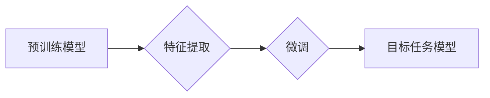

>迁移学习,深度学习,预训练模型,特征提取,Fine-tuning,计算机视觉,自然语言处理

## 1. 背景介绍

在深度学习领域，训练一个强大的模型通常需要大量的 labeled 数据和大量的计算资源。然而，在许多实际应用场景中，获取大量 labeled 数据往往非常困难和昂贵。迁移学习 (Transfer Learning) 应运而生，它是一种利用预先训练好的模型，将知识迁移到新任务上的学习方法。

迁移学习的思想是，在解决一个新任务时，可以利用已经训练好的模型在其他相关任务上的知识，从而减少对新任务数据的需求，并提高模型的性能。

## 2. 核心概念与联系

**2.1 核心概念**

* **源任务 (Source Task):** 预训练模型在训练过程中所使用的任务，通常是规模较大、数据丰富的任务，例如图像分类、文本分类等。
* **目标任务 (Target Task):** 需要迁移学习解决的新任务，通常是规模较小、数据较少的任务，例如特定领域的图像识别、情感分析等。
* **特征提取 (Feature Extraction):** 利用预训练模型提取特征，作为目标任务模型的输入。
* **Fine-tuning (微调):** 对预训练模型进行微调，使其适应目标任务。

**2.2 迁移学习流程**



## 3. 核心算法原理 & 具体操作步骤

**3.1 算法原理概述**

迁移学习的核心思想是利用源任务上训练好的模型的知识，来帮助目标任务的学习。

* **特征提取:** 预训练模型已经学习到了一定的特征表示能力，这些特征对于目标任务也可能具有价值。我们可以将预训练模型的特征提取层作为目标任务模型的特征提取器，从而减少目标任务模型的训练时间和数据需求。
* **微调:** 在特征提取的基础上，我们可以对预训练模型进行微调，使其更适应目标任务。微调的过程通常是调整预训练模型的最后一层或几层参数，以使模型的输出更符合目标任务的需要。

**3.2 算法步骤详解**

1. **选择预训练模型:** 根据目标任务选择合适的预训练模型。例如，对于图像分类任务，可以选择ResNet、VGG等预训练模型；对于文本分类任务，可以选择BERT、GPT等预训练模型。
2. **特征提取:** 将预训练模型的特征提取层作为目标任务模型的特征提取器。
3. **微调:** 对预训练模型的最后一层或几层参数进行微调，以使模型的输出更符合目标任务的需要。
4. **评估:** 使用目标任务的数据对微调后的模型进行评估，并根据评估结果进行调整。

**3.3 算法优缺点**

* **优点:**
    * 减少数据需求
    * 提高模型性能
    * 缩短训练时间
* **缺点:**
    * 需要找到合适的预训练模型
    * 微调过程可能需要一定的经验

**3.4 算法应用领域**

迁移学习在计算机视觉、自然语言处理、语音识别等领域都有广泛的应用。

* **计算机视觉:** 图像分类、目标检测、图像分割等
* **自然语言处理:** 文本分类、情感分析、机器翻译等
* **语音识别:** 语音识别、语音合成等

## 4. 数学模型和公式 & 详细讲解 & 举例说明

**4.1 数学模型构建**

迁移学习的数学模型可以看作是一个多层神经网络，其中包含预训练模型和微调模型。

* **预训练模型:** 已经训练好的模型，其参数为 $\theta_p$。
* **微调模型:** 用于目标任务的模型，其参数为 $\theta_t$。

**4.2 公式推导过程**

假设目标任务的损失函数为 $L(\theta_t, X, Y)$，其中 $X$ 为输入数据， $Y$ 为目标标签。

微调过程的目标是最小化损失函数，即：

$$\theta_t^* = \arg \min_{\theta_t} L(\theta_t, X, Y)$$

由于预训练模型已经学习到了一定的特征表示能力，我们可以将预训练模型的特征提取层作为微调模型的特征提取器。

因此，微调模型的输出可以表示为：

$$h(\theta_t, X) = f(\theta_p, X)$$

其中 $f(\theta_p, X)$ 为预训练模型的特征提取函数。

将上述公式代入损失函数，得到微调模型的损失函数：

$$L(\theta_t, X, Y) = L(h(\theta_t, X), Y)$$

**4.3 案例分析与讲解**

例如，在图像分类任务中，我们可以使用预训练的 ResNet 模型作为特征提取器，并将 ResNet 的最后一层替换为目标任务的分类层。然后，对 ResNet 的最后一层参数进行微调，以使模型能够准确地分类目标任务的图像。

## 5. 项目实践：代码实例和详细解释说明

**5.1 开发环境搭建**

* Python 3.6+
* TensorFlow 2.0+
* PyTorch 1.0+
* CUDA 10.0+ (可选)

**5.2 源代码详细实现**

```python
import tensorflow as tf

# 加载预训练模型
model = tf.keras.applications.ResNet50(weights='imagenet', include_top=False)

# 冻结预训练模型的权重
for layer in model.layers:
    layer.trainable = False

# 添加新的分类层
x = model.output
x = tf.keras.layers.GlobalAveragePooling2D()(x)
x = tf.keras.layers.Dense(1024, activation='relu')(x)
predictions = tf.keras.layers.Dense(num_classes, activation='softmax')(x)

# 创建模型
model = tf.keras.Model(inputs=model.input, outputs=predictions)

# 编译模型
model.compile(optimizer='adam',
              loss='categorical_crossentropy',
              metrics=['accuracy'])

# 训练模型
model.fit(train_data, train_labels, epochs=10)

# 评估模型
loss, accuracy = model.evaluate(test_data, test_labels)
print('Test Loss:', loss)
print('Test Accuracy:', accuracy)
```

**5.3 代码解读与分析**

* 首先，我们加载预训练的 ResNet50 模型，并将其最后一层移除，因为我们不需要其原有的分类层。
* 然后，我们冻结预训练模型的所有层的权重，这意味着在微调过程中，这些层的权重不会被更新。
* 接着，我们添加新的分类层，并将预训练模型的输出作为输入。
* 最后，我们编译和训练模型，并评估模型的性能。

**5.4 运行结果展示**

运行上述代码后，我们可以看到模型的训练过程和评估结果。

## 6. 实际应用场景

**6.1 医疗图像分析**

迁移学习可以用于分析医学图像，例如 X 光片、CT 扫描和 MRI 图像，以帮助医生诊断疾病。

**6.2 自然语言处理**

迁移学习可以用于各种自然语言处理任务，例如文本分类、情感分析、机器翻译和问答系统。

**6.3 自动驾驶**

迁移学习可以用于训练自动驾驶汽车的感知模型，例如目标检测和场景理解模型。

**6.4 未来应用展望**

随着深度学习技术的不断发展，迁移学习将在更多领域得到应用，例如：

* **个性化推荐:** 根据用户的历史行为和偏好，提供个性化的产品和服务推荐。
* **智能客服:** 利用迁移学习训练智能客服机器人，能够更准确地理解用户的需求并提供帮助。
* **药物研发:** 利用迁移学习加速药物研发过程，例如预测药物的活性或副作用。

## 7. 工具和资源推荐

**7.1 学习资源推荐**

* **书籍:**
    * Deep Learning with Python by Francois Chollet
    * Transfer Learning in Natural Language Processing by Sebastian Ruder
* **在线课程:**
    * Coursera: Deep Learning Specialization
    * Udacity: Deep Learning Nanodegree

**7.2 开发工具推荐**

* **TensorFlow:** https://www.tensorflow.org/
* **PyTorch:** https://pytorch.org/
* **Keras:** https://keras.io/

**7.3 相关论文推荐**

* **ImageNet Classification with Deep Convolutional Neural Networks** by Alex Krizhevsky, Ilya Sutskever, and Geoffrey E. Hinton
* **Transfer Learning** by Yoshua Bengio, Jean-François Dauphin, and Aaron Courville

## 8. 总结：未来发展趋势与挑战

**8.1 研究成果总结**

迁移学习在近年来取得了显著的进展，在许多领域都取得了优异的性能。

**8.2 未来发展趋势**

* **更有效的迁移学习方法:** 研究更有效的迁移学习方法，例如自适应迁移学习和跨模态迁移学习。
* **更广泛的应用场景:** 将迁移学习应用到更多领域，例如医疗、教育和金融。
* **更小的模型:** 研究更小的迁移学习模型，以便在资源有限的设备上运行。

**8.3 面临的挑战**

* **数据不匹配:** 源任务和目标任务的数据分布可能存在差异，这会影响迁移学习的性能。
* **模型复杂度:** 迁移学习模型通常比较复杂，训练和部署成本较高。
* **可解释性:** 迁移学习模型的决策过程往往难以解释，这可能会阻碍其在一些领域应用。

**8.4 研究展望**

未来，迁移学习的研究将继续朝着更有效、更广泛、更可解释的方向发展。


## 9. 附录：常见问题与解答

**9.1 如何选择合适的预训练模型？**

选择预训练模型需要考虑目标任务的类型、数据规模和模型的复杂度。

**9.2 如何进行微调？**

微调过程通常是调整预训练模型的最后一层或几层参数，以使模型的输出更符合目标任务的需要。

**9.3 迁移学习的性能如何？**

迁移学习的性能通常优于从头训练模型，尤其是在数据有限的情况下。

作者：禅与计算机程序设计艺术 / Zen and the Art of Computer Programming


<end_of_turn>