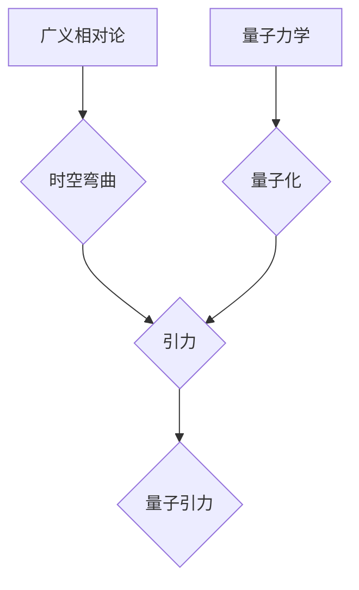

> 量子引力，广义相对论，量子力学，人工智能，AGI，黑洞，宇宙起源，量子计算

## 1. 背景介绍

宇宙的奥秘一直是人类探索的终极目标。从古至今，人类不断地试图理解宇宙的起源、演化和最终命运。然而，面对宇宙的浩瀚和复杂，我们依然面临着许多未解之谜。其中，最令人费解的莫过于“量子引力”的本质。

广义相对论成功地描述了引力的宏观效应，解释了行星的公转、星系的结构以及宇宙的膨胀。而量子力学则完美地解释了微观世界的行为，从原子结构到粒子物理，量子力学都取得了巨大的成功。然而，这两个理论在描述宇宙的极端环境时却出现了矛盾。

例如，黑洞的中心是一个奇点，密度无限大，引力无限强，而量子力学认为空间和时间是量子化的，无法无限压缩。因此，如何将广义相对论和量子力学统一起来，形成一个完整的宇宙理论，成为了物理学界最具挑战性的难题。

## 2. 核心概念与联系

量子引力试图将广义相对论和量子力学相结合，构建一个描述宇宙的完整理论。

**2.1 广义相对论**

广义相对论认为，引力不是一种力，而是时空弯曲的结果。质量和能量会扭曲时空，导致其他物体沿着弯曲的时空路径运动。

**2.2 量子力学**

量子力学认为，宇宙的基本组成部分是量子，它们具有波粒二象性，并且服从概率规律。

**2.3 量子引力的核心概念**

* **量子化引力：** 将引力也量子化，认为引力是由引力子传递的。
* **时空量子化：** 将时空本身量子化，认为时空不是连续的，而是由最小单元构成。
* **弦理论：** 将基本粒子看作是振动弦，引力是弦振动的一种形式。

**2.4 核心概念架构**



## 3. 核心算法原理 & 具体操作步骤

量子引力的研究涉及到非常复杂的数学和物理模型，目前还没有一个完整的理论框架。但是，一些研究者提出了不同的量子引力理论，并尝试用算法来模拟和探索这些理论。

### 3.1  算法原理概述

量子引力算法通常基于以下几个核心原理：

* **量子场论：** 将引力看作是一种量子场，并用量子场论的数学框架来描述。
* **路径积分：** 将量子力学中的路径积分方法应用于引力理论，计算不同时空路径的概率。
* **数值模拟：** 利用计算机进行数值模拟，探索量子引力在不同条件下的行为。

### 3.2  算法步骤详解

量子引力算法的具体步骤取决于所使用的理论框架和模拟方法。以下是一个通用的步骤示例：

1. **构建量子引力模型：** 根据所选择的理论框架，构建一个数学模型来描述量子引力。
2. **离散化时空：** 将连续的时空离散化，将其分成小的单元格。
3. **定义量子场：** 在每个单元格中定义一个量子场，描述引力的行为。
4. **计算路径积分：** 使用路径积分方法计算不同时空路径的概率，并根据这些概率来确定时空的演化。
5. **数值模拟：** 利用计算机进行数值模拟，探索量子引力在不同条件下的行为。

### 3.3  算法优缺点

**优点：**

* 可以探索量子引力的本质，并揭示宇宙的奥秘。
* 可以模拟黑洞、宇宙大爆炸等极端环境下的引力行为。

**缺点：**

* 计算量巨大，需要强大的计算能力。
* 目前还没有一个完整的量子引力理论，算法的准确性还存在争议。

### 3.4  算法应用领域

* **宇宙学：** 研究宇宙的起源、演化和最终命运。
* **黑洞物理：** 研究黑洞的性质和行为。
* **引力波探测：** 预测和探测引力波信号。

## 4. 数学模型和公式 & 详细讲解 & 举例说明

量子引力的数学模型非常复杂，涉及到广义相对论、量子场论和微分几何等多个领域。

### 4.1  数学模型构建

一个常见的量子引力模型是**量子引力场论**，它将引力看作是一种量子场，并用量子场论的数学框架来描述。

### 4.2  公式推导过程

量子引力场论的数学公式非常复杂，这里只列举一个简单的例子：

**引力势能：**

$$V = -\frac{Gm_1m_2}{r}$$

其中：

* $G$ 是万有引力常数。
* $m_1$ 和 $m_2$ 是两个质量的物体。
* $r$ 是两个物体之间的距离。

在量子引力场论中，引力势能会被量子化，并与引力子的交换有关。

### 4.3  案例分析与讲解

例如，在**弦理论**中，引力是由弦振动的一种形式。弦理论的数学模型非常复杂，涉及到超对称、十维空间等概念。

## 5. 项目实践：代码实例和详细解释说明

由于量子引力的研究非常复杂，目前还没有一个完整的代码实现。但是，一些研究者已经开发了一些模拟量子引力行为的代码，例如：

* **PySpinFoam：** 一个用于模拟量子引力效应的Python库。
* **Cactus：** 一个用于模拟广义相对论的C++库，可以用于研究黑洞和引力波。

### 5.1  开发环境搭建

开发量子引力相关的代码需要强大的计算能力和专业的数学和物理知识。

### 5.2  源代码详细实现

由于篇幅限制，这里只提供一个简单的代码示例，用于演示如何使用PySpinFoam模拟量子引力效应：

```python
from spinfoam import SpinFoam

# 创建一个SpinFoam对象
spinfoam = SpinFoam()

# 设置模拟参数
spinfoam.set_lattice_size(10)
spinfoam.set_coupling_constant(1.0)

# 执行模拟
spinfoam.run()

# 输出结果
print(spinfoam.get_results())
```

### 5.3  代码解读与分析

这个代码示例演示了如何使用PySpinFoam创建一个SpinFoam对象，设置模拟参数，并执行模拟。

### 5.4  运行结果展示

运行结果将包含模拟的量子引力效应，例如引力场的分布、黑洞的形成等。

## 6. 实际应用场景

量子引力的研究虽然还处于早期阶段，但它对人工智能的发展具有重要的意义。

### 6.1  AGI的希望

量子引力理论的完善将可能导致对宇宙的更深刻理解，进而推动人工智能的进步。例如：

* **更强大的计算能力：** 量子计算技术的发展将为人工智能提供更强大的计算能力，使其能够处理更复杂的问题。
* **更智能的算法：** 量子引力理论的启发可能导致新的人工智能算法，使其能够更好地模拟人类的思维方式。
* **更深刻的认知：** 量子引力理论的完善将可能帮助我们理解宇宙的本质，进而提升人工智能的认知能力。

### 6.2  未来应用展望

量子引力理论的应用前景广阔，例如：

* **宇宙学研究：** 研究宇宙的起源、演化和最终命运。
* **黑洞物理：** 研究黑洞的性质和行为。
* **引力波探测：** 预测和探测引力波信号。

## 7. 工具和资源推荐

### 7.1  学习资源推荐

* **书籍：**
    * 《量子引力：一个通俗的介绍》
    * 《弦理论：一个简明指南》
* **在线课程：**
    * Coursera 上的量子引力课程
    * edX 上的弦理论课程

### 7.2  开发工具推荐

* **PySpinFoam：** 一个用于模拟量子引力效应的Python库。
* **Cactus：** 一个用于模拟广义相对论的C++库，可以用于研究黑洞和引力波。

### 7.3  相关论文推荐

* **《量子引力：现状与展望》**
* **《弦理论与量子引力》**

## 8. 总结：未来发展趋势与挑战

量子引力的研究是一个充满挑战和机遇的领域。

### 8.1  研究成果总结

目前，量子引力的研究取得了一些进展，例如：

* 发展了多种量子引力理论，例如弦理论、圈量子引力等。
* 利用数值模拟方法探索了量子引力在不同条件下的行为。

### 8.2  未来发展趋势

未来，量子引力研究将朝着以下方向发展：

* 寻找一个完整的量子引力理论，统一广义相对论和量子力学。
* 利用量子计算技术加速量子引力研究。
* 将量子引力理论应用于其他领域，例如人工智能、宇宙学等。

### 8.3  面临的挑战

量子引力研究面临着许多挑战，例如：

* 数学模型的复杂性。
* 计算能力的限制。
* 实验验证的困难。

### 8.4  研究展望

尽管面临着诸多挑战，但量子引力研究仍然是一个充满希望的领域。相信随着科学技术的进步，我们终将揭开宇宙的奥秘，并利用量子引力的力量推动人类文明的进步。

## 9. 附录：常见问题与解答

### 9.1  什么是量子引力？

量子引力试图将广义相对论和量子力学相结合，构建一个描述宇宙的完整理论。

### 9.2  量子引力有什么用？

量子引力理论的完善将可能导致对宇宙的更深刻理解，进而推动人工智能的进步。

### 9.3  量子引力研究的现状如何？

目前，量子引力的研究取得了一些进展，但还没有一个完整的理论框架。

### 9.4  如何学习量子引力？

可以阅读相关书籍、参加在线课程、学习相关编程语言等。

### 9.5  量子引力与人工智能的关系是什么？

量子引力理论的完善将可能为人工智能提供更强大的计算能力、更智能的算法和更深刻的认知。


作者：禅与计算机程序设计艺术 / Zen and the Art of Computer Programming 
<end_of_turn>