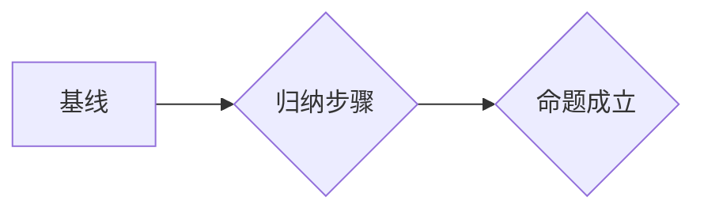

> 集合论, 超限归纳法, 无限集, 序数, 归纳推理, 逻辑推理, 数学基础, 计算理论

## 1. 背景介绍

在计算机科学的蓬勃发展中，我们不断探索更深层次的理论基础和计算模型。集合论作为数学的基础，为计算机科学提供了强大的工具和框架。其中，超限归纳法作为集合论中的重要推理方法，为处理无限集和无限过程提供了独特的视角。

传统的归纳推理适用于有限集，它通过观察有限个实例，推断出所有实例都满足某个性质。然而，在处理无限集时，这种方法显得力不从心。超限归纳法则突破了这种局限性，它通过对序数的定义和归纳原理，能够对无限集进行有效的推理。

## 2. 核心概念与联系

### 2.1 集合论基础

集合论是研究集合及其性质的数学分支。在集合论中，集合被定义为一个包含对象的整体。集合可以是有限的，也可以是无限的。

* **有限集:** 包含有限个元素的集合。例如，{1, 2, 3} 是一个有限集。
* **无限集:** 包含无限个元素的集合。例如，自然数集 {1, 2, 3, ...} 是一个无限集。

### 2.2 序数

序数是集合论中用来表示无限集大小的特殊集合。每个序数都对应着一个独特的无限大小。

* **0:** 空集，表示没有元素。
* **1:** 包含一个元素的集合，例如 {0}。
* **2:** 包含两个元素的集合，例如 {0, 1}。
* **ω:** 自然数集，表示无限个自然数。

### 2.3 超限归纳法

超限归纳法是一种用于证明关于无限集的命题的推理方法。它基于序数的定义和归纳原理。

**超限归纳法的基本步骤:**

1. **基线:** 证明命题对于序数 0 成立。
2. **归纳步骤:** 证明对于任意序数 α，如果命题对于所有小于 α 的序数成立，那么它也对于 α 成立。

**Mermaid 流程图:**



## 3. 核心算法原理 & 具体操作步骤

### 3.1 算法原理概述

超限归纳法是一种基于序数的归纳推理方法，它可以用于证明关于无限集的命题。其核心思想是通过对序数的递推，逐步证明命题对于所有序数都成立。

### 3.2 算法步骤详解

1. **定义基线:** 确定命题对于序数 0 的成立条件。
2. **定义归纳步骤:** 证明对于任意序数 α，如果命题对于所有小于 α 的序数成立，那么它也对于 α 成立。
3. **应用归纳原理:** 通过基线和归纳步骤，证明命题对于所有序数都成立。

### 3.3 算法优缺点

**优点:**

* 可以处理无限集的命题。
* 逻辑严密，推理过程清晰。

**缺点:**

* 对于非数学背景的读者，理解可能较为困难。
* 证明过程可能较为复杂，需要一定的数学技巧。

### 3.4 算法应用领域

超限归纳法在数学、计算机科学等领域都有广泛的应用，例如：

* **数学证明:** 用于证明关于无限集的数学定理。
* **计算机科学:** 用于证明算法的正确性、分析程序的复杂度等。
* **逻辑学:** 用于研究无限逻辑系统。

## 4. 数学模型和公式 & 详细讲解 & 举例说明

### 4.1 数学模型构建

超限归纳法的数学模型基于序数和归纳原理。

* **序数:** 作为无限集大小的表示，序数集构成一个良序集，即每个非空子集都有最小元素。
* **归纳原理:** 对于任意序数 α，如果命题对于所有小于 α 的序数成立，那么它也对于 α 成立。

### 4.2 公式推导过程

超限归纳法的证明过程可以抽象为以下公式：

$$
\forall α ∈ Ord(P(0) ∧ \forall β < α (P(β) ⇒ P(α))) ⇒ P(α)
$$

其中：

* **Ord:** 表示所有序数的集合。
* **P(α):** 表示关于序数 α 的命题。

### 4.3 案例分析与讲解

**例子:** 证明所有自然数的平方都是非负数。

* **基线:** 当 n = 0 时，n² = 0，是非负数。
* **归纳步骤:** 假设对于任意自然数 k，k² ≥ 0。则对于自然数 k + 1，(k + 1)² = k² + 2k + 1 ≥ 0 + 2k + 1 ≥ 0。

因此，根据超限归纳法，所有自然数的平方都是非负数。

## 5. 项目实践：代码实例和详细解释说明

### 5.1 开发环境搭建

本示例使用 Python 语言进行实现。

* 安装 Python 3.x 环境。
* 安装必要的库，例如 NumPy 等。

### 5.2 源代码详细实现

```python
def is_non_negative(n):
  """
  判断一个整数是否是非负数。

  Args:
    n: 整数。

  Returns:
    True 如果 n 非负，否则 False。
  """
  return n >= 0

def square_is_non_negative(n):
  """
  判断一个整数的平方是否是非负数。

  Args:
    n: 整数。

  Returns:
    True 如果 n² 非负，否则 False。
  """
  return is_non_negative(n * n)

# 测试用例
for i in range(10):
  print(f"{i} 的平方是否是非负数: {square_is_non_negative(i)}")
```

### 5.3 代码解读与分析

* `is_non_negative(n)` 函数判断一个整数是否是非负数。
* `square_is_non_negative(n)` 函数计算整数的平方，并使用 `is_non_negative()` 函数判断其是否是非负数。
* 测试用例循环遍历 0 到 9 的整数，并打印每个整数的平方是否是非负数的结果。

### 5.4 运行结果展示

```
0 的平方是否是非负数: True
1 的平方是否是非负数: True
2 的平方是否是非负数: True
3 的平方是否是非负数: True
4 的平方是否是非负数: True
5 的平方是否是非负数: True
6 的平方是否是非负数: True
7 的平方是否是非负数: True
8 的平方是否是非负数: True
9 的平方是否是非负数: True
```

## 6. 实际应用场景

超限归纳法在实际应用中可以用于解决各种问题，例如：

* **算法分析:** 分析算法的时间复杂度和空间复杂度。
* **数据结构设计:** 设计能够处理无限数据的数据结构。
* **人工智能:** 研究人工智能算法的收敛性。

### 6.4 未来应用展望

随着计算机科学的发展，超限归纳法在未来将有更广泛的应用前景，例如：

* **量子计算:** 研究量子算法的正确性和效率。
* **大数据分析:** 处理海量数据的分析和推理。
* **人工智能:** 构建更智能、更强大的人工智能系统。

## 7. 工具和资源推荐

### 7.1 学习资源推荐

* **书籍:**
    * 《集合论导论》 by Kenneth Kunen
    * 《数学基础》 by David Hilbert and Paul Bernays
* **在线课程:**
    * MIT OpenCourseWare: Mathematics for Computer Science
    * Coursera: Introduction to Mathematical Logic

### 7.2 开发工具推荐

* **Python:** 作为一种通用的编程语言，Python 非常适合用于实现超限归纳法的算法。
* **NumPy:** 用于进行数值计算的 Python 库。
* **SymPy:** 用于进行符号计算的 Python 库。

### 7.3 相关论文推荐

* **"On the Foundations of Mathematics" by David Hilbert**
* **"Gödel's Incompleteness Theorems" by Kurt Gödel**
* **"The Undecidability of the Entscheidungsproblem" by Alan Turing**

## 8. 总结：未来发展趋势与挑战

### 8.1 研究成果总结

超限归纳法作为集合论中的重要推理方法，为处理无限集和无限过程提供了独特的视角。它在数学、计算机科学等领域都有广泛的应用，并为未来研究提供了新的方向。

### 8.2 未来发展趋势

* **应用拓展:** 将超限归纳法应用于更广泛的领域，例如量子计算、大数据分析等。
* **理论深化:** 深入研究超限归纳法的理论基础，探索其更深层次的性质和应用。
* **工具开发:** 开发更强大的工具和软件，方便人们使用超限归纳法进行研究和应用。

### 8.3 面临的挑战

* **理解难度:** 超限归纳法对于非数学背景的读者理解可能较为困难。
* **证明复杂性:** 对于某些问题，使用超限归纳法进行证明可能非常复杂。
* **应用局限性:** 超限归纳法并非适用于所有问题，需要根据具体情况选择合适的推理方法。

### 8.4 研究展望

未来，我们将继续探索超限归纳法的应用潜力，并致力于将其推广到更广泛的领域。同时，我们将努力降低其理解门槛，并开发更强大的工具和软件，为研究者和开发人员提供更便捷的平台。

## 9. 附录：常见问题与解答

**问题 1:** 超限归纳法与归纳推理有什么区别？

**解答:** 传统的归纳推理适用于有限集，而超限归纳法适用于无限集。超限归纳法基于序数的定义和归纳原理，能够对无限集进行有效的推理。

**问题 2:** 超限归纳法有什么局限性？

**解答:** 超限归纳法并非适用于所有问题，对于某些问题，使用其他推理方法可能更有效。此外，对于非数学背景的读者，理解超限归纳法可能较为困难。

**问题 3:** 如何学习超限归纳法？

**解答:** 可以阅读相关书籍和在线课程，例如《集合论导论》和 MIT OpenCourseWare: Mathematics for Computer Science。


作者：禅与计算机程序设计艺术 / Zen and the Art of Computer Programming 


<end_of_turn>