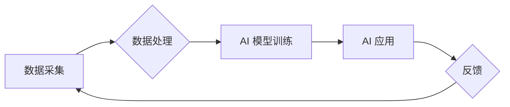

> 集成电路, AI, 垂直整合, 自动化, 机器学习, 深度学习, 芯片设计, 制造, 测试

## 1. 背景介绍

集成电路 (IC) 是现代电子设备的核心，其不断 miniaturization 和性能提升推动着科技发展。然而，IC 设计和制造是一个复杂、耗时且成本高昂的过程，需要庞大的专业知识和资源。近年来，人工智能 (AI) 技术的快速发展为IC行业带来了新的机遇，AI 算法可以自动化许多传统人工完成的任务，提高效率和降低成本。

垂直整合是指将整个产业链环节，从设计到制造、测试和销售，整合到一个企业或集团内部。在IC行业，垂直整合可以帮助企业更好地控制产品质量、缩短生产周期、降低成本，并获得更强的市场竞争力。

## 2. 核心概念与联系

**2.1 AI 垂直整合的优势**

AI 垂直整合可以为IC行业带来以下优势：

* **提高设计效率:** AI 算法可以加速芯片设计流程，例如自动生成电路布局、优化电路性能、识别设计缺陷等。
* **降低设计成本:** AI 可以帮助减少设计迭代次数，缩短设计周期，从而降低设计成本。
* **优化制造流程:** AI 可以分析制造数据，预测设备故障，优化生产参数，提高制造效率和产品良率。
* **增强测试能力:** AI 可以开发自动测试系统，提高测试效率和准确性，减少人工测试成本。

**2.2 AI 垂直整合的架构**

AI 垂直整合的架构通常包括以下几个关键模块：

* **数据采集模块:** 收集来自设计、制造、测试等环节的数据。
* **数据处理模块:** 对收集到的数据进行清洗、预处理和特征提取。
* **AI 模型训练模块:** 利用机器学习和深度学习算法训练 AI 模型。
* **AI 应用模块:** 将训练好的 AI 模型应用于芯片设计、制造、测试等环节。

**2.3 AI 垂直整合的流程图**



## 3. 核心算法原理 & 具体操作步骤

**3.1 算法原理概述**

在AI垂直整合中，常用的算法包括：

* **机器学习:** 用于从数据中学习模式和规律，例如监督学习、无监督学习和强化学习。
* **深度学习:** 一种更高级的机器学习方法，利用多层神经网络模拟人类大脑的学习过程。
* **自然语言处理:** 用于处理和理解自然语言文本，例如芯片设计文档的自动分析和理解。
* **计算机视觉:** 用于处理和理解图像和视频数据，例如芯片缺陷检测和制造过程监控。

**3.2 算法步骤详解**

以芯片设计为例，AI 算法可以应用于以下步骤：

1. **电路布局优化:** 利用机器学习算法分析电路图和布局规则，自动生成更优的电路布局，提高芯片性能和面积利用率。
2. **电路性能预测:** 利用深度学习算法训练模型，预测芯片不同工作条件下的性能指标，例如功耗、时钟频率和延迟。
3. **设计缺陷检测:** 利用计算机视觉算法分析芯片设计图纸，识别潜在的缺陷和错误，提高设计质量。

**3.3 算法优缺点**

AI 算法在IC行业应用的优势在于其自动化能力、效率提升和成本降低。然而，也存在一些缺点：

* **数据依赖:** AI 算法需要大量高质量的数据进行训练，而获取和标注这些数据需要时间和成本。
* **模型解释性:** 一些 AI 算法的决策过程难以解释，这可能导致信任问题和难以调试。
* **算法泛化能力:** AI 模型的泛化能力需要不断验证，确保其能够适应不同的设计场景和制造工艺。

**3.4 算法应用领域**

AI 算法在IC行业应用的领域非常广泛，包括：

* **芯片设计:** 自动化电路布局、性能预测、缺陷检测等。
* **芯片制造:** 优化制造流程、预测设备故障、提高良率等。
* **芯片测试:** 自动化测试、缺陷识别、性能评估等。

## 4. 数学模型和公式 & 详细讲解 & 举例说明

**4.1 数学模型构建**

在AI垂直整合中，常用的数学模型包括：

* **线性回归:** 用于预测连续变量，例如芯片性能指标。
* **逻辑回归:** 用于分类问题，例如芯片缺陷识别。
* **支持向量机:** 用于分类和回归问题，具有较强的泛化能力。
* **神经网络:** 用于复杂模式识别和预测，例如芯片设计优化。

**4.2 公式推导过程**

以线性回归为例，其目标是找到一条直线，使得预测值与实际值之间的误差最小。

线性回归模型的公式为：

$$y = wx + b$$

其中：

* $y$ 是预测值
* $x$ 是输入特征
* $w$ 是权重系数
* $b$ 是偏置项

损失函数用于衡量预测值与实际值之间的误差，常用的损失函数是均方误差 (MSE)：

$$MSE = \frac{1}{n} \sum_{i=1}^{n} (y_i - \hat{y}_i)^2$$

其中：

* $n$ 是样本数量
* $y_i$ 是实际值
* $\hat{y}_i$ 是预测值

通过最小化损失函数，可以求解出最佳的权重系数 $w$ 和偏置项 $b$。

**4.3 案例分析与讲解**

假设我们想要预测芯片的功耗，输入特征包括芯片面积、晶体管数量等。我们可以使用线性回归模型训练一个预测模型，并将训练好的模型应用于新的芯片设计，预测其功耗。

## 5. 项目实践：代码实例和详细解释说明

**5.1 开发环境搭建**

* 操作系统: Ubuntu 20.04
* Python 版本: 3.8
* 库依赖: TensorFlow, PyTorch, NumPy, Pandas

**5.2 源代码详细实现**

```python
import tensorflow as tf

# 定义模型结构
model = tf.keras.models.Sequential([
    tf.keras.layers.Dense(64, activation='relu', input_shape=(5,)),
    tf.keras.layers.Dense(32, activation='relu'),
    tf.keras.layers.Dense(1)
])

# 编译模型
model.compile(optimizer='adam', loss='mse')

# 训练模型
model.fit(X_train, y_train, epochs=100)

# 评估模型
loss = model.evaluate(X_test, y_test)
print('Loss:', loss)

# 预测新数据
predictions = model.predict(new_data)
```

**5.3 代码解读与分析**

* 代码首先定义了一个简单的多层感知机模型，包含三个全连接层。
* 每个全连接层都使用 ReLU 激活函数，除了最后一层使用线性激活函数。
* 模型使用 Adam 优化器和均方误差损失函数进行训练。
* 训练完成后，模型可以用来预测新的芯片功耗数据。

**5.4 运行结果展示**

训练完成后，可以查看模型的损失值，以及对新数据的预测结果。

## 6. 实际应用场景

**6.1 芯片设计优化**

AI 可以帮助芯片设计工程师优化电路布局、提高芯片性能和面积利用率。例如，AI 算法可以自动生成更优的电路布局，减少布线长度和寄生电容，从而提高芯片的时钟频率和功耗效率。

**6.2 制造流程优化**

AI 可以分析制造数据，预测设备故障，优化生产参数，提高制造效率和产品良率。例如，AI 算法可以分析晶圆缺陷数据，识别制造缺陷的根源，并建议相应的改进措施。

**6.3 测试流程自动化**

AI 可以开发自动测试系统，提高测试效率和准确性，减少人工测试成本。例如，AI 算法可以分析芯片测试数据，识别潜在的缺陷，并自动执行相应的测试用例。

**6.4 未来应用展望**

随着 AI 技术的不断发展，其在IC行业的应用场景将更加广泛。例如，AI 可以用于芯片的自动设计、个性化定制、以及预测性维护等领域。

## 7. 工具和资源推荐

**7.1 学习资源推荐**

* **书籍:**
    * 深度学习
    * 人工智能：一种现代方法
* **在线课程:**
    * Coursera: 深度学习
    * edX: 人工智能
* **开源项目:**
    * TensorFlow
    * PyTorch

**7.2 开发工具推荐**

* **编程语言:** Python
* **机器学习框架:** TensorFlow, PyTorch
* **数据处理工具:** Pandas, NumPy

**7.3 相关论文推荐**

* **AI for Chip Design:**
    * [Automated Chip Design with Deep Learning](https://arxiv.org/abs/1906.04137)
* **AI for Chip Manufacturing:**
    * [Predictive Maintenance for Semiconductor Manufacturing Using Machine Learning](https://ieeexplore.ieee.org/document/8839737)
* **AI for Chip Testing:**
    * [Automated Defect Detection in Semiconductor Manufacturing Using Deep Learning](https://arxiv.org/abs/1809.04674)

## 8. 总结：未来发展趋势与挑战

**8.1 研究成果总结**

AI 垂直整合为IC行业带来了新的机遇，可以提高设计效率、降低成本、优化制造流程和增强测试能力。

**8.2 未来发展趋势**

* **更强大的 AI 算法:** 随着 AI 技术的不断发展，将出现更强大的 AI 算法，能够解决更复杂的问题，并实现更精准的预测和控制。
* **更丰富的应用场景:** AI 将在更多 IC 环节得到应用，例如芯片的自动设计、个性化定制、以及预测性维护等领域。
* **更紧密的产业链合作:** AI 垂直整合需要各环节企业之间的紧密合作，才能实现协同效应。

**8.3 面临的挑战**

* **数据获取和标注:** AI 算法需要大量高质量的数据进行训练，而获取和标注这些数据需要时间和成本。
* **模型解释性:** 一些 AI 算法的决策过程难以解释，这可能导致信任问题和难以调试。
* **算法泛化能力:** AI 模型的泛化能力需要不断验证，确保其能够适应不同的设计场景和制造工艺。

**8.4 研究展望**

未来，研究者将继续探索更强大的 AI 算法，并将其应用于更多 IC 环节，以推动 IC 行业的创新发展。


## 9. 附录：常见问题与解答

**9.1 如何获取芯片设计数据？**

芯片设计数据通常由芯片设计公司拥有，可以通过以下方式获取：

* 与芯片设计公司合作，获取授权数据。
* 从公开数据库中获取部分芯片设计数据。
* 利用模拟工具生成虚拟芯片设计数据。

**9.2 如何训练 AI 模型？**

训练 AI 模型需要以下步骤：

* 准备数据：收集和预处理芯片设计数据。
* 选择模型架构：根据任务选择合适的 AI 模型架构。
* 训练模型：使用训练数据训练 AI 模型。
* 评估模型：使用测试数据评估模型的性能。
* 调优模型：根据评估结果调整模型参数，提高模型性能。

**9.3 AI 垂直整合的安全性问题？**

AI 垂直整合可能会带来一些安全性问题，例如：

* 数据泄露: 芯片设计数据是高度敏感的信息，需要采取措施防止数据泄露。
* 模型攻击: 攻击者可能试图攻击 AI 模型，使其产生错误的预测结果。
* 算法偏见: AI 模型可能存在算法偏见，导致不公平的结果。

为了解决这些问题，需要采取相应的安全措施，例如：

* 加密数据传输和存储。
* 对 AI 模型进行安全评估和测试。
* 监控 AI 模型的运行状态，及时发现异常情况。


作者：禅与计算机程序设计艺术