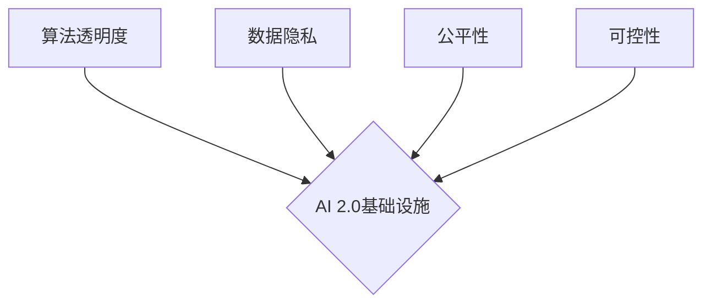

> AI 2.0, 基础设施, 伦理, 社会责任, 算法透明度, 数据隐私, 人工智能监管, 偏见检测, 公平性, 可解释性

## 1. 背景介绍

人工智能（AI）技术近年来取得了飞速发展，从语音识别、图像识别到自然语言处理，AI已经渗透到我们生活的方方面面。随着AI技术的不断进步，我们进入了一个新的时代——AI 2.0时代。AI 2.0时代的特点是：

* **更强大的计算能力:** 随着量子计算、神经网络等技术的突破，AI模型的规模和复杂度将进一步提升，能够处理更复杂的任务。
* **更丰富的训练数据:** 大数据时代为AI提供了海量的数据资源，使得AI模型能够学习更复杂的模式和规律。
* **更广泛的应用场景:** AI将应用于更多领域，例如医疗、教育、金融、交通等，对社会产生更深远的影响。

然而，AI 2.0时代的到来也带来了新的挑战，其中伦理和社会责任问题尤为突出。

## 2. 核心概念与联系

AI 2.0基础设施建设的核心概念包括：

* **算法透明度:** 理解AI模型的决策过程，使其可解释和可信赖。
* **数据隐私:** 保护个人数据安全，防止数据滥用和泄露。
* **公平性:** 确保AI算法不产生歧视和偏见，公平地对待所有用户。
* **可控性:** 控制AI系统的行为，避免其产生不可预知的风险。

这些概念相互关联，共同构成了AI 2.0基础设施建设的伦理和社会责任框架。



## 3. 核心算法原理 & 具体操作步骤

### 3.1  算法原理概述

在AI 2.0基础设施建设中，许多算法被用于实现伦理和社会责任目标。例如：

* **偏见检测算法:** 用于识别AI模型中潜在的偏见，并提出改进方案。
* **可解释性算法:** 用于解释AI模型的决策过程，使其更易于理解和信任。
* **公平性算法:** 用于确保AI算法在不同群体之间公平地对待。

这些算法通常基于机器学习和深度学习技术，通过训练模型识别和解决伦理和社会责任问题。

### 3.2  算法步骤详解

以偏见检测算法为例，其具体操作步骤如下：

1. **数据收集:** 收集包含不同群体特征的数据集，例如性别、种族、年龄等。
2. **数据预处理:** 对数据进行清洗、转换和特征工程，使其适合模型训练。
3. **模型训练:** 使用机器学习算法训练偏见检测模型，例如支持向量机、决策树等。
4. **模型评估:** 使用测试数据集评估模型的性能，例如准确率、召回率等。
5. **模型部署:** 将训练好的模型部署到实际应用场景中，实时检测AI模型中的偏见。

### 3.3  算法优缺点

偏见检测算法和其他伦理和社会责任算法都具有其优缺点：

* **优点:** 可以有效识别和解决AI模型中的伦理和社会责任问题，提高AI系统的可信赖性和安全性。
* **缺点:** 算法本身可能存在偏见，需要不断改进和优化；数据收集和预处理过程可能存在偏差，影响算法的准确性；算法的解释性和可控性仍然是一个挑战。

### 3.4  算法应用领域

偏见检测算法和其他伦理和社会责任算法在多个领域都有应用，例如：

* **招聘:** 识别招聘系统中的性别、种族等偏见，确保公平招聘。
* **贷款:** 识别贷款系统中的信用评分偏见，防止歧视性贷款。
* **刑事司法:** 识别刑事司法系统中的种族、社会经济地位等偏见，确保公平判决。

## 4. 数学模型和公式 & 详细讲解 & 举例说明

### 4.1  数学模型构建

在AI 2.0基础设施建设中，数学模型被用于描述和分析伦理和社会责任问题。例如，可以使用概率模型来描述AI模型中的偏见程度，可以使用博弈论模型来分析AI系统与人类之间的博弈关系。

### 4.2  公式推导过程

以偏见检测算法为例，可以使用以下公式来衡量AI模型中的偏见程度：

$$
P(y|x_i,g_i) - P(y|x_i)
$$

其中：

* $P(y|x_i,g_i)$ 是给定特征 $x_i$ 和群体标签 $g_i$ 的情况下，模型预测输出 $y$ 的概率。
* $P(y|x_i)$ 是给定特征 $x_i$ 的情况下，模型预测输出 $y$ 的概率。

如果该公式的值大于0，则表明模型对群体 $g_i$ 存在偏见，预测输出 $y$ 的概率更高。

### 4.3  案例分析与讲解

假设我们有一个用于预测贷款风险的AI模型，该模型对男性和女性的贷款风险预测存在差异。我们可以使用上述公式来衡量模型中的性别偏见。

如果模型对男性预测的贷款风险概率低于女性，则表明模型存在性别偏见，对女性贷款申请者存在歧视。

## 5. 项目实践：代码实例和详细解释说明

### 5.1  开发环境搭建

为了实现AI 2.0基础设施建设中的伦理和社会责任算法，需要搭建相应的开发环境。

* **操作系统:** Linux 或 macOS
* **编程语言:** Python
* **机器学习库:** scikit-learn, TensorFlow, PyTorch
* **数据处理库:** Pandas, NumPy

### 5.2  源代码详细实现

以下是一个使用Python和scikit-learn库实现偏见检测算法的代码示例：

```python
from sklearn.linear_model import LogisticRegression
from sklearn.model_selection import train_test_split
from sklearn.metrics import classification_report

# 加载数据
data = pd.read_csv('data.csv')

# 分割特征和标签
X = data.drop('label', axis=1)
y = data['label']

# 分割训练集和测试集
X_train, X_test, y_train, y_test = train_test_split(X, y, test_size=0.2, random_state=42)

# 训练模型
model = LogisticRegression()
model.fit(X_train, y_train)

# 预测测试集
y_pred = model.predict(X_test)

# 评估模型性能
print(classification_report(y_test, y_pred))

# 计算偏见度
# ...
```

### 5.3  代码解读与分析

这段代码首先加载数据，然后将数据分割成特征和标签。接着，使用训练集训练LogisticRegression模型，并使用测试集评估模型性能。最后，可以使用其他算法或方法计算模型中的偏见度。

### 5.4  运行结果展示

运行代码后，会输出模型的性能指标，例如准确率、召回率等。此外，还可以使用其他方法来分析模型中的偏见程度。

## 6. 实际应用场景

AI 2.0基础设施建设中的伦理和社会责任算法在多个实际应用场景中发挥着重要作用：

### 6.1  医疗领域

* **疾病诊断:** 确保AI辅助诊断系统不产生性别、种族等偏见，公平地对待所有患者。
* **药物研发:** 识别药物研发过程中潜在的偏见，确保药物对所有人群有效。

### 6.2  教育领域

* **个性化学习:** 确保AI个性化学习系统不产生经济背景、家庭环境等偏见，公平地对待所有学生。
* **招生录取:** 识别招生录取系统中的偏见，确保公平招生。

### 6.3  金融领域

* **信用评分:** 识别信用评分系统中的偏见，防止歧视性贷款。
* **风险管理:** 确保AI风险管理系统不产生行业、地域等偏见，公平地对待所有客户。

### 6.4  未来应用展望

随着AI技术的不断发展，伦理和社会责任算法将在更多领域得到应用，例如自动驾驶、法律、司法等。

## 7. 工具和资源推荐

### 7.1  学习资源推荐

* **书籍:**

    * 《AI Superpowers: China, Silicon Valley, and the New World Order》 by Kai-Fu Lee
    * 《Weapons of Math Destruction: How Big Data Increases Inequality and Threatens Democracy》 by Cathy O'Neil

* **在线课程:**

    * Coursera: "AI for Everyone" by Andrew Ng
    * edX: "Ethics of Artificial Intelligence" by MIT

### 7.2  开发工具推荐

* **TensorFlow:** 开源机器学习框架
* **PyTorch:** 开源机器学习框架
* **Scikit-learn:** Python机器学习库

### 7.3  相关论文推荐

* **"On the Dangers of Stochastic Parrots: Can Language Models Be Too Big?"** by Emily M. Bender et al.
* **"Fairness and Machine Learning"** by Safiya Umoja Noble

## 8. 总结：未来发展趋势与挑战

### 8.1  研究成果总结

AI 2.0基础设施建设中的伦理和社会责任研究取得了显著进展，例如：

* 发展了多种偏见检测算法和公平性算法。
* 建立了AI伦理和社会责任的理论框架。
* 促进了AI伦理和社会责任的国际合作。

### 8.2  未来发展趋势

未来，AI 2.0基础设施建设中的伦理和社会责任研究将朝着以下方向发展：

* **更强大的算法:** 开发更准确、更有效的伦理和社会责任算法。
* **更广泛的应用:** 将伦理和社会责任算法应用到更多领域。
* **更深入的理论研究:** 深入研究AI伦理和社会责任的理论基础。

### 8.3  面临的挑战

AI 2.0基础设施建设中的伦理和社会责任研究还面临着一些挑战：

* **数据偏差:** 数据偏差是AI模型偏见的根源，需要找到有效的方法来解决数据偏差问题。
* **算法解释性:** 许多AI算法难以解释，这使得人们难以理解其决策过程，也难以对其进行监管。
* **伦理规范:** 缺乏统一的AI伦理规范，不同国家和地区的伦理标准存在差异。

### 8.4  研究展望

尽管面临挑战，但AI 2.0基础设施建设中的伦理和社会责任研究仍然充满希望。通过不断努力，我们相信能够构建一个更加公平、更加可持续的AI未来。

## 9. 附录：常见问题与解答

### 9.1  常见问题

* **AI模型如何产生偏见？**

AI模型的偏见通常来自于训练数据中的偏见。如果训练数据中存在性别、种族等方面的偏见，那么AI模型也会继承这些偏见。

* **如何解决AI模型中的偏见？**

解决AI模型中的偏见需要从多个方面入手，例如：

* 使用更公平、更代表性的训练数据。
* 开发偏见检测算法和公平性算法。
* 加强对AI模型的监管和评估。

* **AI伦理和社会责任的监管机制是什么？**

目前，全球范围内还没有统一的AI伦理和社会责任监管机制。一些国家和地区已经开始制定相关法律法规，例如欧盟的通用数据保护条例（GDPR）。

### 9.2  解答

以上只是一些常见问题和解答，AI 2.0基础设施建设中的伦理和社会责任问题非常复杂，需要不断深入研究和探讨。

作者：禅与计算机程序设计艺术 / Zen and the Art of Computer Programming


<end_of_turn>