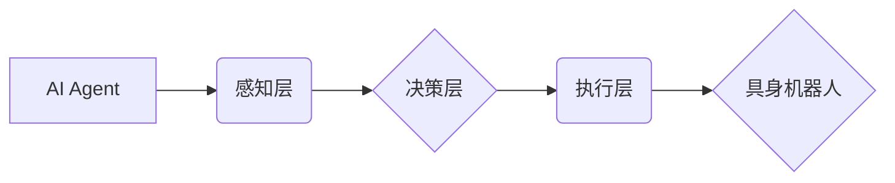

> AI Agent, 具身机器人, 强化学习, 深度学习, 自然语言处理, 人机交互, 计算机视觉, 物理模拟, 决策推理

## 1. 背景介绍

人工智能（AI）技术近年来取得了飞速发展，从语音识别、图像识别到自然语言处理等领域取得了突破性进展。然而，传统的AI模型大多局限于数字世界，缺乏与物理世界直接交互的能力。具身机器人作为AI技术的延伸，将AI与物理世界连接起来，为AI赋予了“身体”，使其能够感知、理解和操作物理环境。

具身机器人是指能够感知环境、自主运动、与环境交互的机器人。它融合了人工智能、机器人技术、控制理论等多学科的知识，具有广泛的应用前景。例如，在医疗领域，具身机器人可以协助医生进行手术、提供康复治疗；在工业领域，具身机器人可以替代人类进行危险、重复性工作；在服务领域，具身机器人可以提供陪伴、服务等功能。

## 2. 核心概念与联系

**2.1 AI Agent**

AI Agent是指能够感知环境、做出决策并采取行动的智能体。它是一个独立的实体，能够根据自身的目标和环境信息进行推理和规划，并通过执行动作来实现目标。

**2.2 具身机器人**

具身机器人是指具有物理实体的机器人，能够感知环境、自主运动、与环境交互。它通过传感器获取环境信息，并通过执行器控制自身运动和操作。

**2.3 核心概念联系**

AI Agent和具身机器人是相互关联的概念。AI Agent可以看作是具身机器人的“大脑”，它负责控制机器人的行为。而具身机器人为AI Agent提供了感知环境、与环境交互的物理平台。

**2.4 架构图**



## 3. 核心算法原理 & 具体操作步骤

**3.1 算法原理概述**

具身机器人的控制算法通常基于强化学习（Reinforcement Learning，RL）和深度学习（Deep Learning，DL）等人工智能技术。

* **强化学习:** 强化学习是一种机器学习方法，通过奖励和惩罚机制来训练智能体，使其在特定环境中学习最优策略。
* **深度学习:** 深度学习是一种基于多层神经网络的机器学习方法，能够学习复杂的数据模式。

**3.2 算法步骤详解**

1. **环境建模:** 建立具身机器人的物理环境模型，包括机器人自身的动力学模型、环境的几何结构和物理属性等。
2. **状态空间定义:** 定义机器人可能的运动状态和环境状态，形成状态空间。
3. **动作空间定义:** 定义机器人可以执行的动作，形成动作空间。
4. **奖励函数设计:** 设计一个奖励函数，根据机器人的行为和环境状态来评估其表现。
5. **强化学习算法训练:** 使用强化学习算法，例如Q-learning、SARSA等，训练AI Agent，使其学习最优策略，即在给定状态下执行最优动作以获得最大的奖励。
6. **动作执行:** AI Agent根据学习到的策略，选择最优动作并执行。
7. **环境反馈:** 环境反馈机器人执行动作的结果，包括新的状态和奖励。
8. **迭代更新:** 根据环境反馈，更新AI Agent的策略，并重复步骤5-7，直到AI Agent的策略收敛。

**3.3 算法优缺点**

* **优点:**
    * 可以学习复杂的行为策略。
    * 可以适应动态变化的环境。
    * 不需要事先定义所有规则和知识。
* **缺点:**
    * 训练过程可能需要大量的时间和数据。
    * 奖励函数的设计非常重要，如果设计不当，可能会导致AI Agent学习到不期望的行为。

**3.4 算法应用领域**

* **机器人控制:** 控制机器人进行自主导航、抓取、操作等任务。
* **游戏AI:** 训练AI Agent在游戏中学习策略，例如玩游戏、打败对手。
* **自动驾驶:** 训练自动驾驶汽车在复杂道路环境中安全驾驶。

## 4. 数学模型和公式 & 详细讲解 & 举例说明

**4.1 数学模型构建**

我们用一个简单的数学模型来描述具身机器人的行为。假设机器人处于一个二维环境中，可以执行四个动作：向上、向下、向左、向右。

* 状态空间：$S = \{s_1, s_2, ..., s_n\}$, 其中$s_i$表示机器人处于第i个位置的状态。
* 动作空间：$A = \{u_1, u_2, u_3, u_4\}$, 其中$u_i$表示第i个动作。
* 奖励函数：$R(s, u)$, 其中$R(s, u)$表示机器人执行动作$u$在状态$s$时的奖励。

**4.2 公式推导过程**

强化学习的目标是找到一个策略$\pi(s)$，使得机器人能够在环境中获得最大的累积奖励。策略$\pi(s)$是一个映射函数，将状态$s$映射到动作$u$。

我们可以使用Bellman方程来更新策略：

$$
V^{\pi}(s) = R(s, \pi(s)) + \gamma \max_{u \in A} V^{\pi}(s')
$$

其中：

* $V^{\pi}(s)$表示在策略$\pi$下，从状态$s$开始的累积奖励。
* $\gamma$是折扣因子，控制未来奖励的权重。
* $s'$是执行动作$u$后到达的状态。

**4.3 案例分析与讲解**

假设我们有一个简单的机器人，它可以移动到一个目标位置。目标位置的奖励为10，其他位置的奖励为0。我们可以使用Q-learning算法来训练机器人学习最优策略。

在训练过程中，机器人会随机执行动作，并根据环境反馈更新Q值表。Q值表是一个存储每个状态-动作对的价值的表格。最终，机器人会学习到一个策略，使得它能够在最短时间内到达目标位置。

## 5. 项目实践：代码实例和详细解释说明

**5.1 开发环境搭建**

* 操作系统：Ubuntu 20.04
* Python 版本：3.8
* 库依赖：OpenAI Gym, TensorFlow, PyTorch

**5.2 源代码详细实现**

```python
import gym
import numpy as np

# 定义环境
env = gym.make('CartPole-v1')

# 定义Q值表
q_table = np.zeros((env.observation_space.n, env.action_space.n))

# 学习参数
alpha = 0.1  # 学习率
gamma = 0.99  # 折扣因子
epsilon = 0.1  # 探索率

# 训练循环
for episode in range(1000):
    state = env.reset()
    done = False

    while not done:
        # 探索与利用
        if np.random.uniform(0, 1) < epsilon:
            action = env.action_space.sample()
        else:
            action = np.argmax(q_table[state])

        # 执行动作
        next_state, reward, done, _ = env.step(action)

        # 更新Q值
        q_table[state, action] = (1 - alpha) * q_table[state, action] + alpha * (reward + gamma * np.max(q_table[next_state]))

        # 更新状态
        state = next_state

    print(f"Episode {episode+1} done")

# 测试
state = env.reset()
while True:
    action = np.argmax(q_table[state])
    state, reward, done, _ = env.step(action)
    env.render()
    if done:
        break
env.close()
```

**5.3 代码解读与分析**

* 代码首先定义了环境和Q值表。
* 然后，使用Q-learning算法训练机器人。
* 训练过程中，机器人会随机执行动作，并根据环境反馈更新Q值表。
* 最后，测试训练好的机器人，使其能够在环境中完成任务。

**5.4 运行结果展示**

运行代码后，机器人将在环境中学习并完成任务。例如，在CartPole-v1环境中，机器人会学习如何平衡杆子。

## 6. 实际应用场景

**6.1 医疗领域**

* **手术机器人:** 协助医生进行微创手术，提高手术精度和安全性。
* **康复机器人:** 为患者提供康复治疗，帮助他们恢复运动能力。
* **护理机器人:** 为老人和病人提供陪伴、护理等服务。

**6.2 工业领域**

* **工业机器人:** 自动化生产线，替代人类进行危险、重复性工作。
* **物流机器人:** 在仓库和物流中心自动搬运货物。
* **维护机器人:** 自动化设备维护和检修。

**6.3 服务领域**

* **陪伴机器人:** 为老人、儿童等提供陪伴和娱乐服务。
* **导游机器人:** 在博物馆、旅游景点等地为游客提供导游服务。
* **客服机器人:** 为客户提供在线咨询和服务。

**6.4 未来应用展望**

随着人工智能和机器人技术的不断发展，具身机器人的应用场景将会更加广泛。未来，具身机器人将能够更加智能化、自主化，并融入到我们的日常生活、工作和学习中。

## 7. 工具和资源推荐

**7.1 学习资源推荐**

* **书籍:**
    * 《Reinforcement Learning: An Introduction》 by Richard S. Sutton and Andrew G. Barto
    * 《Deep Learning》 by Ian Goodfellow, Yoshua Bengio, and Aaron Courville
* **在线课程:**
    * Coursera: Reinforcement Learning Specialization
    * Udacity: Intro to Self-Driving Cars
* **开源项目:**
    * OpenAI Gym: https://gym.openai.com/
    * TensorFlow: https://www.tensorflow.org/
    * PyTorch: https://pytorch.org/

**7.2 开发工具推荐**

* **ROS (Robot Operating System):** https://www.ros.org/
* **Gazebo:** https://gazebosim.org/
* **MoveIt!:** https://moveit.ros.org/

**7.3 相关论文推荐**

* **Deep Reinforcement Learning with Double Q-learning**
* **Proximal Policy Optimization Algorithms**
* **Asynchronous Methods for Deep Reinforcement Learning**

## 8. 总结：未来发展趋势与挑战

**8.1 研究成果总结**

近年来，具身机器人领域取得了显著进展，AI Agent的控制算法不断完善，机器人能够执行更加复杂的任务。

**8.2 未来发展趋势**

* **更智能的AI Agent:** 发展更强大的AI算法，使机器人能够更好地理解环境、做出更智能的决策。
* **更灵活的机器人:** 开发更灵活、更适应复杂环境的机器人，例如具有多关节、多模态感知的机器人。
* **更安全的机器人:** 确保机器人能够安全地与人类交互，并避免潜在的危险。

**8.3 面临的挑战**

* **数据获取和标注:** 训练具身机器人需要大量的真实世界数据，获取和标注这些数据非常困难。
* **模型复杂度:** 具身机器人的控制模型非常复杂，训练和部署这些模型需要强大的计算资源。
* **安全性和可靠性:** 确保机器人能够安全可靠地运行，避免潜在的风险。

**8.4 研究展望**

未来，具身机器人将成为人工智能技术的重要应用领域，并对我们的生活产生深远影响。我们需要继续加强对该领域的研发，克服面临的挑战，推动具身机器人技术的发展。

## 9. 附录：常见问题与解答

**9.1 Q: 具身机器人与传统机器人有什么区别？**

**A