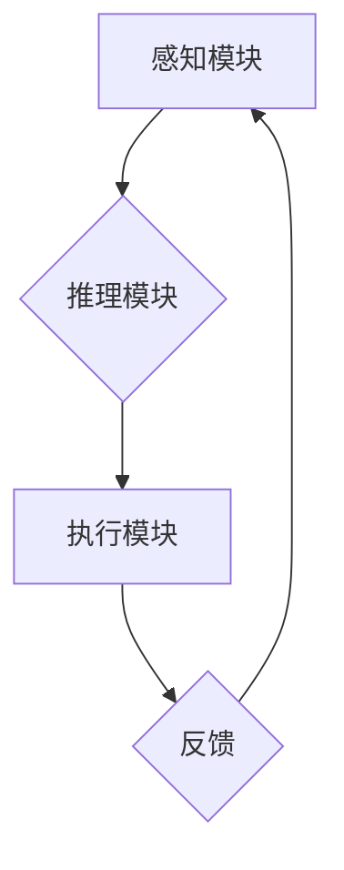

> AI Agent, 智能代理, 生产力提升, 机器学习, 深度学习, 自然语言处理, 流程自动化

## 1. 背景介绍

在当今数字化时代，人工智能（AI）正以惊人的速度发展，深刻地改变着我们生活的方方面面。其中，AI Agent作为人工智能领域的重要分支，凭借其自主学习、决策和执行任务的能力，展现出巨大的潜力，为未来生产力的提升带来了新的机遇。

传统生产模式往往依赖于人工操作和流程，效率低下、成本高昂。而AI Agent能够通过自动化流程、优化决策和提供智能化服务，显著提高生产效率、降低成本，并释放人类潜能，推动生产力跃升。

## 2. 核心概念与联系

**2.1 AI Agent的概念**

AI Agent是一种能够感知环境、做出决策并执行行动的智能系统。它通常由以下几个核心组件组成：

* **感知模块:** 收集环境信息，例如传感器数据、文本、图像等。
* **推理模块:** 分析感知到的信息，做出决策和规划行动。
* **执行模块:** 将决策转化为实际行动，与环境交互。
* **学习模块:** 通过经验积累，不断改进决策和行为策略。

**2.2 AI Agent与生产力提升的联系**

AI Agent能够通过以下方式提升生产力：

* **自动化流程:** AI Agent可以自动执行重复性、规则性任务，例如数据录入、报表生成、客户服务等，解放人力，提高效率。
* **优化决策:** AI Agent可以利用数据分析和机器学习算法，识别模式和趋势，为决策提供数据支持，提高决策的准确性和效率。
* **智能化服务:** AI Agent可以提供个性化、智能化的服务，例如智能客服、个性化推荐、智能助理等，提升用户体验和服务质量。

**2.3 AI Agent的架构**



## 3. 核心算法原理 & 具体操作步骤

**3.1 算法原理概述**

AI Agent的决策和行为策略通常基于以下核心算法：

* **强化学习:** 通过奖励机制，训练AI Agent在特定环境中学习最优策略。
* **机器学习:** 利用数据训练模型，使AI Agent能够识别模式、预测结果和做出决策。
* **深度学习:** 使用多层神经网络，学习更复杂的模式和关系，提高AI Agent的智能化水平。

**3.2 算法步骤详解**

以强化学习为例，其核心步骤如下：

1. **环境建模:** 建立AI Agent所处的环境模型，包括状态空间、动作空间和奖励函数。
2. **策略初始化:** 初始化AI Agent的策略，例如随机策略或贪婪策略。
3. **交互学习:** AI Agent与环境交互，根据当前状态选择动作，并获得奖励反馈。
4. **策略更新:** 根据奖励反馈，更新AI Agent的策略，使其在未来能够获得更高的奖励。
5. **重复步骤3-4:** 持续与环境交互，不断更新策略，直到达到预设的目标或收敛。

**3.3 算法优缺点**

* **优点:** 能够学习复杂环境下的最优策略，适应性强。
* **缺点:** 训练过程需要大量数据和计算资源，收敛速度可能较慢。

**3.4 算法应用领域**

* **机器人控制:** 训练机器人自主导航、避障、抓取等行为。
* **游戏AI:** 开发智能游戏对手，提高游戏体验。
* **推荐系统:** 建立个性化推荐系统，提高用户满意度。

## 4. 数学模型和公式 & 详细讲解 & 举例说明

**4.1 数学模型构建**

强化学习的数学模型通常包括以下几个关键要素：

* **状态空间:** 表示AI Agent可能处于的所有状态。
* **动作空间:** 表示AI Agent可以执行的所有动作。
* **奖励函数:** 将状态和动作映射到奖励值，指导AI Agent的行为决策。
* **价值函数:** 评估状态或状态序列的期望奖励总和。

**4.2 公式推导过程**

强化学习的核心目标是最大化累积奖励。常用的价值函数估计方法包括：

* **Bellman方程:** 描述价值函数与奖励函数和策略之间的关系。

$$
V(s) = \max_{\alpha} \sum_{s' \in S} P(s' | s, \alpha) [r(s, \alpha, s') + \gamma V(s')]
$$

其中：

* $V(s)$: 状态 $s$ 的价值函数。
* $P(s' | s, \alpha)$: 从状态 $s$ 执行动作 $\alpha$ 进入状态 $s'$ 的概率。
* $r(s, \alpha, s')$: 状态 $s$ 执行动作 $\alpha$ 进入状态 $s'$ 的奖励。
* $\gamma$: 折扣因子，控制未来奖励的权重。

**4.3 案例分析与讲解**

例如，训练一个AI Agent玩游戏，其状态空间包括游戏中的所有场景，动作空间包括游戏中的所有操作，奖励函数则根据游戏规则分配奖励，例如获得分数、击杀敌人等。通过Bellman方程和强化学习算法，AI Agent可以学习最优策略，获得更高的游戏分数。

## 5. 项目实践：代码实例和详细解释说明

**5.1 开发环境搭建**

* Python 3.x
* TensorFlow 或 PyTorch 深度学习框架
* OpenAI Gym 游戏环境

**5.2 源代码详细实现**

```python
import gym
import tensorflow as tf

# 定义强化学习模型
class Agent(tf.keras.Model):
    def __init__(self):
        super(Agent, self).__init__()
        # 定义模型结构
        self.dense1 = tf.keras.layers.Dense(64, activation='relu')
        self.dense2 = tf.keras.layers.Dense(32, activation='relu')
        self.output = tf.keras.layers.Dense(env.action_space.n)

    def call(self, state):
        x = self.dense1(state)
        x = self.dense2(x)
        return self.output(x)

# 创建环境和代理
env = gym.make('CartPole-v1')
agent = Agent()

# 训练循环
for episode in range(1000):
    state = env.reset()
    done = False
    while not done:
        # 选择动作
        action = agent(tf.expand_dims(state, axis=0))[0]
        action = tf.argmax(action).numpy()

        # 执行动作并获取奖励
        next_state, reward, done, _ = env.step(action)

        # 更新代理
        # ...

    # 打印进度
    print(f'Episode: {episode}, Reward: {reward}')

# 保存模型
agent.save_weights('cartpole_agent.h5')
```

**5.3 代码解读与分析**

* 代码首先定义了强化学习模型，使用深度神经网络结构。
* 然后创建游戏环境和代理，并开始训练循环。
* 在训练循环中，代理根据当前状态选择动作，执行动作并获取奖励，并根据奖励更新模型参数。
* 最后，保存训练好的模型权重。

**5.4 运行结果展示**

训练完成后，可以加载模型权重，在游戏环境中运行代理，观察其表现。

## 6. 实际应用场景

**6.1 工业自动化:**

AI Agent可以自动控制工业机器人的操作，提高生产效率和产品质量。例如，在汽车制造业中，AI Agent可以自动完成焊接、喷漆等操作，减少人工干预，提高生产效率。

**6.2 金融服务:**

AI Agent可以用于风险管理、欺诈检测、客户服务等领域。例如，AI Agent可以分析市场数据，识别潜在的风险，并采取相应的措施进行风险控制。

**6.3 医疗保健:**

AI Agent可以辅助医生诊断疾病、制定治疗方案、管理患者数据等。例如，AI Agent可以分析患者的病历、影像数据等信息，辅助医生进行诊断，提高诊断准确率。

**6.4 教育培训:**

AI Agent可以提供个性化学习辅导、自动批改作业、评估学生学习进度等服务。例如，AI Agent可以根据学生的学习情况，提供个性化的学习内容和辅导，提高学习效率。

**6.5 未来应用展望**

随着AI技术的不断发展，AI Agent的应用场景将更加广泛，例如：

* **智能家居:** AI Agent可以控制家居设备，实现智能家居的自动化管理。
* **无人驾驶:** AI Agent可以作为无人驾驶汽车的决策系统，实现自动驾驶功能。
* **个性化推荐:** AI Agent可以根据用户的兴趣和偏好，提供个性化的商品、服务和内容推荐。

## 7. 工具和资源推荐

**7.1 学习资源推荐**

* **书籍:**
    * 《Reinforcement Learning: An Introduction》 by Richard S. Sutton and Andrew G. Barto
    * 《Deep Learning》 by Ian Goodfellow, Yoshua Bengio, and Aaron Courville
* **在线课程:**
    * Coursera: Reinforcement Learning Specialization
    * Udacity: Deep Learning Nanodegree

**7.2 开发工具推荐**

* **TensorFlow:** 开源深度学习框架，提供丰富的工具和资源。
* **PyTorch:** 开源深度学习框架，以其灵活性和易用性而闻名。
* **OpenAI Gym:** 游戏环境平台，提供各种标准的强化学习任务。

**7.3 相关论文推荐**

* **Deep Q-Network (DQN):** Mnih et al. (2015)
* **Proximal Policy Optimization (PPO):** Schulman et al. (2017)
* **Trust Region Policy Optimization (TRPO):** Schulman et al. (2015)

## 8. 总结：未来发展趋势与挑战

**8.1 研究成果总结**

近年来，AI Agent领域取得了显著进展，例如：

* 强化学习算法取得了突破性进展，在游戏、机器人控制等领域取得了优异的成绩。
* 深度学习技术应用于AI Agent，提高了其智能化水平。
* 理论研究不断深入，对AI Agent的学习能力、决策机制等方面有了更深入的理解。

**8.2 未来发展趋势**

* **更强大的学习能力:** 研究更强大的强化学习算法，使AI Agent能够学习更复杂的环境和任务。
* **更安全的AI Agent:** 研究确保AI Agent安全可靠的算法和机制，避免其产生不可预知的行为。
* **更广泛的应用场景:** 将AI Agent应用于更多领域，例如医疗保健、教育培训、智能家居等。

**8.3 面临的挑战**

* **数据获取和标注:** 强化学习算法需要大量数据进行训练，数据获取和标注成本较高。
* **算法效率:** 训练复杂AI Agent的算法效率仍然是一个挑战，需要进一步优化算法和硬件资源。
* **伦理问题:** AI Agent的应用引发了伦理问题，例如责任归属、数据隐私等，需要进行深入探讨和规范。

**8.4 研究展望**

未来，AI Agent领域将继续朝着更智能、更安全、更广泛应用的方向发展。研究者将继续探索更强大的学习算法、更安全的控制机制和更广泛的应用场景，推动AI Agent技术的发展，为人类社会带来更多福祉。

## 9. 附录：常见问题与解答

**9.1 如何选择合适的强化学习算法？**

选择合适的强化学习算法取决于具体的应用场景和任务特点。例如，对于离散动作空间的任务，可以使用Q-learning算法；对于连续动作空间的任务，可以使用策略梯度算法。

**9.2 如何解决数据获取和标注问题？**

可以利用模拟环境、迁移学习等技术来解决数据获取和标注问题。

**9.3 如何评估AI Agent的性能？**

常用的评估指标包括奖励总和、成功率、平均时间等。

**9.4 如何确保AI Agent的安全可靠？**

可以通过设计安全的奖励函数、限制AI Agent的行动