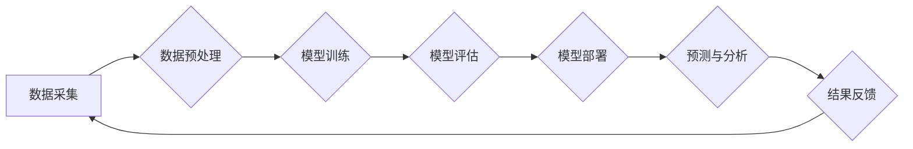

> AI for Science, 生物制药, 药物发现, 虚拟筛选, 机器学习, 深度学习, 自然语言处理

## 1. 背景介绍

生物制药行业一直以来都面临着研发周期长、成本高昂、成功率低等挑战。传统药物发现方法依赖于大量的实验和试错，效率低下，难以满足快速发展的医疗需求。近年来，人工智能（AI）技术突飞猛进，为生物制药领域带来了革命性的变革。AI for Science，即人工智能助力科学研究，正逐渐成为生物制药行业的新引擎，加速药物发现和开发进程。

## 2. 核心概念与联系

**2.1 AI for Science 简介**

AI for Science是指利用人工智能技术，加速和优化科学研究过程的各个环节，包括数据分析、模型构建、实验设计、结果解读等。它涵盖了机器学习、深度学习、自然语言处理等多个人工智能领域，并与生物信息学、化学、药理学等学科紧密结合。

**2.2 AI in Drug Discovery**

在生物制药领域，AI for Science主要应用于药物发现和开发的各个阶段，例如：

* **靶点识别:** 利用机器学习算法分析大规模生物数据，识别潜在的疾病靶点。
* **虚拟筛选:** 利用深度学习模型对化合物库进行虚拟筛选，预测化合物与靶点的结合能力，缩小候选药物范围。
* **药物设计:** 利用人工智能算法优化药物分子结构，提高药物的活性、安全性、生物利用度等。
* **临床试验:** 利用机器学习算法分析临床试验数据，预测药物的疗效和安全性，优化临床试验设计。

**2.3 AI for Science 架构**



## 3. 核心算法原理 & 具体操作步骤

**3.1 算法原理概述**

在AI for Science中，常用的算法包括：

* **机器学习:** 利用算法从数据中学习规律，进行预测和分类。
* **深度学习:** 利用多层神经网络，模拟人类大脑的学习过程，处理复杂数据。
* **自然语言处理:** 利用算法理解和处理自然语言文本，例如分析药物文献、提取关键信息。

**3.2 算法步骤详解**

以机器学习算法为例，其步骤如下：

1. **数据采集:** 收集相关数据，例如药物结构、生物活性、临床试验数据等。
2. **数据预处理:** 对数据进行清洗、转换、特征提取等操作，使其适合算法训练。
3. **模型选择:** 根据任务需求选择合适的机器学习算法，例如线性回归、逻辑回归、支持向量机等。
4. **模型训练:** 利用训练数据训练模型，调整模型参数，使其能够准确预测目标变量。
5. **模型评估:** 利用测试数据评估模型的性能，例如准确率、召回率、F1-score等。
6. **模型部署:** 将训练好的模型部署到实际应用场景中，进行预测和分析。

**3.3 算法优缺点**

* **优点:** 能够从海量数据中发现隐藏规律，提高预测精度，自动化处理任务。
* **缺点:** 需要大量数据进行训练，算法解释性较差，容易受到数据偏差的影响。

**3.4 算法应用领域**

* **药物发现:** 靶点识别、虚拟筛选、药物设计。
* **疾病诊断:** 基于图像、基因、临床数据进行疾病诊断。
* **个性化医疗:** 根据患者基因、生活方式等信息，提供个性化治疗方案。

## 4. 数学模型和公式 & 详细讲解 & 举例说明

**4.1 数学模型构建**

在AI for Science中，常用的数学模型包括：

* **线性回归:** 用于预测连续变量，假设目标变量与输入变量之间存在线性关系。
* **逻辑回归:** 用于预测分类变量，假设目标变量服从伯努利分布。
* **神经网络:** 用于处理复杂数据，模拟人类大脑的学习过程。

**4.2 公式推导过程**

以线性回归为例，其目标是找到最佳的回归系数，使得预测值与真实值之间的误差最小。

* **损失函数:** 均方误差 (MSE)

$$MSE = \frac{1}{n} \sum_{i=1}^{n} (y_i - \hat{y}_i)^2$$

其中：

* $y_i$ 为真实值
* $\hat{y}_i$ 为预测值
* $n$ 为样本数量

* **梯度下降:** 用于优化回归系数，使得损失函数最小化。

$$w = w - \alpha \frac{\partial MSE}{\partial w}$$

其中：

* $w$ 为回归系数
* $\alpha$ 为学习率

**4.3 案例分析与讲解**

假设我们想要预测药物的活性，已知药物的结构特征和活性数据。我们可以使用线性回归模型，将结构特征作为输入变量，活性作为输出变量。通过训练模型，我们可以得到最佳的回归系数，并利用这些系数预测新药物的活性。

## 5. 项目实践：代码实例和详细解释说明

**5.1 开发环境搭建**

* Python 3.x
* TensorFlow/PyTorch
* Jupyter Notebook

**5.2 源代码详细实现**

```python
import tensorflow as tf

# 定义模型
model = tf.keras.Sequential([
    tf.keras.layers.Dense(64, activation='relu', input_shape=(100,)),
    tf.keras.layers.Dense(1)
])

# 编译模型
model.compile(optimizer='adam', loss='mse')

# 训练模型
model.fit(X_train, y_train, epochs=10)

# 预测
predictions = model.predict(X_test)
```

**5.3 代码解读与分析**

* 首先，我们定义了一个简单的深度学习模型，包含两层全连接层。
* 然后，我们使用Adam优化器和均方误差损失函数编译模型。
* 接着，我们使用训练数据训练模型，设置训练轮数为10。
* 最后，我们使用测试数据预测药物活性。

**5.4 运行结果展示**

通过训练和测试，我们可以评估模型的性能，例如预测精度、召回率等。

## 6. 实际应用场景

**6.1 靶点识别**

AI for Science可以分析大量生物数据，例如基因表达谱、蛋白质相互作用网络等，识别潜在的疾病靶点。例如，DeepMind的AlphaFold2可以预测蛋白质结构，帮助科学家识别新的药物靶点。

**6.2 虚拟筛选**

AI for Science可以对化合物库进行虚拟筛选，预测化合物与靶点的结合能力，缩小候选药物范围。例如，Atomwise使用深度学习模型对化合物库进行虚拟筛选，发现了一种治疗埃博拉病毒的候选药物。

**6.3 药物设计**

AI for Science可以优化药物分子结构，提高药物的活性、安全性、生物利用度等。例如，BenevolentAI使用AI技术设计了一种治疗阿尔茨海默病的候选药物。

**6.4 未来应用展望**

* **个性化药物:** 根据患者基因、生活方式等信息，提供个性化治疗方案。
* **疾病预防:** 利用AI技术预测疾病风险，进行早期干预。
* **新药研发加速:** 利用AI技术加速新药研发进程，降低研发成本。

## 7. 工具和资源推荐

**7.1 学习资源推荐**

* **书籍:**
    * Deep Learning by Ian Goodfellow
    * Hands-On Machine Learning with Scikit-Learn, Keras & TensorFlow by Aurélien Géron
* **在线课程:**
    * Coursera: Machine Learning by Andrew Ng
    * Udacity: Deep Learning Nanodegree
* **博客:**
    * Towards Data Science
    * Machine Learning Mastery

**7.2 开发工具推荐**

* **Python:** 
    * TensorFlow
    * PyTorch
    * Scikit-learn
* **云平台:**
    * Google Cloud Platform
    * Amazon Web Services
    * Microsoft Azure

**7.3 相关论文推荐**

* AlphaFold: A solution to a 50-year-old grand challenge in biology
* DeepMind's AlphaFold predicts protein structures with unprecedented accuracy
* Atomwise uses AI to discover new drugs

## 8. 总结：未来发展趋势与挑战

**8.1 研究成果总结**

AI for Science在生物制药领域取得了显著成果，加速了药物发现和开发进程，为人类健康带来了新的希望。

**8.2 未来发展趋势**

* **模型复杂度提升:** 开发更复杂、更强大的AI模型，例如Transformer、Generative Adversarial Networks (GANs)等。
* **数据规模扩大:** 收集和整合更多生物数据，例如基因组数据、蛋白质组数据、临床试验数据等。
* **跨学科融合:** 加强AI与生物学、化学、药理学等学科的融合，开发更精准、更有效的AI解决方案。

**8.3 面临的挑战**

* **数据质量:** 生物数据往往存在噪声、缺失值等问题，需要进行有效的数据清洗和预处理。
* **算法解释性:** 许多AI算法的决策过程难以解释，需要开发更可解释的AI模型。
* **伦理问题:** AI for Science的应用需要考虑伦理问题，例如数据隐私、算法偏见等。

**8.4 研究展望**

未来，AI for Science将继续推动生物制药行业的变革，为人类健康带来更多福祉。


## 9. 附录：常见问题与解答

**9.1 如何选择合适的AI算法？**

选择合适的AI算法取决于具体的应用场景和数据特点。例如，对于预测连续变量，可以使用线性回归或神经网络；对于分类问题，可以使用逻辑回归或支持向量机。

**9.2 如何处理生物数据的噪声和缺失值？**

可以使用数据清洗和预处理技术处理生物数据的噪声和缺失值。例如，可以使用均值填充、插值法等方法处理缺失值；可以使用滑动窗口、中值滤波等方法处理噪声。

**9.3 如何评估AI模型的性能？**

可以使用多种指标评估AI模型的性能，例如准确率、召回率、F1-score、AUC等。

**9.4 AI for Science有哪些伦理问题？**

AI for Science的应用需要考虑伦理问题，例如数据隐私、算法偏见、责任归属等。

作者：禅与计算机程序设计艺术 / Zen and the Art of Computer Programming 


<end_of_turn>