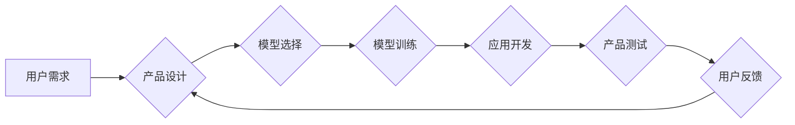

> AI 大模型、AI-native 应用、Product-Model-Fit、模型训练、应用开发、技术趋势

## 1. 背景介绍

近年来，人工智能（AI）技术取得了飞速发展，特别是大规模语言模型（LLM）的出现，如 GPT-3、LaMDA 等，为 AI 应用带来了前所未有的机遇。这些模型拥有强大的文本生成、理解和翻译能力，能够处理复杂的任务，并与人类进行自然流畅的对话。

随着 AI 技术的进步，越来越多的应用开始拥抱 AI，并将其作为核心功能。这些应用被称为 AI-native 应用，它们天生就与 AI 模型紧密结合，并依赖于模型的强大能力来提供独特的功能和体验。

然而，仅仅拥有强大的 AI 模型并不能保证应用的成功。开发出真正优秀的 AI-native 应用，需要考虑多个因素，其中一个关键因素是 Product-Model-Fit（产品模型契合度）。

## 2. 核心概念与联系

Product-Model-Fit 指的是 AI 应用产品设计与 AI 模型能力之间的契合度。简单来说，就是 AI 模型的优势能够充分发挥，并为用户带来实际价值。

**2.1  产品设计**

产品设计是 AI-native 应用的核心，它需要考虑用户需求、使用场景、交互方式等多个方面。

* **用户需求:** 首先要明确用户想要解决什么问题，以及他们希望通过 AI 应用获得什么价值。
* **使用场景:** 不同的使用场景需要不同的产品设计。例如，聊天机器人需要注重自然语言交互，而图像识别应用则需要注重准确性和效率。
* **交互方式:** 用户与 AI 应用的交互方式可以是文本、语音、图像等多种形式。

**2.2  模型能力**

AI 模型的能力决定了 AI-native 应用的功能和性能。

* **模型类型:** 不同的 AI 模型擅长不同的任务，例如文本生成、图像识别、语音识别等。
* **模型精度:** 模型的精度直接影响应用的准确性和可靠性。
* **模型效率:** 模型的效率决定了应用的响应速度和资源消耗。

**2.3  Product-Model-Fit 的重要性**

Product-Model-Fit 是 AI-native 应用成功的关键因素。

* **提升用户体验:** 当产品设计与模型能力契合时，用户可以获得更流畅、更便捷、更智能的体验。
* **提高应用价值:** 当模型能力能够充分发挥时，应用可以提供更强大的功能和更高的价值。
* **降低开发成本:** 当产品设计与模型能力契合时，开发团队可以更有效地利用模型能力，降低开发成本。

**2.4  Mermaid 流程图**



## 3. 核心算法原理 & 具体操作步骤

### 3.1  算法原理概述

在 AI-native 应用中，常用的算法包括：

* **自然语言处理 (NLP):** 用于处理文本数据，例如文本分类、情感分析、机器翻译等。
* **计算机视觉 (CV):** 用于处理图像数据，例如图像识别、物体检测、图像分割等。
* **语音识别 (ASR):** 用于将语音转换为文本。
* **语音合成 (TTS):** 用于将文本转换为语音。

这些算法通常基于深度学习技术，利用大量的训练数据来学习模型参数，从而实现对数据的理解和处理。

### 3.2  算法步骤详解

以文本分类为例，详细说明算法步骤：

1. **数据预处理:** 将文本数据清洗、格式化，例如去除停用词、分词等。
2. **特征提取:** 将文本数据转换为模型可以理解的特征，例如词向量、TF-IDF 等。
3. **模型训练:** 使用训练数据训练分类模型，例如逻辑回归、支持向量机、深度神经网络等。
4. **模型评估:** 使用测试数据评估模型的性能，例如准确率、召回率、F1-score 等。
5. **模型部署:** 将训练好的模型部署到应用中，用于对新文本进行分类。

### 3.3  算法优缺点

不同的算法具有不同的优缺点，需要根据具体应用场景选择合适的算法。

* **逻辑回归:** 算法简单易懂，训练速度快，但对数据线性关系要求较高。
* **支持向量机:** 能够处理高维数据，对非线性关系也有较好的处理能力，但训练时间较长。
* **深度神经网络:** 能够学习更复杂的特征，性能优异，但训练数据量大，训练时间长，容易过拟合。

### 3.4  算法应用领域

AI 算法广泛应用于各个领域，例如：

* **搜索引擎:** 用于文本分类、关键词提取、排名排序等。
* **电商平台:** 用于商品推荐、用户画像、欺诈检测等。
* **医疗保健:** 用于疾病诊断、药物研发、患者管理等。
* **金融服务:** 用于风险评估、欺诈检测、客户服务等。

## 4. 数学模型和公式 & 详细讲解 & 举例说明

### 4.1  数学模型构建

在 AI-native 应用中，常用的数学模型包括：

* **线性回归:** 用于预测连续值，模型公式为：

$$y = w_0 + w_1x_1 + w_2x_2 + ... + w_nx_n$$

其中，$y$ 是预测值，$w_0, w_1, ..., w_n$ 是模型参数，$x_1, x_2, ..., x_n$ 是输入特征。

* **逻辑回归:** 用于预测分类结果，模型公式为：

$$p(y=1|x) = \frac{1}{1 + e^{-(w_0 + w_1x_1 + w_2x_2 + ... + w_nx_n)}}$$

其中，$p(y=1|x)$ 是预测类别为 1 的概率，$w_0, w_1, ..., w_n$ 是模型参数，$x_1, x_2, ..., x_n$ 是输入特征。

### 4.2  公式推导过程

例如，线性回归模型的损失函数为均方误差，公式为：

$$Loss = \frac{1}{n}\sum_{i=1}^{n}(y_i - \hat{y}_i)^2$$

其中，$n$ 是样本数量，$y_i$ 是真实值，$\hat{y}_i$ 是预测值。

通过梯度下降算法，可以迭代更新模型参数，使得损失函数最小化。

### 4.3  案例分析与讲解

例如，在电商平台中，可以使用线性回归模型预测用户购买商品的概率。

* 输入特征：用户年龄、性别、购买历史等。
* 预测值：用户购买商品的概率。

通过训练模型，可以得到用户购买商品的概率预测，从而为用户推荐更合适的商品。

## 5. 项目实践：代码实例和详细解释说明

### 5.1  开发环境搭建

* Python 3.x
* TensorFlow 或 PyTorch 等深度学习框架
* Jupyter Notebook 或 VS Code 等开发工具

### 5.2  源代码详细实现

```python
import tensorflow as tf

# 定义模型
model = tf.keras.models.Sequential([
    tf.keras.layers.Dense(64, activation='relu', input_shape=(10,)),
    tf.keras.layers.Dense(1, activation='sigmoid')
])

# 编译模型
model.compile(optimizer='adam', loss='binary_crossentropy', metrics=['accuracy'])

# 训练模型
model.fit(x_train, y_train, epochs=10)

# 评估模型
loss, accuracy = model.evaluate(x_test, y_test)
print('Loss:', loss)
print('Accuracy:', accuracy)
```

### 5.3  代码解读与分析

* 首先，定义一个简单的深度神经网络模型，包含两层全连接层。
* 然后，使用 Adam 优化器、二分类交叉熵损失函数和准确率作为评估指标，编译模型。
* 接着，使用训练数据训练模型，设置训练轮数为 10。
* 最后，使用测试数据评估模型的性能，打印损失和准确率。

### 5.4  运行结果展示

运行代码后，可以得到模型的训练过程和评估结果，例如：

```
Epoch 1/10
...
Loss: 0.25
Accuracy: 0.88
```

## 6. 实际应用场景

### 6.1  聊天机器人

AI-native 应用可以构建智能聊天机器人，能够与用户进行自然流畅的对话，提供个性化的服务。

### 6.2  智能客服

AI-native 应用可以构建智能客服系统，自动处理用户咨询，提高客服效率。

### 6.3  个性化推荐

AI-native 应用可以利用用户行为数据，进行个性化商品、内容或服务的推荐。

### 6.4  未来应用展望

AI-native 应用的未来应用场景非常广泛，例如：

* **教育:** 智能辅导系统、个性化学习方案。
* **医疗保健:** 辅助诊断、远程医疗、个性化治疗方案。
* **金融服务:** 风险评估、欺诈检测、智能理财。
* **交通运输:** 自动驾驶、智能交通管理。

## 7. 工具和资源推荐

### 7.1  学习资源推荐

* **在线课程:** Coursera、edX、Udacity 等平台提供丰富的 AI 课程。
* **书籍:** 《深度学习》、《机器学习实战》等经典书籍。
* **博客:** TensorFlow、PyTorch 等框架官方博客。

### 7.2  开发工具推荐

* **深度学习框架:** TensorFlow、PyTorch、Keras 等。
* **云平台:** AWS、Azure、Google Cloud 等提供 AI 开发平台和服务。
* **IDE:** Jupyter Notebook、VS Code 等。

### 7.3  相关论文推荐

* **Attention Is All You Need:** https://arxiv.org/abs/1706.03762
* **BERT: Pre-training of Deep Bidirectional Transformers for Language Understanding:** https://arxiv.org/abs/1810.04805

## 8. 总结：未来发展趋势与挑战

### 8.1  研究成果总结

近年来，AI 技术取得了飞速发展，特别是大规模语言模型的出现，为 AI 应用带来了前所未有的机遇。

### 8.2  未来发展趋势

* **模型规模和能力的提升:** 未来，AI 模型的规模和能力将会继续提升，能够处理更复杂的任务，提供更智能的体验。
* **模型训练效率的提高:** 研究人员将继续探索更有效的模型训练方法，降低训练成本和时间。
* **模型解释性和可解释性的增强:** 如何更好地理解和解释 AI 模型的决策过程，是未来研究的重要方向。
* **AI 伦理和安全问题:** 随着 AI 技术的应用越来越广泛，AI 伦理和安全问题也越来越重要，需要引起全社会的重视。

### 8.3  面临的挑战

* **数据获取和隐私保护:** AI 模型的训练需要大量数据，如何获取高质量数据，并保护用户隐私，是重要的挑战。
* **模型可解释性和信任度:** 如何提高 AI 模型的可解释性和信任度，让用户能够理解和信任 AI 的决策，也是重要的挑战。
* **算法公平性和偏见:** AI 模型可能存在算法公平性和偏见问题，需要研究如何构建公平、公正的 AI 系统。

### 8.4  研究展望

未来，AI 技术将继续发展，并对我们的生活产生更深远的影响。我们需要积极探索 AI 的应用潜力，同时也要关注 AI 带来的挑战，努力构建一个更加智能、公平、安全的未来。

## 9.