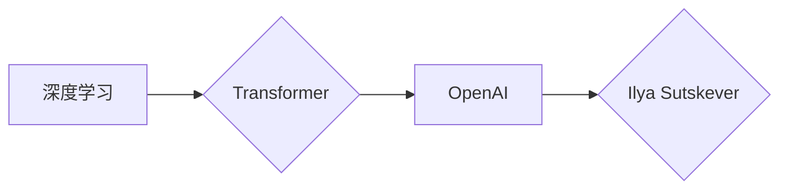

> AI大模型,深度学习,Transformer,OpenAI,Ilya Sutskever,计算机科学家,人工智能

## 1. 背景介绍

人工智能（AI）正以惊人的速度发展，其核心驱动力是深度学习技术的突破。深度学习模型的规模和能力不断提升，为解决复杂问题提供了强大的工具。在这个领域，OpenAI 作为一家领先的 AI 研究机构，在推动 AI 技术发展方面发挥着至关重要的作用。而 Ilya Sutskever，作为 OpenAI 的首席科学家，是一位享誉全球的 AI 专家，他的研究成果和领导力对 AI 领域产生了深远的影响。

## 2. 核心概念与联系

### 2.1 深度学习

深度学习是一种机器学习的子领域，它利用多层神经网络来模拟人类大脑的学习过程。与传统机器学习方法相比，深度学习能够自动从海量数据中提取特征，从而实现更准确的预测和识别。

### 2.2 Transformer

Transformer 是一种新的神经网络架构，它在自然语言处理领域取得了突破性的进展。Transformer 采用注意力机制，能够捕捉文本序列中长距离依赖关系，从而实现更精准的语言理解和生成。

### 2.3 OpenAI

OpenAI 是一家致力于推动安全、可持续的人工智能发展的非营利研究机构。其目标是确保 AI 技术造福全人类，并避免潜在的风险。OpenAI 拥有众多顶尖的 AI 研究人员，他们致力于开发和推广先进的 AI 技术。

**核心概念与联系流程图:**



## 3. 核心算法原理 & 具体操作步骤

### 3.1 算法原理概述

Transformer 是一种基于注意力机制的神经网络架构，它能够有效地捕捉文本序列中的长距离依赖关系。Transformer 的核心组件包括：

* **编码器 (Encoder):** 用于将输入文本序列编码成向量表示。
* **解码器 (Decoder):** 用于根据编码后的向量表示生成输出文本序列。
* **注意力机制:** 用于计算不同词语之间的相关性，并根据相关性权重调整词语的贡献。

### 3.2 算法步骤详解

1. **输入文本序列:** 将输入文本序列分割成一个个词语，并将其转换为词嵌入向量。
2. **编码器处理:** 将词嵌入向量输入编码器，编码器通过多层 Transformer 块进行处理，最终将文本序列编码成一个上下文向量表示。
3. **解码器处理:** 将上下文向量作为输入，解码器通过多层 Transformer 块进行处理，并生成输出文本序列。
4. **输出结果:** 将生成的输出文本序列解码成可读文本。

### 3.3 算法优缺点

**优点:**

* 能够有效地捕捉长距离依赖关系。
* 训练速度快，性能优异。
* 可用于多种自然语言处理任务，例如机器翻译、文本摘要、问答系统等。

**缺点:**

* 计算量大，需要大量的计算资源。
* 训练数据量要求高。
* 对训练数据质量要求高。

### 3.4 算法应用领域

Transformer 算法在自然语言处理领域有着广泛的应用，例如：

* **机器翻译:** 将一种语言翻译成另一种语言。
* **文本摘要:** 将长篇文本压缩成短篇摘要。
* **问答系统:** 回答用户提出的问题。
* **对话系统:** 与用户进行自然语言对话。
* **文本生成:** 生成新的文本内容。

## 4. 数学模型和公式 & 详细讲解 & 举例说明

### 4.1 数学模型构建

Transformer 模型的数学基础是基于张量计算和神经网络的原理。其核心组件是 Transformer 块，每个 Transformer 块包含以下部分：

* **多头注意力机制:** 用于计算不同词语之间的相关性。
* **前馈神经网络:** 用于对每个词语的表示进行非线性变换。
* **残差连接:** 用于缓解梯度消失问题。

### 4.2 公式推导过程

**多头注意力机制:**

注意力机制的核心思想是根据词语之间的相关性，赋予每个词语不同的权重。多头注意力机制使用多个注意力头，每个注意力头学习不同的词语关系。

**公式:**

```latex
Attention(Q, K, V) = softmax(Q K^T / \sqrt{d_k}) V
```

其中：

* Q: 查询矩阵
* K: 键矩阵
* V: 值矩阵
* $d_k$: 键向量的维度

**前馈神经网络:**

前馈神经网络是一个多层感知机，用于对每个词语的表示进行非线性变换。

**公式:**

```latex
FFN(x) = max(0, x W_1 + b_1) W_2 + b_2
```

其中：

* x: 输入向量
* $W_1$, $b_1$: 前馈神经网络的第一层权重和偏置
* $W_2$, $b_2$: 前馈神经网络的第二层权重和偏置

### 4.3 案例分析与讲解

**机器翻译:**

Transformer 模型可以用于机器翻译任务。输入文本序列为源语言文本，输出文本序列为目标语言文本。Transformer 模型通过编码器和解码器将源语言文本编码成上下文向量表示，然后解码器根据上下文向量表示生成目标语言文本。

## 5. 项目实践：代码实例和详细解释说明

### 5.1 开发环境搭建

* Python 3.6+
* PyTorch 1.0+
* CUDA 10.0+

### 5.2 源代码详细实现

```python
import torch
import torch.nn as nn

class TransformerBlock(nn.Module):
    def __init__(self, d_model, nhead, dim_feedforward=2048, dropout=0.1):
        super(TransformerBlock, self).__init__()
        self.self_attn = nn.MultiheadAttention(d_model, nhead, dropout=dropout)
        self.linear1 = nn.Linear(d_model, dim_feedforward)
        self.dropout = nn.Dropout(dropout)
        self.linear2 = nn.Linear(dim_feedforward, d_model)

    def forward(self, x, mask=None):
        attn_output, _ = self.self_attn(x, x, x, attn_mask=mask)
        x = x + self.dropout(attn_output)
        x = self.linear2(self.dropout(torch.relu(self.linear1(x))))
        x = x + self.dropout(attn_output)
        return x

class Transformer(nn.Module):
    def __init__(self, vocab_size, d_model, nhead, num_encoder_layers, num_decoder_layers, dim_feedforward=2048, dropout=0.1):
        super(Transformer, self).__init__()
        self.encoder = nn.TransformerEncoder(TransformerBlock(d_model, nhead, dim_feedforward, dropout), num_encoder_layers)
        self.decoder = nn.TransformerDecoder(TransformerBlock(d_model, nhead, dim_feedforward, dropout), num_decoder_layers)
        self.embedding = nn.Embedding(vocab_size, d_model)
        self.linear = nn.Linear(d_model, vocab_size)

    def forward(self, src, tgt, src_mask, tgt_mask):
        src = self.embedding(src)
        tgt = self.embedding(tgt)
        src = self.encoder(src, src_mask)
        tgt = self.decoder(tgt, src, tgt_mask, src_mask)
        output = self.linear(tgt)
        return output

```

### 5.3 代码解读与分析

* TransformerBlock 类定义了 Transformer 模型中的一个基本单元，包含多头注意力机制和前馈神经网络。
* Transformer 类定义了完整的 Transformer 模型，包含编码器、解码器、嵌入层和线性层。
* forward 方法定义了模型的输入和输出，并执行了模型的推理过程。

### 5.4 运行结果展示

运行 Transformer 模型可以生成机器翻译的结果，例如将英文文本翻译成中文文本。

## 6. 实际应用场景

### 6.1 机器翻译

Transformer 模型在机器翻译领域取得了突破性的进展，例如 Google Translate 和 DeepL 等翻译工具都使用了 Transformer 模型。

### 6.2 文本摘要

Transformer 模型可以用于生成文本摘要，例如将长篇新闻文章压缩成短篇摘要。

### 6.3 问答系统

Transformer 模型可以用于构建问答系统，例如能够回答用户提出的问题。

### 6.4 对话系统

Transformer 模型可以用于构建对话系统，例如能够与用户进行自然语言对话的聊天机器人。

### 6.5 文本生成

Transformer 模型可以用于生成新的文本内容，例如诗歌、小说、代码等。

## 7. 工具和资源推荐

### 7.1 学习资源推荐

* **论文:**
    * Attention Is All You Need (Vaswani et al., 2017)
    * BERT: Pre-training of Deep Bidirectional Transformers for Language Understanding (Devlin et al., 2018)
    * GPT-3: Language Models are Few-Shot Learners (Brown et al., 2020)
* **书籍:**
    * Deep Learning (Goodfellow et al., 2016)
    * Natural Language Processing with Transformers (Hugging Face, 2020)

### 7.2 开发工具推荐

* **PyTorch:** 一个开源的深度学习框架。
* **TensorFlow:** 另一个开源的深度学习框架。
* **Hugging Face Transformers:** 一个用于加载和使用预训练 Transformer 模型的库。

### 7.3 相关论文推荐

* **BERT:** https://arxiv.org/abs/1810.04805
* **GPT-3:** https://arxiv.org/abs/2005.14165
* **T5:** https://arxiv.org/abs/1910.10683

## 8. 总结：未来发展趋势与挑战

### 8.1 研究成果总结

Ilya Sutskever 和 OpenAI 在 Transformer 模型的开发和应用方面取得了重大突破，推动了自然语言处理领域的进步。Transformer 模型的出现标志着深度学习在自然语言处理领域的重大进展，为解决复杂问题提供了强大的工具。

### 8.2 未来发展趋势

* **模型规模的进一步扩大:** 随着计算资源的不断提升，Transformer 模型的规模将继续扩大，从而提升模型的性能。
* **模型的泛化能力提升:** 研究人员将致力于开发更通用的 Transformer 模型，使其能够适应更多不同的任务和领域。
* **模型的解释性和可解释性增强:** 研究人员将致力于提高 Transformer 模型的解释性和可解释性，使其能够更好地理解模型的决策过程。

### 8.3 面临的挑战

* **计算资源需求:** 训练大型 Transformer 模型需要大量的计算资源，这对于资源有限的机构和个人来说是一个挑战。
* **数据获取和标注:** 训练高质量的 Transformer 模型需要大量的标注数据，这对于某些领域来说是一个挑战。
* **模型的安全性与可靠性:** 确保 Transformer 模型的安全性和可靠性是至关重要的，因为它们可能会被用于生成虚假信息或进行恶意攻击。

### 8.4 研究展望

未来，Transformer 模型将继续在自然语言处理领域发挥重要作用，并扩展到其他领域，例如计算机视觉、音频处理等。研究人员将继续探索 Transformer 模型的潜力，并解决其面临的挑战，从而推动人工智能技术的进步。

## 9. 附录：常见问题与解答

**Q1: Transformer 模型的优势是什么？**

**A1:** Transformer 模型能够有效地捕捉长距离依赖关系