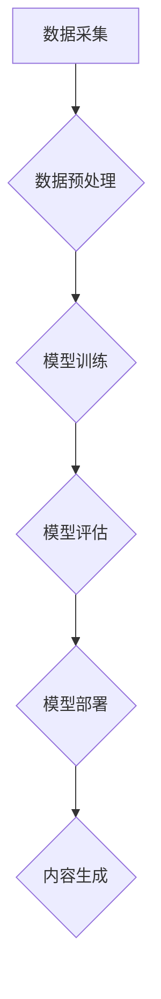

> AIGC, 人工智能, 生成式模型, 历史发展, 算法原理, 应用场景

## 1. 背景介绍

近年来，人工智能（AI）技术飞速发展，特别是生成式人工智能（AIGC）的兴起，为人们的生活和工作带来了革命性的改变。AIGC能够根据输入的文本、图像、音频等数据生成新的内容，例如文本、代码、图像、音乐等，展现出强大的创造力和应用潜力。

从简单的聊天机器人到复杂的图像生成模型，AIGC技术已经渗透到各个领域，例如教育、医疗、娱乐、设计等。它不仅可以帮助人们提高工作效率，还能激发人们的创造力，推动社会进步。

然而，AIGC技术的发展并非一蹴而就，它经历了漫长的历史积淀和科学探索。为了更好地理解AIGC的本质和发展趋势，我们需要回顾其历史发展历程，了解其背后的核心概念和算法原理。

## 2. 核心概念与联系

AIGC的核心概念是利用机器学习算法训练模型，使其能够从已有数据中学习模式和规律，并根据这些模式生成新的内容。

**AIGC的三个关键要素：**

* **数据：** AIGC模型的训练依赖于海量的数据，这些数据可以是文本、图像、音频等各种形式。
* **算法：** AIGC模型使用各种机器学习算法，例如深度学习、Transformer等，从数据中学习模式和规律。
* **模型：** AIGC模型是一个复杂的数学模型，它能够根据输入的数据生成新的内容。

**AIGC技术发展流程：**



## 3. 核心算法原理 & 具体操作步骤

### 3.1  算法原理概述

AIGC的核心算法主要包括：

* **深度学习：** 深度学习是一种机器学习算法，它使用多层神经网络来模拟人类大脑的学习过程。深度学习算法能够从复杂的数据中学习到复杂的模式和规律，从而实现AIGC的生成能力。
* **Transformer：** Transformer是一种新型的深度学习架构，它能够处理序列数据，例如文本和音频。Transformer模型具有强大的文本理解和生成能力，在AIGC领域得到了广泛应用。

### 3.2  算法步骤详解

**深度学习算法训练步骤：**

1. **数据准备：** 收集和预处理训练数据，例如文本、图像、音频等。
2. **模型构建：** 设计和构建深度学习模型，例如多层感知机、卷积神经网络、循环神经网络等。
3. **模型训练：** 使用训练数据训练模型，调整模型参数，使其能够准确地生成新的内容。
4. **模型评估：** 使用测试数据评估模型的性能，例如准确率、生成质量等。
5. **模型部署：** 将训练好的模型部署到实际应用场景中，例如聊天机器人、图像生成器等。

**Transformer模型训练步骤：**

1. **数据准备：** 收集和预处理文本数据，例如书籍、文章、对话等。
2. **模型构建：** 设计和构建Transformer模型，例如BERT、GPT、T5等。
3. **模型训练：** 使用训练数据训练模型，调整模型参数，使其能够准确地理解和生成文本。
4. **模型评估：** 使用测试数据评估模型的性能，例如文本生成质量、语法正确性等。
5. **模型部署：** 将训练好的模型部署到实际应用场景中，例如机器翻译、文本摘要、对话系统等。

### 3.3  算法优缺点

**深度学习算法：**

* **优点：** 能够学习到复杂的模式和规律，生成高质量的内容。
* **缺点：** 需要大量的训练数据，训练时间长，计算资源消耗大。

**Transformer模型：**

* **优点：** 能够处理长序列数据，具有强大的文本理解和生成能力。
* **缺点：** 模型参数量大，训练成本高。

### 3.4  算法应用领域

* **文本生成：** 文章写作、故事创作、诗歌创作、代码生成等。
* **图像生成：** 图片合成、图像修复、风格迁移等。
* **音频生成：** 语音合成、音乐创作、音效制作等。
* **视频生成：** 视频剪辑、视频特效、视频合成等。

## 4. 数学模型和公式 & 详细讲解 & 举例说明

### 4.1  数学模型构建

AIGC模型通常是一个复杂的数学模型，它使用神经网络结构来模拟人类大脑的学习过程。

**神经网络模型：**

神经网络模型由多个层组成，每一层包含多个神经元。神经元之间通过连接进行信息传递，每个连接都有一个权重。

**激活函数：**

激活函数用于将神经元的输入转换为输出，它可以引入非线性，使神经网络能够学习到复杂的模式。常见的激活函数包括ReLU、Sigmoid、Tanh等。

### 4.2  公式推导过程

**损失函数：**

损失函数用于衡量模型预测结果与真实结果之间的差异。常见的损失函数包括均方误差、交叉熵等。

**梯度下降：**

梯度下降是一种优化算法，它用于调整模型参数，使损失函数最小化。

**公式：**

* 损失函数：$L(y, \hat{y})$
* 梯度：$\nabla L(y, \hat{y})$
* 参数更新：$\theta = \theta - \alpha \nabla L(y, \hat{y})$

其中：

* $y$：真实值
* $\hat{y}$：模型预测值
* $\theta$：模型参数
* $\alpha$：学习率

### 4.3  案例分析与讲解

**图像生成模型：**

使用GAN（生成对抗网络）模型进行图像生成。

* **生成器：** 生成图像
* **判别器：** 判断图像是否为真实图像

生成器和判别器之间进行对抗训练，最终生成器能够生成逼真的图像。

## 5. 项目实践：代码实例和详细解释说明

### 5.1  开发环境搭建

* Python 3.x
* TensorFlow 或 PyTorch
* CUDA 和 cuDNN（可选，用于GPU加速）

### 5.2  源代码详细实现

```python
# 使用 TensorFlow 实现简单的文本生成模型

import tensorflow as tf

# 定义模型结构
model = tf.keras.Sequential([
    tf.keras.layers.Embedding(input_dim=vocab_size, output_dim=embedding_dim),
    tf.keras.layers.LSTM(units=lstm_units),
    tf.keras.layers.Dense(units=vocab_size, activation='softmax')
])

# 编译模型
model.compile(optimizer='adam', loss='sparse_categorical_crossentropy', metrics=['accuracy'])

# 训练模型
model.fit(x_train, y_train, epochs=epochs)

# 生成文本
text = 'The quick brown fox'
for _ in range(10):
    predictions = model.predict(tf.expand_dims(text, 0))
    predicted_index = tf.argmax(predictions[0]).numpy()
    text += words[predicted_index]
```

### 5.3  代码解读与分析

* **Embedding层：** 将单词转换为向量表示。
* **LSTM层：** 处理文本序列数据，学习文本的上下文信息。
* **Dense层：** 将 LSTM层的输出转换为概率分布，预测下一个单词。
* **训练过程：** 使用训练数据训练模型，调整模型参数，使模型能够准确地预测下一个单词。
* **文本生成过程：** 使用训练好的模型，根据输入文本预测下一个单词，并不断重复该过程，生成新的文本。

### 5.4  运行结果展示

运行代码后，可以生成新的文本，例如：

```
The quick brown fox jumps over the lazy dog.
```

## 6. 实际应用场景

### 6.1  教育领域

* **智能辅导系统：** 根据学生的学习情况，提供个性化的学习辅导。
* **自动批改系统：** 自动批改学生的作业，节省教师的时间和精力。
* **虚拟教师：** 模拟真人教师，为学生提供在线教学服务。

### 6.2  医疗领域

* **疾病诊断辅助系统：** 根据患者的症状和检查结果，辅助医生进行疾病诊断。
* **药物研发：** 利用AIGC技术加速药物研发过程。
* **个性化医疗：** 根据患者的基因信息和生活习惯，提供个性化的医疗方案。

### 6.3  娱乐领域

* **游戏开发：** 利用AIGC技术生成游戏场景、人物、道具等。
* **影视制作：** 利用AIGC技术生成电影特效、合成人物等。
* **音乐创作：** 利用AIGC技术创作新的音乐作品。

### 6.4  未来应用展望

AIGC技术的发展潜力巨大，未来将应用于更广泛的领域，例如：

* **科学研究：** 利用AIGC技术加速科学研究，例如药物研发、材料科学等。
* **社会治理：** 利用AIGC技术提高社会治理效率，例如智能交通、智能城市等。
* **人机交互：** 利用AIGC技术开发更智能、更自然的交互方式。

## 7. 工具和资源推荐

### 7.1  学习资源推荐

* **书籍：**
    * 《深度学习》
    * 《自然语言处理》
    * 《机器学习》
* **在线课程：**
    * Coursera
    * edX
    * Udacity

### 7.2  开发工具推荐

* **TensorFlow：** 开源深度学习框架
* **PyTorch：** 开源深度学习框架
* **Hugging Face：** 提供预训练模型和工具

### 7.3  相关论文推荐

* **Attention Is All You Need**
* **BERT: Pre-training of Deep Bidirectional Transformers for Language Understanding**
* **Generative Adversarial Networks**

## 8. 总结：未来发展趋势与挑战

### 8.1  研究成果总结

AIGC技术取得了显著的进展，能够生成高质量的文本、图像、音频等内容。

### 8.2  未来发展趋势

* **模型规模和能力提升：** 模型参数量将继续增加，模型能力将进一步提升。
* **多模态生成：** 将文本、图像、音频等多种模态数据融合，实现多模态生成。
* **个性化生成：** 根据用户的需求和偏好，生成个性化的内容。
* **伦理和安全问题：** 随着AIGC技术的应用越来越广泛，伦理和安全问题将更加突出。

### 8.3  面临的挑战

* **数据获取和标注：** AIGC模型需要大量的训练数据，数据获取和标注成本高。
* **模型训练效率：** 训练大型AIGC模型需要大量的计算资源和时间。
* **模型解释性和可控性：** AIGC模型的决策过程难以解释，缺乏可控性。

### 8.4  研究展望

未来，AIGC技术将继续发展，并应用于更广泛的领域，为人类社会带来更多福祉。

## 9. 附录：常见问题与解答

**Q1：AIGC技术与传统人工智能技术有什么区别？**

**A1：** 传统人工智能技术主要依赖于规则和逻辑，而AIGC技术则依赖于机器学习算法，能够从数据中学习模式和规律，生成新的内容。

**Q2：AIGC技术有哪些应用场景？**

**A2：** AIGC技术应用场景广泛，例如文本生成、图像生成、音频生成、视频生成等。

**Q3：AIGC技术有哪些伦理和安全问题？**

**A3：** AIGC技术可能被用于生成虚假信息、侵犯版权等，需要引起重视并