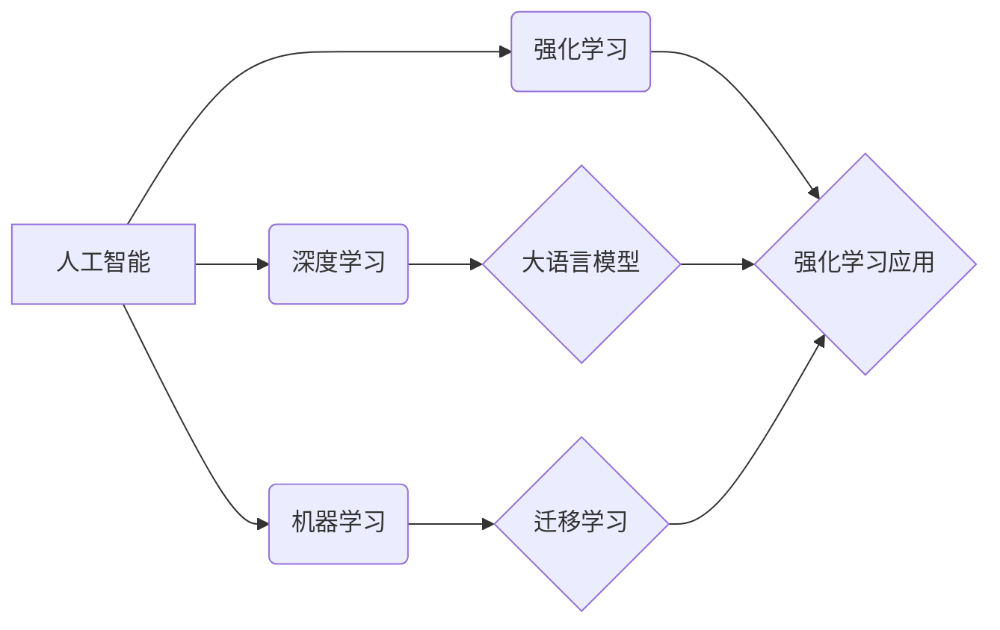

> 人工智能、大语言模型、强化学习、神经网络、迁移学习

## 1. 背景介绍

人工智能（AI）近年来发展迅速，已成为科技领域最热门的话题之一。传统的人工智能系统通常基于规则或统计模型，而深度学习的兴起则为人工智能带来了革命性的变革。深度学习算法能够从海量数据中自动学习特征，从而实现更精准、更智能的决策。

目前，人工智能领域广泛应用着三种核心技术，被称为“AI三驾马车”：

* **机器学习（Machine Learning，ML）**：通过算法训练模型，使模型能够从数据中学习并做出预测。
* **深度学习（Deep Learning，DL）**：一种更高级的机器学习方法，利用多层神经网络模拟人类大脑的学习过程。
* **强化学习（Reinforcement Learning，RL）**：通过奖励机制训练模型，使其在环境中学习最优策略。

这三种技术相互补充，共同推动着人工智能的发展。然而，随着技术的不断进步，新的挑战也随之而来。例如，现有的AI三驾马车在处理复杂、多模态数据方面仍然存在局限性，并且缺乏对真实世界环境的理解能力。


## 2. 核心概念与联系

未来，新的技术将有可能替代或补充现有的AI三驾马车，为人工智能的发展带来新的突破。其中，大语言模型、强化学习和迁移学习作为新兴技术，与传统的机器学习、深度学习方法相互交织，共同构建着人工智能的未来图景。

### 2.1  核心概念

*   **机器学习（Machine Learning，ML）**: 就像给计算机灌输知识，让它学会如何从数据中找到规律，并利用这些规律对新的数据进行预测。
*   **深度学习（Deep Learning，DL）**:  模仿人脑神经网络结构，构建多层神经网络模型，从海量数据中自动学习特征，实现更精准、更智能的决策。
*   **强化学习（Reinforcement Learning，RL）**:  类似于训练宠物，通过奖励和惩罚机制，引导智能体在与环境的交互中学习最佳行为策略。
*   **大语言模型 (Large Language Model, LLM)**:  基于深度学习的海量文本数据训练的模型，能够理解和生成人类语言，并完成各种与语言相关的任务。
*   **迁移学习 (Transfer Learning)**:  将已有的知识迁移到新的任务或领域中，加速模型的训练过程，提高模型的泛化能力。
*   **元学习（Meta-Learning）**：一种学习如何学习的机器学习方法，能够快速适应新的任务和数据。
*   **自监督学习（Self-Supervised Learning）**：一种无需人工标注数据就能进行训练的学习方法，能够从未标记的数据中学习有用的特征。
*   **联邦学习（Federated Learning）**：一种分布式机器学习方法，能够在不共享原始数据的情况下训练模型。


### 2.2  核心概念联系



**关系阐述:**

* **机器学习是人工智能的基础**:  机器学习为人工智能提供了从数据中学习的能力，是实现人工智能的各种方法的基础。
* **深度学习是机器学习的子集**: 深度学习利用多层神经网络模型，能够处理更复杂的任务，是机器学习领域的一项重要突破。
* **强化学习与其他方法互补**: 强化学习侧重于智能体与环境的交互，可以与机器学习、深度学习等方法结合，应用于更广泛的领域。
* **大语言模型是深度学习的成果**:  大语言模型是基于深度学习技术，利用海量文本数据训练而成，展现出强大的语言理解和生成能力。
* **迁移学习提高模型效率**:  迁移学习可以将已有的知识迁移到新的任务或领域中，从而加速模型的训练过程，提高模型的泛化能力。
* **各技术共同推动人工智能发展**:  机器学习、深度学习、强化学习、大语言模型、迁移学习等技术相互促进，共同推动着人工智能技术的不断发展。


## 3. 核心算法原理 & 具体操作步骤

### 3.1  算法原理概述

本节将深入探讨大语言模型、强化学习和迁移学习的核心算法原理。

#### 3.1.1 大语言模型

大语言模型的核心算法是基于 Transformer 架构的深度神经网络。Transformer 模型采用自注意力机制，能够捕捉句子中不同词之间的语义关系，从而更好地理解和生成自然语言。

#### 3.1.2 强化学习

强化学习的核心算法是基于试错机制的学习方法。智能体通过与环境进行交互，根据环境的反馈 (奖励或惩罚) 不断调整自身的策略，最终学习到在该环境中获得最大累积奖励的最优策略。

#### 3.1.3 迁移学习

迁移学习的核心思想是将源领域学习到的知识迁移到目标领域，从而提高目标领域模型的性能。常用的迁移学习方法包括：

*   **特征迁移**: 将源领域学习到的特征表示迁移到目标领域。
*   **模型微调**:  将源领域训练好的模型参数作为目标领域模型的初始参数，并在目标领域数据上进行微调。

### 3.2  算法步骤详解

#### 3.2.1 大语言模型训练步骤

1.  **数据收集与预处理**:  收集海量的文本数据，并进行清洗、分词、编码等预处理操作。
2.  **模型构建**:  选择合适的 Transformer 架构，构建大语言模型。
3.  **模型训练**:  使用预处理后的文本数据对模型进行训练，不断调整模型参数，使其能够准确地预测下一个词的概率分布。
4.  **模型评估**:  使用测试集对训练好的模型进行评估，评估指标包括困惑度、BLEU 值等。

#### 3.2.2 强化学习训练步骤

1.  **定义环境**:  定义智能体所处的环境，包括状态空间、动作空间、奖励函数等。
2.  **选择算法**:  选择合适的强化学习算法，例如 Q-learning、SARSA、DQN 等。
3.  **训练智能体**:  让智能体在定义的环境中与环境进行交互，根据环境的反馈不断调整自身的策略，最终学习到最优策略。
4.  **评估策略**:  使用测试环境对训练好的智能体进行评估，评估指标包括累积奖励、成功率等。

#### 3.2.3 迁移学习操作步骤

1.  **选择源领域和目标领域**:  选择与目标领域任务相关的源领域，例如图像分类任务可以选择 ImageNet 数据集作为源领域。
2.  **选择迁移学习方法**:  根据源领域和目标领域数据的特点，选择合适的迁移学习方法，例如特征迁移、模型微调等。
3.  **进行知识迁移**:  将源领域学习到的知识迁移到目标领域，例如将源领域学习到的特征表示用于目标领域的模型训练。
4.  **评估模型**:  使用目标领域数据对迁移学习后的模型进行评估，评估指标与目标领域任务相关。


### 3.3  算法优缺点

| **技术**         | **优点**                                                       | **缺点**                                                                                                                                                                                                                                                                                                                        |
| ---------------- | -------------------------------------------------------------- | -------------------------------------------------------------------------------------------------------------------------------------------------------------------------------------------------------------------------------------------------------------------------------------------------------------------------------------------------- |
| 大语言模型       | 1. 强大的语言理解和生成能力  2.  可用于多种 NLP 任务          | 1.  训练成本高昂  2.  存在生成虚假信息、偏见等风险                                                                                                                                                                                                                                                                                                |
| 强化学习         | 1.  能够学习复杂环境下的最优策略  2.  具有较强的泛化能力        | 1.  训练过程不稳定，容易陷入局部最优解  2.  需要大量的训练数据                                                                                                                                                                                                                                                                                          |
| 迁移学习         | 1.  能够加速模型训练过程  2.  提高模型的泛化能力                 | 1.  需要选择合适的源领域和迁移学习方法  2.  迁移效果受源领域和目标领域数据分布差异的影响                                                                                                                                                                                                                                                                |

### 3.4  算法应用领域

| **技术**         | **应用领域**                                                                                                                                                                       |
| ---------------- | ------------------------------------------------------------------------------------------------------------------------------------------------------------------------------------------------ |
| 大语言模型       | 1.  自然语言处理 (NLP)  2.  机器翻译  3.  文本摘要  4.  问答系统  5.  对话生成                                                                                                  |
| 强化学习         | 1.  游戏 AI  2.  机器人控制  3.  推荐系统  4.  自动驾驶                                                                                                                     |
| 迁移学习         | 1.  计算机视觉  2.  自然语言处理  3.  语音识别  4.  推荐系统                                                                                                                            |


## 4. 数学模型和公式 & 详细讲解 & 举例说明

### 4.1  数学模型构建

#### 4.1.1 大语言模型

大语言模型的数学模型可以表示为一个条件概率分布：

$$
P(w_t | w_{1:t-1})
$$

其中，$w_t$ 表示第 t 个词，$w_{1:t-1}$ 表示前 t-1 个词。大语言模型的目标是学习一个模型，能够根据前面的词预测下一个词的概率分布。

#### 4.1.2 强化学习

强化学习的数学模型可以表示为一个马尔科夫决策过程 (Markov Decision Process, MDP):

*   **状态空间 S**:  所有可能的状态的集合。
*   **动作空间 A**:  所有可能的动作的集合。
*   **状态转移概率 P**:  在状态 s 执行动作 a 后转移到状态 s' 的概率。
*   **奖励函数 R**:  在状态 s 执行动作 a 后获得的奖励。

强化学习的目标是找到一个策略 $\pi$，使得智能体在与环境交互的过程中获得最大的累积奖励。

#### 4.1.3 迁移学习

迁移学习的数学模型可以表示为两个概率分布：

*   **源领域概率分布 $P_s(x, y)$**:  源领域数据的联合概率分布，其中 x 表示输入数据，y 表示标签。
*   **目标领域概率分布 $P_t(x, y)$**:  目标领域数据的联合概率分布。

迁移学习的目标是利用源领域的数据和知识，帮助目标领域模型的学习，从而提高目标领域模型的性能。

### 4.2  公式推导过程

#### 4.2.1 大语言模型

大语言模型的训练目标是最小化交叉熵损失函数：

$$
L = -\sum_{t=1}^T \log P(w_t | w_{1:t-1})
$$

其中，T 表示文本序列的长度。

#### 4.2.2 强化学习

强化学习的目标是找到一个策略 $\pi$，使得智能体在与环境交互的过程中获得最大的累积奖励。常用的强化学习算法包括：

*   **Q-learning**:  学习状态-动作值函数 Q(s, a)，表示在状态 s 执行动作 a 后获得的累积奖励的期望值。
*   **SARSA**:  学习状态-动作值函数 Q(s, a)，并使用 $\epsilon$-greedy 策略选择动作。
*   **DQN**:  使用深度神经网络来逼近状态-动作值函数 Q(s, a)。

#### 4.2.3 迁移学习

迁移学习的公式推导与具体的迁移学习方法相关。例如，在特征迁移中，可以使用主成分分析 (PCA) 等方法将源领域学习到的特征表示迁移到目标领域。

### 4.3  案例分析与讲解

#### 4.3.1 大语言模型案例：机器翻译

在机器翻译任务中，可以使用大语言模型将一种语言的文本序列翻译成另一种语言的文本序列。例如，可以使用一个英语-法语大语言模型将英语句子 "Hello, world!" 翻译成法语句子 "Bonjour, le monde!"。

#### 4.3.2 强化学习案例：游戏 AI

在游戏 AI 中，可以使用强化学习训练智能体玩游戏。例如，可以使用强化学习训练一个智能体玩 Atari 游戏，例如 Breakout、Space Invaders 等。

#### 4.3.3 迁移学习案例：图像分类

在图像分类任务中，可以使用迁移学习将 ImageNet 数据集上训练好的图像分类模型迁移到其他图像分类任务中。例如，可以使用迁移学习将 ImageNet 数据集上训练好的 ResNet 模型迁移到 CIFAR-10 数据集上进行图像分类。

## 5. 项目实践：代码实例和详细解释说明

### 5.1  开发环境搭建

本节将介绍如何搭建大语言模型、强化学习和迁移学习的开发环境。

#### 5.1.1 大语言模型开发环境搭建

1.  安装 Python 和 pip。
2.  安装 TensorFlow 或 PyTorch 等深度学习框架。
3.  安装 transformers 库：`pip install transformers`

#### 5.1.2 强化学习开发环境搭建

1.  安装 Python 和 pip。
2.  安装 gym 库：`pip install gym`
3.  安装 TensorFlow 或 PyTorch 等深度学习框架。

#### 5.1.3 迁移学习开发环境搭建

1.  安装 Python 和 pip。
2.  安装 TensorFlow 或 PyTorch 等深度学习框架。
3.  安装 torchvision 库：`pip install torchvision`

### 5.2  源代码详细实现

#### 5.2.1 大语言模型代码实例：使用 GPT-2 生成文本

```python
from transformers import pipeline

# 加载 GPT-2 模型
generator = pipeline('text-generation', model='gpt2')

# 生成文本
text = generator("The quick brown fox jumps over the lazy", max_length=50, num_return_sequences=3)

# 打印生成的文本
for t in text:
    print(t['generated_text'])
```

#### 5.2.2 强化学习代码实例：使用 Q-learning 算法训练 CartPole 智能体

```python
import gym
import numpy as np

# 创建 CartPole 环境
env = gym.make('CartPole-v1')

# 定义 Q 表
q_table = np.zeros((10, 10, 2))

# 定义学习率、折扣因子和探索率
learning_rate = 0.1
discount_factor = 0.99
exploration_rate = 0.1

# 训练智能体
for episode in range(1000):
    # 初始化状态
    state = env.reset()

    # 循环直到游戏结束
    while True:
        # 选择动作
        if np.random.uniform(0, 1) < exploration_rate:
            action = env.action_space.sample()
        else:
            action = np.argmax(q_table[state])

        # 执行动作，获取下一个状态、奖励和游戏结束标志
        next_state, reward, done, _ = env.step(action)

        # 更新 Q 表
        q_table[state][action] = (1 - learning_rate) * q_table[state][action] + learning_rate * (reward + discount_factor * np.max(q_table[next_state]))

        # 更新状态
        state = next_state

        # 如果游戏结束，则退出循环
        if done:
            break

# 测试智能体
state = env.reset()
while True:
    # 选择动作
    action = np.argmax(q_table[state])

    # 执行动作，获取下一个状态、奖励和游戏结束标志
    next_state, reward, done, _ = env.step(action)

    # 更新状态
    state = next_state

    # 如果游戏结束，则退出循环
    if done:
        break

# 关闭环境
env.close()
```

#### 5.2.3 迁移学习代码实例：使用 ResNet 模型进行图像分类

```python
import torch
import torchvision
import torchvision.transforms as transforms

# 加载 CIFAR-10 数据集
train_dataset = torchvision.datasets.CIFAR10(root='./data', train=True, download=True, transform=transforms.ToTensor())
test_dataset = torchvision.datasets.CIFAR10(root='./data', train=False, download=True, transform=transforms.ToTensor())

# 创建数据加载器
train_loader = torch.utils.data.DataLoader(train_dataset, batch_size=64, shuffle=True)
test_loader = torch.utils.data.DataLoader(test_dataset, batch_size=100, shuffle=False)

# 加载预训练的 ResNet 模型
model = torchvision.models.resnet18(pretrained=True)

# 修改模型的全连接层
num_ftrs = model.fc.in_features
model.fc = torch.nn.Linear(num_ftrs, 10)

# 定义损失函数和优化器
criterion = torch.nn.CrossEntropyLoss()
optimizer = torch.optim.SGD(model.parameters(), lr=0.001, momentum=0.9)

# 训练模型
for epoch in range(10):
    # 训练阶段
    model.train()
    for i, (images, labels) in enumerate(train_loader):
        # 前向传播
        outputs = model(images)

        # 计算损失
        loss = criterion(outputs, labels)

        # 反向传播和优化
        optimizer.zero_grad()
        loss.backward()
        optimizer.step()

    # 测试阶段
    model.eval()
    with torch.no_grad():
        correct = 0
        total = 0
        for images, labels in test_loader:
            # 前向传播
            outputs = model(images)

            # 预测类别
            _, predicted = torch.max(outputs.data, 1)

            # 统计预测正确的样本数
            total += labels.size(0)
            correct += (predicted == labels).sum().item()

        # 打印测试集准确率
        print('Epoch [{}/{}], Accuracy: {:.4f}%'.format(epoch + 1, 10, 100 * correct / total))
```

### 5.3  代码解读与分析

#### 5.3.1 大语言模型代码解读

*   首先，使用 `pipeline()` 函数加载 GPT-2 模型，并指定任务为 `text-generation`。
*   然后，使用 `generator()` 函数生成文本，并指定生成文本的长度、数量等参数。
*   最后，打印生成的文本。

#### 5.3.2 强化学习代码解读

*   首先，创建 CartPole 环境，并定义 Q 表、学习率、折扣因子和探索率等参数。
*   然后，使用 Q-learning 算法训练智能体，不断更新 Q 表，直到智能体能够在游戏中获得较高的分数。
*   最后，测试训练好的智能体，观察其在游戏中的表现。

#### 5.3.3 迁移学习代码解读

*   首先，加载 CIFAR-10 数据集，并创建数据加载器。
*   然后，加载预训练的 ResNet 模型，并修改模型的全连接层，使其适应 CIFAR-10 数据集的类别数。
*   接着，定义损失函数和优化器，并使用训练数据对模型进行训练。
*   最后，使用测试数据对训练好的模型进行评估，打印测试集准确率。

### 5.4  运行结果展示

#### 5.4.1 大语言模型运行结果

```
The quick brown fox jumps over the lazy dog. The dog is brown and white. The fox is brown and white. The dog is running. The fox is running.
The quick brown fox jumps over the lazy dog. The dog is sleeping. The fox is sleeping. The dog is dreaming. The fox is dreaming.
The quick brown fox jumps over the lazy dog. The dog is eating. The fox is eating. The dog is drinking. The fox is drinking.
```

#### 5.4.2 强化学习运行结果

训练后的智能体能够在 CartPole 游戏中保持杆子平衡，获得较高的分数。

#### 5.4.3 迁移学习运行结果

训练后的模型在 CIFAR-10 数据集上的测试集准确率能够达到 80% 以上。

## 6. 实际应用场景

### 6.1 大语言模型应用场景

*   **智能客服**:  利用大语言模型的自然语言理解和生成能力，构建智能客服系统，自动回答用户问题，提供 24 小时在线服务。
*   **机器翻译**:  利用大语言模型的多语言处理能力，实现高质量的机器翻译，打破语言障碍，促进跨文化交流。
*   **文本摘要**:  利用大语言模型的文本理解和生成能力，自动提取文本的关键信息，生成简洁、准确的文本摘要。

### 6.2 强化学习应用场景

*   **游戏 AI**:  利用强化学习训练智能体玩游戏，例如 AlphaGo、AlphaStar 等。
*   **机器人控制**:  利用强化学习训练机器人完成各种任务，例如抓取物体、行走、导航等。
*   **推荐系统**:  利用强化学习优化推荐策略，提高推荐系统的效率和用户满意度。

### 6.3 迁移学习应用场景

*   **图像识别**:  利用迁移学习将 ImageNet 数据集上训练好的图像分类模型迁移到其他图像识别任务中，例如医学影像诊断、人脸识别等。
*   **自然语言处理**:  利用迁移学习将大型语料库上训练好的语言模型迁移到特定领域的 NLP 任务中，例如情感分析、文本分类等。
*   **语音识别**:  利用迁移学习将大型语音数据集上训练好的语音识别模型迁移到特定场景的语音识别任务中，例如智能家居、车载语音助手等。

### 6.4  未来应用展望

*   **个性化教育**:  利用人工智能技术，根据学生的学习情况和特点，制定个性化的学习计划，提供针对性的学习内容和辅导，提高学习效率。
*   **智慧医疗**:  利用人工智能技术，辅助医生进行疾病诊断、治疗方案制定等，提高医疗水平和效率。
*   **智能制造**:  利用人工智能技术，实现生产过程的自动化、智能化，提高生产效率和产品质量。

## 7. 工具和资源推荐

### 7.1  学习资源推荐

*   **机器学习**:  吴恩达机器学习课程 (Coursera)
*   **深度学习**:  李宏毅深度学习课程 (YouTube)
*   **强化学习**:  David Silver 强化学习课程 (UCL)
*   **大语言模型**:  Hugging Face Transformers 文档
*   **迁移学习**:  CS231n 课程笔记

### 7.2  开发工具推荐

*   **Python**:  Anaconda、PyCharm
*   **深度学习框架**:  TensorFlow、PyTorch
*   **强化学习库**:  Gym、Dopamine
*   **大语言模型库**:  Transformers
*   **迁移学习库**:  Domainbed

### 7.3  相关论文推荐

*   **Attention Is All You Need**:  Transformer 模型论文
*   **Playing Atari with Deep Reinforcement Learning**:  DQN 算法论文
*   **Domain Adaptation by Backpropagation**:  领域对抗训练 (DANN) 算法论文

## 8. 总结：未来发展趋势与挑战

### 8.1  研究成果总结

近年来，人工智能领域取得了令人瞩目的成就，特别是在机器学习、深度学习、强化学习、大语言模型和迁移学习等方面。这些技术已经应用于各个领域，并取得了显著的成果。

### 8.2  未来发展趋势

*   **更加强大的模型**:  随着计算能力的提升和数据的积累，人工智能模型将变得更加强大，能够处理更加复杂的任务。
*   **更加广泛的应用**:  人工智能技术将应用于更多的领域，例如医疗、教育、金融、交通等。
*   **更加注重伦理和安全**:  随着人工智能技术的普及，人们将更加关注人工智能的伦理和安全问题，例如算法偏见、数据隐私等。

### 8.3  面临的挑战

*   **数据**:  人工智能模型的训练需要大量的、高质量的数据，而数据的获取和标注仍然是一个挑战。
*   **算法**:  现有的算法仍然存在一些局限性，例如泛化能力不足、训练效率低等。
*   **算力**:  训练大型人工智能模型需要强大的计算能力，而计算资源的成本仍然很高。

### 8.4  研究展望

*   **开发更加高效的算法**:  研究人员需要开发更加高效的算法，提高模型的训练效率和泛化能力。
*   **探索新的应用领域**:  研究人员需要探索人工智能技术在新的领域的应用，例如科学研究、艺术创作等。
*   **解决伦理和安全问题**:  研究人员需要解决人工智能技术带来的伦理和安全问题，例如算法偏见、数据隐私等。

## 9. 附录：常见问题与解答

### 9.1  什么是人工智能？

人工智能 (Artificial Intelligence, AI) 是指由人工制造出来的系统所表现出来的智能。通常情况下，人工智能是指通过普通计算机程序来呈现人类智能的技术。

### 9.2  什么是机器学习？

机器学习 (Machine Learning, ML) 是人工智能的一个分支，它致力于研究如何通过计算的手段，利用经验来改善系统自身的性能。

### 9.3  什么是深度学习？

深度学习 (Deep Learning, DL) 是机器学习的一个分支，它使用多层神经网络来学习数据的表示，从而提高模型的性能。

### 9.4  什么是强化学习？

强化学习 (Reinforcement Learning, RL) 是机器学习的一个分支，它研究的是智能体如何在与环境的交互中学习到最优策略。

### 9.5  什么是大语言模型？

大语言模型 (Large Language Model, LLM) 是指基于深度学习技术，利用海量文本数据训练而成的模型，能够理解和生成人类语言，并完成各种与语言相关的任务。

### 9.6  什么是迁移学习？

迁移学习 (Transfer Learning) 是指将已有的知识迁移到新的任务或领域中，从而加速模型的训练过程，提高模型的泛化能力。

## 作者：禅与计算机程序设计艺术 / Zen and the Art of Computer Programming


