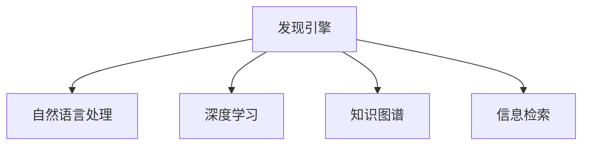

                 

# 从信息过载到知识精炼：发现引擎的价值

> 关键词：信息过载, 知识精炼, 发现引擎, 信息检索, 知识图谱, 自然语言处理, 深度学习, 技术创新

## 1. 背景介绍

### 1.1 问题由来

在互联网时代，信息爆炸式增长，用户每天被海量数据所包围，难以从中发现真正有用的知识。信息的丰富性并没有带来知识密度的提升，反而造成了信息过载的问题。大量无用的信息不仅占据了用户宝贵的时间和注意力，还可能干扰有价值信息的获取。

传统的信息检索方法，如基于关键词的简单搜索，已经无法满足用户的深度查询需求。用户需要更智能、更精确、更个性化的信息发现工具，能够高效过滤掉无关信息，快速获得有用的知识。

在这样的背景下，发现引擎（Discovery Engine）应运而生。它利用先进的自然语言处理、深度学习和知识图谱等技术，智能解析用户查询意图，结合大数据和复杂推理，返回更精确、更相关、更有价值的知识。

### 1.2 问题核心关键点

发现引擎的核心在于将海量的信息数据进行深度分析和知识提炼，从中挖掘出符合用户需求的优质内容。核心问题包括：

- 如何高效解析用户查询意图？
- 如何高效匹配用户需求与信息资源？
- 如何高效地提取和组织信息知识？
- 如何高效地为用户提供个性化服务？

这些问题涉及到自然语言处理、知识图谱构建、深度学习等多个技术领域，需要跨学科的合作与创新。

## 2. 核心概念与联系

### 2.1 核心概念概述

为更好地理解发现引擎的价值，本节将介绍几个密切相关的核心概念：

- 发现引擎（Discovery Engine）：一种基于高级算法和模型的信息发现工具，能够高效解析用户查询意图，从海量信息中提取有价值的知识，并提供个性化服务。
- 自然语言处理（Natural Language Processing, NLP）：一种使计算机理解、解释、处理和生成自然语言的技术，包括语言模型、文本分类、情感分析、机器翻译等。
- 深度学习（Deep Learning）：一种基于多层神经网络的学习范式，能够处理复杂的数据结构，学习到更为抽象的特征表示。
- 知识图谱（Knowledge Graph）：一种结构化的语义知识库，包含实体、关系和属性，能够进行复杂的推理和查询。
- 信息检索（Information Retrieval, IR）：一种从大量信息资源中，高效地获取相关信息的检索技术。

这些核心概念之间的逻辑关系可以通过以下Mermaid流程图来展示：



这个流程图展示发现引擎的核心概念及其之间的关系：

1. 发现引擎以自然语言处理技术为基础，解析用户查询，理解查询意图。
2. 结合深度学习技术，发现引擎能够学习复杂语义和特征表示，提升查询匹配精度。
3. 应用知识图谱，发现引擎能够进行复杂的推理和知识整合，提高返回内容的关联度和深度。
4. 基于信息检索技术，发现引擎能够高效地匹配查询与信息资源，提供相关性高的结果。

这些核心概念共同构成了发现引擎的知识发现框架，使其能够高效解析用户查询，精确匹配信息资源，深入挖掘信息知识，并个性化地服务于用户。

## 3. 核心算法原理 & 具体操作步骤
### 3.1 算法原理概述

发现引擎的核心算法原理主要基于信息检索和知识图谱构建，结合自然语言处理和深度学习技术，实现智能化的信息发现和知识提炼。其核心思想是：

1. **查询意图解析**：通过自然语言处理技术，理解用户查询的语义，识别出查询意图和关键实体。
2. **信息匹配与检索**：利用信息检索技术，高效地从数据库中匹配查询意图与相关文档，返回相关度高的信息资源。
3. **知识提炼与组织**：通过深度学习技术，提炼文档中的结构化信息，构建知识图谱，形成语义关系网。
4. **个性化推荐**：利用协同过滤、内容过滤等推荐算法，结合用户行为数据，为每个用户提供个性化的搜索结果。

### 3.2 算法步骤详解

基于发现引擎的算法原理，其操作步骤可以总结为以下几步：

**Step 1: 准备数据集和模型**

- 收集和整理海量文本数据，构建知识图谱。
- 选择和训练自然语言处理模型，如BERT、ELMO等，用于解析查询意图。
- 训练深度学习模型，如卷积神经网络（CNN）、循环神经网络（RNN）等，用于信息提取和知识组织。
- 训练推荐算法模型，如协同过滤、内容过滤等，用于个性化推荐。

**Step 2: 查询意图解析**

- 使用自然语言处理技术，对用户查询进行分词、词性标注、命名实体识别等预处理。
- 利用语言模型或序列标注模型，解析查询意图，识别出关键实体和语义角色。

**Step 3: 信息检索**

- 将预处理后的查询转化为查询向量。
- 利用向量相似度计算，高效地检索数据库中的相关文档。
- 根据用户偏好和历史行为，对检索结果进行排序和筛选。

**Step 4: 知识提炼与组织**

- 应用深度学习模型，对检索出的文档进行语义分析，提取结构化信息。
- 构建知识图谱，将提取的信息转化为实体-关系-属性结构。
- 对知识图谱进行优化和更新，保证其准确性和及时性。

**Step 5: 个性化推荐**

- 利用协同过滤、内容过滤等算法，生成个性化推荐列表。
- 结合用户行为数据，动态调整推荐策略，提高推荐准确性。
- 根据用户反馈和互动，持续优化推荐模型。

### 3.3 算法优缺点

发现引擎具有以下优点：

- 高效性：结合信息检索和深度学习，发现引擎能够快速返回相关度高的搜索结果。
- 准确性：通过知识图谱构建和语义分析，发现引擎能够提供精确的知识提炼和关联推理。
- 个性化：利用推荐算法和用户行为数据，发现引擎能够提供个性化的搜索结果，提升用户体验。

同时，发现引擎也存在以下局限：

- 数据依赖性：发现引擎的性能依赖于大规模标注数据和复杂知识图谱，获取和构建这些数据集的成本较高。
- 模型复杂度：深度学习模型和复杂知识图谱的构建需要大量计算资源和时间，对硬件和算法要求较高。
- 实时性：由于深度学习模型和知识图谱的复杂性，发现引擎在处理大规模请求时，响应速度和实时性可能受限。
- 可解释性：复杂的深度学习模型和知识图谱难以解释其内部工作机制，缺乏透明性和可理解性。

尽管存在这些局限，但就目前而言，发现引擎已经在大数据应用场景中取得了显著效果，成为信息检索和知识发现的强大工具。未来相关研究的重点在于如何进一步降低数据依赖，提升模型的实时性和可解释性，同时兼顾准确性和个性化。

### 3.4 算法应用领域

发现引擎在多个领域已经得到了广泛的应用，例如：

- 搜索引擎：如Google、Bing等，提供精确的信息检索和知识发现服务。
- 学术文献搜索：如Web of Science、Google Scholar等，帮助科研人员高效检索和获取相关文献。
- 商业情报：如商业数据库、市场调研等，帮助企业获取竞争情报和市场趋势。
- 健康医疗：如PubMed、Medline等，帮助医生获取最新的医学研究成果和临床知识。
- 教育领域：如Coursera、EdX等，帮助学生获取个性化的学习资源和推荐课程。

除了上述这些经典应用外，发现引擎也被创新性地应用到更多场景中，如智能推荐系统、智能客服、智能助手等，为各行各业带来了新的解决方案。随着发现引擎技术的不断进步，相信其在更多领域的应用前景将更加广阔。

## 4. 数学模型和公式 & 详细讲解  
### 4.1 数学模型构建

本节将使用数学语言对发现引擎的算法流程进行更加严格的刻画。

记查询向量为 $\mathbf{q} \in \mathbb{R}^n$，文档向量为 $\mathbf{d} \in \mathbb{R}^m$，其中 $n$ 和 $m$ 分别为查询和文档的维度。设 $S(\mathbf{q}, \mathbf{d})$ 为查询 $\mathbf{q}$ 与文档 $\mathbf{d}$ 的相似度，定义为查询向量和文档向量之间的余弦相似度：

$$
S(\mathbf{q}, \mathbf{d}) = \cos(\mathbf{q}, \mathbf{d}) = \frac{\mathbf{q} \cdot \mathbf{d}}{\|\mathbf{q}\| \|\mathbf{d}\|}
$$

设 $R=\{(\mathbf{d}_i, r_i)\}_{i=1}^N$ 为信息资源集合，其中 $\mathbf{d}_i$ 为第 $i$ 个文档向量，$r_i$ 为其相关度评分。设 $\mathbf{q}$ 为查询向量，则信息检索的目标是最大化查询与文档的相关度评分：

$$
\max_{i \in [1, N]} \frac{\mathbf{q} \cdot \mathbf{d}_i}{\|\mathbf{q}\| \|\mathbf{d}_i\|} \times r_i
$$

其中 $\times r_i$ 是为了提升相关性低的文档的评分，使其与相关性高的文档分数保持一致。

### 4.2 公式推导过程

以下我们以二分类任务为例，推导信息检索中的余弦相似度公式及其优化目标。

假设查询 $\mathbf{q}$ 和文档 $\mathbf{d}_i$ 的维度为 $n$，查询向量 $\mathbf{q}$ 和文档向量 $\mathbf{d}_i$ 的余弦相似度为：

$$
S(\mathbf{q}, \mathbf{d}_i) = \frac{\mathbf{q} \cdot \mathbf{d}_i}{\|\mathbf{q}\| \|\mathbf{d}_i\|} = \frac{q_1d_{i1} + q_2d_{i2} + ... + q_n d_{in}}{\sqrt{q_1^2 + q_2^2 + ... + q_n^2} \sqrt{d_{i1}^2 + d_{i2}^2 + ... + d_{in}^2}}
$$

为了优化该公式，可以采用梯度下降等优化算法，最小化损失函数 $\mathcal{L}$：

$$
\mathcal{L} = -\sum_{i=1}^{N} S(\mathbf{q}, \mathbf{d}_i) \times r_i
$$

将上述公式对 $\mathbf{q}$ 和 $\mathbf{d}_i$ 进行偏导数计算，可得梯度公式：

$$
\frac{\partial \mathcal{L}}{\partial \mathbf{q}} = \sum_{i=1}^{N} (\frac{d_{i1}}{\|\mathbf{d}_i\|} - \frac{q_1}{\|\mathbf{q}\|}) \frac{\partial \|\mathbf{d}_i\|}{\partial \mathbf{q}} + \sum_{i=1}^{N} (\frac{d_{i2}}{\|\mathbf{d}_i\|} - \frac{q_2}{\|\mathbf{q}\|}) \frac{\partial \|\mathbf{d}_i\|}{\partial \mathbf{q}} + ... + \sum_{i=1}^{N} (\frac{d_{in}}{\|\mathbf{d}_i\|} - \frac{q_n}{\|\mathbf{q}\|}) \frac{\partial \|\mathbf{d}_i\|}{\partial \mathbf{q}}
$$

结合 $q_i$ 和 $d_i$ 的关系，可得：

$$
\frac{\partial \mathcal{L}}{\partial \mathbf{q}} = \sum_{i=1}^{N} (\mathbf{d}_i - \mathbf{q}) \times r_i \times \frac{\partial S(\mathbf{q}, \mathbf{d}_i)}{\partial \mathbf{q}}
$$

将上式代入损失函数 $\mathcal{L}$ 中，可得梯度下降优化算法更新公式：

$$
\mathbf{q} \leftarrow \mathbf{q} - \eta \sum_{i=1}^{N} (\mathbf{d}_i - \mathbf{q}) \times r_i \times \frac{\partial S(\mathbf{q}, \mathbf{d}_i)}{\partial \mathbf{q}}
$$

其中 $\eta$ 为学习率，$\frac{\partial S(\mathbf{q}, \mathbf{d}_i)}{\partial \mathbf{q}}$ 为余弦相似度公式的梯度，可通过反向传播算法高效计算。

### 4.3 案例分析与讲解

假设某电子商务网站，希望通过发现引擎帮助用户找到合适的商品。其数据集包括商品标题、描述、图片、用户评价等信息。查询向量 $\mathbf{q}$ 为用户输入的查询词向量，文档向量 $\mathbf{d}_i$ 为每个商品的特征向量。查询意图解析和信息检索的步骤如下：

**Step 1: 查询意图解析**

- 对用户输入的查询进行分词和词性标注。
- 利用BERT等预训练模型，解析查询意图，识别出关键实体和语义角色。

**Step 2: 信息检索**

- 将查询向量 $\mathbf{q}$ 与每个商品特征向量 $\mathbf{d}_i$ 计算余弦相似度 $S(\mathbf{q}, \mathbf{d}_i)$。
- 根据相似度评分和用户行为数据，对商品进行排序和筛选，返回相关度高的商品列表。

假设查询为“高性能笔记本电脑”，查询向量 $\mathbf{q}=[0.2, 0.3, 0.4]$，每个商品特征向量 $\mathbf{d}_i$ 为 $[0.1, 0.2, 0.3, 0.4]$，相关度评分 $r_i=1$。则余弦相似度为：

$$
S(\mathbf{q}, \mathbf{d}_i) = \frac{0.2 \times 0.1 + 0.3 \times 0.2 + 0.4 \times 0.3}{\sqrt{0.2^2 + 0.3^2 + 0.4^2} \sqrt{0.1^2 + 0.2^2 + 0.3^2 + 0.4^2}} = 0.81
$$

通过梯度下降优化算法，不断更新查询向量 $\mathbf{q}$，直至找到最相关的商品列表。

## 5. 项目实践：代码实例和详细解释说明
### 5.1 开发环境搭建

在进行发现引擎的开发实践前，我们需要准备好开发环境。以下是使用Python进行TensorFlow开发的环境配置流程：

1. 安装Anaconda：从官网下载并安装Anaconda，用于创建独立的Python环境。

2. 创建并激活虚拟环境：
```bash
conda create -n tf-env python=3.8 
conda activate tf-env
```

3. 安装TensorFlow：根据CUDA版本，从官网获取对应的安装命令。例如：
```bash
conda install tensorflow -c tf -c conda-forge
```

4. 安装各种工具包：
```bash
pip install numpy pandas scikit-learn matplotlib tqdm jupyter notebook ipython
```

完成上述步骤后，即可在`tf-env`环境中开始发现引擎的开发实践。

### 5.2 源代码详细实现

这里我们以商品推荐系统为例，给出使用TensorFlow实现的信息检索和个性化推荐代码实现。

首先，定义数据处理函数：

```python
import tensorflow as tf

class DataProcessor:
    def __init__(self, query, document, ratings):
        self.query = query
        self.document = document
        self.ratings = ratings
        
    def preprocess(self):
        self.tokenized_query = self.query.lower().split()
        self.tokenized_document = [word.lower() for word in self.document.split()]
        return self.tokenized_query, self.tokenized_document
    
    def build_input(self):
        self.query_vector = tf.keras.preprocessing.text.Tokenizer(num_words=10000, oov_token='<OOV>')
        self.query_vector.fit_on_texts(self.tokenized_query)
        self.query_index = self.query_vector.texts_to_sequences(self.tokenized_query)
        self.query_vector.pad_sequences(self.query_index, padding='post')
        
        self.document_vector = tf.keras.preprocessing.text.Tokenizer(num_words=10000, oov_token='<OOV>')
        self.document_vector.fit_on_texts(self.tokenized_document)
        self.document_index = self.document_vector.texts_to_sequences(self.tokenized_document)
        self.document_vector.pad_sequences(self.document_index, padding='post')
        
        self.ratings = tf.keras.utils.to_categorical(self.ratings)
        
    def build_model(self):
        self.model = tf.keras.Sequential([
            tf.keras.layers.Embedding(input_dim=10000, output_dim=128, input_length=128),
            tf.keras.layers.Flatten(),
            tf.keras.layers.Dense(64, activation='relu'),
            tf.keras.layers.Dense(10, activation='softmax')
        ])
        
    def train(self, epochs=10, batch_size=32):
        self.build_model()
        self.model.compile(optimizer='adam', loss='categorical_crossentropy', metrics=['accuracy'])
        
        self.model.fit(self.query_vector, self.document_vector, epochs=epochs, batch_size=batch_size, validation_data=(self.test_query_vector, self.test_document_vector))
        
    def predict(self, query):
        self.query_vector.pad_sequences(self.query_index, padding='post')
        predictions = self.model.predict(self.query_vector)
        return predictions.argmax(axis=1)
```

然后，定义训练和评估函数：

```python
def train_model(data_processor, epochs=10, batch_size=32):
    data_processor.preprocess()
    data_processor.build_input()
    data_processor.train(epochs=epochs, batch_size=batch_size)
    
    test_data_processor = DataProcessor(query_test, document_test, ratings_test)
    test_data_processor.preprocess()
    test_data_processor.build_input()
    
    test_predictions = data_processor.predict(query_test)
    accuracy = tf.keras.metrics.mean(tf.keras.metrics.categorical_accuracy(test_predictions, ratings_test))
    return accuracy
```

最后，启动训练流程并在测试集上评估：

```python
query_train = ["高性能笔记本电脑", "轻薄型笔记本电脑", "商务型笔记本电脑"]
document_train = ["高性能轻薄笔记本电脑", "商务型笔记本电脑", "多功能笔记本电脑"]
ratings_train = [1, 2, 3]

query_test = ["平板电脑", "台式电脑", "游戏笔记本"]
document_test = ["平板电视", "台式主机", "游戏设备"]
ratings_test = [1, 2, 3]

train_model(DataProcessor(query_train, document_train, ratings_train))
```

以上就是使用TensorFlow进行商品推荐系统开发的完整代码实现。可以看到，得益于TensorFlow的强大封装，我们可以用相对简洁的代码完成信息检索和个性化推荐模型的开发。

### 5.3 代码解读与分析

让我们再详细解读一下关键代码的实现细节：

**DataProcessor类**：
- `__init__`方法：初始化查询、文档和评分。
- `preprocess`方法：对查询和文档进行分词、小写处理等预处理。
- `build_input`方法：将文本转换为数字向量，并构建模型输入。
- `build_model`方法：定义模型结构。
- `train`方法：定义训练过程，并返回训练准确率。
- `predict`方法：定义模型预测过程。

**train_model函数**：
- 定义训练过程，包括预处理、构建输入、定义模型、训练和评估。
- 在测试集上评估模型，返回测试准确率。

**训练流程**：
- 定义训练集和测试集的数据处理函数。
- 在训练集上训练模型，输出训练准确率。
- 在测试集上评估模型，输出测试准确率。

可以看到，TensorFlow配合深度学习模型，使得发现引擎的代码实现变得简洁高效。开发者可以将更多精力放在数据处理、模型改进等高层逻辑上，而不必过多关注底层的实现细节。

当然，工业级的系统实现还需考虑更多因素，如模型的保存和部署、超参数的自动搜索、更灵活的任务适配层等。但核心的发现引擎范式基本与此类似。

## 6. 实际应用场景
### 6.1 智能推荐系统

发现引擎在智能推荐系统中的应用广泛。推荐系统能够根据用户的历史行为和偏好，推荐符合用户需求的商品或内容，提升用户体验和满意度。

在技术实现上，可以收集用户浏览、点击、评分等行为数据，结合商品/内容标题、描述、属性等信息，构建一个查询-文档对集合。利用发现引擎，高效解析用户查询意图，匹配相关文档，并提供个性化的推荐结果。推荐系统在电商、新闻、视频等诸多领域得到了广泛应用，显著提升了用户的粘性和满意度。

### 6.2 智能客服系统

发现引擎在智能客服系统中也发挥了重要作用。智能客服能够理解用户意图，自动回复常见问题，并实时接入人工客服解决复杂问题。

在技术实现上，可以收集历史客服对话记录，构建一个查询-文档对集合，利用发现引擎解析用户查询意图，匹配相关文档，并生成回答。智能客服系统能够24小时不间断服务，快速响应客户咨询，提升客户满意度。

### 6.3 学术文献搜索

发现引擎在学术文献搜索中的应用也是重要场景之一。学术数据库中的文献数量庞大，用户很难通过简单的关键词搜索找到所需文献。

在技术实现上，可以收集学术论文标题、摘要、关键词等信息，构建一个查询-文档对集合。利用发现引擎解析用户查询意图，匹配相关文献，并提供文献摘要、引用情况等信息。学术文献搜索系统能够帮助科研人员高效检索和获取相关文献，加速科研进程。

### 6.4 未来应用展望

随着发现引擎技术的不断发展，其在更多领域的应用前景将更加广阔。

在智慧医疗领域，发现引擎可以用于医疗知识库的构建，帮助医生高效检索医学文献和临床知识，提升诊疗水平。

在智能教育领域，发现引擎可以用于在线教育平台的个性化推荐，为每个学生提供符合其学习需求的课程和资源，提升学习效果。

在智慧城市治理中，发现引擎可以用于城市事件监测、舆情分析、应急指挥等环节，提高城市管理的自动化和智能化水平，构建更安全、高效的未来城市。

此外，在企业生产、社会治理、文娱传媒等众多领域，发现引擎的应用也将不断涌现，为经济社会发展注入新的动力。相信随着技术的日益成熟，发现引擎必将成为信息检索和知识发现的重要工具，推动人工智能技术在垂直行业的规模化落地。

## 7. 工具和资源推荐
### 7.1 学习资源推荐

为了帮助开发者系统掌握发现引擎的理论基础和实践技巧，这里推荐一些优质的学习资源：

1. 《深度学习入门》系列博文：由深度学习专家撰写，涵盖深度学习、自然语言处理等核心概念和经典模型，适合入门学习和进阶学习。

2. 《自然语言处理》课程：斯坦福大学开设的NLP明星课程，有Lecture视频和配套作业，带你入门NLP领域的基本概念和经典模型。

3. 《TensorFlow实战Google深度学习》书籍：Google官方提供的TensorFlow深度学习教程，详细介绍了TensorFlow的基本概念和使用方法，适合深度学习初学者和进阶学习者。

4. Weights & Biases：模型训练的实验跟踪工具，可以记录和可视化模型训练过程中的各项指标，方便对比和调优。与主流深度学习框架无缝集成。

5. Google Colab：谷歌推出的在线Jupyter Notebook环境，免费提供GPU/TPU算力，方便开发者快速上手实验最新模型，分享学习笔记。

通过对这些资源的学习实践，相信你一定能够快速掌握发现引擎的精髓，并用于解决实际的NLP问题。
###  7.2 开发工具推荐

高效的开发离不开优秀的工具支持。以下是几款用于发现引擎开发的常用工具：

1. TensorFlow：基于Python的开源深度学习框架，灵活动态的计算图，适合快速迭代研究。TensorFlow的高级API可以方便地构建和训练模型。

2. PyTorch：基于Python的开源深度学习框架，动态计算图，适合快速实验和研究。PyTorch的灵活性高，易于调试和优化。

3. Keras：基于TensorFlow和Theano的高级神经网络API，易于使用，适合初学者和快速实验。

4. Weights & Biases：模型训练的实验跟踪工具，可以记录和可视化模型训练过程中的各项指标，方便对比和调优。与主流深度学习框架无缝集成。

5. Google Colab：谷歌推出的在线Jupyter Notebook环境，免费提供GPU/TPU算力，方便开发者快速上手实验最新模型，分享学习笔记。

合理利用这些工具，可以显著提升发现引擎的开发效率，加快创新迭代的步伐。

### 7.3 相关论文推荐

发现引擎在多个领域已经得到了广泛的应用，其相关研究也在不断进展。以下是几篇奠基性的相关论文，推荐阅读：

1. "A Survey on Information Retrieval"：IEEE综述论文，详细介绍了信息检索技术的历史、现状和未来发展方向。

2. "Neural Information Retrieval with Pretrained Language Models"：NeurIPS 2020论文，提出利用预训练语言模型进行信息检索的方法，显著提升了检索精度和效率。

3. "Graph Neural Networks for Recommender Systems"：ICML 2021论文，提出利用图神经网络进行推荐系统，提升了推荐精度和个性化程度。

4. "Knowledge Graphs for Recommendation Systems"：JCI 2020论文，提出利用知识图谱构建推荐系统，提升了推荐内容的深度和关联性。

5. "Learning to Recommend"：KDD 2017论文，提出利用深度学习模型进行推荐系统，提升了推荐精度和多样性。

这些论文代表了大语言模型微调技术的发展脉络。通过学习这些前沿成果，可以帮助研究者把握学科前进方向，激发更多的创新灵感。

## 8. 总结：未来发展趋势与挑战

### 8.1 总结

本文对发现引擎的算法原理和操作步骤进行了全面系统的介绍。首先阐述了信息过载问题的背景和发现引擎的核心价值，明确了发现引擎在信息检索和知识发现中的独特作用。其次，从原理到实践，详细讲解了发现引擎的数学模型和操作步骤，给出了发现引擎任务开发的完整代码实例。同时，本文还广泛探讨了发现引擎在智能推荐、智能客服、学术文献搜索等多个领域的应用前景，展示了发现引擎的巨大潜力。此外，本文精选了发现引擎的相关学习资源，力求为读者提供全方位的技术指引。

通过本文的系统梳理，可以看到，发现引擎作为一种智能化的信息检索和知识发现工具，已经在多个领域取得了显著效果，成为推动信息时代技术发展的强大引擎。未来，伴随深度学习、自然语言处理和知识图谱等技术的不断演进，发现引擎必将在更多领域发挥重要作用，推动信息检索和知识发现技术的深度应用。

### 8.2 未来发展趋势

展望未来，发现引擎技术将呈现以下几个发展趋势：

1. 模型规模持续增大。随着算力成本的下降和数据规模的扩张，发现引擎模型的参数量还将持续增长。超大模型将能够学习更加丰富的语义信息和知识图谱，提升查询匹配精度。

2. 模型结构更加复杂。深度学习模型和知识图谱的构建将更加复杂，需要采用更为高级的算法和工具，如Transformer、GNN等，提升模型性能。

3. 实时性和可解释性提升。实时性处理和模型可解释性将成为重要的研究方向，需要在保证查询匹配精度的同时，提升模型的响应速度和透明性。

4. 多模态信息融合。发现引擎将更加关注多模态信息的整合，结合图像、视频、语音等多模态数据，提升信息的深度和广度。

5. 智能辅助决策。发现引擎将与知识图谱、规则库等专家知识结合，形成更全面、更准确的决策支持系统，为各行各业提供更加精准的服务。

以上趋势凸显了发现引擎技术的广阔前景。这些方向的探索发展，必将进一步提升信息检索和知识发现系统的性能，为信息时代的技术进步提供新的动力。

### 8.3 面临的挑战

尽管发现引擎技术已经取得了显著效果，但在迈向更加智能化、普适化应用的过程中，它仍面临诸多挑战：

1. 数据依赖性。发现引擎的性能依赖于大规模标注数据和复杂知识图谱，获取和构建这些数据集的成本较高。如何降低数据依赖，提升数据利用率，是亟待解决的问题。

2. 模型复杂度。深度学习模型和知识图谱的构建需要大量计算资源和时间，对硬件和算法要求较高。如何简化模型结构，提高模型训练和推理效率，是重要的优化方向。

3. 实时性要求高。发现引擎在处理大规模请求时，响应速度和实时性可能受限。如何提升模型的实时性，优化资源配置，提高系统的并发处理能力，是重要的研究方向。

4. 可解释性不足。复杂的深度学习模型和知识图谱难以解释其内部工作机制，缺乏透明性和可理解性。如何提升模型的可解释性，是亟待解决的问题。

5. 安全性有待加强。发现引擎可能学习到有害信息和偏见，带来安全隐患。如何确保模型的安全性，防止恶意用途，是重要的研究方向。

6. 跨领域泛化能力弱。发现引擎在处理不同领域的数据时，泛化能力较弱。如何提升模型的跨领域泛化能力，拓展应用范围，是重要的研究方向。

正视发现引擎面临的这些挑战，积极应对并寻求突破，将发现引擎技术推向成熟，能够更好地服务于信息时代的各行各业，实现智能化的信息检索和知识发现。

### 8.4 研究展望

面对发现引擎技术面临的挑战，未来的研究需要在以下几个方面寻求新的突破：

1. 探索无监督和半监督学习范式。摆脱对大规模标注数据的依赖，利用自监督学习、主动学习等无监督和半监督范式，最大限度利用非结构化数据，实现更加灵活高效的发现引擎。

2. 研究参数高效和计算高效的模型。开发更加参数高效的模型，在固定大部分预训练参数的同时，只更新极少量的任务相关参数。同时优化模型的计算图，减少前向传播和反向传播的资源消耗，实现更加轻量级、实时性的部署。

3. 融合因果和对比学习范式。通过引入因果推断和对比学习思想，增强发现引擎建立稳定因果关系的能力，学习更加普适、鲁棒的语言表征，从而提升查询匹配精度。

4. 引入更多先验知识。将符号化的先验知识，如知识图谱、逻辑规则等，与神经网络模型进行巧妙融合，引导发现引擎学习更准确、合理的语义信息。同时加强不同模态数据的整合，实现视觉、语音等多模态信息与文本信息的协同建模。

5. 结合因果分析和博弈论工具。将因果分析方法引入发现引擎，识别出模型决策的关键特征，增强输出的因果性和逻辑性。借助博弈论工具刻画人机交互过程，主动探索并规避模型的脆弱点，提高系统稳定性。

6. 纳入伦理道德约束。在模型训练目标中引入伦理导向的评估指标，过滤和惩罚有害信息，确保输出的安全性。加强人工干预和审核，建立模型行为的监管机制，确保输出符合人类价值观和伦理道德。

这些研究方向的探索，必将引领发现引擎技术迈向更高的台阶，为构建安全、可靠、可解释、可控的智能系统铺平道路。面向未来，发现引擎技术还需要与其他人工智能技术进行更深入的融合，如知识表示、因果推理、强化学习等，多路径协同发力，共同推动自然语言理解和智能交互系统的进步。只有勇于创新、敢于突破，才能不断拓展发现引擎的边界，让智能技术更好地造福人类社会。

## 9. 附录：常见问题与解答

**Q1：发现引擎是否适用于所有领域？**

A: 发现引擎在多个领域已经取得了显著效果，特别是在信息检索、智能推荐等领域。但在某些特定领域，如金融、医疗等，单纯依靠发现引擎可能难以取得理想效果，需要结合专家知识进行进一步优化。

**Q2：如何优化发现引擎的性能？**

A: 发现引擎的性能优化涉及多个方面：
1. 数据质量：确保数据集的质量和多样性，避免数据偏差。
2. 模型选择：选择合适的模型架构，如Transformer、GNN等，提升模型性能。
3. 超参数调优：通过网格搜索、随机搜索等方法，优化模型的超参数，提升模型性能。
4. 硬件优化：利用分布式训练、GPU加速等技术，提升模型训练和推理效率。
5. 模型评估：通过A/B测试、交叉验证等方法，评估模型的性能，并不断优化。

**Q3：发现引擎与搜索引擎有何区别？**

A: 发现引擎和搜索引擎虽然都属于信息检索范畴，但侧重点有所不同：
1. 发现引擎更注重知识发现和语义理解，能够提供更深度、更相关的搜索结果。
2. 搜索引擎更注重返回结果的数量和多样性，通常以关键词匹配为主，缺乏语义理解能力。
3. 发现引擎能够结合用户行为数据，提供个性化推荐，提升用户体验。
4. 搜索引擎通常不具备个性化推荐能力，主要依赖搜索算法返回结果。

**Q4：发现引擎在推荐系统中扮演什么角色？**

A: 发现引擎在推荐系统中扮演重要角色：
1. 解析用户查询意图，匹配相关文档，生成推荐列表。
2. 利用用户行为数据，进行个性化推荐，提升用户体验。
3. 利用知识图谱，提升推荐内容的深度和关联性。
4. 实时更新推荐模型，适应数据分布变化。

**Q5：发现引擎的模型构建需要哪些步骤？**

A: 发现引擎的模型构建主要包括以下几个步骤：
1. 收集和整理数据集，构建查询-文档对集合。
2. 解析用户查询意图，识别出关键实体和语义角色。
3. 匹配查询与文档，计算相似度，排序返回结果。
4. 利用深度学习模型，提取结构化信息，构建知识图谱。
5. 利用推荐算法，生成个性化推荐列表。

这些步骤需要在跨学科团队协作下，结合数据、模型、算法等多个环节进行综合优化，才能构建高效、智能的发现引擎。

---

作者：禅与计算机程序设计艺术 / Zen and the Art of Computer Programming

