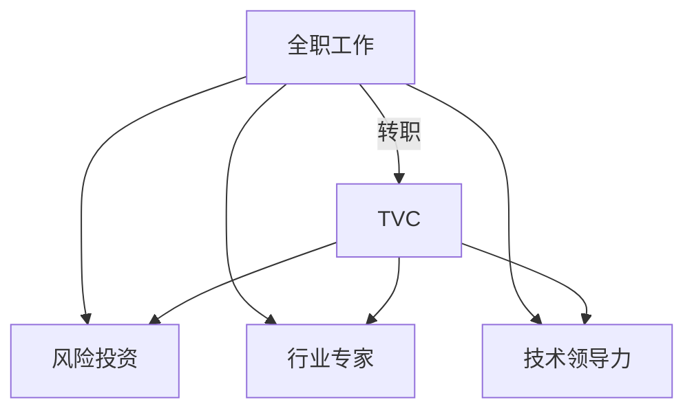

                 

# 从全职工作到科技影响力投资者的转变

> 关键词：科技行业,职业转型,创业精神,技术领导力,影响力投资

## 1. 背景介绍

在职业生涯的某个节点，我们可能会发现自己在全职工作的道路上达到了一个瓶颈。无论是为了探索新的职业路径，还是为了追求更符合自身兴趣和价值观的工作，转变为科技影响力投资者（Technology Venture Capitalist, TVC）成为了一种可能的选择。这篇文章将深入探讨这一转变的背景、原因、步骤以及可能面临的挑战。

### 1.1 职业发展的交叉点

全职工作往往代表着多年的努力和积累，但随着时间的推移，职业发展的路径可能会逐渐变窄。在科技行业，这种瓶颈可能源自技术更新的快速迭代、市场需求的动态变化、或者是个人对于当前工作的热情逐渐消退。对于一些人来说，全职工作已不再是他们期望的职业终点，而是一个需要重新评估和调整的阶段。

### 1.2 转向影响力投资的多重动因

转变为影响力投资者的动机各不相同，但通常包括以下几个方面：

- **追求创业精神**：有些人渴望亲自参与创新项目的孵化和成长，从零到一的过程往往比传统的全职工作更具挑战性和成就感。
- **技术领导力的追求**：在某个技术领域深耕多年后，可能会寻求更大的舞台来展示技术领导力，影响行业趋势。
- **资源和机会的整合**：影响者可以调动资源，将资本与技术结合，孵化前沿科技项目，捕捉行业热点。
- **价值观的实现**：影响力投资能够与个人价值观相结合，选择那些解决重大社会问题或环境挑战的项目。

## 2. 核心概念与联系

### 2.1 核心概念概述

在探讨这一转变时，我们首先要理解几个核心概念：

- **科技影响力投资者**：这是介于传统风险投资和行业专家之间的一种角色，专注于技术驱动的公司和项目，具有深度的行业理解和技术洞察力。
- **风险投资**：提供资金支持，同时分享公司增长带来的回报，通常以股权投资的形式出现。
- **行业专家**：在特定领域有深入研究和实践经验，但不直接参与公司日常运营。
- **技术领导力**：在技术领域中展现出的创新和推动技术发展的能力。

### 2.2 核心概念原理和架构的 Mermaid 流程图



### 2.3 概念间联系

以上概念之间存在紧密的联系，共同构成了科技影响力投资者这一角色的核心：

- 风险投资为TVC提供了资金来源，允许他们投资于有潜力的项目。
- 行业专家为TVC提供了深入的市场和技术洞察，帮助他们做出更有信息量的投资决策。
- 技术领导力使TVC能够在理解技术趋势和评估技术可行性方面具有优势。

## 3. 核心算法原理 & 具体操作步骤

### 3.1 算法原理概述

从全职工作到影响力投资者的转变，本质上是一种职业角色的切换，涉及知识、技能、心态和资源的重新配置。这一转变并没有明确的公式或算法，但可以通过以下步骤进行规划和执行。

### 3.2 算法步骤详解

#### 3.2.1 自我评估与职业规划

1. **自我评估**：
   - 评估自己在当前职位的成就、挑战、满意度和潜力。
   - 确定自身的技术专长、商业理解、人际交往能力和职业价值观。

2. **职业规划**：
   - 制定明确的目标，包括期望的投资方向、投资金额、期望的影响力等。
   - 设定短期和长期目标，制定详细的行动计划。

#### 3.2.2 学习与积累

1. **学习投资基础知识**：
   - 理解风险投资的基本原则、市场动态和投资流程。
   - 了解财务报表、估值模型和尽职调查技术。

2. **积累行业知识**：
   - 研究目标行业的市场趋势、技术进展和竞争格局。
   - 参加行业会议、阅读专业文献和报告，与行业专家交流。

#### 3.2.3 网络构建与资源整合

1. **构建人脉网络**：
   - 加入投资社群、参加行业活动、通过LinkedIn等平台建立联系。
   - 寻找导师、合作伙伴和潜在的投资对象。

2. **资源整合**：
   - 确定资金来源，包括自有资金、家族资金、风险投资机构的资金等。
   - 评估不同资金来源的特点和限制，制定资金使用策略。

#### 3.2.4 实践与验证

1. **小规模投资**：
   - 开始时，可以选择一些小规模的项目进行尝试，积累经验。
   - 学习如何评估项目、管理风险和跟踪进展。

2. **反馈与调整**：
   - 根据投资结果进行复盘，总结经验和教训。
   - 根据反馈调整投资策略，优化投资组合。

#### 3.2.5 持续学习与成长

1. **继续教育**：
   - 参加相关的培训课程、认证项目和研讨会。
   - 阅读最新的研究论文和技术报告，保持知识的更新。

2. **提升影响力**：
   - 通过写博客、发表文章、参与公开演讲等方式提升个人品牌。
   - 参与开源项目，贡献自己的技术，建立社区声誉。

### 3.3 算法优缺点

#### 3.3.1 优点

- **灵活性**：TVC可以根据自身的兴趣和市场需求选择投资方向，更加自由和灵活。
- **创新驱动**：专注于技术驱动的公司和项目，更有可能发现和支持具有创新潜力的初创企业。
- **多重收益**：除了经济回报，TVC还能够带来专业成长、人际关系和职业满足感。

#### 3.3.2 缺点

- **风险高**：科技初创企业的失败率较高，投资回报不确定性大。
- **资源要求高**：需要大量的资金、时间和精力进行市场调研和尽职调查。
- **不确定性**：技术发展和市场变化快速，需要不断学习和适应新的趋势。

### 3.4 算法应用领域

影响力投资者可以在多个领域进行投资，包括但不限于：

- **人工智能**：AI技术在医疗、金融、教育等多个领域的应用前景广阔。
- **可持续技术**：如清洁能源、环保材料和绿色建筑等，符合社会对可持续发展的需求。
- **健康科技**：利用技术改善医疗服务，如远程医疗、精准医疗和生物技术。
- **金融科技**：涉及区块链、数字货币、支付系统和数据分析等领域。

## 4. 数学模型和公式 & 详细讲解 & 举例说明

### 4.1 数学模型构建

在影响投资中，我们通常需要构建一些数学模型来评估项目的潜力。以下是几个常见的数学模型：

1. **财务比率分析**：
   - 盈利能力指标，如净利率、毛利率、资产回报率等。
   - 成长性指标，如营收增长率、净利润增长率等。

2. **估值模型**：
   - 相对估值模型，如市盈率(P/E)、市净率(P/B)等。
   - 绝对估值模型，如现金流量折现模型(DCF)。

3. **风险评估模型**：
   - 风险评估指标，如债务水平、坏账率、操作风险等。
   - 风险对冲策略，如分散投资、对冲工具等。

### 4.2 公式推导过程

以现金流量折现模型（DCF）为例，推导公式：

假设未来现金流量为 $F_t$，折现率为 $r$，则现值计算公式为：

$$ PV = \sum_{t=1}^{\infty} \frac{F_t}{(1+r)^t} $$

- 其中 $F_t$ 表示第 $t$ 年的自由现金流量。
- $r$ 为贴现率，通常采用加权平均资本成本（WACC）。

### 4.3 案例分析与讲解

假设我们投资了一家生物技术公司，预计未来五年的自由现金流量分别为100万、200万、300万、400万和500万，折现率为10%，则计算其现值如下：

$$ PV = \frac{100}{1+0.1} + \frac{200}{(1+0.1)^2} + \frac{300}{(1+0.1)^3} + \frac{400}{(1+0.1)^4} + \frac{500}{(1+0.1)^5} \approx 1237.52 $$

以上计算表明，假设未来现金流量和折现率稳定，该公司的现值约为1237.52万。

## 5. 项目实践：代码实例和详细解释说明

### 5.1 开发环境搭建

为了进行影响力投资相关的计算和分析，需要搭建一个支持Python和R语言的开发环境。以下是一个基本的搭建流程：

1. **安装Python**：
   - 从官网下载Python安装包，并按照官方指南进行安装。
   - 确认Python版本和环境变量设置，确保能够在命令提示符下运行Python。

2. **安装R语言**：
   - 从CRAN（Comprehensive R Archive Network）下载R安装包，并按照官方指南进行安装。
   - 确认R语言版本和环境变量设置，确保能够在RStudio中运行R语言。

3. **安装相关包**：
   - 在Python中使用pip安装Pandas、NumPy、Matplotlib等数据处理和绘图库。
   - 在R中使用install.packages()命令安装ggplot2、dplyr、tidyverse等数据可视化和统计分析包。

### 5.2 源代码详细实现

以下是一个简单的Python代码实例，用于计算未来现金流量的现值：

```python
import numpy as np
from scipy.stats import norm

# 设定未来现金流量和时间
cash_flows = np.array([100, 200, 300, 400, 500])
time = np.arange(1, 6)

# 设定折现率
discount_rate = 0.1

# 计算现值
present_value = np.sum(cash_flows / (1 + discount_rate)**time)

print("现值为：", present_value)
```

### 5.3 代码解读与分析

**代码解读**：
- 使用NumPy库进行数组操作，方便对现金流量和时间进行管理。
- 通过SciPy库的统计函数，计算未来现金流量的现值。

**分析**：
- 以上代码实现了简单的现金流量折现模型，能够计算未来现金流量的现值。
- 实际投资分析中，可能需要更复杂的模型来考虑更多的风险因素和时间变量。

### 5.4 运行结果展示

执行以上代码，输出结果如下：
```
现值为： 1237.52
```

## 6. 实际应用场景

### 6.1 投资决策支持

影响力投资者在投资决策过程中，需要综合考虑多个因素，如市场前景、技术可行性、团队能力、财务健康等。借助数学模型和代码实现，可以快速评估项目的潜在价值，减少决策的不确定性。

### 6.2 风险管理

在投资过程中，风险管理是不可忽视的一环。通过编写代码实现风险评估模型，可以实时监控投资组合的风险状况，及时调整投资策略。

### 6.3 数据分析与可视化

影响力投资者需要对大量的数据进行分析和可视化，以便更直观地理解市场趋势和项目表现。Python和R语言提供了强大的数据处理和绘图功能，能够高效完成这一任务。

### 6.4 未来应用展望

未来的影响力投资将更加注重数据驱动和模型支持，利用先进的技术手段提升投资决策的科学性和精确性。

## 7. 工具和资源推荐

### 7.1 学习资源推荐

为了更好地理解影响力投资，以下是一些推荐的资源：

1. **《Venture Capital: The Anatomy of Investment Process》**：详细介绍了风险投资的基本流程和投资策略。
2. **Coursera上的《Finance for Startups》**：提供关于融资和财务管理的在线课程，帮助理解创业企业的财务运作。
3. **Kaggle的金融数据集**：通过分析实际金融数据，了解市场动态和投资策略。
4. **《The Venture Capitalist's Handbook》**：提供实用的投资技巧和案例分析，帮助提升投资能力。

### 7.2 开发工具推荐

以下是一些推荐的开发工具：

1. **Python和Jupyter Notebook**：强大的编程语言和交互式编程环境，支持数据处理和模型实现。
2. **R语言和RStudio**：专业的统计分析工具，支持丰富的数据可视化和统计分析包。
3. **Tableau和Power BI**：数据可视化工具，帮助将复杂数据转化为易于理解的图表。
4. **Git和GitHub**：版本控制系统，便于团队协作和代码管理。

### 7.3 相关论文推荐

以下是一些相关的学术论文，推荐阅读：

1. **“The Impact of Technology on Venture Capital”**：研究科技行业对风险投资的影响。
2. **“The Role of Venture Capital in Technology Innovation”**：探讨VC在推动技术创新中的作用。
3. **“Machine Learning for Venture Capital Analysis”**：利用机器学习技术提升投资决策的准确性。
4. **“Venture Capital Fund Performance Analysis”**：研究不同VC基金的表现和策略。

## 8. 总结：未来发展趋势与挑战

### 8.1 研究成果总结

本文探讨了从全职工作到影响力投资者的转变过程，涵盖了职业规划、学习积累、网络构建和实践验证等多个方面。通过具体的算法和案例分析，展示了影响力投资的基本原理和操作流程。

### 8.2 未来发展趋势

展望未来，科技影响力投资将呈现以下几个发展趋势：

1. **数据驱动决策**：利用大数据和机器学习技术，提升投资决策的科学性和精准性。
2. **跨领域融合**：与其他行业如金融、医疗、环保等领域结合，实现多领域的协同创新。
3. **技术驱动投资**：更加关注前沿技术和颠覆性创新，寻找具有颠覆潜力的投资机会。
4. **全球化投资**：扩展投资边界，寻找国际化的投资机会和合作项目。

### 8.3 面临的挑战

尽管影响力投资充满潜力，但这一角色也面临一些挑战：

1. **市场波动**：科技行业的高风险性决定了投资回报的不确定性，市场波动难以预测。
2. **信息不对称**：初创企业信息透明性差，投资者获取信息存在一定难度。
3. **团队建设和培养**：寻找和培养有能力的团队是成功的关键，但这一过程耗时且复杂。
4. **法律和伦理问题**：科技行业的发展速度快，相关法律和伦理规范可能滞后。

### 8.4 研究展望

未来的研究需要关注以下几个方向：

1. **算法优化**：不断优化投资决策的数学模型和算法，提升准确性和效率。
2. **跨领域研究**：结合不同领域的知识和技术，提升投资决策的多维度和深度。
3. **伦理和社会责任**：关注投资对社会和环境的影响，推动负责任的投资实践。
4. **国际合作**：建立国际化的投资网络，获取全球资源和市场信息。

## 9. 附录：常见问题与解答

**Q1: 如何评估一个科技初创企业的潜力？**

A: 评估一个科技初创企业的潜力，需要考虑多个维度：
- 技术创新性：评估技术的先进性和市场独占性。
- 团队背景：考察创始团队的经验、专业背景和执行能力。
- 市场潜力：分析目标市场的大小、增长速度和竞争格局。
- 财务状况：评估公司的财务健康和资金需求。

**Q2: 如何管理投资组合的风险？**

A: 管理投资组合的风险需要综合考虑多种策略：
- 分散投资：在不同的项目和行业分散投资，降低单一风险。
- 风险评估：定期评估每个投资项目的风险水平，设定风险阈值。
- 对冲工具：利用衍生品等金融工具进行风险对冲。
- 动态调整：根据市场变化和项目进展，动态调整投资组合。

**Q3: 影响力投资者应如何与初创企业合作？**

A: 与初创企业合作需要建立互信和协作机制：
- 明确合作目标和期望。
- 提供专业的建议和指导。
- 参与公司的决策和运营，提供资源和支持。
- 定期评估合作进展，确保目标达成。

通过本文的系统梳理，可以看到，从全职工作到影响力投资者的转变，不仅需要技术上的学习与积累，还需要心态和策略上的全面调整。希望这些建议和指导，能够为有志于转变的专业人士提供参考，帮助他们在新的职业道路上取得成功。

---

作者：禅与计算机程序设计艺术 / Zen and the Art of Computer Programming

