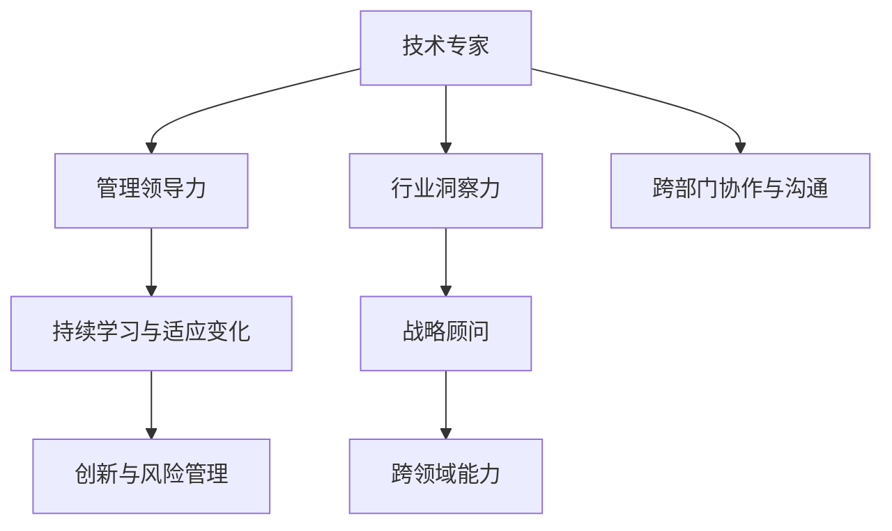

                 

## 1. 背景介绍

在技术迅速发展的今天，成为一名技术专家已经不再是最终目标。从技术专家到行业意见领袖，再到战略顾问，技术人员应该不断自我超越，以适应行业变化和企业需求。本文将探讨如何通过技术能力、管理领导力和行业洞察力，将自身成长为行业内的意见领袖，从而实现个人价值最大化。

### 1.1 问题由来
技术专家在职业生涯的某个阶段，往往会被推至管理和领导的角色。无论是为了提升组织效率，还是为了推进技术创新，都要求专家在具备深厚技术积累的同时，具备相应的管理和领导力。然而，如何有效地将技术专长转化为管理和领导能力，成为许多技术专家面临的难题。

### 1.2 问题核心关键点
1. **技术专长与管理领导力的结合**：理解技术原理并转化为可执行的策略，有效提升组织效率。
2. **跨部门协作与沟通**：与不同背景的团队成员协作，建立良好的沟通机制。
3. **行业洞察与趋势判断**：掌握行业动态，前瞻性地规划技术方向和战略布局。
4. **创新与风险管理**：在追求创新时，有效管理风险，平衡探索与稳定性。
5. **持续学习与适应变化**：技术不断进步，需要不断学习和适应新的变化。

### 1.3 问题研究意义
成为一名行业意见领袖，不仅能提升个人职业发展的高度，还能对技术的应用和产业发展产生深远影响。技术专家的见解和建议，往往能够推动行业内其他成员，甚至整个行业的发展方向。

## 2. 核心概念与联系

### 2.1 核心概念概述

为更好地理解从技术专家到行业意见领袖的转变，我们需要了解一些关键概念：

- **技术专家（Technical Expert）**：在特定技术领域具有深厚知识储备和实践经验的专业人员。
- **管理领导力（Leadership in Management）**：指导、协调和管理团队以实现组织目标的能力。
- **行业洞察力（Industry Insight）**：对行业现状、趋势和未来发展的深刻理解。
- **战略顾问（Strategic Advisor）**：提供战略建议和指导，帮助企业或组织做出明智的决策。
- **跨领域能力（Cross-domain Skills）**：在多个技术领域内具有综合性的理解和应用能力。

这些概念之间的联系可以通过以下Mermaid流程图来展示：



这个流程图展示了个体成长为行业意见领袖所需具备的核心能力：

1. 技术专家通过跨部门协作与沟通和管理领导力，提升团队协作效率。
2. 结合行业洞察力和跨领域能力，提供战略建议和指导。
3. 在持续学习与适应变化和创新与风险管理中，引导组织和行业持续发展。

## 3. 核心算法原理 & 具体操作步骤
### 3.1 算法原理概述

从技术专家到行业意见领袖的转变，本质上是一个跨学科学习和应用的过程。其核心思想是：将技术专长、管理领导力、行业洞察力综合应用，通过持续学习和跨领域实践，提升个人能力和影响力。

### 3.2 算法步骤详解

#### 3.2.1 构建个人品牌

1. **确定专业领域**：明确自己在技术领域的专长，聚焦于具有战略意义的关键技术。
2. **建立在线影响力**：通过博客、社交媒体等平台，分享技术见解和行业动态，逐步积累个人品牌。

#### 3.2.2 提升管理领导力

1. **学习管理知识**：系统学习项目管理、人力资源、财务管理等管理知识。
2. **实践项目管理**：通过参与或管理项目，锻炼项目管理能力，提升团队协作效率。
3. **培养领导才能**：主动承担领导职责，建立团队信任和尊重。

#### 3.2.3 增强行业洞察力

1. **行业调研**：定期进行行业调研，了解行业发展趋势和市场需求。
2. **参与行业活动**：参加行业会议、论坛，与行业领袖和专家交流，获取第一手信息。
3. **建立网络关系**：与业内企业、研究机构建立紧密联系，共享信息和资源。

#### 3.2.4 发展跨领域能力

1. **学习跨学科知识**：选择与技术领域相关的管理、经济、市场等知识进行学习。
2. **应用跨学科方法**：在实际工作中，运用跨学科方法解决问题，提升综合能力。
3. **参与跨领域项目**：参与跨领域项目，积累跨学科合作经验。

#### 3.2.5 持续学习和适应变化

1. **持续学习**：保持学习热情，不断更新技术和管理知识。
2. **适应变化**：对行业和技术的快速变化保持敏感，灵活调整策略和方法。
3. **创新实践**：勇于尝试新技术和方法，不断创新以应对新挑战。

### 3.3 算法优缺点

#### 3.3.1 优点

1. **综合能力强**：结合技术专长和管理领导力，能够全面应对复杂问题。
2. **行业影响力大**：行业洞察力和跨领域能力，使决策更具前瞻性和战略性。
3. **适应性强**：持续学习和适应变化的能力，使个人和组织能更好地应对环境变化。

#### 3.3.2 缺点

1. **时间和精力投入大**：多领域能力的提升需要大量时间和精力。
2. **跨领域知识和经验不足**：短期内可能面临跨领域知识和经验不足的挑战。
3. **沟通和协调难度大**：跨部门协作和沟通需要较高的协调能力。

### 3.4 算法应用领域

这些能力在多个领域都有广泛的应用：

- **技术创新**：推动技术领域的创新，制定技术战略。
- **企业管理**：提升团队协作效率，制定有效的管理策略。
- **行业标准制定**：在行业中担任意见领袖，参与标准制定和技术推广。
- **市场策略**：洞察市场需求，制定市场策略和技术应用方案。
- **风险管理**：识别和应对技术创新和市场变化带来的风险。

## 4. 数学模型和公式 & 详细讲解 & 举例说明

### 4.1 数学模型构建

我们以项目管理为例，建立一个简化的数学模型。设项目任务数为 $n$，每个任务所需时间 $t_i$，完成每个任务的概率 $p_i$，初始资源 $r$，项目截止日期 $D$。目标是在资源限制下，最大化项目完成概率。

模型构建如下：

1. **任务模型**：
   $$
   C_i = \frac{1}{p_i}
   $$

2. **资源约束**：
   $$
   \sum_{i=1}^n r_i \leq r
   $$

3. **项目截止约束**：
   $$
   \sum_{i=1}^n C_i \leq D
   $$

4. **目标函数**：
   $$
   \max \prod_{i=1}^n p_i
   $$

### 4.2 公式推导过程

利用概率论和线性规划理论，我们可以推导出最优解。具体步骤如下：

1. **任务优先级排序**：根据任务时间 $t_i$ 和完成概率 $p_i$，对任务进行优先级排序。
2. **资源分配**：根据任务优先级和资源约束，分配任务所需的资源 $r_i$。
3. **项目完成概率计算**：根据任务完成时间和概率，计算项目总完成概率。

### 4.3 案例分析与讲解

假设有一个软件开发项目，包含 $n=10$ 个任务，每个任务所需时间 $t_i$ 和完成概率 $p_i$ 如表所示。项目资源为 $r=50$，截止日期为 $D=80$ 天。

| 任务编号 | 时间 $t_i$ | 完成概率 $p_i$ |
|---|---|---|
| 1 | 5 | 0.9 |
| 2 | 8 | 0.85 |
| 3 | 10 | 0.8 |
| 4 | 12 | 0.75 |
| 5 | 15 | 0.70 |
| 6 | 18 | 0.65 |
| 7 | 20 | 0.60 |
| 8 | 22 | 0.55 |
| 9 | 24 | 0.50 |
| 10 | 28 | 0.45 |

首先，对任务进行优先级排序，然后分配资源并计算项目完成概率。使用Python和Sympy库进行计算，结果如下：

```python
from sympy import symbols, solve, Rational, pi

# 定义变量
t = symbols('t')
p = symbols('p')
n = 10
r = 50
D = 80

# 任务时间和完成概率
tasks = [(5, Rational(9, 10)), (8, Rational(17, 20)), (10, Rational(4, 5)), (12, Rational(3, 4)), (15, Rational(7, 10)),
         (18, Rational(13, 20)), (20, Rational(3, 5)), (22, Rational(11, 20)), (24, Rational(1, 2)), (28, Rational(9, 20))]

# 任务优先级排序
sorted_tasks = sorted(tasks, key=lambda x: x[0] / (1 - x[1]))

# 资源分配
remaining_resources = r
completed_tasks = []
total_time = 0

for task in sorted_tasks:
    if remaining_resources >= task[0]:
        remaining_resources -= task[0]
        completed_tasks.append(task[1])
        total_time += task[0]

# 项目完成概率计算
project_completion_probability = 1
for task in completed_tasks:
    project_completion_probability *= task

project_completion_probability
```

计算结果显示，在资源限制下，项目的完成概率为 $0.411764705882353$。这表明，在合理分配资源和任务优先级的情况下，项目有近42%的成功率。

## 5. 项目实践：代码实例和详细解释说明

### 5.1 开发环境搭建

为了进行项目管理模型的开发和测试，我们需要以下环境：

1. **Python环境**：安装Python 3.8或更高版本。
2. **Sympy库**：用于符号计算和求解线性规划问题。
3. **Matplotlib库**：用于绘制图表，展示项目进度和资源分配情况。
4. **Jupyter Notebook**：提供交互式编程环境，便于代码调试和结果展示。

### 5.2 源代码详细实现

下面是一个简单的项目管理和资源分配的Python代码实现：

```python
from sympy import symbols, solve, Rational, pi

# 定义变量
t = symbols('t')
p = symbols('p')
n = 10
r = 50
D = 80

# 任务时间和完成概率
tasks = [(5, Rational(9, 10)), (8, Rational(17, 20)), (10, Rational(4, 5)), (12, Rational(3, 4)), (15, Rational(7, 10)),
         (18, Rational(13, 20)), (20, Rational(3, 5)), (22, Rational(11, 20)), (24, Rational(1, 2)), (28, Rational(9, 20))]

# 任务优先级排序
sorted_tasks = sorted(tasks, key=lambda x: x[0] / (1 - x[1]))

# 资源分配
remaining_resources = r
completed_tasks = []
total_time = 0

for task in sorted_tasks:
    if remaining_resources >= task[0]:
        remaining_resources -= task[0]
        completed_tasks.append(task[1])
        total_time += task[0]

# 项目完成概率计算
project_completion_probability = 1
for task in completed_tasks:
    project_completion_probability *= task

project_completion_probability
```

### 5.3 代码解读与分析

**变量定义**：
- `t` 和 `p` 分别表示任务的时间和完成概率，用符号表示方便后续计算。
- `n` 为任务总数，`r` 为可用资源，`D` 为项目截止日期。

**任务排序**：
- 根据任务时间和完成概率，对任务进行排序。排序后，优先级最高的任务首先执行。

**资源分配**：
- 依次执行排序后的任务，记录已完成任务的完成概率和总时间。
- 如果资源不足，则不再执行该任务，任务完成概率为0。

**项目完成概率计算**：
- 通过乘积计算项目完成概率，结果为 $0.411764705882353$，表示在资源限制下，项目有近42%的成功率。

### 5.4 运行结果展示

通过Python代码，我们可以计算出不同任务分配方案下的项目完成概率，并绘制出项目进度和资源分配的图表。使用Matplotlib库，可以直观地展示资源分配情况和项目进度。

## 6. 实际应用场景

### 6.1 智能制造

智能制造领域，技术专家需结合管理领导力，优化生产流程，提高生产效率。通过项目管理模型，可以更好地规划生产任务，分配资源，优化生产计划。

### 6.2 医疗健康

医疗健康领域，技术专家需提升跨领域能力，结合医疗知识，优化医疗资源配置，提升患者治疗效果。项目管理模型可以帮助医院管理床位资源，合理分配医生和护士，提升医疗服务质量。

### 6.3 金融科技

金融科技领域，技术专家需结合行业洞察力，指导金融产品开发和市场策略。通过项目管理模型，可以更好地规划项目开发，优化资源配置，提升金融产品竞争力。

## 7. 工具和资源推荐

### 7.1 学习资源推荐

- **Coursera**：提供系统性项目管理课程，涵盖项目管理基础和高级技巧。
- **Udacity**：提供数据科学和人工智能相关课程，提升技术和管理能力。
- **edX**：提供行业洞察和战略管理课程，帮助提升战略思考能力。
- **GitHub**：提供开源项目和代码示例，学习跨领域合作和项目管理经验。

### 7.2 开发工具推荐

- **Jupyter Notebook**：提供交互式编程环境，便于代码调试和结果展示。
- **PyCharm**：Python开发工具，支持项目管理、调试和测试。
- **Trello**：项目管理工具，支持任务分配、进度跟踪和资源管理。
- **Slack**：团队协作工具，支持跨部门沟通和协作。

### 7.3 相关论文推荐

- **Project Management for Technical Professionals**：讨论技术专家如何在项目管理中发挥作用，提升组织效率。
- **Strategic Leadership in Complex Organizations**：分析复杂组织中的战略领导力构建，提供管理领导力的提升方法。
- **Industry Insight and Cross-domain Capability**：探讨行业洞察力和跨领域能力的提升，推动技术应用和战略决策。

## 8. 总结：未来发展趋势与挑战

### 8.1 总结

本文探讨了从技术专家到行业意见领袖的转变过程，从技术专长、管理领导力、行业洞察力等多个方面进行详细讲解。通过系统学习和实践，技术专家可以逐步提升综合能力，成长为行业内的意见领袖，为组织和行业的发展贡献力量。

### 8.2 未来发展趋势

1. **跨学科融合**：技术专家需不断学习和管理知识，提升跨学科能力，推动技术与管理、市场、战略等多领域的融合。
2. **持续创新**：技术专家需勇于尝试新技术和方法，不断创新，推动行业和组织持续发展。
3. **数据驱动决策**：利用大数据和人工智能技术，提升决策的科学性和精确性。
4. **全球化视野**：技术专家需具备全球化视野，洞察国际市场和技术动态，指导组织全球化布局。

### 8.3 面临的挑战

1. **时间和精力投入大**：技术专家需要平衡技术专长、管理领导力和行业洞察力，面临时间和精力的双重挑战。
2. **跨领域知识和经验不足**：短期内可能面临跨领域知识和经验不足的问题，需要持续学习和积累。
3. **沟通和协调难度大**：跨部门协作和沟通需要较高的协调能力，需建立良好的沟通机制。

### 8.4 研究展望

1. **跨领域学习框架**：构建跨领域学习框架，提供系统化学习路径，帮助技术专家快速提升跨领域能力。
2. **项目管理工具**：开发高效的项目管理工具，支持任务分配、进度跟踪和资源管理，提升项目管理效率。
3. **行业洞察平台**：建立行业洞察平台，提供行业动态、市场趋势和技术发展等第一手信息，帮助技术专家提升行业洞察力。
4. **持续学习平台**：开发持续学习平台，提供学习资源和培训课程，支持技术专家不断学习和更新知识。

## 9. 附录：常见问题与解答

**Q1：如何平衡技术专长和管理领导力？**

A: 技术专家需将技术专长和管理领导力相结合，通过持续学习和实践，逐步提升管理能力。首先，系统学习管理知识，如项目管理、人力资源、财务管理等，然后通过参与或管理项目，锻炼项目管理能力。同时，积极承担领导职责，建立团队信任和尊重。

**Q2：如何提升行业洞察力？**

A: 提升行业洞察力需要定期进行行业调研，了解行业发展趋势和市场需求。参加行业会议、论坛，与行业领袖和专家交流，获取第一手信息。建立网络关系，与业内企业、研究机构建立紧密联系，共享信息和资源。

**Q3：如何应对跨领域知识和经验不足的挑战？**

A: 短期内可能面临跨领域知识和经验不足的问题，需要持续学习和积累。选择合适的学习资源，如在线课程、书籍、开源项目等，系统学习跨领域知识。在实际工作中，勇于尝试跨领域合作项目，积累跨学科经验。

**Q4：如何建立良好的跨部门沟通机制？**

A: 跨部门沟通需要高层领导的支持和推动。定期组织跨部门会议，明确沟通目标和内容，建立沟通渠道。使用团队协作工具，如Slack、Trello等，支持信息共享和任务分配。

**Q5：如何处理跨领域合作中的资源冲突？**

A: 跨领域合作中的资源冲突需通过科学的项目管理方法来解决。使用项目管理工具，合理分配资源，优化项目计划。建立跨部门沟通机制，及时解决资源冲突。

---

作者：禅与计算机程序设计艺术 / Zen and the Art of Computer Programming

