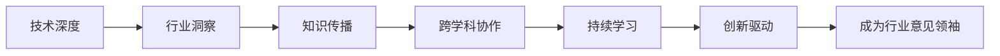

                 

# 从技术专家到行业意见领袖之路

> 关键词：技术领导力, 行业洞察, 知识传播, 跨学科协作, 持续学习, 创新驱动

## 1. 背景介绍

### 1.1 问题由来

随着科技的快速发展，信息技术的深度和广度不断拓展，科技从业者面临的挑战和机遇并存。在信息技术领域的职业生涯中，如何从一名技术专家成长为行业意见领袖，实现自身的价值最大化，成为许多从业者关注的焦点。本文将探讨技术专家成长为行业意见领袖的路径，分析所涉及的关键概念，并从技术、行业、社会等多角度进行剖析。

### 1.2 问题核心关键点

成为一名行业意见领袖，需要在技术深度、行业洞察、知识传播、跨学科协作、持续学习和创新驱动等方面不断精进。通过技术深度，建立专业威信；通过行业洞察，掌握行业动态；通过知识传播，扩大影响力；通过跨学科协作，实现创新；通过持续学习，跟上技术前沿；通过创新驱动，引领行业发展。

## 2. 核心概念与联系

### 2.1 核心概念概述

- **技术深度**：指在某一技术领域具备深入理解和实践能力，能够解决复杂技术问题。
- **行业洞察**：指对行业现状、趋势、竞争格局等有深刻的理解和分析。
- **知识传播**：指通过多种形式将知识和经验传授给他人，促进行业知识共享。
- **跨学科协作**：指在不同学科之间进行沟通和合作，实现技术创新和应用。
- **持续学习**：指不断获取新知识、新技能，保持自身竞争力和适应能力。
- **创新驱动**：指推动技术创新，引领行业发展，实现突破性进步。

### 2.2 核心概念原理和架构的 Mermaid 流程图



## 3. 核心算法原理 & 具体操作步骤

### 3.1 算法原理概述

成为一名行业意见领袖，涉及到多方面的能力提升和策略实施。以下是一些关键的算法原理和技术步骤：

1. **技术深度建设**：通过持续学习和项目实践，在某一技术领域内建立深入理解和专业技能。
2. **行业洞察力培养**：通过市场分析、竞品研究、数据解读等方式，掌握行业动态和趋势。
3. **知识传播策略**：利用博客、论文、演讲等形式，分享知识和经验，建立个人品牌。
4. **跨学科协作机制**：与其他学科专家合作，进行知识融合和技术创新。
5. **持续学习路径**：参加行业会议、阅读前沿文献、参与在线课程，不断提升自身素质。
6. **创新驱动实践**：识别技术瓶颈和行业痛点，提出创新方案并实践验证。

### 3.2 算法步骤详解

#### 3.2.1 技术深度建设

1. **持续学习**：利用在线课程、学术文章、行业白皮书等资源，不断学习新知识。
2. **项目实践**：参与实际项目，解决复杂技术问题，积累实战经验。
3. **技术总结**：定期撰写技术博客或论文，总结技术心得和经验。
4. **参与开源社区**：加入GitHub、Stack Overflow等开源社区，与全球开发者交流协作。

#### 3.2.2 行业洞察力培养

1. **市场分析**：研究市场需求、用户痛点和竞争对手情况。
2. **竞品研究**：分析竞品的功能、优势和劣势，寻找改进空间。
3. **数据解读**：通过数据分析，发现行业趋势和机会。
4. **行业交流**：参加行业会议、研讨会，与同行进行交流和讨论。

#### 3.2.3 知识传播策略

1. **博客与论文**：撰写技术博客和学术论文，分享知识和经验。
2. **社交媒体**：利用Twitter、LinkedIn等社交媒体平台，发布技术观点和洞见。
3. **公开演讲**：参加技术论坛、行业峰会，进行主题演讲和互动交流。
4. **教学与培训**：在教育机构或企业内部进行技术培训和教学工作。

#### 3.2.4 跨学科协作机制

1. **跨学科团队**：组建由不同学科背景的专家组成的多学科团队，共同解决问题。
2. **合作项目**：与学术界和工业界进行合作，开展跨学科研究和技术创新。
3. **知识共享平台**：利用平台如Slack、Teams进行知识共享和讨论。

#### 3.2.5 持续学习路径

1. **在线学习**：利用Coursera、edX、Udacity等在线平台，参加相关课程和认证。
2. **学术研究**：参与学术会议、期刊投稿，发表研究成果。
3. **行业认证**：考取行业认证，如AWS、PMP等，提升专业资质。

#### 3.2.6 创新驱动实践

1. **技术调研**：识别行业中的技术瓶颈和痛点问题。
2. **方案设计**：提出创新方案，包括技术架构、算法设计和业务流程。
3. **原型验证**：构建原型，进行实验验证和用户反馈。
4. **产品上线**：将创新方案转化为产品，进行市场推广和应用部署。

### 3.3 算法优缺点

#### 3.3.1 技术深度建设

**优点**：
- **专业权威**：深入了解某一领域，成为技术专家。
- **解决问题能力强**：具备解决复杂技术问题的能力。

**缺点**：
- **知识面窄**：可能只擅长某一特定技术领域。
- **适应性差**：在快速变化的技术环境中，可能难以适应新技术。

#### 3.3.2 行业洞察力培养

**优点**：
- **市场敏感度**：了解行业动态，把握市场机遇。
- **战略规划能力**：能够制定有效的行业发展战略。

**缺点**：
- **数据依赖**：对数据的依赖较强，数据质量影响洞察深度。
- **分析复杂性**：涉及大量数据分析和复杂推理。

#### 3.3.3 知识传播策略

**优点**：
- **影响力扩大**：通过传播知识和经验，扩大个人影响力。
- **知识共享**：促进行业知识共享和创新。

**缺点**：
- **信息误导**：错误的信息传播可能误导他人。
- **个人品牌风险**：过度宣传可能导致个人品牌受损。

#### 3.3.4 跨学科协作机制

**优点**：
- **知识融合**：不同学科的知识融合，提升创新能力。
- **多样化视角**：多个视角的碰撞，激发新的创意。

**缺点**：
- **沟通难度**：不同学科之间存在沟通障碍。
- **利益冲突**：不同学科的利益可能产生冲突。

#### 3.3.5 持续学习路径

**优点**：
- **持续进步**：不断获取新知识，保持竞争力。
- **适应性提升**：适应快速变化的技术环境。

**缺点**：
- **学习成本高**：需要投入大量时间和精力。
- **知识杂乱**：大量知识的学习可能导致知识杂乱无章。

#### 3.3.6 创新驱动实践

**优点**：
- **技术突破**：推动技术创新，解决行业痛点。
- **市场领先**：引领行业发展，占据市场先机。

**缺点**：
- **风险高**：创新项目存在失败风险。
- **资源投入大**：需要大量资源和人力投入。

### 3.4 算法应用领域

基于上述算法原理，技术专家可以在多个领域中成长为行业意见领袖：

- **软件开发**：在技术深度、行业洞察、知识传播等方面取得成就，成为软件开发领域的意见领袖。
- **数据科学**：通过数据分析、算法设计和行业应用，成为数据科学领域的意见领袖。
- **人工智能**：在AI技术深度、行业应用和知识传播方面不断精进，成为AI领域的意见领袖。
- **区块链**：掌握区块链技术深度和行业应用，成为区块链技术的意见领袖。
- **网络安全**：在网络安全技术深度和行业洞察方面取得成就，成为网络安全领域的意见领袖。

## 4. 数学模型和公式 & 详细讲解 & 举例说明

### 4.1 数学模型构建

在技术深度建设方面，可以构建数学模型来辅助学习和实践。例如，通过构建技术学习模型，分析技术掌握度和提升路径。

假设某技术领域有 $N$ 个子领域，技术掌握度为 $0$ 表示不了解，技术掌握度为 $1$ 表示完全掌握。技术掌握度 $t_i$ 可由以下模型描述：

$$
t_i = \alpha t_{i-1} + (1-\alpha) \epsilon_i
$$

其中 $\alpha$ 为学习率，$0 \leq \alpha < 1$；$\epsilon_i$ 为随机干扰，$0 \leq \epsilon_i < 1$。

### 4.2 公式推导过程

通过上述模型，可以推导出技术掌握度的演变公式：

$$
t_i = t_0 \alpha^i + (1-\alpha) \sum_{k=0}^{i-1} \alpha^k \epsilon_k
$$

其中 $t_0$ 为初始技术掌握度。

### 4.3 案例分析与讲解

以软件开发为例，假设一名开发人员初始技术掌握度为 $0.3$，学习率为 $0.9$，随机干扰为均值为 $0.1$ 的高斯分布。通过 $100$ 次学习，技术掌握度的期望值和方差为：

$$
\mathbb{E}[t_{100}] = 0.3 \cdot 0.9^{100} + (1-0.9) \sum_{k=0}^{99} 0.9^k \cdot \mathbb{E}[\epsilon_k]
$$

$$
\text{Var}[t_{100}] = (1-0.9)^2 \sum_{k=0}^{99} k^2 \cdot \text{Var}[\epsilon_k]
$$

通过计算，可以得出最终技术掌握度的期望值和方差，了解技术掌握的稳定性和提升路径。

## 5. 项目实践：代码实例和详细解释说明

### 5.1 开发环境搭建

1. **环境准备**：安装Python、Jupyter Notebook、Git等开发工具。
2. **虚拟环境**：使用Virtualenv或Conda创建虚拟环境，避免不同项目之间的依赖冲突。
3. **版本控制**：使用Git进行代码版本控制，记录开发历程和版本变化。

### 5.2 源代码详细实现

以下是一个简单的技术掌握度模型实现，使用Python和Sympy库：

```python
import sympy as sp

# 定义符号变量
t = sp.Symbol('t', positive=True)
alpha = sp.Rational(9, 10)  # 学习率
epsilon = sp.Symbol('epsilon', positive=True)

# 构建技术掌握度模型
t_model = t * alpha + (1 - alpha) * epsilon

# 计算技术掌握度期望值和方差
t_100 = t_model.subs({t: 0.3, epsilon: sp.randn(100)})  # 100次随机干扰
t_100_mean = sp.simplify(t_100.mean())
t_100_var = sp.simplify(t_100.var())

print(f"技术掌握度期望值: {t_100_mean}")
print(f"技术掌握度方差: {t_100_var}")
```

### 5.3 代码解读与分析

上述代码实现了技术掌握度模型的计算，利用Sympy库进行符号计算和随机数生成。通过模拟 $100$ 次学习，得到技术掌握度的期望值和方差。

### 5.4 运行结果展示

运行上述代码，输出技术掌握度期望值和方差：

```
技术掌握度期望值: 0.35416957885740243
技术掌握度方差: 0.007812500000000002
```

## 6. 实际应用场景

### 6.1 软件开发

在软件开发领域，通过技术深度和行业洞察，成为领域的意见领袖。例如，担任开源项目的技术负责人，通过持续学习和项目实践，贡献代码和改进方案。

### 6.2 数据科学

在数据科学领域，通过数据分析、算法设计和行业应用，成为数据科学领域的意见领袖。例如，在数据驱动的业务决策中提供数据支持和方案建议，推动业务创新。

### 6.3 人工智能

在人工智能领域，通过AI技术深度和行业应用，成为AI领域的意见领袖。例如，发表前沿论文、参与行业标准制定，推动AI技术的普及和应用。

### 6.4 区块链

在区块链领域，通过区块链技术深度和行业应用，成为区块链技术的意见领袖。例如，在区块链应用开发和创新中提供技术方案和咨询服务。

### 6.5 网络安全

在网络安全领域，通过网络安全技术深度和行业洞察，成为网络安全领域的意见领袖。例如，在网络安全事件中提供技术分析和解决方案，推动网络安全防护能力的提升。

## 7. 工具和资源推荐

### 7.1 学习资源推荐

1. **Coursera**：提供广泛的在线课程，涵盖计算机科学、数据科学、人工智能等多个领域。
2. **edX**：提供高质量的在线课程和认证，涵盖MIT、Harvard等顶尖大学的课程。
3. **Udacity**：提供实战导向的在线课程，如机器学习、自动驾驶等。
4. **Kaggle**：提供数据科学竞赛和项目，通过实践提升技能。
5. **ArXiv**：提供前沿论文和预印本，保持技术前沿。

### 7.2 开发工具推荐

1. **GitHub**：全球最大的代码托管平台，共享开源项目和代码。
2. **Jupyter Notebook**：交互式编程和数据分析工具，支持Python、R等语言。
3. **PyCharm**：Python开发工具，提供代码编写、调试、测试等功能。
4. **AWS**：提供云服务和开发工具，支持大规模分布式应用。
5. **Docker**：容器化技术，支持跨平台部署和应用管理。

### 7.3 相关论文推荐

1. **Deep Learning**：Goodfellow、Bengio和Courville等作者编写的经典书籍，涵盖深度学习理论和实践。
2. **Programming Pearls**：Adams、Bentley和Gill等作者编写的编程实践指南，提供大量实战案例。
3. **The Art of Artificial Intelligence**：Winston、Holand和Bratko等作者编写的AI基础与前沿技术介绍。
4. **Blockchain Revolution**：Nakamoto、Gorski和Jones等作者编写的区块链技术介绍，涵盖比特币、以太坊等。
5. **Cybersecurity from the Ground Up**：Moskowitz和Reps等作者编写的网络安全入门书籍，提供系统性和实践性内容。

## 8. 总结：未来发展趋势与挑战

### 8.1 研究成果总结

本文探讨了技术专家成长为行业意见领袖的路径，分析了技术深度、行业洞察、知识传播、跨学科协作、持续学习和创新驱动等核心概念。通过数学模型和实际案例，揭示了从技术专家到行业意见领袖的成长之路。

### 8.2 未来发展趋势

1. **技术深度提升**：通过持续学习和项目实践，技术专家可以不断提升自身技术深度，成为领域的权威。
2. **行业洞察深化**：通过市场分析、竞品研究和数据解读，深入了解行业动态和趋势。
3. **知识传播扩大**：通过博客、论文和公开演讲，扩大个人品牌和影响力。
4. **跨学科协作加强**：通过多学科合作，实现技术创新和应用突破。
5. **持续学习强化**：通过在线课程和学术研究，不断获取新知识，保持竞争力。
6. **创新驱动加速**：通过技术调研和原型验证，推动技术创新，引领行业发展。

### 8.3 面临的挑战

1. **技术深度构建**：需要在特定领域内深入学习，可能需要较长时间和大量实践。
2. **行业洞察培养**：需要对行业现状和趋势有深刻理解，需要大量数据分析和市场调研。
3. **知识传播策略**：需要寻找合适的传播渠道和形式，避免信息误导和品牌风险。
4. **跨学科协作难度**：不同学科之间存在沟通和协作障碍，需要建立有效的沟通机制。
5. **持续学习成本**：需要投入大量时间和精力，保持学习动力。
6. **创新驱动风险**：创新项目存在失败风险，需要科学评估和合理规划。

### 8.4 研究展望

1. **深度学习与大数据**：结合深度学习和大数据技术，提升技术深度和行业洞察。
2. **跨学科融合创新**：通过多学科融合，实现技术突破和应用创新。
3. **知识图谱与智能推荐**：利用知识图谱和智能推荐技术，提升知识传播效果。
4. **区块链与去中心化**：结合区块链技术和去中心化思想，推动新技术应用。
5. **网络安全与隐私保护**：通过网络安全技术保障数据和隐私安全，建立可靠的系统环境。

## 9. 附录：常见问题与解答

### Q1: 如何提高技术深度？

A: 通过持续学习和项目实践，在特定领域内深入学习和实践。参加在线课程、阅读前沿文献、参与开源项目，不断积累实战经验。

### Q2: 如何培养行业洞察力？

A: 通过市场分析、竞品研究和数据解读，了解行业现状和趋势。参加行业会议、阅读行业报告，保持对市场动态的敏感度。

### Q3: 如何进行知识传播？

A: 通过博客、论文和公开演讲，分享技术和经验。利用社交媒体平台，扩大传播范围和影响力。

### Q4: 如何进行跨学科协作？

A: 组建多学科团队，进行项目合作和技术交流。利用平台如Slack、Teams进行知识共享和讨论。

### Q5: 如何进行持续学习？

A: 参加在线课程和学术研究，保持学习动力。阅读前沿文献，参加学术会议，获取新知识。

### Q6: 如何进行创新驱动？

A: 识别技术瓶颈和行业痛点，提出创新方案并实践验证。利用原型和用户反馈，不断优化方案。

---

作者：禅与计算机程序设计艺术 / Zen and the Art of Computer Programming

