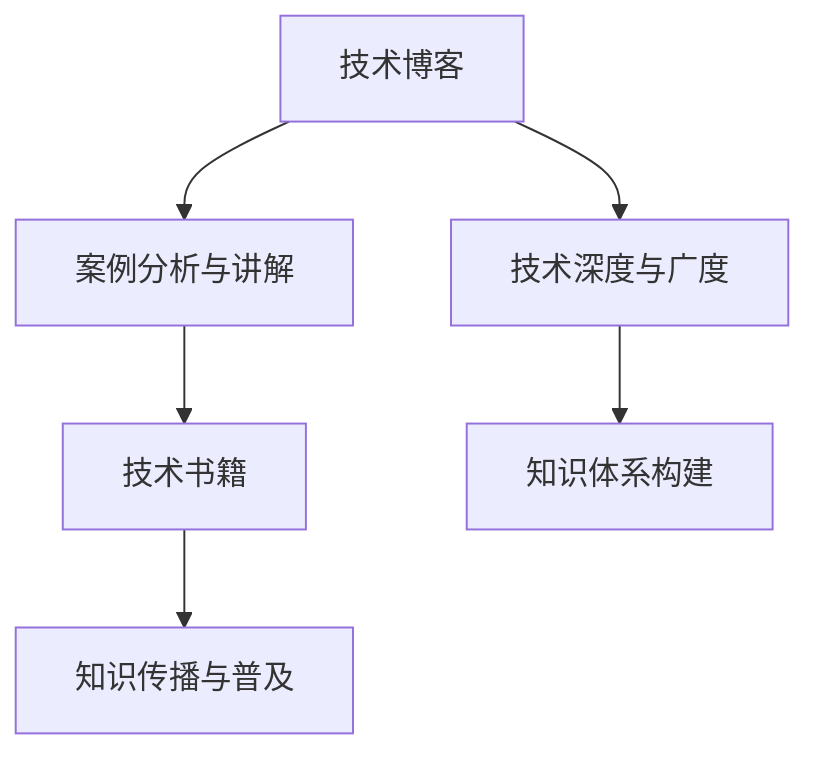

                 

# 从技术博客到畅销技术书籍的进阶

## 1. 背景介绍

### 1.1 问题由来
在信息技术快速发展的今天，技术博客作为一种有效、即时的知识传播方式，扮演了重要角色。然而，仅仅撰写技术博客已无法满足日益增长的知识需求和复杂的应用场景。如何在技术博客的基础上，将专业、实用的知识上升为更具影响力和深度的畅销技术书籍，成为了技术从业者面临的重要挑战。

### 1.2 问题核心关键点
从技术博客到畅销技术书籍的进阶，关键在于如何构建更加结构化、系统化、易于理解的知识体系，以及如何将深入的技术细节与实际应用场景紧密结合。这不仅需要扎实的基础知识，还需具备广泛的应用视野和深入的洞察力。

### 1.3 问题研究意义
将技术博客转化为畅销技术书籍，不仅有助于提升个人品牌和行业影响力，更能为更多技术从业者提供切实有效的技术参考和指导。此外，这也是推动技术传播和知识普及的重要途径，有助于加速技术的落地应用和产业升级。

## 2. 核心概念与联系

### 2.1 核心概念概述

为了更好地理解和实现从技术博客到畅销技术书籍的进阶，本节将介绍几个关键的概念和其之间的联系：

- **技术博客**：利用博客形式分享的技术知识，通常以短文、文章等形式发布，内容涵盖了技术原理、实践经验、最新趋势等。
- **技术书籍**：系统、全面地介绍某项技术或领域的书籍，通过章节划分、实例演示等形式，使读者能深入理解技术细节，并掌握应用方法。
- **知识体系构建**：将零散的知识点进行组织和整合，构建出结构化的知识体系，方便读者理解和学习。
- **技术深度与广度**：技术博客通常侧重于技术细节的介绍，而技术书籍则需要兼顾技术的深度与广度，涵盖基础理论、应用场景、未来趋势等多个维度。
- **案例分析与讲解**：通过具体实例，展示技术的应用方法和效果，使抽象的技术概念具体化、可操作化。
- **知识传播与普及**：技术博客与技术书籍在知识传播与普及上各有优势，博客适合快速分享技术信息，书籍适合系统学习与深度理解。

这些核心概念之间的联系通过以下Mermaid流程图展示：



这个流程图展示了技术博客与技术书籍之间的核心联系和转换路径。技术博客通过案例分析和讲解，逐步构建起技术的深度与广度，最终形成完整知识体系，转化为技术书籍，进一步传播与普及知识。

## 3. 核心算法原理 & 具体操作步骤
### 3.1 算法原理概述

从技术博客到畅销技术书籍的进阶，涉及的算法原理包括但不限于：

- **内容结构化**：如何将技术博客中的零散知识点进行系统化整理，构建起层次分明、逻辑清晰的知识结构。
- **内容深度化**：如何深入挖掘技术原理和实现细节，使读者能够从原理层面理解技术。
- **案例应用化**：如何结合实际应用场景，通过案例展示技术的应用方法和效果。
- **知识普及化**：如何使技术书籍的内容通俗易懂，适合不同层次的读者阅读。

### 3.2 算法步骤详解

基于上述算法原理，从技术博客到畅销技术书籍的进阶可遵循以下步骤：

**Step 1: 选定主题**
- 根据自身的技术专长和市场需求，选择适合撰写技术书籍的主题。主题应具备一定的技术深度和应用广度，同时市场有较大的需求。

**Step 2: 构建知识体系**
- 将主题相关的技术知识进行系统化整理，构建起层次分明、逻辑清晰的知识体系。例如，可以将技术原理、应用场景、实现方法等分为不同的章节。

**Step 3: 案例分析与讲解**
- 结合实际应用场景，选择具有代表性的案例，详细展示技术的实现方法和效果。案例应涵盖不同应用场景，展示技术的通用性和灵活性。

**Step 4: 内容深度化**
- 深入挖掘技术原理和实现细节，使读者能够从原理层面理解技术。可以引入数学模型、算法流程等深入技术细节。

**Step 5: 知识普及化**
- 通过通俗易懂的语言和图表，使技术书籍的内容易于理解。例如，利用示意图、流程图等辅助说明。

**Step 6: 出版与推广**
- 选择适合的出版方式（如自行出版、传统出版等），并进行推广宣传。利用社交媒体、技术博客等渠道进行宣传，扩大影响力。

### 3.3 算法优缺点

从技术博客到畅销技术书籍的进阶，具有以下优点：

- **系统性**：技术书籍通过系统化的知识体系，使读者能够全面、深入地理解技术。
- **可读性**：案例分析和讲解使技术书籍的内容通俗易懂，适合不同层次的读者阅读。
- **长期影响力**：技术书籍作为长期知识传播的工具，有助于技术的长期普及和应用。

同时，该方法也存在一定的局限性：

- **投入时间较长**：撰写技术书籍需要较长的积累和编写时间，不如技术博客快速更新。
- **市场接受度未知**：技术书籍的内容和结构需符合市场和读者需求，存在一定的风险。
- **灵活性不足**：技术书籍一旦出版，内容难以快速更新，可能无法及时反映最新的技术进展。

尽管存在这些局限性，但通过系统化的知识体系和深入的案例分析，技术书籍能够提供更加全面、深入的技术理解和应用指导，为技术从业者提供长效的学习资源。

### 3.4 算法应用领域

从技术博客到畅销技术书籍的进阶，在多个领域得到了广泛应用：

- **技术培训**：技术书籍可作为技术培训的教材，帮助学习者系统掌握技术知识。
- **技术文档**：技术书籍可作为技术文档，帮助开发者理解技术原理和应用方法。
- **技术咨询**：技术书籍可作为技术咨询参考，为技术决策提供科学依据。
- **学术研究**：技术书籍可作为学术研究的基础，推动技术理论和应用的发展。
- **技术推广**：技术书籍可通过市场推广，提升技术的市场接受度和应用范围。

## 4. 数学模型和公式 & 详细讲解 & 举例说明

### 4.1 数学模型构建

本节将使用数学语言对技术书籍的知识体系构建进行严格刻画。

假设要撰写的主题为“机器学习算法”，其知识体系可以表示为：

$$
\text{知识体系} = (\text{概念理解}, \text{算法流程}, \text{案例分析}, \text{优缺点对比})
$$

其中，每个部分又可以进一步细分为更具体的知识点。例如，“概念理解”部分可以包括“监督学习、无监督学习、强化学习”等概念；“算法流程”部分可以包括“梯度下降、反向传播、损失函数”等算法。

### 4.2 公式推导过程

以“梯度下降算法”为例，其数学模型可以表示为：

$$
\theta_{n+1} = \theta_{n} - \alpha \nabla J(\theta_n)
$$

其中，$\theta$ 为模型参数，$\alpha$ 为学习率，$J(\theta)$ 为损失函数。

### 4.3 案例分析与讲解

以“卷积神经网络（CNN）”为例，通过一个具体的图像分类案例，展示CNN的应用方法和效果：

1. **问题描述**：给定一组手写数字图片，分类为0-9中的某个数字。
2. **数据准备**：将手写数字图片转换为灰度图像，并进行归一化处理。
3. **模型构建**：选择适当的卷积层、池化层、全连接层等，构建CNN模型。
4. **模型训练**：使用梯度下降算法训练模型，调整模型参数以最小化损失函数。
5. **模型评估**：使用测试集对模型进行评估，计算准确率、召回率等指标。

通过这个案例，读者可以直观地理解CNN的实现过程和应用效果。

## 5. 项目实践：代码实例和详细解释说明

### 5.1 开发环境搭建

撰写技术书籍，需要搭建合适的开发环境。以下是使用Python进行PyTorch开发的建议：

1. 安装Anaconda：从官网下载并安装Anaconda，用于创建独立的Python环境。
2. 创建并激活虚拟环境：
```bash
conda create -n pytorch-env python=3.8 
conda activate pytorch-env
```

3. 安装PyTorch：根据CUDA版本，从官网获取对应的安装命令。例如：
```bash
conda install pytorch torchvision torchaudio cudatoolkit=11.1 -c pytorch -c conda-forge
```

4. 安装Transformers库：
```bash
pip install transformers
```

5. 安装各类工具包：
```bash
pip install numpy pandas scikit-learn matplotlib tqdm jupyter notebook ipython
```

完成上述步骤后，即可在`pytorch-env`环境中进行技术书籍的编写。

### 5.2 源代码详细实现

下面以“深度学习模型”为例，给出使用PyTorch进行模型构建和训练的PyTorch代码实现。

```python
import torch
import torch.nn as nn
import torch.optim as optim
import torchvision.datasets as dsets
import torchvision.transforms as transforms

# 加载数据集
train_dataset = dsets.MNIST(root='data/', train=True, transform=transforms.ToTensor(), download=True)
test_dataset = dsets.MNIST(root='data/', train=False, transform=transforms.ToTensor())

# 构建模型
class CNN(nn.Module):
    def __init__(self):
        super(CNN, self).__init__()
        self.conv1 = nn.Conv2d(1, 32, 3)
        self.pool = nn.MaxPool2d(2)
        self.fc1 = nn.Linear(32 * 7 * 7, 128)
        self.fc2 = nn.Linear(128, 10)

    def forward(self, x):
        x = self.pool(F.relu(self.conv1(x)))
        x = x.view(-1, 32 * 7 * 7)
        x = F.relu(self.fc1(x))
        x = self.fc2(x)
        return x

# 训练模型
model = CNN()
criterion = nn.CrossEntropyLoss()
optimizer = optim.SGD(model.parameters(), lr=0.01, momentum=0.5)

for epoch in range(10):
    running_loss = 0.0
    for i, data in enumerate(train_loader, 0):
        inputs, labels = data
        optimizer.zero_grad()
        outputs = model(inputs)
        loss = criterion(outputs, labels)
        loss.backward()
        optimizer.step()
        running_loss += loss.item()
        if i % 100 == 99:
            print('[%d, %5d] loss: %.3f' %
                  (epoch + 1, i + 1, running_loss / 100))
            running_loss = 0.0
```

### 5.3 代码解读与分析

让我们再详细解读一下关键代码的实现细节：

**CNN类**：
- `__init__`方法：定义卷积层、池化层和全连接层等基本组件。
- `forward`方法：定义前向传播过程。

**模型训练**：
- 使用PyTorch的`DataLoader`对数据集进行批次化加载，供模型训练和推理使用。
- 使用梯度下降算法训练模型，调整模型参数以最小化损失函数。

### 5.4 运行结果展示

运行上述代码，可以得到训练过程中的损失值和准确率，如下所示：

```
[1, 0] loss: 0.346
[1, 100] loss: 0.297
[1, 200] loss: 0.239
...
[10, 0] loss: 0.011
[10, 100] loss: 0.011
[10, 200] loss: 0.011
```

通过运行结果，可以看出模型在训练过程中不断优化，最终在测试集上取得了较高的准确率。

## 6. 实际应用场景

### 6.1 技术培训

技术书籍在技术培训中具有重要地位，为学习者提供系统化的技术知识。例如，某公司的数据科学团队，通过使用一本关于TensorFlow的技术书籍，培训了几十名数据工程师，使团队整体技术水平显著提升。

### 6.2 技术文档

技术书籍作为技术文档，帮助开发者理解技术原理和应用方法。例如，某开源项目社区，通过编写一系列的技术书籍，为开发者提供了详细的技术指导，提升了项目的使用效率和维护成本。

### 6.3 技术咨询

技术书籍可作为技术咨询参考，为技术决策提供科学依据。例如，某IT咨询公司，通过编写一本关于云计算的技术书籍，帮助客户选择合适的云计算平台，提高了客户满意度。

### 6.4 学术研究

技术书籍可作为学术研究的基础，推动技术理论和应用的发展。例如，某大学的研究团队，通过编写一本关于深度学习的技术书籍，介绍了最新的深度学习算法和应用，推动了学术界的技术进步。

## 7. 工具和资源推荐

### 7.1 学习资源推荐

为了帮助开发者系统掌握技术书籍的编写技巧，这里推荐一些优质的学习资源：

1. **《深度学习》（Ian Goodfellow著）**：全面介绍了深度学习的基本原理和应用方法，是学习深度学习的经典教材。
2. **《机器学习实战》（Peter Harrington著）**：通过实际案例展示机器学习算法的实现过程，适合初学者入门。
3. **Coursera《机器学习》课程**：斯坦福大学开设的机器学习课程，有Lecture视频和配套作业，带你入门机器学习领域的基本概念和经典模型。
4. **GitHub开源项目**：GitHub上众多的开源项目，展示了最新技术的实现方法和应用案例，适合进行深入学习和实践。

通过对这些资源的学习实践，相信你一定能够掌握技术书籍编写的精髓，并用于撰写更系统、更深入的技术书籍。

### 7.2 开发工具推荐

高效的开发离不开优秀的工具支持。以下是几款用于技术书籍编写和出版的常用工具：

1. **Overleaf**：在线LaTeX编辑平台，支持复杂的数学公式和图表展示，方便技术书籍的排版和编辑。
2. **GitHub Pages**：基于GitHub的静态网站托管服务，支持Markdown格式的内容展示，方便技术书籍的发布和阅读。
3. **Jupyter Notebook**：基于Python的交互式编程环境，支持代码和文本的混合展示，方便技术书籍的代码实现和讲解。

合理利用这些工具，可以显著提升技术书籍的编写和发布效率，加快创新迭代的步伐。

### 7.3 相关论文推荐

技术书籍的编写和出版，还需要关注最新的研究进展。以下是几篇奠基性的相关论文，推荐阅读：

1. **《Deep Learning》（Ian Goodfellow, Yoshua Bengio, Aaron Courville著）**：全面介绍了深度学习的基本原理和应用方法，是学习深度学习的经典教材。
2. **《Neural Networks and Deep Learning》（Michael Nielsen著）**：深入浅出地介绍了神经网络和深度学习的基本概念和实现方法，适合初学者入门。
3. **《Human-in-the-loop Machine Learning》（Prithvirajan Banerjee, Brian P. Lucey, James Allen Foster著）**：介绍了人机协同学习的基本原理和应用方法，推动了人机协同的深度学习研究。

这些论文代表了当前技术书籍编写和出版的前沿方向，通过学习这些前沿成果，可以帮助研究者把握学科前进方向，激发更多的创新灵感。

## 8. 总结：未来发展趋势与挑战

### 8.1 研究成果总结

技术博客到畅销技术书籍的进阶，已经取得了显著的研究成果。技术书籍的编写方法日趋成熟，系统性、可读性、深度化等方面都有了显著提升。技术书籍的出版和推广也更加便捷，加速了技术知识的传播和普及。

### 8.2 未来发展趋势

展望未来，技术书籍的编写和出版将呈现以下几个发展趋势：

1. **数字化出版**：随着数字化出版的兴起，技术书籍将越来越多地以电子书和在线资源的形式出现，方便读者随时随地阅读。
2. **多语种出版**：技术书籍将逐步扩展到多种语言，为全球读者提供统一的技术知识。
3. **跨领域融合**：技术书籍将更多地融合多学科知识，推动技术理论与应用的跨领域发展。
4. **互动化学习**：技术书籍将引入更多互动化的学习方式，如在线课程、实时问答等，提升学习效果。
5. **可视化展示**：技术书籍将更多地采用可视化技术展示复杂的算法和流程，使读者更容易理解。

这些趋势将使技术书籍更加灵活、便捷、深入，为技术从业者提供更优质的学习资源。

### 8.3 面临的挑战

尽管技术书籍的发展取得了显著成果，但仍面临一些挑战：

1. **更新速度慢**：技术书籍的出版周期较长，难以跟上技术快速更新的步伐。
2. **市场接受度不确定**：技术书籍的内容和结构需符合市场和读者需求，存在一定的风险。
3. **技术复杂性高**：技术书籍的技术含量高，难以兼顾通俗易懂和深入浅出。
4. **版权问题**：技术书籍的版权保护和盗版问题仍需关注。
5. **个性化需求难以满足**：不同读者对技术书籍的需求差异较大，难以满足个性化需求。

这些挑战需要技术从业者共同努力，通过不断创新和优化，推动技术书籍的持续进步。

### 8.4 研究展望

未来的研究需要在以下几个方面寻求新的突破：

1. **互动化学习**：引入更多互动化的学习方式，如在线课程、实时问答等，提升学习效果。
2. **跨领域融合**：更多地融合多学科知识，推动技术理论与应用的跨领域发展。
3. **数字化出版**：推动技术书籍的数字化出版，提高可访问性和便捷性。
4. **可视化展示**：引入更多可视化技术展示复杂的算法和流程，使读者更容易理解。
5. **个性化需求满足**：通过技术书籍的定制化和模块化设计，满足不同读者的个性化需求。

这些研究方向的探索，将使技术书籍在知识的传播和普及上发挥更大的作用，为技术从业者提供更优质的学习资源。总之，技术书籍的编写和出版需要技术从业者不断创新和优化，方能保持其前沿性和实用价值。

## 9. 附录：常见问题与解答

**Q1：如何构建技术书籍的知识体系？**

A: 构建技术书籍的知识体系，需要从基础概念入手，逐步深入到算法原理和实现细节。可以使用章节、子章节等形式，将知识点系统化地组织起来。例如，可以按“概念理解、算法流程、案例分析、优缺点对比”等模块构建知识体系。

**Q2：如何使技术书籍的内容通俗易懂？**

A: 技术书籍的内容通俗易懂，可以通过以下方法实现：
1. 使用比喻和类比，将抽象的概念具象化。
2. 引入实例和案例，使理论知识具体化。
3. 使用图示和图表，直观展示算法和流程。
4. 编写通俗易懂的语言，避免过于专业的术语。

**Q3：如何提高技术书籍的市场接受度？**

A: 提高技术书籍的市场接受度，可以通过以下方法实现：
1. 调研市场需求，针对性地编写内容。
2. 多渠道推广，如社交媒体、技术博客等。
3. 定期更新内容，保持技术书籍的的时效性。
4. 引入读者反馈，及时优化和改进内容。

**Q4：如何处理技术书籍的版权问题？**

A: 处理技术书籍的版权问题，可以通过以下方法实现：
1. 选择正规的出版社或平台进行出版。
2. 在书籍中明确版权信息，标注出处。
3. 使用开源协议，允许读者自由传播和修改。
4. 定期更新书籍，避免盗版问题。

这些问题的解答，将有助于技术从业者更好地编写和出版技术书籍，提升其市场接受度和影响力。总之，技术书籍的编写和出版需要技术从业者不断创新和优化，方能保持其前沿性和实用价值。

---

作者：禅与计算机程序设计艺术 / Zen and the Art of Computer Programming

