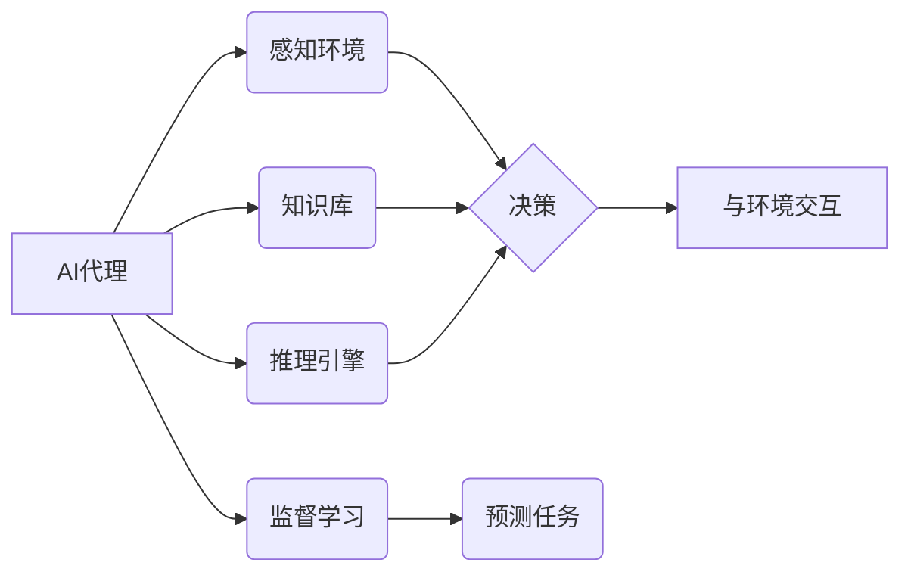

> AI, 人工智能, Agent, 监督学习, 预测, 机器学习, 模型训练, 数据集, 算法, 应用场景

## 1. 背景介绍

在当今数据爆炸的时代，人工智能（AI）正以惊人的速度发展，并深刻地改变着我们生活的方方面面。其中，AI代理（Agent）作为一种能够感知环境、做出决策并与环境交互的智能体，在自动驾驶、机器人控制、金融交易等领域展现出巨大的潜力。

监督学习作为一种重要的机器学习算法，能够通过学习标记数据来预测未来事件或结果。在AI代理中，监督学习被广泛应用于预测任务，例如预测用户行为、预测股票价格、预测天气变化等。

## 2. 核心概念与联系

**2.1 AI代理（Agent）**

AI代理是一个能够感知环境、做出决策并与环境交互的智能体。它通常由以下几个核心组件组成：

* **感知器（Sensor）：** 用于感知环境信息，例如图像、文本、传感器数据等。
* **决策器（Actuator）：** 根据感知到的环境信息做出决策，例如控制机器人的运动、发送邮件、购买股票等。
* **知识库（Knowledge Base）：** 存储代理的知识和经验，用于辅助决策。
* **推理引擎（Reasoning Engine）：** 用于从知识库中推理出新的知识或结论。

**2.2 监督学习**

监督学习是一种机器学习算法，它通过学习标记数据来预测未来事件或结果。标记数据是指包含输入特征和对应输出标签的数据集。监督学习算法的目标是学习一个映射关系，将输入特征映射到相应的输出标签。

**2.3 预测任务**

预测任务是指利用监督学习算法预测未来事件或结果的任务。例如，预测用户是否会点击广告、预测股票价格走势、预测天气变化等。

**2.4 核心概念关系图**



## 3. 核心算法原理 & 具体操作步骤

### 3.1  算法原理概述

监督学习算法的核心原理是通过学习标记数据来建立一个映射关系，将输入特征映射到相应的输出标签。常见的监督学习算法包括线性回归、逻辑回归、决策树、支持向量机、神经网络等。

### 3.2  算法步骤详解

1. **数据收集和预处理:** 收集相关数据，并进行清洗、转换、特征工程等预处理操作。
2. **模型选择:** 根据预测任务的特点选择合适的监督学习算法。
3. **模型训练:** 使用标记数据训练模型，调整模型参数，使模型能够准确地预测输出标签。
4. **模型评估:** 使用测试数据评估模型的性能，例如准确率、召回率、F1-score等。
5. **模型调优:** 根据评估结果，调整模型参数或选择其他算法，提高模型性能。
6. **模型部署:** 将训练好的模型部署到实际应用场景中，用于预测未来事件或结果。

### 3.3  算法优缺点

不同的监督学习算法具有不同的优缺点，需要根据具体任务选择合适的算法。

* **线性回归:** 优点：简单易懂，计算速度快。缺点：假设数据服从线性关系，对非线性关系的预测能力较弱。
* **逻辑回归:** 优点：适用于分类任务，输出结果为概率。缺点：对特征空间的假设较强，容易过拟合。
* **决策树:** 优点：易于理解和解释，可以处理非线性关系。缺点：容易过拟合，对数据噪声敏感。
* **支持向量机:** 优点：可以处理高维数据，对非线性关系的预测能力强。缺点：训练时间较长，参数选择较复杂。
* **神经网络:** 优点：可以学习复杂的非线性关系，预测精度高。缺点：训练时间长，参数众多，容易过拟合。

### 3.4  算法应用领域

监督学习算法广泛应用于各个领域，例如：

* **图像识别:** 识别图像中的物体、场景、人脸等。
* **自然语言处理:** 分析文本内容，例如情感分析、文本分类、机器翻译等。
* **推荐系统:** 根据用户的历史行为推荐感兴趣的内容。
* **金融预测:** 预测股票价格、信用风险等。
* **医疗诊断:** 辅助医生诊断疾病。

## 4. 数学模型和公式 & 详细讲解 & 举例说明

### 4.1  数学模型构建

监督学习算法的核心是建立一个数学模型，将输入特征映射到相应的输出标签。常见的数学模型包括线性模型、逻辑回归模型、决策树模型、支持向量机模型、神经网络模型等。

### 4.2  公式推导过程

不同的监督学习算法使用不同的数学公式进行模型训练和预测。例如，线性回归模型使用最小二乘法来求解模型参数，逻辑回归模型使用极大似然估计来求解模型参数。

### 4.3  案例分析与讲解

以线性回归模型为例，假设我们想要预测房屋价格，输入特征包括房屋面积、房间数量、地理位置等，输出标签是房屋价格。

线性回归模型的数学公式如下：

$$
y = w_0 + w_1x_1 + w_2x_2 + ... + w_nx_n + \epsilon
$$

其中：

* $y$ 是房屋价格
* $w_0, w_1, w_2, ..., w_n$ 是模型参数
* $x_1, x_2, ..., x_n$ 是房屋面积、房间数量、地理位置等输入特征
* $\epsilon$ 是误差项

通过最小二乘法，我们可以求解模型参数 $w_0, w_1, w_2, ..., w_n$，使得模型预测的房屋价格与实际房屋价格之间的误差最小。

## 5. 项目实践：代码实例和详细解释说明

### 5.1  开发环境搭建

* Python 3.x
* scikit-learn 库
* pandas 库
* matplotlib 库

### 5.2  源代码详细实现

```python
import pandas as pd
from sklearn.linear_model import LinearRegression
from sklearn.model_selection import train_test_split
from sklearn.metrics import mean_squared_error

# 加载数据
data = pd.read_csv('house_price.csv')

# 选择特征和目标变量
X = data[['面积', '房间数量', '地理位置']]
y = data['价格']

# 将数据划分为训练集和测试集
X_train, X_test, y_train, y_test = train_test_split(X, y, test_size=0.2, random_state=42)

# 创建线性回归模型
model = LinearRegression()

# 训练模型
model.fit(X_train, y_train)

# 预测测试集数据
y_pred = model.predict(X_test)

# 计算模型性能
mse = mean_squared_error(y_test, y_pred)
print(f'均方误差: {mse}')

# 可视化预测结果
import matplotlib.pyplot as plt
plt.scatter(y_test, y_pred)
plt.xlabel('实际价格')
plt.ylabel('预测价格')
plt.title('线性回归预测结果')
plt.show()
```

### 5.3  代码解读与分析

* 首先，我们加载数据，选择特征和目标变量。
* 然后，我们将数据划分为训练集和测试集，用于训练和评估模型。
* 创建线性回归模型，并使用训练集数据训练模型。
* 训练完成后，使用测试集数据预测房屋价格。
* 最后，我们计算模型性能，并可视化预测结果。

### 5.4  运行结果展示

运行代码后，会输出模型的均方误差值，以及预测结果的可视化图。

## 6. 实际应用场景

### 6.1  电商推荐系统

利用监督学习算法，可以根据用户的历史购买记录、浏览记录、评分等数据，预测用户对哪些商品感兴趣，并推荐给用户。

### 6.2  金融风险评估

利用监督学习算法，可以根据用户的信用记录、收入、支出等数据，预测用户的信用风险，帮助金融机构进行风险评估和决策。

### 6.3  医疗诊断辅助

利用监督学习算法，可以根据患者的症状、病史、检查结果等数据，预测患者患某种疾病的概率，帮助医生进行诊断辅助。

### 6.4  未来应用展望

随着人工智能技术的不断发展，监督学习算法在更多领域将发挥越来越重要的作用。例如，在自动驾驶、机器人控制、个性化教育等领域，监督学习算法将推动人工智能技术的进一步发展。

## 7. 工具和资源推荐

### 7.1  学习资源推荐

* **书籍:**
    * 《机器学习》 - 周志华
    * 《深入理解机器学习》 -  李航
* **在线课程:**
    * Coursera: Machine Learning by Andrew Ng
    * edX: Artificial Intelligence by Columbia University

### 7.2  开发工具推荐

* **Python:** 
    * scikit-learn: 机器学习库
    * TensorFlow: 深度学习库
    * PyTorch: 深度学习库

### 7.3  相关论文推荐

* **《Support Vector Machines》** - Vapnik, V. N. (1995)
* **《Deep Learning》** - Goodfellow, I., Bengio, Y., & Courville, A. (2016)

## 8. 总结：未来发展趋势与挑战

### 8.1  研究成果总结

监督学习算法在人工智能领域取得了显著的成果，在图像识别、自然语言处理、推荐系统等领域取得了突破性的进展。

### 8.2  未来发展趋势

* **模型复杂度提升:** 研究更复杂、更强大的监督学习模型，例如Transformer模型、生成对抗网络等。
* **数据效率提升:** 研究如何利用更少的数据训练更准确的模型，例如迁移学习、自监督学习等。
* **解释性增强:** 研究如何提高监督学习模型的解释性，使得模型的决策过程更加透明可理解。

### 8.3  面临的挑战

* **数据质量问题:** 监督学习算法依赖于高质量的标记数据，而现实世界的数据往往存在噪声、不完整等问题。
* **模型过拟合问题:** 当模型过于复杂时，容易过拟合训练数据，导致模型在测试数据上的性能下降。
* **伦理问题:** 监督学习算法在应用过程中可能存在伦理问题，例如数据隐私、算法偏见等。

### 8.4  研究展望

未来，监督学习算法将继续朝着更智能、更安全、更可解释的方向发展，并在更多领域发挥重要作用。


## 9. 附录：常见问题与解答

**Q1: 监督学习算法有哪些？**

**A1:** 常见的监督学习算法包括线性回归、逻辑回归、决策树、支持向量机、神经网络等。

**Q2: 监督学习算法的优缺点是什么？**

**A2:** 不同的监督学习算法具有不同的优缺点，需要根据具体任务选择合适的算法。

**Q3: 如何评估监督学习模型的性能？**

**A3:** 常用的评估指标包括准确率、召回率、F1-score、均方误差等。

**Q4: 如何解决监督学习模型的过拟合问题？**

**A4:** 可以使用正则化技术、交叉验证、数据增强等方法来解决模型过拟合问题。


作者：禅与计算机程序设计艺术 / Zen and the Art of Computer Programming 
<end_of_turn>