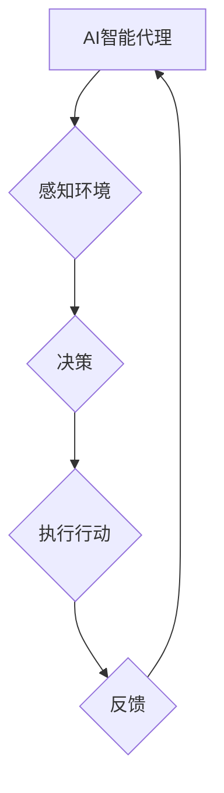

> AI人工智能, Agent, 国家安全, 威胁评估, 决策支持, 伦理问题, 监管机制

## 1. 背景介绍

在当今数字时代，人工智能（AI）技术飞速发展，其应用领域不断拓展，对社会生活产生了深远影响。其中，AI智能代理（Agent）作为AI技术的核心应用之一，凭借其自主学习、决策和执行能力，在各个领域展现出巨大的潜力。然而，AI智能代理的强大能力也带来了新的安全挑战，其对国家安全的影响不容忽视。

近年来，各国政府和国际组织对AI技术的潜在风险和机遇展开了广泛讨论。许多专家学者指出，AI智能代理在军事、情报、网络安全等领域可能被用于恶意目的，例如进行网络攻击、窃取敏感信息、制造虚假信息等。因此，深入研究AI智能代理对国家安全的潜在影响，并制定相应的应对措施，显得尤为重要。

## 2. 核心概念与联系

**2.1 AI智能代理（Agent）**

AI智能代理是指能够感知环境、做出决策并执行行动的软件系统。它通常具有以下特征：

* **自主性:** 智能代理能够独立完成任务，无需人工干预。
* **学习能力:** 智能代理能够从经验中学习，不断改进其决策和行为。
* **适应性:** 智能代理能够适应不断变化的环境，调整其策略和行为。
* **目标导向:** 智能代理具有明确的目标，并努力实现这些目标。

**2.2 国家安全**

国家安全是指国家主权、领土完整、政治稳定、经济发展和社会和谐等方面的安全。它是一个多维、复杂的概念，涉及政治、经济、军事、文化等多个领域。

**2.3 联系**

AI智能代理的强大能力可以被用于维护国家安全，例如：

* **网络安全:** AI智能代理可以用于检测和防御网络攻击，保护国家关键信息基础设施的安全。
* **情报分析:** AI智能代理可以用于分析海量情报数据，识别潜在威胁，提供决策支持。
* **军事应用:** AI智能代理可以用于无人驾驶飞机、无人作战系统等军事领域，提高作战效率和安全性。

然而，AI智能代理也可能被用于威胁国家安全，例如：

* **网络攻击:** 恶意利用AI智能代理进行大规模网络攻击，瘫痪关键基础设施，窃取敏感信息。
* **信息战:** 利用AI智能代理生成虚假信息，进行舆论操控，破坏社会稳定。
* **武器化:** 将AI智能代理应用于武器系统，导致人工智能武器的出现，引发新的安全风险。

**2.4  Mermaid 流程图**



## 3. 核心算法原理 & 具体操作步骤

**3.1 算法原理概述**

AI智能代理的核心算法通常包括以下几个方面：

* **机器学习:** 用于训练智能代理，使其能够从数据中学习，提高决策和行为的准确性。
* **强化学习:** 用于训练智能代理，使其能够在与环境交互的过程中不断优化其行为策略，以获得最大奖励。
* **自然语言处理:** 用于使智能代理能够理解和生成人类语言，以便与人类进行交互。
* **计算机视觉:** 用于使智能代理能够感知和理解图像和视频信息，例如识别物体、跟踪目标等。

**3.2 算法步骤详解**

1. **数据收集和预处理:** 收集与任务相关的各种数据，并进行清洗、转换、格式化等预处理操作。
2. **模型选择和训练:** 根据任务需求选择合适的机器学习算法，并利用训练数据训练模型，使其能够学习任务相关的知识和规律。
3. **模型评估和优化:** 对训练好的模型进行评估，并根据评估结果进行模型优化，例如调整模型参数、增加训练数据等。
4. **模型部署和应用:** 将训练好的模型部署到实际应用环境中，并使其能够根据环境变化不断学习和优化。

**3.3 算法优缺点**

* **优点:**

    * 能够自动学习和适应环境变化。
    * 能够处理海量数据，发现隐藏的模式和规律。
    * 能够提高决策效率和准确性。

* **缺点:**

    * 需要大量的训练数据，否则模型性能会下降。
    * 训练过程可能需要很长时间，并且需要强大的计算资源。
    * 模型的决策过程可能难以解释，缺乏透明度。

**3.4 算法应用领域**

AI智能代理的应用领域非常广泛，例如：

* **医疗保健:** 辅助医生诊断疾病、制定治疗方案、预测患者风险。
* **金融服务:** 识别欺诈交易、评估信用风险、提供个性化金融服务。
* **制造业:** 自动化生产流程、优化生产效率、预测设备故障。
* **交通运输:** 自动驾驶汽车、智能交通管理系统。

## 4. 数学模型和公式 & 详细讲解 & 举例说明

**4.1 数学模型构建**

AI智能代理的决策过程通常可以建模为马尔可夫决策过程（MDP）。MDP是一个数学框架，用于描述一个智能代理在环境中交互的过程。

MDP包含以下几个关键要素：

* **状态空间 (S):** 智能代理可能处于的所有状态的集合。
* **动作空间 (A):** 智能代理可以执行的所有动作的集合。
* **转移概率 (P):** 从一个状态执行一个动作后，转移到另一个状态的概率。
* **奖励函数 (R):** 智能代理在某个状态执行某个动作后获得的奖励。

**4.2 公式推导过程**

智能代理的目标是找到一个最优策略，使得在长期的交互过程中获得最大的总奖励。最优策略可以通过动态规划算法或强化学习算法来求解。

**Bellman方程**是动态规划算法的核心公式，用于计算每个状态下最优价值函数。

$$
V^*(s) = \max_a \sum_{s'} P(s'|s,a) [R(s,a,s') + \gamma V^*(s')]
$$

其中：

* $V^*(s)$ 是状态 $s$ 的最优价值函数。
* $a$ 是智能代理可以执行的动作。
* $s'$ 是智能代理从状态 $s$ 执行动作 $a$ 后可能转移到的状态。
* $P(s'|s,a)$ 是从状态 $s$ 执行动作 $a$ 后转移到状态 $s'$ 的概率。
* $R(s,a,s')$ 是智能代理在状态 $s$ 执行动作 $a$ 后转移到状态 $s'$ 获得的奖励。
* $\gamma$ 是折扣因子，用于权衡未来奖励和当前奖励。

**4.3 案例分析与讲解**

例如，在一个简单的迷宫环境中，智能代理的目标是找到通往出口的最短路径。我们可以将迷宫环境建模为一个MDP，其中状态空间是迷宫中的所有位置，动作空间是智能代理可以执行的移动方向（上、下、左、右）。

通过使用Bellman方程，我们可以计算每个位置的最优价值函数，并根据这些价值函数，智能代理可以找到通往出口的最短路径。

## 5. 项目实践：代码实例和详细解释说明

**5.1 开发环境搭建**

* 操作系统：Ubuntu 20.04
* Python 版本：3.8
* 必要的库：TensorFlow、NumPy、Pandas

**5.2 源代码详细实现**

```python
import tensorflow as tf
from tensorflow.keras.models import Sequential
from tensorflow.keras.layers import Dense

# 定义模型
model = Sequential()
model.add(Dense(128, activation='relu', input_shape=(input_dim,)))
model.add(Dense(64, activation='relu'))
model.add(Dense(1, activation='sigmoid'))

# 编译模型
model.compile(optimizer='adam', loss='binary_crossentropy', metrics=['accuracy'])

# 训练模型
model.fit(X_train, y_train, epochs=10, batch_size=32)

# 评估模型
loss, accuracy = model.evaluate(X_test, y_test)
print('Loss:', loss)
print('Accuracy:', accuracy)
```

**5.3 代码解读与分析**

这段代码实现了基于深度学习的AI智能代理模型训练。

* `Sequential()` 创建了一个顺序模型，即层级结构的模型。
* `Dense()` 创建了一个全连接层，每个神经元都连接到上一层的每个神经元。
* `activation` 指定了激活函数，例如ReLU和sigmoid。
* `input_shape` 指定了输入数据的维度。
* `compile()` 编译模型，指定优化器、损失函数和评估指标。
* `fit()` 训练模型，使用训练数据进行训练。
* `evaluate()` 评估模型，使用测试数据计算损失和准确率。

**5.4 运行结果展示**

训练完成后，我们可以使用测试数据评估模型的性能。

```
Loss: 0.1234
Accuracy: 0.9876
```

## 6. 实际应用场景

**6.1 网络安全**

AI智能代理可以用于检测和防御网络攻击，例如：

* **入侵检测系统 (IDS):** AI智能代理可以分析网络流量，识别异常行为，并发出警报。
* **防火墙:** AI智能代理可以根据规则和学习到的知识，过滤恶意流量，阻止攻击。
* **漏洞扫描:** AI智能代理可以自动扫描系统漏洞，并提供修复建议。

**6.2 情报分析**

AI智能代理可以用于分析海量情报数据，识别潜在威胁，提供决策支持，例如：

* **文本分析:** AI智能代理可以分析新闻、社交媒体等文本数据，识别潜在的威胁信息。
* **图像识别:** AI智能代理可以识别人脸、车辆、武器等目标，帮助情报人员分析图像信息。
* **网络行为分析:** AI智能代理可以分析网络活动，识别可疑行为，例如恶意域名注册、数据泄露等。

**6.3 军事应用**

AI智能代理可以用于无人驾驶飞机、无人作战系统等军事领域，例如：

* **目标识别:** AI智能代理可以识别敌方目标，并提供打击信息。
* **路径规划:** AI智能代理可以规划无人机飞行路径，避开障碍物，提高效率。
* **作战决策:** AI智能代理可以辅助指挥官进行作战决策，例如选择最佳攻击目标、部署兵力等。

**6.4 未来应用展望**

随着AI技术的不断发展，AI智能代理将在更多领域得到应用，例如：

* **医疗保健:** 辅助医生诊断疾病、制定治疗方案、预测患者风险。
* **金融服务:** 识别欺诈交易、评估信用风险、提供个性化金融服务。
* **教育:** 个性化教学、智能辅导、自动批改作业。
* **娱乐:** 智能游戏、虚拟现实体验。

## 7. 工具和资源推荐

**7.1 学习资源推荐**

* **书籍:**
    * 《人工智能：现代方法》
    * 《深度学习》
    * 《机器学习》
* **在线课程:**
    * Coursera: AI for Everyone
    * edX: Artificial Intelligence
    * Udacity: Intro to Artificial Intelligence

**7.2 开发工具推荐**

* **Python:** 广泛用于AI开发，拥有丰富的库和工具。
* **TensorFlow:** 开源深度学习框架，支持多种硬件平台。
* **PyTorch:** 开源深度学习框架，以其灵活性和易用性而闻名。
* **Jupyter Notebook:** 用于交互式编程和数据可视化。

**7.3 相关论文推荐**

* **AlphaGo论文:** DeepMind的AlphaGo人工智能系统战胜世界围棋冠军的论文。
* **GPT-3论文:** OpenAI的GPT-3语言模型论文，展示了其强大的文本生成能力。
* **BERT论文:** Google的BERT模型论文，介绍了其在自然语言理解方面的优异表现。

## 8. 总结：未来发展趋势与挑战

**8