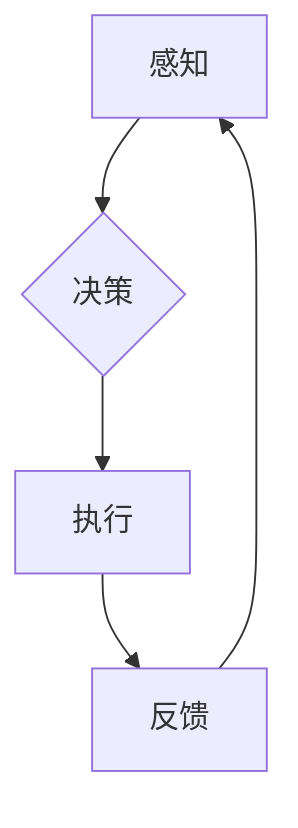

> 深度学习、互动学习、深度学习代理、强化学习、自然语言处理、计算机视觉

## 1. 背景介绍

深度学习作为人工智能领域最前沿的技术之一，在图像识别、自然语言处理、语音识别等领域取得了突破性的进展。然而，传统的深度学习模型通常是静态的，缺乏对环境的动态交互能力。随着智能体在复杂环境中的应用需求日益增长，深度学习代理的概念应运而生。深度学习代理是指能够通过深度学习模型与环境交互、学习并做出决策的智能体。

互动学习作为一种新型的学习 paradigms，为深度学习代理的训练提供了新的思路。它强调智能体与环境的交互过程，通过与环境的反馈信息不断调整模型参数，从而实现更有效的学习。

## 2. 核心概念与联系

**2.1 深度学习代理**

深度学习代理是一种利用深度学习算法实现智能交互的代理系统。它通常由以下几个部分组成：

* **感知模块:** 用于接收来自环境的输入信息，例如图像、文本、传感器数据等。
* **决策模块:** 基于感知模块获取的信息，利用深度学习模型进行决策，例如选择动作、生成文本等。
* **执行模块:** 将决策模块的输出转化为实际动作，并与环境进行交互。

**2.2 互动学习**

互动学习是一种基于交互的学习方法，强调智能体与环境的动态交互过程。它通常包括以下几个步骤：

* **感知:** 智能体从环境中获取信息。
* **决策:** 智能体根据感知到的信息做出决策。
* **执行:** 智能体执行决策，并与环境进行交互。
* **反馈:** 环境对智能体的动作提供反馈信息。
* **学习:** 智能体根据反馈信息更新模型参数，从而改进决策能力。

**2.3 互动学习在深度学习代理中的应用**

互动学习可以有效地提高深度学习代理的学习效率和适应性。通过与环境的交互，深度学习代理可以获得更丰富的经验，并根据环境的变化不断调整策略，从而更好地完成任务。

**Mermaid 流程图**



## 3. 核心算法原理 & 具体操作步骤

### 3.1 算法原理概述

互动学习算法的核心思想是通过强化学习来训练深度学习代理。强化学习是一种基于奖励机制的机器学习方法，智能体通过与环境的交互，不断尝试不同的动作，并根据环境的反馈信息（奖励或惩罚）调整策略，最终学习到最优的行动策略。

### 3.2 算法步骤详解

1. **环境建模:** 建立一个模拟真实世界的环境模型，该模型可以提供智能体感知到的信息和对智能体动作的反馈。
2. **代理初始化:** 初始化深度学习代理，包括感知模块、决策模块和执行模块。
3. **交互循环:**
    * 智能体从环境中感知信息。
    * 智能体根据感知信息和当前策略，选择一个动作。
    * 智能体执行动作，并获得环境的反馈信息（奖励或惩罚）。
    * 智能体根据反馈信息更新策略，例如使用梯度下降算法更新神经网络参数。
4. **重复步骤3，直到达到预设的目标或训练结束。**

### 3.3 算法优缺点

**优点:**

* 能够有效地训练深度学习代理，使其能够在复杂环境中做出决策。
* 能够适应环境的变化，并不断改进策略。
* 能够学习到最优的行动策略。

**缺点:**

* 训练过程可能需要大量的计算资源和时间。
* 需要设计一个合适的奖励函数，才能有效地指导智能体的学习。
* 难以处理连续动作空间的问题。

### 3.4 算法应用领域

互动学习算法在以下领域具有广泛的应用前景：

* **机器人控制:** 训练机器人能够自主地感知环境、做出决策并执行动作。
* **游戏人工智能:** 训练游戏中的AI对手，使其能够与人类玩家进行更智能的对抗。
* **自动驾驶:** 训练自动驾驶汽车能够感知道路环境、做出决策并安全驾驶。
* **个性化推荐:** 训练推荐系统能够根据用户的行为和偏好提供个性化的推荐。

## 4. 数学模型和公式 & 详细讲解 & 举例说明

### 4.1 数学模型构建

在强化学习中，我们通常使用马尔可夫决策过程 (MDP) 来建模智能体与环境的交互过程。MDP 由以下几个要素组成：

* **状态空间 S:** 智能体可能处于的所有状态的集合。
* **动作空间 A:** 智能体可以执行的所有动作的集合。
* **转移概率 P(s', r | s, a):** 从状态 s 执行动作 a 后，转移到状态 s' 的概率，以及获得奖励 r 的概率。
* **奖励函数 R(s, a):** 智能体在状态 s 执行动作 a 后获得的奖励。

### 4.2 公式推导过程

强化学习的目标是找到一个最优策略 π(s)，该策略能够使智能体在长期的交互过程中获得最大的总奖励。最优策略可以通过动态规划算法或蒙特卡罗方法来求解。

**Bellman 方程:**

$$
V^{\pi}(s) = \max_a \left[ R(s, a) + \gamma \sum_{s'} P(s', r | s, a) V^{\pi}(s') \right]
$$

其中：

* $V^{\pi}(s)$ 是状态 s 下按照策略 π 的价值函数。
* $R(s, a)$ 是状态 s 执行动作 a 后获得的奖励。
* $\gamma$ 是折扣因子，控制未来奖励的权重。

### 4.3 案例分析与讲解

例如，在玩游戏时，智能体可以将游戏状态作为状态空间，可以执行的动作包括向上、向下、向左、向右等，奖励函数可以设计为获得分数时奖励，失去生命时惩罚。通过强化学习算法，智能体可以学习到最优的策略，从而获得更高的分数。

## 5. 项目实践：代码实例和详细解释说明

### 5.1 开发环境搭建

* Python 3.x
* TensorFlow 或 PyTorch 深度学习框架
* OpenAI Gym 或其他强化学习环境

### 5.2 源代码详细实现

```python
import gym
import tensorflow as tf

# 定义深度学习代理
class Agent:
    def __init__(self, state_size, action_size):
        # 初始化神经网络模型
        self.model = tf.keras.models.Sequential([
            tf.keras.layers.Dense(64, activation='relu', input_shape=(state_size,)),
            tf.keras.layers.Dense(action_size)
        ])
        self.model.compile(loss='mse', optimizer='adam')

    # 选择动作
    def choose_action(self, state):
        # 使用神经网络模型预测动作概率
        probs = self.model.predict(state)
        # 根据概率选择动作
        action = tf.random.categorical(tf.math.log(probs), num_samples=1)[0, 0]
        return action

# 创建强化学习环境
env = gym.make('CartPole-v1')

# 初始化代理
agent = Agent(state_size=env.observation_space.shape[0], action_size=env.action_space.n)

# 训练代理
for episode in range(1000):
    state = env.reset()
    done = False
    total_reward = 0
    while not done:
        # 选择动作
        action = agent.choose_action(state)
        # 执行动作
        next_state, reward, done, _ = env.step(action)
        # 更新代理模型
        agent.model.fit(state.reshape(1, -1), reward, epochs=1)
        # 更新状态
        state = next_state
        total_reward += reward
    print(f'Episode {episode+1}, Total Reward: {total_reward}')

# 测试代理
state = env.reset()
while True:
    action = agent.choose_action(state)
    state, reward, done, _ = env.step(action)
    env.render()
    if done:
        break
env.close()
```

### 5.3 代码解读与分析

* 代码首先定义了一个深度学习代理类 `Agent`，该类包含一个神经网络模型，用于预测动作概率。
* 然后，代码创建了一个强化学习环境 `CartPole-v1`，该环境模拟了一个平衡木的控制问题。
* 接着，代码初始化代理并开始训练过程。
* 在训练过程中，代理会根据环境的反馈信息更新神经网络模型，从而学习到最优的策略。
* 最后，代码测试代理的性能，并展示代理在环境中的行为。

### 5.4 运行结果展示

运行代码后，代理将学习到平衡木的控制策略，并在环境中保持平衡。

## 6. 实际应用场景

### 6.1 机器人控制

互动学习算法可以用于训练机器人能够自主地感知环境、做出决策并执行动作。例如，可以训练机器人能够自主地导航、抓取物体、进行组装等任务。

### 6.2 游戏人工智能

互动学习算法可以用于训练游戏中的AI对手，使其能够与人类玩家进行更智能的对抗。例如，可以训练AI对手能够学习人类玩家的策略，并根据策略做出更有效的应对。

### 6.3 自动驾驶

互动学习算法可以用于训练自动驾驶汽车能够感知道路环境、做出决策并安全驾驶。例如，可以训练自动驾驶汽车能够识别交通信号灯、避开障碍物、保持车距等。

### 6.4 个性化推荐

互动学习算法可以用于训练推荐系统能够根据用户的行为和偏好提供个性化的推荐。例如，可以训练推荐系统能够推荐用户可能感兴趣的商品、电影、音乐等。

### 6.4 未来应用展望

随着人工智能技术的不断发展，互动学习算法将在更多领域得到应用，例如医疗诊断、金融风险管理、教育个性化等。

## 7. 工具和资源推荐

### 7.1 学习资源推荐

* **书籍:**
    * Reinforcement Learning: An Introduction by Richard S. Sutton and Andrew G. Barto
    * Deep Reinforcement Learning Hands-On by Maxim Lapan
* **在线课程:**
    * Deep Reinforcement Learning Specialization by DeepLearning.AI
    * Reinforcement Learning by David Silver (University of DeepMind)

### 7.2 开发工具推荐

* **TensorFlow:** https://www.tensorflow.org/
* **PyTorch:** https://pytorch.org/
* **OpenAI Gym:** https://gym.openai.com/

### 7.3 相关论文推荐

* **Deep Q-Network (DQN):** https://arxiv.org/abs/1312.5602
* **Proximal Policy Optimization (PPO):** https://arxiv.org/abs/1707.06347
* **Trust Region Policy Optimization (TRPO):** https://arxiv.org/abs/1502.05477

## 8. 总结：未来发展趋势与挑战

### 8.1 研究成果总结

互动学习算法在深度学习代理的训练中取得了显著的成果，能够有效地提高代理的学习效率和适应性。

### 8.2 未来发展趋势

* **更强大的模型架构:** 研究更强大的深度学习模型架构，例如Transformer、Graph Neural Networks等，以提高代理的学习能力和泛化能力。
* **更有效的训练算法:** 研究更有效的训练算法，例如分布式强化学习、迁移学习等，以加速代理的训练过程。
* **更丰富的环境模拟:** 建立更丰富的环境模拟，例如模拟真实世界的复杂场景，以提高代理的鲁棒性和适应性。

### 8.3 面临的挑战

* **样本效率:** 强化学习算法通常需要大量的样本数据才能训练出有效的模型，这在现实世界中