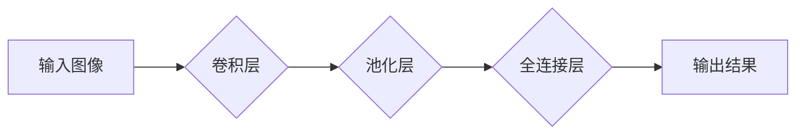

> 卷积神经网络 (CNN)，可视化技术，深度学习，图像识别，特征提取，神经网络可视化，TensorBoard

## 1. 背景介绍

深度学习作为人工智能领域的核心技术之一，在图像识别、自然语言处理、语音识别等领域取得了突破性的进展。其中，卷积神经网络 (CNN) 凭借其强大的特征提取能力和高效的计算架构，成为深度学习领域最受欢迎的模型之一。然而，CNN 的内部工作机制复杂，难以理解，这限制了其在实际应用中的推广和优化。

可视化技术作为一种有效的工具，可以帮助我们直观地理解和分析 CNN 的内部结构和工作流程，从而更好地理解其工作原理，发现潜在的缺陷，并进行有效的优化。

## 2. 核心概念与联系

卷积神经网络 (CNN) 是一种专门用于处理图像数据的深度学习模型。其核心结构包括卷积层、池化层、全连接层等。

**CNN 的工作原理：**

1. **卷积层：** 利用卷积核对输入图像进行卷积运算，提取图像的局部特征。
2. **池化层：** 对卷积层的输出进行下采样，减少特征图的大小，提高模型的鲁棒性。
3. **全连接层：** 将池化层的输出进行扁平化，连接到全连接层，进行分类或回归任务。

**CNN 可视化技术：**

可视化技术可以帮助我们直观地理解 CNN 的内部结构和工作流程，主要包括以下几个方面：

* **网络结构可视化：** 展示 CNN 的层级结构、连接方式和参数数量。
* **特征图可视化：** 展示卷积层提取的特征图，直观地观察特征的分布和变化。
* **激活函数可视化：** 展示不同层级的激活函数的输出，分析神经元的激活状态。
* **权重可视化：** 展示卷积核的权重分布，分析模型对不同特征的敏感度。

**Mermaid 流程图：**



## 3. 核心算法原理 & 具体操作步骤

### 3.1  算法原理概述

卷积神经网络的核心算法是卷积运算和池化运算。

* **卷积运算：** 将卷积核滑动在输入图像上，计算每个位置的卷积结果，从而提取图像的局部特征。
* **池化运算：** 对卷积层的输出进行下采样，减少特征图的大小，提高模型的鲁棒性。

### 3.2  算法步骤详解

1. **输入图像预处理：** 将输入图像进行尺寸调整、归一化等预处理操作。
2. **卷积层：** 使用多个卷积核对输入图像进行卷积运算，提取图像的局部特征。
3. **池化层：** 对卷积层的输出进行池化运算，例如最大池化或平均池化，减少特征图的大小。
4. **激活函数：** 在卷积层和池化层之间应用激活函数，例如ReLU或Sigmoid，引入非线性，提高模型的表达能力。
5. **全连接层：** 将池化层的输出进行扁平化，连接到全连接层，进行分类或回归任务。
6. **输出层：** 根据任务类型，使用不同的输出层，例如softmax层进行分类，或线性层进行回归。

### 3.3  算法优缺点

**优点：**

* **强大的特征提取能力：** CNN 可以自动学习图像的特征，无需人工设计特征。
* **高效的计算架构：** CNN 的卷积运算和池化运算具有良好的并行性，可以高效地利用GPU进行加速。
* **鲁棒性强：** CNN 对图像的噪声和变形具有较强的鲁棒性。

**缺点：**

* **训练数据量大：** CNN 需要大量的训练数据才能达到良好的性能。
* **计算资源消耗大：** CNN 的训练过程需要大量的计算资源。
* **可解释性差：** CNN 的内部工作机制复杂，难以理解其决策过程。

### 3.4  算法应用领域

CNN 在图像识别、目标检测、图像分割、人脸识别、医疗影像分析等领域有着广泛的应用。

## 4. 数学模型和公式 & 详细讲解 & 举例说明

### 4.1  数学模型构建

卷积神经网络的数学模型可以表示为一个多层神经网络，其中每一层都包含多个神经元。每个神经元接收来自上一层的输入信号，并通过一个激活函数进行处理，输出到下一层。

### 4.2  公式推导过程

卷积运算的数学公式如下：

$$
y(i,j) = \sum_{m=0}^{M-1} \sum_{n=0}^{N-1} x(i+m,j+n) * w(m,n)
$$

其中：

* $y(i,j)$ 是卷积输出的像素值。
* $x(i+m,j+n)$ 是输入图像的像素值。
* $w(m,n)$ 是卷积核的权重值。
* $M$ 和 $N$ 是卷积核的大小。

池化运算的数学公式如下：

$$
y(i,j) = \max_{m=0}^{k-1} \max_{n=0}^{l-1} x(i*s+m,j*s+n)
$$

其中：

* $y(i,j)$ 是池化输出的像素值。
* $x(i*s+m,j*s+n)$ 是输入特征图的像素值。
* $s$ 是池化窗口的大小。
* $k$ 和 $l$ 是池化窗口的大小。

### 4.3  案例分析与讲解

假设我们有一个 3x3 的输入图像和一个 2x2 的卷积核，卷积核的权重值如下：

$$
w = \begin{bmatrix}
1 & 2 \\
3 & 4
\end{bmatrix}
$$

卷积运算的结果如下：

$$
y = \begin{bmatrix}
1 & 2 \\
3 & 4
\end{bmatrix} * \begin{bmatrix}
1 & 2 & 3 \\
4 & 5 & 6 \\
7 & 8 & 9
\end{bmatrix} = \begin{bmatrix}
15 & 18 \\
45 & 54
\end{bmatrix}
$$

## 5. 项目实践：代码实例和详细解释说明

### 5.1  开发环境搭建

* Python 3.x
* TensorFlow 或 PyTorch 深度学习框架
* Jupyter Notebook 或 VS Code 开发环境

### 5.2  源代码详细实现

```python
import tensorflow as tf

# 定义卷积神经网络模型
model = tf.keras.models.Sequential([
    tf.keras.layers.Conv2D(32, (3, 3), activation='relu', input_shape=(28, 28, 1)),
    tf.keras.layers.MaxPooling2D((2, 2)),
    tf.keras.layers.Conv2D(64, (3, 3), activation='relu'),
    tf.keras.layers.MaxPooling2D((2, 2)),
    tf.keras.layers.Flatten(),
    tf.keras.layers.Dense(10, activation='softmax')
])

# 编译模型
model.compile(optimizer='adam',
              loss='sparse_categorical_crossentropy',
              metrics=['accuracy'])

# 训练模型
model.fit(x_train, y_train, epochs=10)

# 评估模型
loss, accuracy = model.evaluate(x_test, y_test)
print('Test loss:', loss)
print('Test accuracy:', accuracy)
```

### 5.3  代码解读与分析

* **定义模型结构：** 使用 `tf.keras.models.Sequential` 创建一个顺序模型，并添加卷积层、池化层、全连接层等。
* **编译模型：** 使用 `model.compile` 方法配置模型的优化器、损失函数和评价指标。
* **训练模型：** 使用 `model.fit` 方法训练模型，传入训练数据和训练轮数。
* **评估模型：** 使用 `model.evaluate` 方法评估模型在测试数据上的性能。

### 5.4  运行结果展示

训练完成后，可以查看模型在测试数据上的准确率，并可视化模型的训练过程，例如损失函数的变化趋势。

## 6. 实际应用场景

CNN 在图像识别、目标检测、图像分割、人脸识别、医疗影像分析等领域有着广泛的应用。

### 6.1  图像识别

CNN 可以用于识别图像中的物体，例如人脸、车辆、动物等。

### 6.2  目标检测

CNN 可以用于检测图像中多个目标的位置和类别，例如在图像中检测出所有的人脸和车辆。

### 6.3  图像分割

CNN 可以用于将图像分割成不同的区域，例如将图像中的前景和背景进行分割。

### 6.4  未来应用展望

随着深度学习技术的不断发展，CNN 的应用场景将会更加广泛，例如：

* **自动驾驶：** CNN 可以用于识别道路上的障碍物、交通信号灯等，帮助自动驾驶汽车安全行驶。
* **医疗诊断：** CNN 可以用于辅助医生诊断疾病，例如识别病理图像中的肿瘤细胞。
* **智能家居：** CNN 可以用于识别用户的指令，控制智能家居设备。

## 7. 工具和资源推荐

### 7.1  学习资源推荐

* **书籍：**
    * 深度学习
    * 深度学习实践
* **在线课程：**
    * Coursera 深度学习课程
    * Udacity 深度学习工程师 Nanodegree

### 7.2  开发工具推荐

* **TensorFlow：** 开源深度学习框架
* **PyTorch：** 开源深度学习框架
* **Keras：** 高级深度学习API

### 7.3  相关论文推荐

* **AlexNet：** ImageNet Classification with Deep Convolutional Neural Networks
* **VGGNet：** Very Deep Convolutional Networks for Large-Scale Image Recognition
* **ResNet：** Deep Residual Learning for Image Recognition

## 8. 总结：未来发展趋势与挑战

### 8.1  研究成果总结

CNN 在图像识别等领域取得了显著的成果，但仍存在一些挑战，例如：

* **数据效率：** CNN 需要大量的训练数据才能达到良好的性能。
* **可解释性：** CNN 的内部工作机制复杂，难以理解其决策过程。
* **计算资源消耗：** CNN 的训练过程需要大量的计算资源。

### 8.2  未来发展趋势

未来，CNN 的研究方向将集中在以下几个方面：

* **提高数据效率：** 研究新的训练方法，例如迁移学习和知识蒸馏，以减少训练数据量。
* **增强可解释性：** 研究新的可视化技术和解释方法，使 CNN 的决策过程更加透明。
* **降低计算资源消耗：** 研究新的模型架构和训练算法，以降低 CNN 的计算资源消耗。

### 8.3  面临的挑战

CNN 的发展面临着以下挑战：

* **数据获取和标注：** 获取高质量的图像数据并进行标注是一个耗时和费力的过程。
* **模型复杂度：** CNN 的模型结构越来越复杂，训练和部署难度也越来越高。
* **伦理问题：** CNN 的应用可能会带来一些伦理问题，例如数据隐私和算法偏见。

### 8.4  研究展望

尽管面临着挑战，但 CNN 的发展前景依然广阔。随着技术的不断进步，CNN 将在更多领域发挥重要作用，为人类社会带来更多便利和福祉。

## 9. 附录：常见问题与解答

**Q1：CNN 和传统机器学习算法