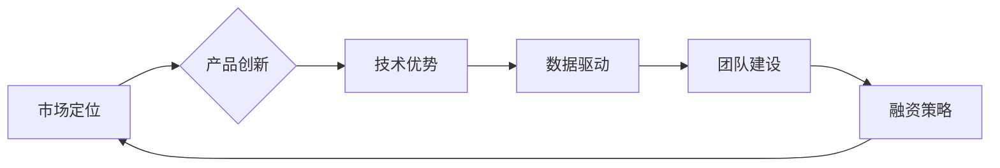

> AI创业, 竞争策略, 市场定位, 产品创新, 技术优势, 数据驱动, 团队建设, 融资策略, 监管环境

## 1. 背景介绍

人工智能（AI）技术近年来发展迅速，已渗透到各个行业，催生了一批AI创业公司。这些公司在医疗、金融、教育、零售等领域提供创新解决方案，推动着社会进步。然而，AI创业市场竞争激烈，新公司面临着诸多挑战。如何制定有效的竞争策略，才能在激烈的市场竞争中脱颖而出？

## 2. 核心概念与联系

**2.1 AI创业公司的竞争策略**

AI创业公司的竞争策略是指公司在市场竞争中，为了实现自身目标而采取的一系列行动计划。这些行动计划包括市场定位、产品创新、技术优势、数据驱动、团队建设、融资策略等方面。

**2.2 竞争策略的要素**

* **市场定位:** 确定目标客户群体、竞争对手和市场细分领域，明确公司在市场中的独特价值主张。
* **产品创新:** 开发具有差异化竞争力的AI产品，满足客户需求，并不断迭代升级。
* **技术优势:** 拥有领先的AI技术和算法，确保产品性能和竞争力。
* **数据驱动:** 利用海量数据进行模型训练和优化，提升产品精度和效率。
* **团队建设:** 聚集优秀的人才，构建高效的研发、运营和销售团队。
* **融资策略:** 筹集充足的资金，支持公司发展和扩张。

**2.3 竞争策略的相互关联**

这些竞争策略要素相互关联，相互影响。例如，明确的市场定位可以帮助公司选择合适的技术方向和产品创新策略；强大的技术优势可以支撑产品创新和数据驱动；优秀的团队可以推动产品开发和市场推广。

**Mermaid 流程图**



## 3. 核心算法原理 & 具体操作步骤

**3.1 算法原理概述**

深度学习是AI领域的重要技术之一，其核心算法是多层神经网络。深度学习算法能够自动从海量数据中学习特征，并进行预测或分类。

**3.2 算法步骤详解**

1. **数据预处理:** 将原始数据进行清洗、转换和格式化，使其适合深度学习算法的训练。
2. **网络结构设计:** 根据任务需求设计多层神经网络的结构，包括神经元数量、层数和激活函数等。
3. **模型训练:** 利用训练数据训练神经网络模型，调整模型参数，使其能够准确地进行预测或分类。
4. **模型评估:** 使用测试数据评估模型的性能，并根据评估结果进行模型调优。
5. **模型部署:** 将训练好的模型部署到实际应用场景中，用于进行预测或分类。

**3.3 算法优缺点**

**优点:**

* 能够自动学习特征，无需人工特征工程。
* 能够处理海量数据，并取得较高的预测精度。
* 能够应用于多种任务，例如图像识别、自然语言处理和语音识别等。

**缺点:**

* 训练数据量要求高，需要大量的标注数据。
* 计算资源消耗大，训练时间长。
* 模型解释性差，难以理解模型的决策过程。

**3.4 算法应用领域**

深度学习算法已广泛应用于各个领域，例如：

* **图像识别:** 人脸识别、物体检测、图像分类等。
* **自然语言处理:** 机器翻译、文本摘要、情感分析等。
* **语音识别:** 语音转文本、语音助手等。
* **医疗诊断:** 疾病预测、影像分析等。
* **金融风险控制:** 欺诈检测、信用评分等。

## 4. 数学模型和公式 & 详细讲解 & 举例说明

**4.1 数学模型构建**

深度学习模型通常采用多层感知机（MLP）或卷积神经网络（CNN）等结构。

**4.2 公式推导过程**

深度学习模型的训练过程基于梯度下降算法，其核心公式为：

$$
\theta = \theta - \alpha \nabla L(\theta)
$$

其中：

* $\theta$：模型参数
* $\alpha$：学习率
* $\nabla L(\theta)$：损失函数对参数的梯度

**4.3 案例分析与讲解**

假设我们训练一个图像分类模型，目标是将图像分类为猫或狗。损失函数可以选用交叉熵损失函数，其公式为：

$$
L(y, \hat{y}) = - \sum_{i=1}^{C} y_i \log \hat{y}_i
$$

其中：

* $y$：真实标签
* $\hat{y}$：模型预测概率

通过梯度下降算法，不断更新模型参数，使得损失函数最小化，从而实现图像分类任务。

## 5. 项目实践：代码实例和详细解释说明

**5.1 开发环境搭建**

使用Python语言和深度学习框架TensorFlow或PyTorch进行开发。

**5.2 源代码详细实现**

```python
import tensorflow as tf

# 定义模型结构
model = tf.keras.models.Sequential([
    tf.keras.layers.Conv2D(32, (3, 3), activation='relu', input_shape=(28, 28, 1)),
    tf.keras.layers.MaxPooling2D((2, 2)),
    tf.keras.layers.Conv2D(64, (3, 3), activation='relu'),
    tf.keras.layers.MaxPooling2D((2, 2)),
    tf.keras.layers.Flatten(),
    tf.keras.layers.Dense(10, activation='softmax')
])

# 编译模型
model.compile(optimizer='adam',
              loss='sparse_categorical_crossentropy',
              metrics=['accuracy'])

# 训练模型
model.fit(x_train, y_train, epochs=10)

# 评估模型
loss, accuracy = model.evaluate(x_test, y_test)
print('Test loss:', loss)
print('Test accuracy:', accuracy)
```

**5.3 代码解读与分析**

这段代码定义了一个简单的卷积神经网络模型，用于图像分类任务。模型包含两层卷积层、两层池化层、一层全连接层和一层输出层。

**5.4 运行结果展示**

训练完成后，模型可以用于预测新的图像类别。

## 6. 实际应用场景

**6.1 医疗诊断**

AI算法可以辅助医生进行疾病诊断，例如分析医学影像，识别肿瘤或其他病变。

**6.2 金融风险控制**

AI算法可以用于检测金融欺诈，评估信用风险，以及进行投资决策。

**6.3 自动驾驶**

AI算法是自动驾驶汽车的核心技术，用于感知周围环境、规划路径和控制车辆。

**6.4 未来应用展望**

AI技术将继续发展，并应用于更多领域，例如个性化教育、智能家居、工业自动化等。

## 7. 工具和资源推荐

**7.1 学习资源推荐**

* **在线课程:** Coursera、edX、Udacity等平台提供丰富的AI课程。
* **书籍:** 《深度学习》、《机器学习实战》等书籍是学习AI的基础教材。
* **开源项目:** TensorFlow、PyTorch等开源项目提供了丰富的代码示例和学习资源。

**7.2 开发工具推荐**

* **深度学习框架:** TensorFlow、PyTorch、Keras等框架提供了高效的深度学习开发工具。
* **云计算平台:** AWS、Azure、Google Cloud等云计算平台提供了强大的计算资源和AI服务。

**7.3 相关论文推荐**

* **ImageNet Classification with Deep Convolutional Neural Networks**
* **Attention Is All You Need**
* **BERT: Pre-training of Deep Bidirectional Transformers for Language Understanding**

## 8. 总结：未来发展趋势与挑战

**8.1 研究成果总结**

近年来，AI技术取得了显著进展，在图像识别、自然语言处理、语音识别等领域取得了突破性成果。

**8.2 未来发展趋势**

* **模型规模和复杂度提升:** 模型参数量将继续增加，模型结构将更加复杂。
* **数据驱动和自动化:** 数据将成为AI发展的关键要素，自动化机器学习将更加普及。
* **跨模态学习:** AI模型将能够处理多种数据类型，例如文本、图像、音频等。
* **边缘计算和部署:** AI模型将部署到边缘设备，实现更快速的响应和更低的延迟。

**8.3 面临的挑战**

* **数据隐私和安全:** AI模型的训练和应用需要大量数据，如何保护数据隐私和安全是一个重要挑战。
* **算法可解释性和公平性:** AI模型的决策过程难以解释，如何确保算法公平性和可解释性是一个重要问题。
* **伦理和社会影响:** AI技术的发展可能带来伦理和社会问题，需要进行深入的思考和讨论。

**8.4 研究展望**

未来，AI研究将继续探索更强大的算法、更丰富的应用场景和更安全的解决方案，推动人工智能技术向更智能、更安全、更普惠的方向发展。

## 9. 附录：常见问题与解答

**9.1 如何选择合适的AI算法？**

选择合适的AI算法取决于具体的应用场景和数据特点。例如，图像识别任务可以使用卷积神经网络，而文本分类任务可以使用循环神经网络。

**9.2 如何处理不平衡的数据集？**

不平衡的数据集会导致模型训练效果不佳。可以使用数据增强、权重调整等方法来处理不平衡的数据集。

**9.3 如何评估AI模型的性能？**

可以使用准确率、召回率、F1-score等指标来评估AI模型的性能。

**9.4 如何部署AI模型？**

可以使用云计算平台、边缘设备等方式部署AI模型。

**9.5 如何保证AI模型的安全性和可靠性？**

需要进行模型测试、安全评估、数据加密等措施来保证AI模型的安全性和可靠性。


作者：禅与计算机程序设计艺术 / Zen and the Art of Computer Programming 
<end_of_turn>