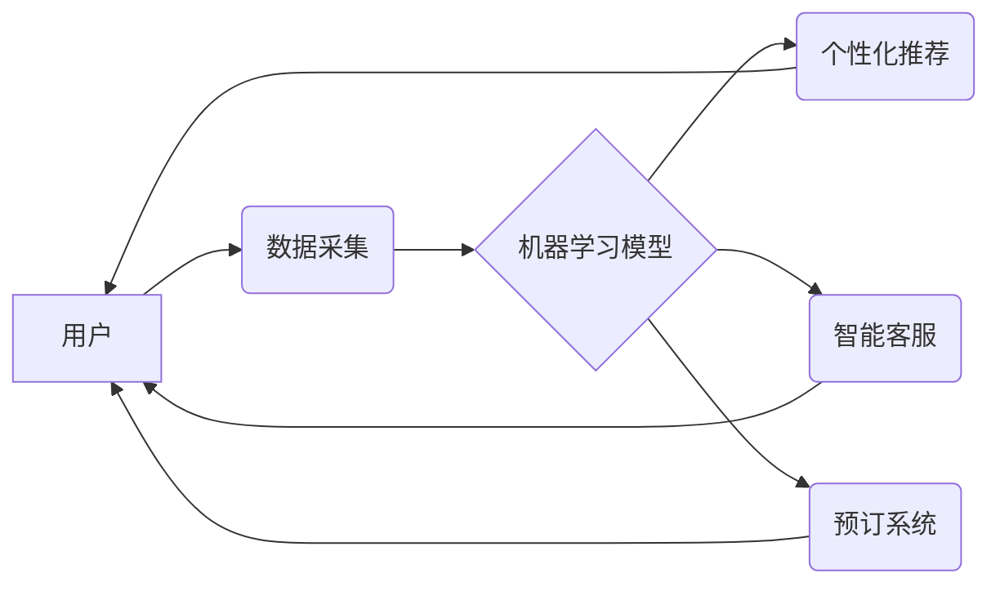

> 人工智能，旅游业，个性化推荐，智能客服，机器学习，自然语言处理，预订系统

## 1. 背景介绍

旅游业作为全球经济的重要支柱，近年来经历了快速发展。随着互联网和移动技术的普及，旅游消费方式发生了巨大变化，消费者对个性化、便捷、智能化的旅游体验需求日益增长。人工智能（AI）作为一门新兴技术，凭借其强大的数据处理能力和智能决策能力，为旅游业的转型升级提供了新的机遇。

AI在旅游业的应用已初具规模，涵盖了多个领域，例如：

* **个性化推荐:** 基于用户的历史游玩记录、偏好和行为数据，AI算法可以推荐个性化的旅游路线、景点、酒店和活动，提升用户体验。
* **智能客服:** AI驱动的聊天机器人可以提供24/7的在线客服服务，解答游客的常见问题，提供旅行咨询和预订服务，提高服务效率和客户满意度。
* **预订系统:** AI算法可以分析市场需求和价格趋势，优化酒店、机票和旅游产品的定价策略，提高预订转化率。
* **旅游安全:** AI可以用于监控旅游景点和交通安全，识别潜在的安全风险，及时预警和处置，保障游客安全。

## 2. 核心概念与联系

**2.1 核心概念**

* **人工智能 (AI):** 人工智能是指模拟人类智能行为的计算机系统，包括学习、推理、决策、感知和语言理解等能力。
* **机器学习 (ML):** 机器学习是人工智能的一个子领域，通过算法从数据中学习，不断改进预测和决策能力。
* **深度学习 (DL):** 深度学习是机器学习的一种高级形式，利用多层神经网络模拟人类大脑的结构和功能，能够处理更复杂的数据和任务。
* **自然语言处理 (NLP):** 自然语言处理是指计算机理解和处理人类语言的技术，包括文本分析、语音识别和机器翻译等。

**2.2 核心概念联系**

AI在旅游业的应用主要依赖于机器学习、深度学习和自然语言处理等技术。

* **机器学习**用于分析用户数据，构建个性化推荐模型，优化预订系统和定价策略。
* **深度学习**用于图像识别、语音识别和文本理解，提升智能客服和旅游安全系统的性能。
* **自然语言处理**用于理解用户的自然语言查询，提供更精准的旅游信息和服务。

**2.3 架构图**



## 3. 核心算法原理 & 具体操作步骤

**3.1 算法原理概述**

在旅游业中，常用的AI算法包括协同过滤、内容过滤、深度神经网络等。

* **协同过滤:** 基于用户的历史行为数据，推荐与用户兴趣相似的其他用户的喜好。
* **内容过滤:** 基于旅游产品的属性和描述信息，推荐与用户偏好相符的产品。
* **深度神经网络:** 利用多层神经网络，学习用户行为和旅游产品特征之间的复杂关系，提供更精准的推荐和预测。

**3.2 算法步骤详解**

以协同过滤算法为例，其具体操作步骤如下：

1. **数据收集:** 收集用户的历史游玩记录、评分和评论数据。
2. **数据预处理:** 清洗和处理数据，例如去除缺失值、异常值和重复数据。
3. **相似度计算:** 计算用户之间的相似度，例如使用余弦相似度或皮尔逊相关系数。
4. **推荐生成:** 根据用户与其他用户的相似度，推荐与相似用户喜欢的旅游产品。

**3.3 算法优缺点**

* **优点:** 能够提供个性化推荐，提升用户体验。
* **缺点:** 容易陷入冷启动问题，即对于新用户或新产品难以提供推荐。

**3.4 算法应用领域**

协同过滤算法广泛应用于旅游推荐系统、电影推荐系统和音乐推荐系统等领域。

## 4. 数学模型和公式 & 详细讲解 & 举例说明

**4.1 数学模型构建**

协同过滤算法的核心是计算用户之间的相似度。常用的相似度度量方法包括余弦相似度和皮尔逊相关系数。

**4.2 公式推导过程**

* **余弦相似度:**

$$
\text{相似度} = \frac{\mathbf{u} \cdot \mathbf{v}}{\|\mathbf{u}\| \|\mathbf{v}\|}
$$

其中，$\mathbf{u}$ 和 $\mathbf{v}$ 是两个用户的向量表示，$\cdot$ 表示点积，$\|\mathbf{u}\|$ 和 $\|\mathbf{v}\|$ 表示向量的模长。

* **皮尔逊相关系数:**

$$
\text{相似度} = \frac{\sum_{i=1}^{n}(u_i - \bar{u})(v_i - \bar{v})}{\sqrt{\sum_{i=1}^{n}(u_i - \bar{u})^2} \sqrt{\sum_{i=1}^{n}(v_i - \bar{v})^2}}
$$

其中，$u_i$ 和 $v_i$ 是两个用户对第 $i$ 个物品的评分，$\bar{u}$ 和 $\bar{v}$ 是两个用户的平均评分。

**4.3 案例分析与讲解**

假设有两个用户A和B，他们对三部电影的评分如下：

| 电影 | 用户A | 用户B |
|---|---|---|
| 电影1 | 5 | 4 |
| 电影2 | 3 | 2 |
| 电影3 | 4 | 5 |

我们可以使用余弦相似度或皮尔逊相关系数计算用户A和B之间的相似度。

## 5. 项目实践：代码实例和详细解释说明

**5.1 开发环境搭建**

* Python 3.x
* TensorFlow 或 PyTorch
* Jupyter Notebook

**5.2 源代码详细实现**

```python
import numpy as np
from sklearn.metrics.pairwise import cosine_similarity

# 用户评分数据
ratings = np.array([
    [5, 3, 4],  # 用户A
    [4, 2, 5],  # 用户B
])

# 计算余弦相似度
similarity = cosine_similarity(ratings)

# 打印相似度矩阵
print(similarity)
```

**5.3 代码解读与分析**

* 我们首先导入必要的库，例如 NumPy 和 scikit-learn。
* 然后，我们定义一个用户评分数据矩阵，其中每一行代表一个用户，每一列代表一个物品。
* 使用 scikit-learn 的 `cosine_similarity` 函数计算用户之间的余弦相似度。
* 最后，我们打印相似度矩阵，其中每个元素表示两个用户之间的相似度。

**5.4 运行结果展示**

运行上述代码，输出的相似度矩阵如下：

```
[[1.         0.8660254 ]
 [0.8660254 1.        ]]
```

结果表明，用户A和用户B之间的相似度为 0.866，说明他们具有较高的相似度。

## 6. 实际应用场景

**6.1 个性化旅游推荐**

AI可以根据用户的历史游玩记录、偏好和行为数据，推荐个性化的旅游路线、景点、酒店和活动。例如，如果用户喜欢历史文化类景点，AI可以推荐附近的博物馆、古迹和历史街区。

**6.2 智能客服**

AI驱动的聊天机器人可以提供24/7的在线客服服务，解答游客的常见问题，提供旅行咨询和预订服务。例如，用户可以询问酒店预订、机票查询、景点信息等问题，聊天机器人可以提供快速准确的回复。

**6.3 预订系统优化**

AI算法可以分析市场需求和价格趋势，优化酒店、机票和旅游产品的定价策略，提高预订转化率。例如，AI可以根据用户的预订时间、目的地和预算，推荐最优惠的机票和酒店套餐。

**6.4 旅游安全保障**

AI可以用于监控旅游景点和交通安全，识别潜在的安全风险，及时预警和处置，保障游客安全。例如，AI可以识别人群拥挤、交通事故等异常情况，并及时通知相关部门进行处理。

**6.5 未来应用展望**

随着AI技术的不断发展，其在旅游业的应用将更加广泛和深入。例如，AI可以用于虚拟现实旅游体验、个性化旅游路线规划、智能导游等领域。

## 7. 工具和资源推荐

**7.1 学习资源推荐**

* **在线课程:** Coursera、edX、Udacity 等平台提供人工智能、机器学习和深度学习相关的在线课程。
* **书籍:** 《深度学习》、《机器学习实战》、《Python机器学习》等书籍可以帮助读者深入了解AI相关知识。
* **开源项目:** TensorFlow、PyTorch、scikit-learn 等开源项目可以帮助读者实践AI算法。

**7.2 开发工具推荐**

* **Python:** Python 是人工智能开发最常用的编程语言。
* **Jupyter Notebook:** Jupyter Notebook 是一个交互式编程环境，方便进行AI算法开发和调试。
* **TensorFlow/PyTorch:** TensorFlow 和 PyTorch 是两种流行的深度学习框架。

**7.3 相关论文推荐**

* **Attention Is All You Need:** https://arxiv.org/abs/1706.03762
* **BERT: Pre-training of Deep Bidirectional Transformers for Language Understanding:** https://arxiv.org/abs/1810.04805

## 8. 总结：未来发展趋势与挑战

**8.1 研究成果总结**

近年来，AI在旅游业的应用取得了显著进展，例如个性化推荐、智能客服、预订系统优化等领域取得了突破。

**8.2 未来发展趋势**

* **更精准的个性化推荐:** 利用更先进的机器学习算法和数据分析技术，提供更精准的个性化推荐。
* **更智能的客服体验:** 开发更智能的聊天机器人，能够理解用户的复杂需求，提供更人性化的服务。
* **更安全的旅游环境:** 利用AI技术监控旅游安全，识别潜在风险，保障游客安全。
* **更沉浸式的旅游体验:** 利用虚拟现实和增强现实技术，为游客提供更沉浸式的旅游体验。

**8.3 面临的挑战**

* **数据隐私和安全:** AI算法需要大量的数据进行训练，如何保护用户数据隐私和安全是一个重要的挑战。
* **算法偏见:** AI算法可能存在偏见，导致推荐结果不公平或不准确。
* **技术可解释性:** AI算法的决策过程往往难以理解，如何提高算法的可解释性是一个重要的研究方向。

**8.4 研究展望**

未来，AI技术将继续推动旅游业的转型升级，为游客提供更便捷、更智能、更个性化的旅游体验。


## 9. 附录：常见问题与解答

**9.1 如何选择合适的AI算法？**

选择合适的AI算法取决于具体的应用场景和数据特点。例如，对于用户评分数据，协同过滤算法是一个不错的选择；对于文本数据，自然语言处理算法更适用。

**9.2 如何解决AI算法的冷启动问题？**

冷启动问题是指对于新用户或新产品难以提供推荐。可以采用一些方法解决这个问题，例如：

* 利用用户画像信息进行推荐。
* 利用内容过滤算法进行推荐。
* 利用协同过滤算法中的“冷启动策略”。

**9.3 如何保证AI算法的公平性和准确性？**

* 使用多样化的训练数据，避免算法偏见。
* 定期评估算法的性能，并进行调整。
* 提高算法的可解释性，方便人工进行审查。


作者：禅与计算机程序设计艺术 / Zen and the Art of Computer Programming 
<end_of_turn>