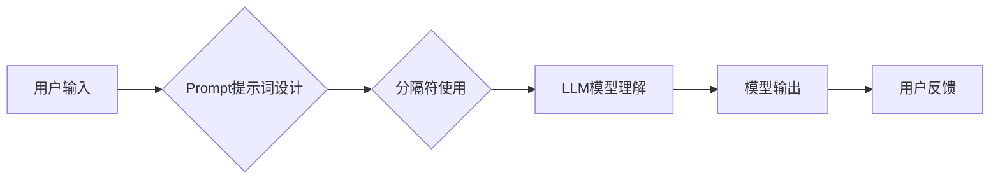

> AI大模型,Prompt提示词,分隔符,最佳实践,自然语言处理,文本生成

## 1. 背景介绍

近年来，大语言模型（LLM）在自然语言处理（NLP）领域取得了显著进展，展现出强大的文本生成、翻译、摘要等能力。然而，LLM的性能很大程度上取决于输入的Prompt提示词的质量。一个精心设计的Prompt可以引导模型生成更准确、更相关的输出，而一个模糊或不完整的Prompt则可能导致模型产生错误或不相关的结果。

Prompt提示词是LLM与用户交互的关键环节，它决定了模型的理解和输出方向。因此，如何设计高质量的Prompt提示词成为LLM应用的关键问题之一。

## 2. 核心概念与联系

**2.1  Prompt提示词**

Prompt提示词是指用户向LLM输入的文本指令或问题，它引导模型理解任务目标并生成相应的输出。

**2.2  分隔符**

分隔符是用于在Prompt提示词中划分不同部分的符号或字符串，例如：

*  **空格:** 最简单的分隔符，用于分隔单词或短语。
*  **换行符:** 用于分隔句子或段落。
*  **特定符号:** 例如“，”，“；”，“|”等，用于标记不同类型的输入或指示模型执行特定操作。

**2.3  Prompt提示词设计原则**

*  **明确目标:** Prompt提示词应清晰地表达用户想要模型完成的任务。
*  **提供上下文:**  为模型提供足够的背景信息，帮助其理解任务的语境。
*  **结构化输入:** 使用分隔符将Prompt提示词结构化，提高模型的理解效率。
*  **控制输出格式:**  指定模型输出的格式，例如文本、代码、列表等。

**2.4  分隔符的作用**

分隔符在Prompt提示词中起着至关重要的作用：

*  **提高可读性:**  分隔符使Prompt提示词更易于阅读和理解。
*  **明确语义:**  分隔符可以帮助模型区分不同类型的输入，例如事实、观点、指令等。
*  **控制输出:**  分隔符可以指示模型生成特定格式的输出。

**2.5  Mermaid 流程图**



## 3. 核心算法原理 & 具体操作步骤

**3.1  算法原理概述**

Prompt提示词设计和分隔符的使用本质上是基于自然语言处理（NLP）和机器学习（ML）的原理。

*  **NLP:**  NLP技术用于分析和理解人类语言，包括词法分析、语法分析、语义分析等。
*  **ML:**  ML算法可以从大量文本数据中学习语言模式和规律，并用于生成文本、翻译文本、总结文本等任务。

**3.2  算法步骤详解**

1.  **数据收集:** 收集大量文本数据，包括各种类型的文本，例如书籍、文章、对话等。
2.  **数据预处理:** 对文本数据进行清洗、格式化和标记，例如去除停用词、标点符号、HTML标签等。
3.  **模型训练:** 使用ML算法训练语言模型，例如Transformer模型，使其能够理解和生成人类语言。
4.  **Prompt设计:** 根据任务目标设计Prompt提示词，并使用分隔符进行结构化。
5.  **模型推理:** 将Prompt提示词输入到训练好的语言模型中，模型会根据输入生成相应的输出。
6.  **结果评估:** 对模型输出进行评估，例如使用BLEU、ROUGE等指标衡量文本生成质量。

**3.3  算法优缺点**

**优点:**

*  **生成高质量文本:**  LLM可以生成流畅、语法正确的文本。
*  **适应多种任务:**  LLM可以用于多种NLP任务，例如文本生成、翻译、摘要等。
*  **不断改进:**  随着训练数据的增加和算法的改进，LLM的性能不断提升。

**缺点:**

*  **训练成本高:**  训练大型语言模型需要大量的计算资源和时间。
*  **数据依赖:**  LLM的性能很大程度上取决于训练数据的质量和数量。
*  **潜在风险:**  LLM可能生成带有偏见或错误信息的文本。

**3.4  算法应用领域**

*  **聊天机器人:**  构建更智能、更自然的聊天机器人。
*  **文本生成:**  自动生成新闻报道、小说、诗歌等文本。
*  **机器翻译:**  实现更高效、更准确的机器翻译。
*  **代码生成:**  辅助程序员编写代码。

## 4. 数学模型和公式 & 详细讲解 & 举例说明

**4.1  数学模型构建**

LLM通常基于Transformer模型架构，其核心是自注意力机制（Self-Attention）。自注意力机制允许模型在处理文本时关注不同词之间的关系，从而更好地理解上下文信息。

**4.2  公式推导过程**

自注意力机制的计算过程可以概括为以下公式：

$$
Attention(Q, K, V) = softmax(\frac{QK^T}{\sqrt{d_k}})V
$$

其中：

*  $Q$：查询矩阵
*  $K$：键矩阵
*  $V$：值矩阵
*  $d_k$：键向量的维度
*  $softmax$：softmax函数，用于归一化注意力权重

**4.3  案例分析与讲解**

假设我们有一个句子“我爱吃苹果”，将其转换为词向量表示，得到三个词向量：

*  “我”：$q_1$
*  “爱”：$q_2$
*  “吃”：$q_3$

然后，将词向量与键向量$k_1$, $k_2$, $k_3$进行点积，并使用softmax函数归一化，得到每个词对其他词的注意力权重。例如，$q_1$对$k_2$的注意力权重表示“我”与“爱”之间的关系强度。

## 5. 项目实践：代码实例和详细解释说明

**5.1  开发环境搭建**

*  操作系统：Linux/macOS
*  编程语言：Python
*  深度学习框架：TensorFlow/PyTorch
*  其他依赖库：transformers、numpy、pandas等

**5.2  源代码详细实现**

```python
from transformers import AutoModelForCausalLM, AutoTokenizer

# 加载预训练模型和词典
model_name = "gpt2"
tokenizer = AutoTokenizer.from_pretrained(model_name)
model = AutoModelForCausalLM.from_pretrained(model_name)

# 定义Prompt提示词
prompt = "写一首关于春天的诗:"

# 使用分隔符将Prompt提示词结构化
prompt = prompt + "
"

# 将Prompt提示词转换为模型输入格式
inputs = tokenizer(prompt, return_tensors="pt")

# 使用模型生成文本
outputs = model.generate(**inputs)

# 将模型输出转换为文本
generated_text = tokenizer.decode(outputs[0], skip_special_tokens=True)

# 打印生成结果
print(generated_text)
```

**5.3  代码解读与分析**

*  代码首先加载预训练的GPT-2模型和词典。
*  然后定义Prompt提示词，并使用分隔符将其结构化。
*  将Prompt提示词转换为模型输入格式，并使用模型生成文本。
*  最后将模型输出转换为文本，并打印生成结果。

**5.4  运行结果展示**

```
春风拂面暖洋洋，
花儿绽放满山岗。
小鸟歌唱枝头俏，
万物复苏生机强。
```

## 6. 实际应用场景

**6.1  聊天机器人**

使用Prompt提示词和分隔符可以构建更智能、更自然的聊天机器人，例如：

*  **对话流控制:**  使用分隔符标记不同的对话阶段，引导聊天机器人进行更流畅的对话。
*  **个性化回复:**  根据用户的历史对话记录，使用Prompt提示词生成个性化的回复。

**6.2  文本生成**

Prompt提示词可以用于生成各种类型的文本，例如：

*  **小说创作:**  使用Prompt提示词提供故事背景、人物设定等信息，引导模型生成小说情节。
*  **诗歌创作:**  使用Prompt提示词指定诗歌主题、风格等信息，引导模型生成诗歌。

**6.3  代码生成**

Prompt提示词可以帮助程序员更快、更轻松地编写代码，例如：

*  **代码补全:**  根据程序员输入的部分代码，使用Prompt提示词生成完整的代码片段。
*  **代码翻译:**  使用Prompt提示词将代码从一种编程语言翻译成另一种编程语言。

**6.4  未来应用展望**

随着LLM技术的不断发展，Prompt提示词和分隔符将在更多领域得到应用，例如：

*  **教育:**  使用Prompt提示词辅助学生学习，例如生成习题、提供学习建议等。
*  **医疗:**  使用Prompt提示词辅助医生诊断疾病、制定治疗方案等。
*  **科学研究:**  使用Prompt提示词辅助科学家进行数据分析、模型构建等。

## 7. 工具和资源推荐

**7.1  学习资源推荐**

*  **书籍:**
    *  《深度学习》
    *  《自然语言处理》
*  **在线课程:**
    *  Coursera: 自然语言处理
    *  edX: 深度学习
*  **博客:**
    *  Hugging Face Blog
    *  OpenAI Blog

**7.2  开发工具推荐**

*  **深度学习框架:** TensorFlow, PyTorch
*  **NLP库:** transformers, spaCy, NLTK
*  **代码编辑器:** VS Code, Sublime Text

**7.3  相关论文推荐**

*  Attention Is All You Need
*  BERT: Pre-training of Deep Bidirectional Transformers for Language Understanding
*  GPT-3: Language Models are Few-Shot Learners

## 8. 总结：未来发展趋势与挑战

**8.1  研究成果总结**

近年来，LLM在文本生成、翻译、摘要等任务上取得了显著进展，Prompt提示词和分隔符的设计成为LLM应用的关键环节。

**8.2  未来发展趋势**

*  **模型规模更大:**  随着计算资源的不断提升，LLM模型规模将进一步扩大，性能将得到进一步提升。
*  **多模态理解:**  LLM将能够理解和生成多种模态数据，例如文本、图像、音频等。
*  **个性化定制:**  LLM将能够根据用户的个性化需求进行定制，生成更符合用户偏好的文本。

**8.3  面临的挑战**

*  **数据安全:**  LLM的训练数据可能包含敏感信息，需要采取措施保护数据安全。
*  **模型偏见:**  LLM可能存在偏见，需要进行公平性评估和缓解措施。
*  **可解释性:**  LLM的决策过程难以解释，需要提高模型的可解释性。

**8.4  研究展望**

未来研究将重点关注以下几个方面：

*  **更有效的Prompt设计方法:**  开发更智能、更有效的Prompt设计方法，提高LLM的性能。
*  **多模态LLM的开发:**  研究多模态LLM，使其能够理解和生成多种模态数据。
*  **可解释性增强:**  提高LLM的解释性，使其决策过程更加透明。

## 9. 附录：常见问题与解答

**9.1  如何设计高质量的Prompt提示词？**

*  明确目标：明确用户想要模型完成的任务。
*  提供上下文：为模型提供足够的背景信息。
*  结构化输入：使用分隔符将Prompt提示词