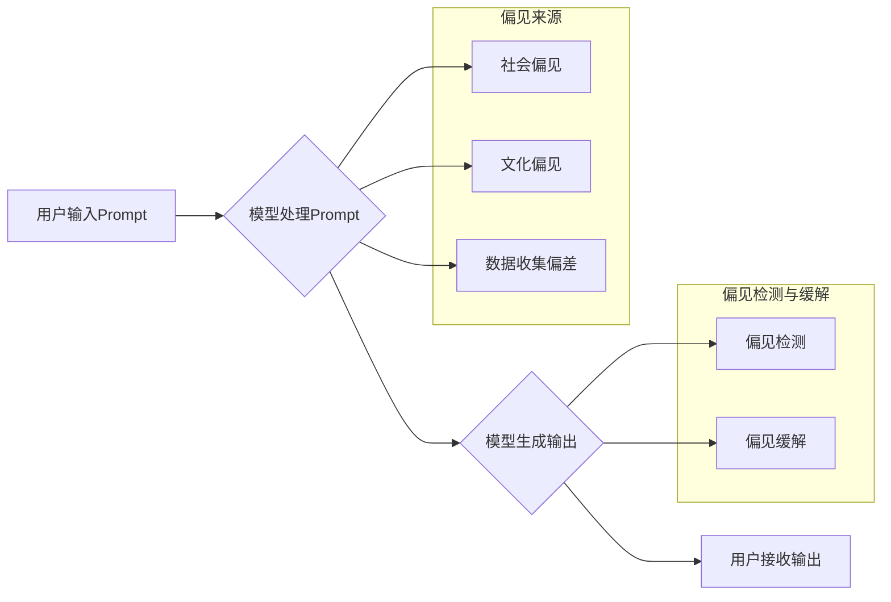

> AI大模型,Prompt提示词,偏见,公平性,伦理,最佳实践,模型训练,数据清洗

## 1. 背景介绍

近年来，大规模语言模型（LLM）的快速发展，如GPT-3、LaMDA和BERT等，为人工智能领域带来了革命性的变革。这些模型能够理解和生成人类语言，在文本生成、翻译、问答等领域展现出令人惊叹的性能。然而，LLM的训练数据往往包含人类社会中的各种偏见和歧视，导致模型输出也可能带有这些偏见，从而引发伦理和社会问题。

偏见在AI模型中表现为：

* **歧视性结果:** 模型可能对特定种族、性别、宗教或其他群体产生歧视性的预测或生成结果。
* **强化现有偏见:** 模型可能加剧现有的社会偏见，例如，将某些职业或角色与特定性别联系在一起。
* **误导性信息:** 模型可能生成包含错误信息或偏见观点的文本，误导用户。

解决AI模型中的偏见问题至关重要，以确保AI技术能够公平、公正地服务于所有人。

## 2. 核心概念与联系

**2.1  Prompt提示词**

Prompt提示词是用户与AI模型交互的关键要素。它引导模型生成特定类型的输出，并影响模型的输出结果。

**2.2  偏见来源**

模型的偏见主要源于训练数据中的偏见。训练数据可能包含以下类型的偏见：

* **社会偏见:** 训练数据可能反映社会中存在的种族、性别、宗教等方面的偏见。
* **文化偏见:** 训练数据可能包含特定文化背景的偏见，这些偏见可能在其他文化中不适用。
* **数据收集偏差:** 数据收集过程本身可能存在偏差，例如，某些群体的数据可能更难获取。

**2.3  偏见检测与缓解**

偏见检测旨在识别模型输出中的偏见，而偏见缓解则旨在减少模型输出中的偏见。

**2.4  公平性与伦理**

公平性是指AI模型对所有用户提供平等的待遇，而伦理则指AI模型的使用符合道德规范。

**Mermaid 流程图**



## 3. 核心算法原理 & 具体操作步骤

### 3.1  算法原理概述

偏见缓解算法旨在通过修改模型的训练过程或输出过程来减少模型输出中的偏见。常见的偏见缓解算法包括：

* **数据预处理:** 通过数据清洗、重采样等方法来减少训练数据中的偏见。
* **对抗训练:** 通过生成对抗样本来训练模型，使其能够识别和抵抗偏见。
* **公平性约束:** 在模型训练过程中加入公平性约束，例如，确保模型对不同群体预测结果的差异在可接受范围内。

### 3.2  算法步骤详解

以数据预处理为例，其具体步骤如下：

1. **数据收集:** 收集用于训练模型的数据。
2. **数据清洗:** 删除数据中的噪声、错误和不完整信息。
3. **数据标注:** 为数据添加标签，以便模型进行学习。
4. **数据平衡:** 通过重采样等方法来平衡不同群体的样本数量。
5. **数据去敏感特征:** 删除数据中的敏感特征，例如种族、性别等，以减少模型对这些特征的依赖。

### 3.3  算法优缺点

**优点:**

* 可以有效减少模型输出中的偏见。
* 相对简单易实现。

**缺点:**

* 可能导致数据信息损失。
* 难以完全消除数据中的偏见。

### 3.4  算法应用领域

偏见缓解算法广泛应用于以下领域：

* **自然语言处理:** 减少文本生成、翻译、问答等任务中的偏见。
* **计算机视觉:** 减少图像识别、物体检测等任务中的偏见。
* **推荐系统:** 减少推荐结果中的偏见。

## 4. 数学模型和公式 & 详细讲解 & 举例说明

### 4.1  数学模型构建

假设我们有一个分类模型，其目标是预测样本属于某个类别。我们可以使用以下数学模型来衡量模型的公平性：

$$
\text{Disparate Impact} = \frac{TP_1 + FN_1}{TP_1 + FP_1 + FN_1 + TN_1} / \frac{TP_2 + FN_2}{TP_2 + FP_2 + FN_2 + TN_2}
$$

其中：

* $TP_1$ 和 $TP_2$ 分别表示模型对两个群体的正例预测正确的数量。
* $FN_1$ 和 $FN_2$ 分别表示模型对两个群体的正例预测错误的（漏检）数量。
* $FP_1$ 和 $FP_2$ 分别表示模型对两个群体的负例预测错误的（误判）数量。
* $TN_1$ 和 $TN_2$ 分别表示模型对两个群体的负例预测正确的数量。

Disparate Impact 衡量了模型对两个群体预测结果的差异。

### 4.2  公式推导过程

Disparate Impact 公式的推导过程如下：

1. 计算每个群体的准确率：

$$
\text{Accuracy}_1 = \frac{TP_1 + TN_1}{TP_1 + FP_1 + FN_1 + TN_1}
$$

$$
\text{Accuracy}_2 = \frac{TP_2 + TN_2}{TP_2 + FP_2 + FN_2 + TN_2}
$$

2. 计算两个群体准确率的比值：

$$
\text{Disparate Impact} = \frac{\text{Accuracy}_1}{\text{Accuracy}_2}
$$

### 4.3  案例分析与讲解

假设我们有一个模型用于预测贷款申请是否通过。我们对两个群体（男性和女性）进行测试，发现模型对男性的准确率为 80%，对女性的准确率为 70%。

则 Disparate Impact 为：

$$
\text{Disparate Impact} = \frac{0.8}{0.7} = 1.14
$$

Disparate Impact 大于 1，表明模型对男性预测结果的准确率高于女性，存在性别偏见。

## 5. 项目实践：代码实例和详细解释说明

### 5.1  开发环境搭建

* Python 3.7+
* TensorFlow 2.0+
* PyTorch 1.0+

### 5.2  源代码详细实现

```python
import tensorflow as tf

# 定义模型
model = tf.keras.Sequential([
    tf.keras.layers.Dense(64, activation='relu'),
    tf.keras.layers.Dense(10, activation='softmax')
])

# 定义损失函数和优化器
loss_fn = tf.keras.losses.CategoricalCrossentropy()
optimizer = tf.keras.optimizers.Adam(learning_rate=0.001)

# 训练模型
model.compile(loss=loss_fn, optimizer=optimizer)
model.fit(x_train, y_train, epochs=10)

# 评估模型
loss, accuracy = model.evaluate(x_test, y_test)
print('Loss:', loss)
print('Accuracy:', accuracy)
```

### 5.3  代码解读与分析

* 代码首先定义了一个简单的多层感知机模型。
* 然后定义了损失函数和优化器。
* 使用 `model.fit()` 函数训练模型，并使用 `model.evaluate()` 函数评估模型性能。

### 5.4  运行结果展示

运行代码后，会输出模型的损失值和准确率。

## 6. 实际应用场景

### 6.1  医疗诊断

偏见缓解算法可以用于减少医疗诊断系统中的偏见，确保所有患者都能获得公平的诊断和治疗。

### 6.2  招聘筛选

偏见缓解算法可以用于减少招聘筛选系统中的偏见，确保所有候选人都得到公平的评估机会。

### 6.3  刑事司法

偏见缓解算法可以用于减少刑事司法系统中的偏见，确保所有被告人都得到公平的审判。

### 6.4  未来应用展望

随着AI技术的不断发展，偏见缓解算法将在更多领域得到应用，例如教育、金融、交通等。

## 7. 工具和资源推荐

### 7.1  学习资源推荐

* **论文:**

    * "On the Dangers of Stochastic Parrots: Can Language Models Be Too Big?"
    * "Mitigating Bias in Machine Learning"

* **书籍:**

    * "Weapons of Math Destruction: How Big Data Increases Inequality and Threatens Democracy"
    * "AI Superpowers: China, Silicon Valley, and the New World Order"

### 7.2  开发工具推荐

* **TensorFlow Fairness:** TensorFlow Fairness 是一个开源工具包，用于检测和缓解机器学习模型中的偏见。
* **AIF360:** AIF360 是一个开源工具包，用于评估和缓解机器学习模型中的公平性问题。

### 7.3  相关论文推荐

* "Fairness through Awareness"
* "Adversarial Debiasing"
* "Learning Fair Representations"

## 8. 总结：未来发展趋势与挑战

### 8.1  研究成果总结

近年来，在偏见缓解算法方面取得了显著进展，但仍然存在许多挑战。

### 8.2  未来发展趋势

* **更有效的偏见缓解算法:** 研究更有效的偏见缓解算法，能够更好地减少模型输出中的偏见。
* **更全面的公平性评估指标:** 开发更全面的公平性评估指标，能够更全面地衡量模型的公平性。
* **可解释性增强:** 提高偏见缓解算法的可解释性，以便更好地理解算法的工作原理和效果。

### 8.3  面临的挑战

* **数据偏差:** 数据偏差是导致模型偏见的根本原因，如何有效地解决数据偏差问题仍然是一个挑战。
* **公平性定义:** 公平性的定义是多方面的，不同场景下公平性的要求可能不同，如何制定统一的公平性标准是一个挑战。
* **伦理问题:** 偏见缓解算法的应用可能会引发伦理问题，例如，如何平衡公平性和效率。

### 8.4  研究展望

未来，偏见缓解算法的研究将继续深入，朝着更有效、更全面、更可解释的方向发展。


## 9. 附录：常见问题与解答

**Q1: 如何判断模型是否存在偏见？**

**A1:** 可以使用各种偏见检测工具和指标来判断模型是否存在偏见，例如Disparate Impact、Equalized Odds等。

**Q2: 如何缓解模型中的偏见？**

**A2:** 可以使用各种偏见缓解算法来缓解模型中的偏见，例如数据预处理、对抗训练、公平性约束等。

**Q3: 偏见缓解算法是否能够完全消除模型中的偏见？**

**A3:** 目前还没有一种方法能够完全消除模型中的偏见，因为数据本身可能就存在偏见。但是，我们可以通过使用偏见缓解算法来减少模型输出中的偏见。


作者：禅与计算机程序设计艺术 / Zen and the Art of Computer Programming 
<end_of_turn>