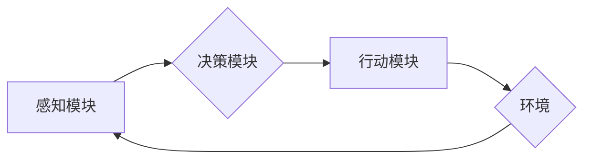

> AI系统,代理,智能体,决策,环境交互,强化学习,多智能体系统

## 1. 背景介绍

在人工智能 (AI) 系统的不断发展中，代理的概念逐渐成为核心构建块，为实现智能行为和交互提供了强大的框架。代理是一种能够感知环境、做出决策并与环境交互的智能体。它可以是软件程序、机器人或其他任何能够自主行动的实体。

代理在AI系统中的应用日益广泛，涵盖了自然语言处理、计算机视觉、机器人控制、游戏AI等多个领域。例如，在聊天机器人中，代理扮演着与用户交互的角色，理解用户的意图并提供相应的回复；在无人驾驶汽车中，代理负责感知周围环境、做出驾驶决策并控制车辆行驶；在游戏AI中，代理控制游戏角色，根据游戏规则和环境做出策略性决策。

## 2. 核心概念与联系

**2.1 代理的概念**

代理是一个能够感知环境、做出决策并与环境交互的智能体。它可以被视为一个独立的实体，拥有自己的目标和行为策略。代理的特性包括：

* **感知能力:** 代理能够感知环境中的信息，例如传感器数据、用户输入等。
* **决策能力:** 代理能够根据感知到的信息和自身的知识，做出决策并选择行动。
* **行动能力:** 代理能够与环境进行交互，执行决策并改变环境状态。
* **目标:** 代理拥有自己的目标，例如完成任务、获得奖励等。

**2.2 代理与环境的交互**

代理与环境之间存在着相互作用关系。代理通过感知环境信息来了解当前状态，并根据决策做出行动，从而改变环境状态。这种交互过程可以被描述为一个循环：

1. 代理感知环境信息。
2. 代理根据感知信息做出决策。
3. 代理执行决策，与环境交互。
4. 环境状态发生变化，代理感知新的环境信息。

**2.3 代理的类型**

代理可以根据不同的分类标准进行划分，例如：

* **基于模型的代理:** 拥有环境模型，能够预测环境状态的变化。
* **基于价值的代理:** 通过学习环境奖励函数，选择能够获得最大奖励的行动。
* **基于策略的代理:** 直接学习行动策略，无需构建环境模型。
* **单智能体代理:** 独立行动，不与其他代理交互。
* **多智能体代理:** 与其他代理交互，共同完成任务或竞争资源。

**2.4 代理架构**

代理通常由以下几个主要部分组成：

* **感知模块:** 负责感知环境信息，例如传感器数据、用户输入等。
* **决策模块:** 负责根据感知信息和自身的知识，做出决策并选择行动。
* **行动模块:** 负责执行决策，与环境进行交互。
* **知识库:** 存储代理的知识和经验，例如规则、模型、策略等。



## 3. 核心算法原理 & 具体操作步骤

### 3.1 算法原理概述

代理的决策和行为通常基于一些核心算法，例如强化学习、搜索算法、决策树等。

**3.1.1 强化学习**

强化学习是一种机器学习方法，通过奖励和惩罚机制，训练代理学习最优的行为策略。代理在与环境交互的过程中，会根据采取的行动获得奖励或惩罚。通过不断学习和调整行为策略，代理最终能够获得最大的累积奖励。

**3.1.2 搜索算法**

搜索算法用于在状态空间中寻找最优路径或解。代理可以利用搜索算法，例如深度优先搜索、广度优先搜索等，在环境状态空间中搜索最优行动序列。

**3.1.3 决策树**

决策树是一种树形结构，用于表示决策规则和条件。代理可以利用决策树，根据感知到的环境信息，逐步决策并选择行动。

### 3.2 算法步骤详解

**3.2.1 强化学习算法步骤**

1. **初始化:** 设置代理的初始状态、动作空间、奖励函数等参数。
2. **感知环境:** 代理感知环境信息，例如当前状态、可用动作等。
3. **选择行动:** 代理根据当前状态和策略，选择一个行动。
4. **执行行动:** 代理执行选择的行动，与环境交互。
5. **获得奖励:** 环境根据代理的行动，给予相应的奖励或惩罚。
6. **更新策略:** 代理根据获得的奖励，更新自身的策略，以提高未来获得奖励的概率。
7. **重复步骤2-6:** 直到代理达到预设的目标或训练结束。

**3.2.2 搜索算法步骤**

1. **定义目标状态:** 确定代理需要达成的目标状态。
2. **构建状态空间:** 将环境状态表示为一个状态空间，其中每个状态对应一个环境配置。
3. **选择搜索算法:** 根据问题特点选择合适的搜索算法，例如深度优先搜索、广度优先搜索等。
4. **执行搜索:** 利用选择的搜索算法，在状态空间中搜索从当前状态到目标状态的路径。
5. **选择最佳路径:** 从搜索结果中选择最优路径，并指导代理执行相应的行动。

### 3.3 算法优缺点

**3.3.1 强化学习算法**

* **优点:** 能够学习复杂的行为策略，适应动态变化的环境。
* **缺点:** 训练过程可能需要大量数据和时间，容易陷入局部最优解。

**3.3.2 搜索算法**

* **优点:** 能够找到最优解，适用于确定性环境。
* **缺点:** 效率较低，难以处理复杂的大规模状态空间。

### 3.4 算法应用领域

**3.4.1 强化学习算法**

* **机器人控制:** 训练机器人完成复杂的任务，例如导航、抓取、运动控制等。
* **游戏AI:** 开发智能游戏角色，能够与人类玩家进行对抗或合作。
* **推荐系统:** 建立个性化推荐系统，根据用户的行为和偏好推荐物品或内容。

**3.4.2 搜索算法**

* **路径规划:** 规划机器人或车辆在复杂环境中的路径。
* **组合优化问题:** 解决资源分配、调度等组合优化问题。
* **游戏人工智能:** 在一些策略游戏，例如围棋、象棋等，搜索算法可以用于寻找最优策略。

## 4. 数学模型和公式 & 详细讲解 & 举例说明

### 4.1 数学模型构建

**4.1.1 强化学习模型**

强化学习模型可以表示为一个马尔可夫决策过程 (MDP)，其中包含以下元素:

* **状态空间 (S):** 环境可能存在的全部状态。
* **动作空间 (A):** 代理可以采取的全部动作。
* **转移概率 (P):** 从一个状态执行一个动作后转移到另一个状态的概率。
* **奖励函数 (R):** 代理在某个状态执行某个动作后获得的奖励。
* **折扣因子 (γ):** 用于权衡未来奖励的价值。

**4.1.2 数学公式**

强化学习的目标是找到一个最优策略 π，使得代理在与环境交互的过程中获得最大的累积奖励。最优策略 π* 可以通过以下公式表示:

```latex
\pi^* = \arg\max_{\pi} \mathbb{E}_{\pi} \sum_{t=0}^{\infty} \gamma^t r_t
```

其中:

* $\mathbb{E}_{\pi}$ 表示根据策略 π 采样的期望值。
* $r_t$ 表示在时间步 t 获得的奖励。

### 4.2 公式推导过程

最优策略的推导过程通常涉及动态规划算法或蒙特卡罗方法。

**4.2.1 动态规划算法**

动态规划算法通过递归的方式，从最优子问题的解出发，逐步推导最优策略。Bellman 方程是动态规划算法的核心，它描述了最优价值函数的递推关系。

**4.2.2 蒙特卡罗方法**

蒙特卡罗方法通过模拟代理与环境交互的过程，收集经验数据，并根据经验数据更新策略。

### 4.3 案例分析与讲解

**4.3.1 围棋AI**

AlphaGo 是 DeepMind 开发的围棋AI，它利用强化学习算法，通过与人类围棋高手进行比赛，不断学习和改进策略。AlphaGo 的成功证明了强化学习算法在复杂游戏中的应用潜力。

## 5. 项目实践：代码实例和详细解释说明

### 5.1 开发环境搭建

* **操作系统:** Linux/macOS/Windows
* **编程语言:** Python
* **库依赖:** OpenAI Gym, TensorFlow/PyTorch

### 5.2 源代码详细实现

```python
import gym
import numpy as np

# 创建环境
env = gym.make('CartPole-v1')

# 定义代理策略
def policy(state):
    # 根据状态选择动作
    action = 0 if state[2] < 0 else 1
    return action

# 训练代理
for episode in range(1000):
    state = env.reset()
    done = False
    total_reward = 0

    while not done:
        # 选择动作
        action = policy(state)

        # 执行动作
        next_state, reward, done, _ = env.step(action)

        # 更新状态
        state = next_state

        # 计算总奖励
        total_reward += reward

    print(f'Episode {episode+1}, Total Reward: {total_reward}')

# 关闭环境
env.close()
```

### 5.3 代码解读与分析

* **环境创建:** 使用 OpenAI Gym 库创建 CartPole-v1 环境。
* **代理策略:** 定义一个简单的策略，根据状态的倾斜角度选择动作。
* **训练循环:** 训练代理 1000 个回合，每个回合执行直到环境终止。
* **状态更新:** 在每个时间步，根据执行的动作更新状态。
* **奖励计算:** 计算每个回合的总奖励。

### 5.4 运行结果展示

运行代码后，会输出每个回合的总奖励，随着训练的进行，代理的总奖励会逐渐提高，最终能够稳定地完成任务。

## 6. 实际应用场景

### 6.1 自然语言处理

* **聊天机器人:** 代理可以理解用户意图，并生成自然语言回复。
* **机器翻译:** 代理可以学习语言之间的映射关系，将文本从一种语言翻译成另一种语言。
* **文本摘要:** 代理可以分析文本内容，生成简洁的摘要。

### 6.2 计算机视觉

* **图像识别:** 代理可以学习图像特征，识别图像中的物体。
* **目标跟踪:** 代理可以跟踪图像中的目标，即使目标在运动或遮挡。
* **图像分割:** 代理可以将图像分割成不同的区域，例如前景和背景。

### 6.3 机器人控制

* **导航:** 代理可以帮助机器人自主导航，避开障碍物，到达目标位置。
* **抓取:** 代理可以控制机器人手臂，抓取和移动物体。
* **协作机器人:** 代理可以使多个机器人协同工作，完成复杂的任务。

### 6.4 未来应用展望

* **个性化教育:** 代理可以根据学生的学习进度和能力，提供个性化的学习内容和辅导。
* **医疗诊断:** 代理可以辅助医生诊断疾病，并提供个性化的治疗方案。
* **自动驾驶:** 代理可以控制自动驾驶汽车，实现安全可靠的自动驾驶。

## 7. 工具和资源推荐

### 7.1 学习资源推荐

* **书籍:**
    * Reinforcement Learning: An Introduction by Richard S. Sutton and Andrew G. Barto
    * Artificial Intelligence: A Modern Approach by Stuart Russell and Peter Norvig
* **在线课程:**
    * Coursera: Reinforcement Learning Specialization
    * Udacity: Artificial Intelligence Nanodegree

### 7.2 开发工具推荐

* **Python:** 广泛用于 AI 开发，拥有丰富的库和工具。
* **TensorFlow/PyTorch:** 深度学习框架，用于训练和部署 AI 模型。
* **OpenAI Gym:** 机器学习环境库，提供各种标准化环境。