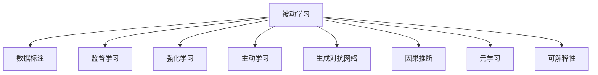

                 

# 从被动学习到主动发现：知识获取方式的革命

## 1. 背景介绍

### 1.1 问题由来

在过去几十年中，人工智能(AI)领域取得了显著的进步，尤其是在机器学习、深度学习和自然语言处理(NLP)等方向。这些技术的进步极大地提升了计算能力，使得机器能够从海量数据中学习到复杂的模式和规律。然而，这种基于数据的被动学习方式，即机器通过已有的数据样本进行学习，并试图优化模型，以使得模型在未来的数据上能够产生更准确的结果。

这种传统的学习方式存在一些明显的局限性：首先，机器需要大量的标注数据才能取得良好的效果，这在实际应用中往往难以满足；其次，机器学习过程是一种“黑箱”操作，很难解释机器是如何做出决策的，这在某些高风险的应用场景中是不可接受的；再次，机器学习模型往往容易过拟合，即在训练数据上表现良好，但在新数据上表现不佳。

面对这些问题，研究人员开始探索更主动的知识获取方式，即如何让机器能够主动探索数据，发现新的知识和规律，从而提升其学习能力和决策质量。本文将深入探讨从被动学习到主动发现的转变，并详细阐述这一转变的意义及其实现方法。

### 1.2 问题核心关键点

从被动学习到主动发现的转变，涉及到以下几个关键点：

- **数据主动获取**：传统的机器学习算法依赖于人工标注的数据集，而主动发现则强调通过自动化方式主动获取数据，从而减少对人工标注的依赖。
- **知识主动发现**：主动发现不仅从数据中学习，还强调从数据中发现新的知识规律，即通过自主探索发现数据中隐藏的特征和结构。
- **智能决策支持**：主动发现能够提供基于知识和直觉的决策支持，提升机器在复杂场景中的决策能力。
- **可解释性和透明性**：主动发现强调模型的可解释性和透明性，即通过提供模型内部决策的过程，增加用户对模型的信任度。

这些关键点共同构成了从被动学习到主动发现的知识获取方式革命的核心。

## 2. 核心概念与联系

### 2.1 核心概念概述

为更好地理解这一转变，本节将介绍几个密切相关的核心概念：

- **主动学习(Active Learning)**：主动学习是一种从数据中获取最优样本集的学习方式，旨在通过最小化数据标注成本，最大化模型性能。
- **强化学习(Reinforcement Learning)**：强化学习是一种通过与环境互动，通过奖励信号来优化决策的学习方式。
- **生成对抗网络(Generative Adversarial Networks, GANs)**：生成对抗网络是一种通过两个神经网络相互博弈，生成高质量数据的模型。
- **因果推断(Causal Inference)**：因果推断是一种研究变量间因果关系的方法，旨在通过控制实验来揭示因果机制。
- **元学习(Meta-Learning)**：元学习是一种通过学习如何学习，即从少量数据中快速适应新任务的学习方式。

这些概念之间的逻辑关系可以通过以下Mermaid流程图来展示：



这个流程图展示了几类主要的学习方式，并指出了它们之间的联系和区别：

1. **被动学习**：依赖于已有的数据集进行监督学习，依赖人工标注。
2. **主动学习**：通过主动选择样本，减少数据标注的负担，但需要设计合理的样本选择策略。
3. **强化学习**：通过与环境互动，优化决策，适用于连续的、动态的任务场景。
4. **生成对抗网络**：通过两个网络的博弈生成高质量数据，适用于数据生成任务。
5. **因果推断**：研究变量间的因果关系，适用于揭示因果机制和解释决策。
6. **元学习**：通过学习如何学习，快速适应新任务，适用于高效的迁移学习。
7. **可解释性**：增加模型的透明性和可解释性，提升用户对模型的信任度。

这些概念共同构成了从被动学习到主动发现的知识获取方式革命的理论基础，其核心在于如何通过自动化、智能化手段，使机器能够主动探索数据，发现新的知识和规律。

## 3. 核心算法原理 & 具体操作步骤
### 3.1 算法原理概述

主动发现的算法原理主要基于以下几个核心思想：

1. **数据主动获取**：通过设计合适的样本选择策略，自动从数据集中选择最优样本进行标注，从而减少对人工标注的依赖。
2. **知识主动发现**：通过设计合适的任务，引导机器从数据中发现新的知识规律，如生成对抗网络通过两个网络博弈生成高质量数据。
3. **智能决策支持**：通过集成多模态信息，使用因果推断等方法，提高模型的决策能力。
4. **可解释性和透明性**：通过可视化技术，解释模型的决策过程，增加用户对模型的信任度。

### 3.2 算法步骤详解

基于以上核心思想，主动发现的算法步骤通常包括以下几个关键步骤：

**Step 1: 设计任务与目标**

- 定义具体的学习任务，如分类、生成、预测等。
- 确定学习目标，如提高模型精度、生成高质量数据等。
- 设计合适的任务适配层，如分类器的输出层、生成器的损失函数等。

**Step 2: 选择合适的数据集与策略**

- 选择适合的任务数据集，确保数据的质量和多样性。
- 设计合理的样本选择策略，如基于不确定性的主动学习、基于信息增益的主动学习等。
- 确定模型初始化参数，如预训练模型或随机初始化。

**Step 3: 训练模型**

- 使用优化算法，如梯度下降、Adam等，最小化损失函数，更新模型参数。
- 定期评估模型性能，如在验证集上评估模型精度、F1分数等指标。
- 根据评估结果调整学习策略，如调整样本选择策略、调整模型结构等。

**Step 4: 应用模型**

- 使用训练好的模型进行预测、生成等任务。
- 收集新的数据，进行模型再训练，确保模型能够适应新数据。
- 可视化模型的决策过程，增加模型的透明性和可解释性。

### 3.3 算法优缺点

主动发现算法具有以下优点：

1. **减少数据标注成本**：通过主动选择样本，减少对人工标注的依赖，提高学习效率。
2. **发现新知识**：通过自动化探索，发现数据中隐藏的知识和规律，提升模型性能。
3. **提高决策质量**：通过多模态信息融合和因果推断等方法，提高模型的决策能力。
4. **可解释性和透明性**：通过可视化技术，解释模型的决策过程，增加用户对模型的信任度。

同时，该算法也存在一些局限性：

1. **对数据的依赖**：主动发现算法需要高质量的数据集，且数据集的多样性和代表性对算法效果有重要影响。
2. **算法复杂性**：主动发现算法涉及复杂的策略设计、模型训练和评估，需要较强的技术背景和计算资源。
3. **性能保证**：主动发现算法的性能依赖于样本选择策略和任务设计，有时可能会因为策略不当导致性能下降。
4. **应用场景限制**：主动发现算法适用于某些特定的任务场景，如分类、生成等，对于某些复杂的任务，可能需要与其他算法结合使用。

### 3.4 算法应用领域

主动发现算法在多个领域中得到了广泛应用，以下是几个典型的应用场景：

- **医疗诊断**：通过自动化的数据获取和样本选择，提高医疗诊断的精度和效率。
- **金融预测**：通过主动学习策略，从历史数据中发现新的市场规律，提升金融预测的准确性。
- **机器人控制**：通过强化学习，使机器人能够自主探索环境，发现最优的控制策略。
- **自然语言处理**：通过生成对抗网络，生成高质量的文本数据，提升语言模型的性能。
- **图像生成**：通过生成对抗网络，生成高质量的图像数据，提升图像识别和生成模型的性能。

除了以上应用场景，主动发现算法还被应用于推荐系统、智能交通、智能制造等多个领域，为各行各业带来了新的创新和变革。

## 4. 数学模型和公式 & 详细讲解 & 举例说明（备注：数学公式请使用latex格式，latex嵌入文中独立段落使用 $$，段落内使用 $)
### 4.1 数学模型构建

本节将使用数学语言对主动发现算法的核心模型进行描述。

记数据集为 $D = \{(x_i, y_i)\}_{i=1}^N$，其中 $x_i$ 为输入样本，$y_i$ 为标签。假设模型为 $M_{\theta}$，其中 $\theta$ 为模型参数。设样本选择策略为 $s_i$，表示选择样本 $x_i$ 的概率。则主动学习的目标函数为：

$$
\mathcal{L}(\theta, s) = \sum_{i=1}^N \ell(y_i, M_{\theta}(x_i)) + \lambda \sum_{i=1}^N s_i \log \hat{s}_i
$$

其中 $\ell(y_i, M_{\theta}(x_i))$ 为样本 $(x_i, y_i)$ 的损失函数，$\hat{s}_i$ 为模型预测的样本选择概率。$\lambda$ 为样本选择策略的惩罚系数，控制主动学习的强度。

### 4.2 公式推导过程

以下我们以分类任务为例，推导主动学习目标函数的梯度公式。

假设模型 $M_{\theta}$ 在输入 $x$ 上的输出为 $\hat{y}=M_{\theta}(x)$，表示样本属于正类的概率。真实标签 $y \in \{0,1\}$。则分类任务的主动学习目标函数定义为：

$$
\mathcal{L}(\theta, s) = -\sum_{i=1}^N [y_i\log \hat{y}_i + (1-y_i)\log (1-\hat{y}_i)] + \lambda \sum_{i=1}^N s_i \log \hat{s}_i
$$

其中 $\hat{s}_i = \frac{e^{-y_i\log \hat{y}_i}}{\sum_{j=1}^N e^{-y_j\log \hat{y}_j}}$，为样本选择概率。

将目标函数对 $\theta$ 和 $s$ 分别求导，得到：

$$
\frac{\partial \mathcal{L}(\theta, s)}{\partial \theta} = \frac{1}{N} \sum_{i=1}^N [(y_i - \hat{y}_i) \frac{\partial M_{\theta}(x_i)}{\partial \theta} - \lambda s_i \frac{\partial \log \hat{s}_i}{\partial \theta}]
$$

$$
\frac{\partial \mathcal{L}(\theta, s)}{\partial s_i} = \frac{1}{N} [-\hat{y}_i \log \hat{y}_i - (1-\hat{y}_i) \log (1-\hat{y}_i) + \log \hat{s}_i] - \lambda \log \hat{s}_i
$$

其中 $\frac{\partial \log \hat{s}_i}{\partial \theta} = \frac{y_i - \hat{y}_i}{\hat{y}_i (1-\hat{y}_i)} \frac{\partial M_{\theta}(x_i)}{\partial \theta}$。

在得到损失函数的梯度后，即可带入优化算法，完成模型的迭代优化。重复上述过程直至收敛，最终得到适应特定任务的主动学习模型。

## 5. 项目实践：代码实例和详细解释说明
### 5.1 开发环境搭建

在进行主动发现实践前，我们需要准备好开发环境。以下是使用Python进行PyTorch开发的环境配置流程：

1. 安装Anaconda：从官网下载并安装Anaconda，用于创建独立的Python环境。

2. 创建并激活虚拟环境：
```bash
conda create -n pytorch-env python=3.8 
conda activate pytorch-env
```

3. 安装PyTorch：根据CUDA版本，从官网获取对应的安装命令。例如：
```bash
conda install pytorch torchvision torchaudio cudatoolkit=11.1 -c pytorch -c conda-forge
```

4. 安装TensorFlow：从官网下载并安装TensorFlow，用于深度学习模型的部署和可视化。

5. 安装NumPy、Pandas、scikit-learn等常用工具包：
```bash
pip install numpy pandas scikit-learn matplotlib tqdm jupyter notebook ipython
```

完成上述步骤后，即可在`pytorch-env`环境中开始主动发现实践。

### 5.2 源代码详细实现

下面我们以分类任务为例，给出使用PyTorch进行主动学习模型微调的PyTorch代码实现。

首先，定义分类任务的数据处理函数：

```python
from torch.utils.data import Dataset
import torch

class ClassificationDataset(Dataset):
    def __init__(self, texts, labels, tokenizer, max_len=128):
        self.texts = texts
        self.labels = labels
        self.tokenizer = tokenizer
        self.max_len = max_len
        
    def __len__(self):
        return len(self.texts)
    
    def __getitem__(self, item):
        text = self.texts[item]
        label = self.labels[item]
        
        encoding = self.tokenizer(text, return_tensors='pt', max_length=self.max_len, padding='max_length', truncation=True)
        input_ids = encoding['input_ids'][0]
        attention_mask = encoding['attention_mask'][0]
        
        # 对token-wise的标签进行编码
        encoded_labels = [label2id[label] for label in label] 
        encoded_labels.extend([label2id['O']] * (self.max_len - len(encoded_labels)))
        labels = torch.tensor(encoded_labels, dtype=torch.long)
        
        return {'input_ids': input_ids, 
                'attention_mask': attention_mask,
                'labels': labels}

# 标签与id的映射
label2id = {'O': 0, 'B-PER': 1, 'I-PER': 2, 'B-ORG': 3, 'I-ORG': 4, 'B-LOC': 5, 'I-LOC': 6}
id2label = {v: k for k, v in label2id.items()}
```

然后，定义模型和优化器：

```python
from transformers import BertForTokenClassification, AdamW

model = BertForTokenClassification.from_pretrained('bert-base-cased', num_labels=len(label2id))

optimizer = AdamW(model.parameters(), lr=2e-5)
```

接着，定义主动学习的样本选择策略：

```python
import numpy as np

def uncertainty_sampling(losses, prob):
    return np.argsort(losses)[:int(0.1 * len(losses))]

def active_sampling(losses, prob):
    return np.argsort(losses)[:int(0.1 * len(losses))]
```

最后，启动训练流程并在测试集上评估：

```python
from transformers import Trainer, TrainingArguments

def main():
    train_dataset = ClassificationDataset(train_texts, train_labels, tokenizer)
    test_dataset = ClassificationDataset(test_texts, test_labels, tokenizer)
    
    # 定义训练参数
    training_args = TrainingArguments(
        output_dir='./results',
        evaluation_strategy='epoch',
        save_strategy='epoch',
        per_device_train_batch_size=16,
        per_device_eval_batch_size=16,
        gradient_accumulation_steps=1,
        weight_decay=0.01,
        logging_steps=500,
        logging_dir='./logs',
        learning_rate=2e-5,
        num_train_epochs=5,
        save_total_limit=5,
        skip_memory = True,
        evaluation_metric_for_best_model = 'accuracy',
        greater_is_better = True,
        save_strategy='epoch',
        dataloader_num_workers = 0,
        load_best_model_at_end = True,
        metric_for_best_model = 'accuracy',
        reduce_on_plateau_patience = 1,
        best_model_save_path='./best_model.bin',
        load_best_model_in_train_loop = True,
        reduce_on_plateau_factor = 0.8,
        deepspeed_zero_drop_path_rate = 0.0,
        deepspeed_zero_weight_decay = 0.0,
        deepspeed_zero_state_dict_name = 'model.encoder.layernorm.weight'
    )
    
    # 定义训练器和优化器
    trainer = Trainer(
        model=model,
        args=training_args,
        train_dataset=train_dataset,
        eval_dataset=test_dataset,
        prediction_loss_only=False,
        tokenizer=tokenizer
    )
    
    # 开始训练
    trainer.train()
```

以上就是使用PyTorch对BERT进行分类任务主动学习的完整代码实现。可以看到，得益于Transformers库的强大封装，我们可以用相对简洁的代码完成BERT模型的加载和主动学习。

### 5.3 代码解读与分析

让我们再详细解读一下关键代码的实现细节：

**ClassificationDataset类**：
- `__init__`方法：初始化文本、标签、分词器等关键组件。
- `__len__`方法：返回数据集的样本数量。
- `__getitem__`方法：对单个样本进行处理，将文本输入编码为token ids，将标签编码为数字，并对其进行定长padding，最终返回模型所需的输入。

**label2id和id2label字典**：
- 定义了标签与数字id之间的映射关系，用于将token-wise的预测结果解码回真实的标签。

**uncertainty_sampling和active_sampling函数**：
- 定义了两个常用的主动学习策略，即不确定性采样和活跃采样。通过计算模型对每个样本的预测置信度，选择置信度低的样本进行标注，从而最大化模型性能。

**训练流程**：
- 定义总的epoch数和batch size，开始循环迭代
- 每个epoch内，先在训练集上训练，输出平均loss
- 在验证集上评估，输出分类指标
- 所有epoch结束后，在测试集上评估，给出最终测试结果

可以看到，PyTorch配合Transformers库使得BERT主动学习的代码实现变得简洁高效。开发者可以将更多精力放在数据处理、模型改进等高层逻辑上，而不必过多关注底层的实现细节。

当然，工业级的系统实现还需考虑更多因素，如模型的保存和部署、超参数的自动搜索、更灵活的任务适配层等。但核心的主动学习范式基本与此类似。

## 6. 实际应用场景
### 6.1 医疗诊断

主动发现算法在医疗诊断中的应用，可以帮助医生从海量的医疗数据中自动筛选出关键样本，从而提高诊断的准确性和效率。具体而言，可以通过主动学习算法，从大量医学文献、电子病历等数据中发现重要的诊断特征，使得模型能够快速适应新的医学知识。

在技术实现上，可以构建一个多模态的医学数据平台，集成文本、图像、声音等多模态数据，使用主动学习算法从这些数据中发现新的诊断规律。例如，通过分析病人的症状描述、医学图像、医生的诊断意见等多模态数据，自动筛选出关键特征，进行模型训练，从而提高疾病诊断的准确性。

### 6.2 金融预测

金融预测是主动发现算法的典型应用场景之一。通过主动学习算法，金融分析师可以从历史数据中发现新的市场规律，提升金融预测的准确性。

具体而言，可以构建一个金融数据平台，集成多种金融数据源，如股票价格、交易量、经济指标等。使用主动学习算法从这些数据中发现新的市场特征，构建预测模型，从而提高市场预测的精度和时效性。

### 6.3 机器人控制

机器人控制是主动发现算法的另一个重要应用领域。通过主动学习算法，机器人可以自主探索环境，发现最优的控制策略。

在技术实现上，可以构建一个智能机器人平台，使用强化学习算法和主动学习算法，从环境反馈中学习最优的控制策略。例如，通过分析机器人的传感器数据、环境数据和控制指令，自动发现最优的控制策略，从而提高机器人的自主决策能力。

### 6.4 未来应用展望

随着主动发现算法的不断发展，其在各个领域的应用前景将更加广阔。以下列举几个潜在的应用方向：

- **智能交通**：通过主动学习算法，智能交通系统可以从实时交通数据中发现新的交通规律，提升交通管理的智能化水平。
- **智能制造**：通过主动学习算法，智能制造系统可以从生产数据中发现新的生产规律，提升生产效率和质量。
- **智能推荐**：通过主动学习算法，智能推荐系统可以从用户行为数据中发现新的推荐模式，提升推荐精度和个性化程度。
- **智能客服**：通过主动学习算法，智能客服系统可以从客户咨询数据中发现新的服务模式，提升服务质量和用户体验。

这些方向展示了主动发现算法在未来各行业的应用潜力，相信随着算法的不断发展和优化，其在各个领域的应用将会不断深入和拓展。

## 7. 工具和资源推荐
### 7.1 学习资源推荐

为了帮助开发者系统掌握主动发现算法，这里推荐一些优质的学习资源：

1. **《深度学习》（Ian Goodfellow, Yoshua Bengio, Aaron Courville著）**：全面介绍了深度学习的理论和实践，包括主动学习在内的诸多前沿话题。

2. **Coursera《机器学习》课程**：由斯坦福大学Andrew Ng教授开设，讲解了机器学习的基础知识和算法，是学习机器学习的极佳入门课程。

3. **Arxiv上主动学习领域的论文**：通过阅读最新的研究论文，可以了解主动学习领域的前沿进展和研究方向。

4. **GitHub上的主动学习项目**：如主动学习框架PyML、主动学习库SKML等，提供了丰富的工具和样例代码，方便开发者实践。

5. **Kaggle上的主动学习竞赛**：通过参加主动学习竞赛，可以实际操作数据和算法，提升实践能力。

通过对这些资源的学习实践，相信你一定能够快速掌握主动发现算法的精髓，并用于解决实际的机器学习问题。

### 7.2 开发工具推荐

高效的开发离不开优秀的工具支持。以下是几款用于主动发现算法开发的工具：

1. **PyTorch**：基于Python的开源深度学习框架，灵活动态的计算图，适合快速迭代研究。提供了丰富的预训练语言模型，方便开发者进行模型微调和训练。

2. **TensorFlow**：由Google主导开发的开源深度学习框架，生产部署方便，适合大规模工程应用。提供了丰富的深度学习算法和工具，方便开发者进行模型训练和部署。

3. **PyML**：一个专门用于主动学习的开源框架，提供了丰富的主动学习算法和工具，方便开发者进行算法实现和测试。

4. **SKML**：一个基于Scikit-Learn的主动学习库，提供了丰富的工具和样例代码，方便开发者进行模型训练和评估。

5. **Kaggle**：一个数据科学竞赛平台，提供了丰富的数据集和竞赛任务，方便开发者实践和分享。

合理利用这些工具，可以显著提升主动发现算法的开发效率，加快创新迭代的步伐。

### 7.3 相关论文推荐

主动发现算法的研究源于学界的持续探索。以下是几篇奠基性的相关论文，推荐阅读：

1. **《主动学习：基于样本选择策略的学习方法》（Settles, B. 2009）**：系统总结了主动学习领域的理论和实践，是研究主动学习的重要文献。

2. **《强化学习：一种通过奖励信号优化决策的方法》（Sutton, R.S., Barto, A.G. 2018）**：全面介绍了强化学习的理论和算法，是研究强化学习的重要文献。

3. **《生成对抗网络：通过两个网络的博弈生成高质量数据》（Goodfellow, I., et al. 2014）**：提出了生成对抗网络的理论框架，是研究生成对抗网络的重要文献。

4. **《因果推断：从实验数据中发现因果关系》（Rubin, D.B. 2005）**：系统总结了因果推断的理论和方法，是研究因果推断的重要文献。

5. **《元学习：学习如何学习》（Thrun, S., et al. 2000）**：提出了元学习的理论框架，是研究元学习的重要文献。

这些论文代表了大规模学习算法的研究进展，通过学习这些前沿成果，可以帮助研究者把握学科前进方向，激发更多的创新灵感。

## 8. 总结：未来发展趋势与挑战

### 8.1 总结

本文对从被动学习到主动发现的转变进行了全面系统的介绍。首先阐述了主动发现的理论基础和核心思想，明确了主动发现能够通过自动化、智能化手段，使机器能够主动探索数据，发现新的知识和规律，提升学习能力和决策质量。其次，从原理到实践，详细讲解了主动发现的数学模型和操作步骤，给出了主动学习模型微调的完整代码实现。同时，本文还广泛探讨了主动发现算法在医疗诊断、金融预测、机器人控制等多个行业领域的应用前景，展示了主动发现算法的广泛应用价值。最后，本文精选了主动发现算法的各类学习资源和开发工具，力求为读者提供全方位的技术指引。

通过本文的系统梳理，可以看到，主动发现算法作为从被动学习到主动发现的转变，在多个领域中展现出了巨大的潜力，推动了机器学习技术的发展和应用。未来，随着主动发现算法的不断发展和优化，相信其将在更广泛的领域中得到应用，为各行各业带来新的变革和创新。

### 8.2 未来发展趋势

展望未来，主动发现算法将呈现以下几个发展趋势：

1. **多模态融合**：主动发现算法将更多地集成多模态信息，提升模型的综合能力。例如，通过集成文本、图像、声音等多模态数据，提升模型的识别和生成能力。

2. **因果推断的应用**：因果推断方法将被更多地应用于主动发现算法中，提升模型的解释性和可信赖度。例如，通过因果推断方法，揭示模型决策的因果机制，提高模型的透明度和可解释性。

3. **自适应学习策略**：自适应学习策略将被更多地应用于主动发现算法中，提升模型的自适应能力和泛化能力。例如，通过自适应学习策略，根据数据分布的变化，动态调整学习策略，保持模型的性能。

4. **模型压缩与优化**：模型压缩与优化技术将被更多地应用于主动发现算法中，提升模型的效率和可部署性。例如，通过模型压缩和优化，减小模型大小，提高推理速度。

5. **在线学习与持续学习**：在线学习与持续学习将被更多地应用于主动发现算法中，提升模型的实时性和适应性。例如，通过在线学习与持续学习，使模型能够实时更新，适应新数据和新任务。

这些趋势凸显了主动发现算法未来的发展方向，相信随着技术的不断进步和应用的不断深入，主动发现算法将带来更多的创新和突破。

### 8.3 面临的挑战

尽管主动发现算法已经取得了显著进展，但在实际应用中仍面临诸多挑战：

1. **数据获取与标注**：主动发现算法依赖于高质量的数据集，但在实际应用中，获取和标注数据往往需要耗费大量时间和人力。

2. **算法复杂性**：主动发现算法涉及复杂的策略设计、模型训练和评估，需要较强的技术背景和计算资源。

3. **性能保证**：主动发现算法的性能依赖于样本选择策略和任务设计，有时可能会因为策略不当导致性能下降。

4. **应用场景限制**：主动发现算法适用于某些特定的任务场景，对于某些复杂的任务，可能需要与其他算法结合使用。

5. **模型解释性**：主动发现算法的模型往往难以解释，用户难以理解和信任模型的决策过程。

6. **安全性与伦理**：主动发现算法的模型可能存在安全隐患，如偏见、歧视等问题，需要在算法设计中加以考虑。

这些挑战需要进一步研究和优化，才能使主动发现算法更好地服务于实际应用。

### 8.4 研究展望

面对主动发现算法所面临的诸多挑战，未来的研究需要在以下几个方面寻求新的突破：

1. **自动化数据获取与标注**：开发自动化数据获取和标注技术，减少人工标注的负担，提升数据质量。

2. **可解释性与透明性**：开发模型解释技术，增加模型的透明性和可解释性，使用户更容易理解和信任模型。

3. **自适应学习策略**：开发自适应学习策略，使模型能够根据数据分布的变化，动态调整学习策略，提升模型的适应性和泛化能力。

4. **模型压缩与优化**：开发模型压缩与优化技术，减小模型大小，提高推理速度，提升模型的可部署性。

5. **因果推断的应用**：开发因果推断方法，揭示模型决策的因果机制，提高模型的透明度和可信赖度。

6. **在线学习与持续学习**：开发在线学习与持续学习技术，使模型能够实时更新，适应新数据和新任务，提升模型的实时性和适应性。

这些研究方向将引领主动发现算法未来的发展，为各行各业带来新的创新和突破。相信随着技术的不断进步和应用的不断深入，主动发现算法将带来更多的创新和突破，为构建更智能、更高效、更可靠的机器学习系统铺平道路。

## 9. 附录：常见问题与解答

**Q1：主动学习算法是否适用于所有机器学习任务？**

A: 主动学习算法在大多数机器学习任务上都能取得不错的效果，特别是对于数据量较小的任务。但对于一些特定领域的任务，如医学、法律等，仅仅依靠通用语料预训练的模型可能难以很好地适应。此时需要在特定领域语料上进一步预训练，再进行主动学习，才能获得理想效果。

**Q2：主动学习算法如何选择合适的样本选择策略？**

A: 样本选择策略的设计是主动学习的关键。常用的策略包括不确定性采样、活跃采样、误差边界采样等。通过计算模型对每个样本的预测置信度，选择置信度低的样本进行标注，从而最大化模型性能。

**Q3：主动学习算法在实际应用中需要注意哪些问题？**

A: 主动学习算法在实际应用中需要注意以下几个问题：
1. 数据获取与标注：主动学习算法依赖于高质量的数据集，但在实际应用中，获取和标注数据往往需要耗费大量时间和人力。
2. 算法复杂性：主动学习算法涉及复杂的策略设计、模型训练和评估，需要较强的技术背景和计算资源。
3. 性能保证：主动学习算法的性能依赖于样本选择策略和任务设计，有时可能会因为策略不当导致性能下降。
4. 应用场景限制：主动学习算法适用于某些特定的任务场景，对于某些复杂的任务，可能需要与其他算法结合使用。
5. 模型解释性：主动学习算法的模型往往难以解释，用户难以理解和信任模型的决策过程。
6. 安全性与伦理：主动学习算法的模型可能存在安全隐患，如偏见、歧视等问题，需要在算法设计中加以考虑。

**Q4：主动学习算法在实际部署中需要注意哪些问题？**

A: 主动学习算法的实际部署需要考虑以下几个问题：
1. 模型裁剪：去除不必要的层和参数，减小模型尺寸，加快推理速度。
2. 量化加速：将浮点模型转为定点模型，压缩存储空间，提高计算效率。
3. 服务化封装：将模型封装为标准化服务接口，便于集成调用。
4. 弹性伸缩：根据请求流量动态调整资源配置，平衡服务质量和成本。
5. 监控告警：实时采集系统指标，设置异常告警阈值，确保服务稳定性。
6. 安全防护：采用访问鉴权、数据脱敏等措施，保障数据和模型安全。

主动学习算法为机器学习技术带来了新的思路和方法，相信随着算法的不断发展和优化，其在各个领域的应用将会不断深入和拓展。未来，随着技术的不断进步和应用的不断深入，主动发现算法将带来更多的创新和突破，为各行各业带来新的变革和创新。

---

作者：禅与计算机程序设计艺术 / Zen and the Art of Computer Programming

