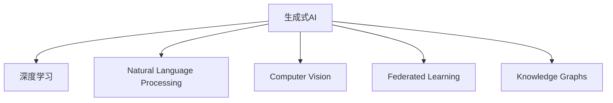

                 

# 从零开始构建AIGC应用生态

## 1. 背景介绍

### 1.1 问题由来

随着人工智能（AI）技术的飞速发展，生成式AI（Generative AI，简称AIGC）正在成为新一轮技术革新的焦点。AIGC技术以其高效、智能化、个性化等优势，在内容创作、视觉设计、语音生成、游戏开发等领域展现出强大的应用潜力。然而，AIGC技术目前还处于发展初期，需要更多基础研究和实践探索。

### 1.2 问题核心关键点

AIGC的核心关键点在于其“生成”能力，即能够通过学习和训练，生成具有一定质量的内容或产品。AIGC的生成能力依赖于深度学习、自然语言处理（NLP）、计算机视觉（CV）等前沿技术，需要在大规模数据上进行模型训练，以学习各种知识模式和生成规则。同时，AIGC还需要对生成的内容进行质量控制，以确保其符合人类文化和价值观的要求。

### 1.3 问题研究意义

研究AIGC技术的生态构建，对于推动AI技术的发展、提升用户体验、优化资源配置、促进产业转型升级具有重要意义：

1. **提升生产力**：AIGC技术能够自动化、智能化地完成内容创作、设计、翻译等工作，极大地提升生产力。
2. **创新创意**：AIGC能够生成新颖、创意丰富的内容，激发人类的创造力。
3. **降低成本**：AIGC能够大幅度降低内容创作的成本，特别是对于大规模、高重复性内容，如广告文案、电影剧本等。
4. **优化用户体验**：通过AIGC生成个性化推荐、智能对话等应用，提升用户体验。
5. **推动产业发展**：AIGC技术的应用推动了内容创作、娱乐、教育等多个产业的数字化、智能化转型。

## 2. 核心概念与联系

### 2.1 核心概念概述

为更好地理解AIGC生态的构建，本节将介绍几个密切相关的核心概念：

- **生成式AI（AIGC）**：利用深度学习等技术，自动生成文本、图像、音频等内容的技术。
- **深度学习**：通过多层神经网络对数据进行建模，自动发现数据中的模式和规律。
- **自然语言处理（NLP）**：使计算机能够理解、处理和生成人类语言的技术。
- **计算机视觉（CV）**：使计算机能够处理和分析图像、视频等视觉数据的技术。
- **联邦学习**：多参与方在不共享原始数据的情况下，通过本地数据训练模型，并聚合模型参数的分布式学习技术。
- **知识图谱**：通过结构化知识表示，构建语义网络，支持智能问答、推荐等应用。

这些核心概念之间的逻辑关系可以通过以下Mermaid流程图来展示：



这个流程图展示了大规模生成式AI技术的核心概念及其之间的关系：

1. 生成式AI利用深度学习、NLP、CV等技术，自动生成高质量内容。
2. 联邦学习使模型能够在分布式环境下进行高效训练，避免数据泄露。
3. 知识图谱提供结构化知识，增强内容生成和推理能力。

## 3. 核心算法原理 & 具体操作步骤

### 3.1 算法原理概述

AIGC技术通常依赖于预训练模型进行知识提取，再通过微调或进一步训练，生成特定任务或场景下的内容。其核心算法包括：

1. **预训练模型**：在大规模无标签数据上进行的深度学习模型训练，学习到通用的知识模式。
2. **微调模型**：在预训练模型的基础上，利用下游任务的标注数据进行有监督学习，适应特定任务。
3. **知识增强**：通过知识图谱、领域知识等，增强模型生成的内容质量和逻辑性。
4. **对抗训练**：引入对抗样本，提高模型的鲁棒性和泛化能力。

### 3.2 算法步骤详解

**Step 1: 准备数据和环境**

- **数据准备**：收集标注数据和无标签数据，分为训练集、验证集和测试集。
- **环境配置**：安装相关深度学习框架（如TensorFlow、PyTorch）和AIGC工具库（如OpenAI的DALL·E、GPT-3等）。

**Step 2: 预训练模型选择与适配**

- **选择预训练模型**：根据任务类型选择适合的预训练模型，如GPT-3、DALL·E等。
- **适配任务**：添加任务适配层，如分类器、解码器等，调整模型参数和超参数。

**Step 3: 微调和训练**

- **设置超参数**：确定学习率、批大小、迭代轮数、正则化技术等。
- **执行训练**：在训练集上前向传播计算损失，反向传播更新参数，并在验证集上评估性能。

**Step 4: 知识增强和优化**

- **知识图谱集成**：通过知识图谱增强模型生成的内容。
- **对抗训练**：加入对抗样本，提高模型的鲁棒性和泛化能力。

**Step 5: 评估和部署**

- **评估模型**：在测试集上评估模型性能，调整超参数或模型结构。
- **部署应用**：将模型集成到实际应用中，提供API或服务接口。

### 3.3 算法优缺点

AIGC技术具有以下优点：

1. **高效**：利用深度学习和自动化生成，大幅提升内容创作效率。
2. **个性化**：生成内容可根据用户需求进行定制，满足个性化需求。
3. **低成本**：减少人工创作成本，降低内容生产门槛。
4. **多模态**：支持文本、图像、音频等多模态数据的生成。

同时，AIGC技术也存在以下局限：

1. **数据依赖**：模型的生成能力依赖于数据质量和规模，难以处理极端小规模数据。
2. **质量控制**：生成的内容可能需要人工审核，确保符合人类价值观。
3. **伦理风险**：生成的内容可能包含偏见、有害信息，需要额外审核。
4. **资源消耗**：大规模模型训练和推理消耗大量计算资源。

## 4. 数学模型和公式 & 详细讲解 & 举例说明

### 4.1 数学模型构建

AIGC的生成过程通常涉及文本生成、图像生成、语音生成等不同任务，每个任务的数学模型构建略有不同。以文本生成为例，使用语言模型$P_{\theta}(w_t|w_{<t})$表示在上下文$w_{<t}$的条件下，生成单词$w_t$的概率。使用如下对数似然损失函数进行训练：

$$
\mathcal{L}(\theta) = -\sum_{t=1}^{T} \log P_{\theta}(w_t|w_{<t})
$$

其中$T$为生成文本的长度。

### 4.2 公式推导过程

以文本生成为例，假设模型基于循环神经网络（RNN）构建，使用LSTM进行文本建模。推导过程如下：

1. **输入编码**：将输入文本$x$通过嵌入层转化为向量$h_0$。
2. **文本生成**：在时间步$t$，根据上一步的隐状态$h_{t-1}$和当前单词$x_t$，计算下一个隐状态$h_t$和生成概率$p_t$。
3. **输出解码**：根据生成概率$p_t$，选择下一个单词$w_t$，更新隐状态$h_t$。
4. **损失计算**：计算对数似然损失$\mathcal{L}(\theta)$，反向传播更新模型参数$\theta$。

### 4.3 案例分析与讲解

以图像生成为例，使用生成对抗网络（GAN）模型。GAN模型由生成器$G$和判别器$D$组成，通过对抗训练使生成器能够生成与真实图像难以区分的虚假图像。训练过程如下：

1. **生成器训练**：生成器$G$通过噪声向量$z$生成图像$G(z)$。
2. **判别器训练**：判别器$D$对真实图像和生成图像进行判别，优化判别器的损失函数$\mathcal{L}_D$。
3. **对抗训练**：通过反向传播更新生成器和判别器的参数，使生成器生成的图像更逼真。

## 5. 项目实践：代码实例和详细解释说明

### 5.1 开发环境搭建

以TensorFlow 2.0为例，搭建AIGC开发环境：

1. 安装TensorFlow和相关依赖：
```bash
pip install tensorflow
```
2. 配置环境变量：
```bash
export TF_CPP_MIN_LOG_LEVEL=2
```

### 5.2 源代码详细实现

以文本生成模型为例，代码实现如下：

```python
import tensorflow as tf
from tensorflow.keras.layers import Input, Embedding, LSTM, Dense, Dropout
from tensorflow.keras.models import Model

# 定义模型
input_seq = Input(shape=(None,), dtype='int32')
x = Embedding(input_dim=1000, output_dim=128, mask_zero=True)(input_seq)
x = LSTM(128, return_sequences=True)(x)
x = Dropout(0.5)(x)
x = Dense(1024, activation='relu')(x)
output = Dense(1000, activation='softmax')(x)
model = Model(input_seq, output)

# 编译模型
model.compile(optimizer='adam', loss='categorical_crossentropy', metrics=['accuracy'])

# 训练模型
model.fit(x_train, y_train, batch_size=32, epochs=10, validation_data=(x_val, y_val))
```

### 5.3 代码解读与分析

**模型定义**：使用Embedding层将输入序列转换为向量，通过LSTM层进行序列建模，最后使用Dense层输出生成概率。

**损失函数**：使用交叉熵损失函数进行训练，优化模型生成概率与真实标签的差异。

**训练流程**：使用Adam优化器进行模型训练，在训练集上进行迭代优化，并在验证集上进行性能评估。

## 6. 实际应用场景

### 6.1 内容创作平台

AIGC技术可以应用于内容创作平台，如自动生成文章、博客、小说等。用户可以根据平台提供的话题或关键词，快速生成高质量内容，极大提升创作效率。

### 6.2 虚拟现实（VR）和增强现实（AR）

AIGC技术可以生成逼真的虚拟场景和人物，增强VR和AR的沉浸感。例如，在游戏中自动生成NPC对话、虚拟环境等。

### 6.3 智能客服

AIGC技术可以应用于智能客服，生成自然流畅的对话文本，快速解答用户问题。例如，通过对话历史生成相关问答模板，提升客服响应速度和质量。

### 6.4 未来应用展望

AIGC技术未来有望在更多领域得到应用，如医疗诊断、教育、媒体等。例如，在医疗领域，生成式模型可以辅助医生进行病例分析、药物研发等。在教育领域，生成式模型可以生成个性化学习材料，提升学习效果。

## 7. 工具和资源推荐

### 7.1 学习资源推荐

1. **Coursera《深度学习专项课程》**：由斯坦福大学提供，涵盖深度学习基础和实践，适合初学者入门。
2. **Google AI的AIGC系列文章**：涵盖生成对抗网络、自回归模型、序列到序列等技术。
3. **DeepMind的AIGC研究论文**：涵盖最新生成模型和应用研究，具有较高的学术价值。

### 7.2 开发工具推荐

1. **TensorFlow 2.0**：广泛应用的开源深度学习框架，支持分布式计算、自动微分等功能。
2. **PyTorch**：灵活易用的深度学习框架，支持动态图和静态图。
3. **JAX**：基于XLA优化的自动微分库，支持高性能计算。

### 7.3 相关论文推荐

1. **GPT-3的研究论文**：OpenAI发表的生成式预训练变换器模型，大幅提升了生成质量。
2. **GAN的研究论文**：Ian Goodfellow等发表的生成对抗网络模型，开创了生成式模型的研究新方向。
3. **Transformer的研究论文**：Ashish Vaswani等发表的Transformer模型，推动了NLP和AIGC的发展。

## 8. 总结：未来发展趋势与挑战

### 8.1 总结

本文对从零开始构建AIGC应用生态进行了全面系统的介绍。首先阐述了AIGC技术的研究背景和应用前景，明确了其在高生产力、个性化、低成本等方面的独特优势。其次，从原理到实践，详细讲解了AIGC的数学模型构建、算法步骤、优缺点和应用领域。同时，本文还广泛探讨了AIGC在内容创作、VR/AR、智能客服等众多行业领域的应用前景，展示了AIGC技术的巨大潜力。

### 8.2 未来发展趋势

展望未来，AIGC技术将呈现以下几个发展趋势：

1. **多模态生成**：支持文本、图像、音频等多模态数据生成，增强AIGC的表达能力。
2. **深度融合**：与其他AI技术如NLP、CV、自然语言推理等深度融合，提升AIGC的生成效果。
3. **联邦学习**：在大规模分布式数据上进行模型训练，提高模型的泛化能力。
4. **知识增强**：利用知识图谱、领域知识等，增强模型生成的内容质量和逻辑性。
5. **生成式推理**：将生成式和推理能力相结合，生成更具创造力和逻辑性的内容。

以上趋势凸显了AIGC技术的广阔前景。这些方向的探索发展，必将进一步提升AIGC系统的性能和应用范围，为人类生产力和创造力带来深刻变革。

### 8.3 面临的挑战

尽管AIGC技术已经取得了瞩目成就，但在迈向更加智能化、普适化应用的过程中，它仍面临诸多挑战：

1. **数据质量**：生成的内容依赖于数据质量，数据噪声、偏见等问题会影响生成效果。
2. **伦理道德**：生成的内容可能包含偏见、有害信息，需要额外审核。
3. **资源消耗**：大规模模型训练和推理消耗大量计算资源。
4. **鲁棒性**：生成的内容可能对输入有较强的依赖，对噪声和扰动敏感。
5. **公平性**：AIGC生成的内容可能存在偏见，需要保证公平性。

这些挑战需要多方协作，共同努力克服，才能使AIGC技术更好地服务于人类社会。

### 8.4 研究展望

面对AIGC技术面临的挑战，未来的研究需要在以下几个方面寻求新的突破：

1. **数据增强**：通过数据扩充、噪声注入等方法，提升数据质量。
2. **伦理监管**：引入伦理导向的评估指标，过滤和惩罚有害内容。
3. **高效计算**：优化计算图，减少资源消耗。
4. **鲁棒性提升**：通过对抗训练、鲁棒性优化等方法，提高模型的鲁棒性。
5. **公平性保障**：利用公平性约束和算法，保证生成的内容公平性。

这些研究方向的探索，必将引领AIGC技术迈向更高的台阶，为构建安全、可靠、可解释、可控的智能系统铺平道路。面向未来，AIGC技术还需要与其他AI技术进行更深入的融合，如知识表示、因果推理、强化学习等，多路径协同发力，共同推动人工智能技术的发展。

## 9. 附录：常见问题与解答

**Q1：AIGC技术是否适用于所有应用场景？**

A: AIGC技术在大多数领域都能取得不错的效果，特别是对于需要大量内容生成和创意输出的场景，如内容创作、娱乐、广告等。但对于一些需要深度理解人类意图和行为的场景，如医疗诊断、法律咨询等，需要结合领域知识进行优化。

**Q2：AIGC模型训练和优化有哪些技巧？**

A: AIGC模型训练和优化技巧包括：

1. **数据增强**：通过回译、近义替换等方式扩充训练集。
2. **正则化**：使用L2正则、Dropout等避免过拟合。
3. **对抗训练**：加入对抗样本，提高模型鲁棒性。
4. **知识增强**：利用知识图谱、领域知识等增强模型生成能力。
5. **多模型集成**：训练多个模型，取平均输出，提升生成质量。

这些技巧需要根据具体任务和数据特点进行灵活组合。

**Q3：AIGC技术的伦理问题如何处理？**

A: 处理AIGC技术的伦理问题需要多方面措施：

1. **数据筛选**：避免使用含有偏见和有害信息的数据。
2. **生成监控**：通过人工审核和算法过滤，保证生成的内容符合人类价值观。
3. **透明可解释**：确保AIGC模型的决策过程透明可解释，便于用户理解。

这些措施需要结合技术、政策和用户反馈进行持续改进。

**Q4：AIGC技术的资源优化有哪些方法？**

A: AIGC技术的资源优化方法包括：

1. **模型压缩**：去除不必要的层和参数，减小模型尺寸。
2. **量化加速**：将浮点模型转为定点模型，减少内存占用。
3. **分布式训练**：利用多机分布式计算，加速模型训练。
4. **计算图优化**：优化计算图，减少前向传播和反向传播的资源消耗。

这些方法需要根据具体应用场景进行优化。

---

作者：禅与计算机程序设计艺术 / Zen and the Art of Computer Programming

