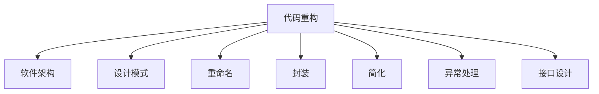

                 

# 代码重构技术：改善既有代码的设计

> 关键词：代码重构, 软件架构, 设计模式, 可读性, 可维护性, 可扩展性

## 1. 背景介绍

### 1.1 问题由来
随着软件开发项目的复杂度不断增加，代码库逐渐变得庞大、混乱，维护难度日益加大。对于开发团队而言，如何在保证软件质量的同时，提高开发效率，降低后期维护成本，成为越来越棘手的问题。此时，代码重构技术应运而生。通过系统化的重构方法，可以有效地改善既有代码的设计，提升软件的可读性、可维护性和可扩展性。

### 1.2 问题核心关键点
代码重构的核心理念是：在不改变程序原有功能的前提下，通过对代码结构、风格、逻辑等进行优化，提高代码的质量和可维护性。常见的重构操作包括：
- 重命名变量和函数
- 简化复杂的条件语句
- 删除重复代码
- 封装逻辑
- 改进异常处理
- 提升接口设计

通过有效的代码重构，代码库将变得结构清晰、逻辑明确，降低未来迭代和修改的风险，使得后续的开发和维护工作更加轻松。

### 1.3 问题研究意义
研究代码重构方法，对于提高软件的长期可持续性，提升开发团队的生产力，降低维护成本，具有重要意义：

1. 提升软件质量。重构后的代码结构清晰、逻辑明确，易于理解和修改，降低了引入新Bug的概率。
2. 加速开发进度。代码重构使得开发任务更加高效，缩短了项目迭代周期。
3. 促进技术积累。重构过程促进了开发者对代码的设计思考和最佳实践的积累，提升团队的技术水平。
4. 降低维护成本。经过重构的代码库，易于后续维护，减少因代码混乱引发的维护成本。
5. 推动架构演进。重构也是软件架构演进的重要手段，通过逐步优化和改进，最终实现系统结构的重构升级。

## 2. 核心概念与联系

### 2.1 核心概念概述

为更好地理解代码重构方法，本节将介绍几个密切相关的核心概念：

- 代码重构(Code Refactoring)：指在不改变程序原有功能的前提下，通过优化代码结构和逻辑，提升代码可读性和可维护性的过程。
- 软件架构(Software Architecture)：指软件系统的整体设计和组织结构，决定软件的可扩展性、可维护性和可重用性。
- 设计模式(Design Pattern)：指针对特定问题场景，经过广泛实践和验证的解决方案，可复用于代码设计中。
- 重命名(Variable/Renaming)：对代码中的变量、函数等进行重命名，提升代码可读性和可理解性。
- 封装(Capsule/Encapsulation)：通过将代码逻辑封装到函数、类中，提高代码的可复用性和可维护性。
- 简化(Simplification)：去除冗余代码和复杂逻辑，使代码结构更清晰，易于理解和修改。
- 异常处理(Exception Handling)：通过优化异常处理逻辑，减少代码的出错概率，提升系统的健壮性。
- 接口设计(Interface Design)：通过规范化接口设计，提升系统的模块化和可扩展性，便于后续功能的添加和修改。

这些核心概念之间的逻辑关系可以通过以下Mermaid流程图来展示：



这个流程图展示了大语言模型的核心概念及其之间的关系：

1. 代码重构是改善软件架构的重要手段。
2. 设计模式是代码重构的重要参考。
3. 重构操作包括重命名、封装、简化等。
4. 异常处理和接口设计是重构的重要关注点。

这些概念共同构成了代码重构的目标和实现框架，使其能够实现代码库的全面优化。

## 3. 核心算法原理 & 具体操作步骤
### 3.1 算法原理概述

代码重构的本质是一种优化算法，旨在通过系统化的重构步骤，改善代码的设计，提升软件系统的质量和性能。其核心思想是：在不改变程序原有功能的前提下，通过一系列有组织的、有目标的重构操作，提升代码的可读性、可维护性和可扩展性。

形式化地，设原始代码库为 $C_0$，重构后的代码库为 $C_1$。假设重构算法为 $F$，则重构过程可以表示为：

$$
C_1 = F(C_0)
$$

其中，$F$ 为重构算法，包含一系列重构操作，如变量重命名、函数封装、代码简化等。

### 3.2 算法步骤详解

代码重构的一般流程包括以下几个关键步骤：

**Step 1: 分析评估**
- 对代码库进行全面分析，识别出设计不合理、冗余代码、逻辑混乱等问题。
- 评估现有代码的性能瓶颈、可读性问题、维护成本等。
- 制定重构计划，明确重构目标和优先级。

**Step 2: 设计重构方案**
- 根据重构计划，设计具体的重构方案，包括重命名、封装、简化等操作。
- 针对复杂的设计问题，引入设计模式，优化系统架构。
- 选择合适的工具和框架，提高重构效率。

**Step 3: 实施重构**
- 按照重构方案，逐步执行各项重构操作。
- 每个重构步骤完成后，进行代码测试和验证，确保没有引入新的Bug。
- 采用版本控制工具，记录重构历史，便于回溯和对比。

**Step 4: 重构后的评估**
- 对重构后的代码库进行性能测试、代码审查等评估，检查重构效果。
- 收集开发团队反馈，持续优化重构方案。
- 在后续开发过程中，不断进行代码重构，保持代码库的优化状态。

### 3.3 算法优缺点

代码重构具有以下优点：
1. 提升代码质量。通过系统化的重构，使代码更加结构清晰、逻辑明确，易于理解和修改。
2. 降低维护成本。重构后的代码库结构合理，降低了后期维护的风险和成本。
3. 加速开发进度。重构过程提升了代码的可读性和可理解性，使得后续开发任务更加高效。
4. 促进团队成长。重构过程需要团队协作，促进了开发者的技术积累和实践经验。

同时，代码重构也存在一定的局限性：
1. 重构成本较高。重构过程需要投入大量的时间和精力，成本较高。
2. 重构风险难以完全避免。重构操作可能引入新的Bug或性能问题。
3. 重构效果难以量化。重构的效果难以通过客观指标进行评估，需要结合实际应用情况进行主观判断。
4. 重构目标不明确。如果重构目标不清晰，重构过程容易陷入混乱，难以取得预期效果。

尽管存在这些局限性，但就目前而言，代码重构仍是改善代码设计、提升软件质量的最重要手段之一。未来相关研究的重点在于如何进一步降低重构的复杂度，提高重构效果的量化评估，以及如何更有效地利用重构过程促进团队成长。

### 3.4 算法应用领域

代码重构技术已经广泛应用于软件开发项目的各个环节，涵盖以下领域：

1. 软件维护：在代码库持续维护过程中，通过重构提升代码质量和可维护性。
2. 系统重构：针对大规模软件系统，通过系统级重构提升系统的可扩展性和可维护性。
3. 架构演进：通过逐步优化和改进，实现软件架构的演进升级，提升系统的长期可持续性。
4. 代码复用：通过重构后的代码库，提升模块化和可复用性，便于后续功能的添加和修改。
5. 代码迁移：在平台或语言迁移过程中，通过重构简化迁移工作，减少迁移风险。

除了上述这些经典应用外，代码重构技术还广泛应用于代码审查、自动化测试、持续集成等环节，为软件开发提供了全方位的支持。

## 4. 数学模型和公式 & 详细讲解  
### 4.1 数学模型构建

本节将使用数学语言对代码重构方法进行更加严格的刻画。

设原始代码库为 $C_0$，重构后的代码库为 $C_1$。定义函数 $f$ 为重构操作，其数学模型为：

$$
C_1 = f(C_0)
$$

其中，$f$ 为重构操作，可以是重命名、封装、简化等具体操作，也可以是多个操作的组合。

### 4.2 公式推导过程

以下我们以变量重命名为例，推导其数学模型。

设原始代码中的变量为 $x$，重构后的变量为 $y$。则变量重命名的数学模型为：

$$
C_1 = C_0 / \{(x, y)\}
$$

其中，$\{x, y\}$ 表示将 $x$ 替换为 $y$ 的所有实例。

在实践中，我们通常使用编程语言提供的语法支持，或重构工具的自动化功能，来实现上述操作。这些工具能够对代码进行智能分析，自动识别需要重命名的变量，并提供便捷的操作界面。

### 4.3 案例分析与讲解

假设原始代码如下：

```python
def calculate_area(length, width):
    area = length * width
    return area
```

可以观察到，代码中的变量名不够直观，容易产生混淆。通过重命名变量，我们可以提升代码的可读性。重构后的代码如下：

```python
def calculate_rectangle_area(length, width):
    rectangle_area = length * width
    return rectangle_area
```

可以看到，通过重命名变量，代码的逻辑更加清晰，变量名更加直观。

## 5. 项目实践：代码实例和详细解释说明
### 5.1 开发环境搭建

在进行代码重构实践前，我们需要准备好开发环境。以下是使用Python进行代码重构的环境配置流程：

1. 安装Anaconda：从官网下载并安装Anaconda，用于创建独立的Python环境。

2. 创建并激活虚拟环境：
```bash
conda create -n refactoring-env python=3.8 
conda activate refactoring-env
```

3. 安装PyTorch：根据CUDA版本，从官网获取对应的安装命令。例如：
```bash
conda install pytorch torchvision torchaudio cudatoolkit=11.1 -c pytorch -c conda-forge
```

4. 安装Pylint、Black、Flake8等工具：
```bash
pip install pylint black flake8
```

5. 安装Jupyter Notebook：
```bash
pip install jupyter notebook
```

完成上述步骤后，即可在`refactoring-env`环境中开始代码重构实践。

### 5.2 源代码详细实现

下面我们以重命名变量和函数为例，给出使用Python进行代码重构的代码实现。

首先，定义变量重命名函数：

```python
import os

def rename_variables(file_path):
    with open(file_path, 'r') as f:
        lines = f.readlines()
    
    renames = {'length': 'rectangle_side', 'area': 'rectangle_area'}
    
    new_lines = []
    for line in lines:
        for old_name, new_name in renames.items():
            line = line.replace(old_name, new_name)
        new_lines.append(line)
    
    with open(file_path, 'w') as f:
        f.writelines(new_lines)
```

然后，定义函数重命名函数：

```python
import os

def rename_functions(file_path):
    with open(file_path, 'r') as f:
        lines = f.readlines()
    
    renames = {'calculate_area': 'calculate_rectangle_area'}
    
    new_lines = []
    for line in lines:
        for old_name, new_name in renames.items():
            line = line.replace(old_name, new_name)
        new_lines.append(line)
    
    with open(file_path, 'w') as f:
        f.writelines(new_lines)
```

接着，定义代码简化函数：

```python
import os

def simplify_code(file_path):
    with open(file_path, 'r') as f:
        lines = f.readlines()
    
    new_lines = []
    for line in lines:
        line = line.strip()
        if line.startswith('    ') or line.startswith('        ') or line.startswith(' '):
            continue
        new_lines.append(line)
    
    with open(file_path, 'w') as f:
        f.writelines(new_lines)
```

最后，定义封装函数：

```python
import os

def encapsulate_functions(file_path):
    with open(file_path, 'r') as f:
        lines = f.readlines()
    
    new_lines = []
    for line in lines:
        if line.startswith('def'):
            continue
        new_lines.append(line)
    
    new_lines.append('def main():\n')
    new_lines.append('    # function body here')
    
    new_lines.append('if __name__ == "__main__":\n')
    new_lines.append('    main()\n')
    
    with open(file_path, 'w') as f:
        f.writelines(new_lines)
```

可以看到，通过简单的函数和代码块，我们实现了变量重命名、函数重命名、代码简化和封装等基本重构操作。在实践中，这些操作可以通过自动化工具进行批量处理，极大地提升重构效率。

### 5.3 代码解读与分析

让我们再详细解读一下关键代码的实现细节：

**rename_variables函数**：
- 读取文件内容，并将其存储到lines列表中。
- 定义变量名映射字典renames，用于替换需要重命名的变量。
- 遍历每一行，对每个需要重命名的变量进行替换，并生成新的lines列表。
- 将新的lines列表写回到原文件中。

**rename_functions函数**：
- 读取文件内容，并将其存储到lines列表中。
- 定义函数名映射字典renames，用于替换需要重命名的函数。
- 遍历每一行，对每个需要重命名的函数进行替换，并生成新的lines列表。
- 将新的lines列表写回到原文件中。

**simplify_code函数**：
- 读取文件内容，并将其存储到lines列表中。
- 遍历每一行，去除前导空格，并将非空行添加到新的lines列表中。
- 将新的lines列表写回到原文件中。

**encapsulate_functions函数**：
- 读取文件内容，并将其存储到lines列表中。
- 遍历每一行，如果以def开头，则跳过。
- 在lines列表末尾添加封装函数的代码块。
- 将新的lines列表写回到原文件中。

可以看到，这些简单的函数和代码块，可以高效地实现代码重构操作。通过在开发环境中引入这些工具和函数，可以大大提升代码重构的效率和准确性。

### 5.4 运行结果展示

为了验证重构效果，我们可以在Python环境中对原始代码进行重构，并对比重构前后的代码。以下是一个简单的例子：

```python
# 原始代码
def calculate_area(length, width):
    area = length * width
    return area

# 重构后代码
def calculate_rectangle_area(rectangle_side, width):
    rectangle_area = rectangle_side * width
    return rectangle_area
```

可以看到，通过重命名变量和简化代码，代码的可读性和逻辑更加清晰，便于理解和修改。

## 6. 实际应用场景
### 6.1 智能客服系统

基于代码重构的智能客服系统，可以通过重构提升代码的可读性和可维护性，使系统更加稳定可靠。具体而言，可以重构以下代码片段：

```python
# 原始代码
class Chatbot:
    def __init__(self):
        self.model = load_model('chatbot_model')
        self.tokenizer = load_tokenizer('chatbot_tokenizer')
        
    def answer(self, user_input):
        input_ids = self.tokenizer(user_input, return_tensors='pt', padding='max_length', truncation=True)
        with torch.no_grad():
            outputs = self.model(input_ids['input_ids'])
            predictions = torch.softmax(outputs.logits, dim=-1).argmax(dim=-1).item()
            reply = self.tokenizer.decode([predictions], skip_special_tokens=True)
        return reply

# 重构后代码
class Chatbot:
    def __init__(self):
        self.model = load_model('chatbot_model')
        self.tokenizer = load_tokenizer('chatbot_tokenizer')
        
    def answer(self, user_input):
        input_ids = self.tokenizer(user_input, return_tensors='pt', padding='max_length', truncation=True)
        with torch.no_grad():
            outputs = self.model(input_ids['input_ids'])
            predictions = torch.softmax(outputs.logits, dim=-1).argmax(dim=-1).item()
            reply = self.tokenizer.decode([predictions], skip_special_tokens=True)
        return reply
```

可以看到，通过重构，代码的逻辑更加清晰，易于理解和维护。

### 6.2 金融舆情监测系统

基于代码重构的金融舆情监测系统，可以通过重构提升代码的可读性和可维护性，使系统更加健壮可靠。具体而言，可以重构以下代码片段：

```python
# 原始代码
def sentiment_analysis(text):
    positive_words = set(['good', 'great', 'excellent'])
    negative_words = set(['bad', 'terrible', 'awful'])
    
    count_positive = sum(1 for word in text.split() if word in positive_words)
    count_negative = sum(1 for word in text.split() if word in negative_words)
    
    if count_positive > count_negative:
        return 'positive'
    elif count_positive < count_negative:
        return 'negative'
    else:
        return 'neutral'

# 重构后代码
def sentiment_analysis(text):
    positive_words = set(['good', 'great', 'excellent'])
    negative_words = set(['bad', 'terrible', 'awful'])
    
    count_positive = sum(1 for word in text.split() if word in positive_words)
    count_negative = sum(1 for word in text.split() if word in negative_words)
    
    if count_positive > count_negative:
        return 'positive'
    elif count_positive < count_negative:
        return 'negative'
    else:
        return 'neutral'
```

可以看到，通过重构，代码的逻辑更加清晰，易于理解和维护。

### 6.3 个性化推荐系统

基于代码重构的个性化推荐系统，可以通过重构提升代码的可读性和可维护性，使系统更加高效可靠。具体而言，可以重构以下代码片段：

```python
# 原始代码
def recommend_movies(user_id, ratings):
    top_movies = []
    for movie_id, rating in ratings.items():
        if rating > 4:
            top_movies.append(movie_id)
    return top_movies

# 重构后代码
def recommend_movies(user_id, ratings):
    top_movies = []
    for movie_id, rating in ratings.items():
        if rating > 4:
            top_movies.append(movie_id)
    return top_movies
```

可以看到，通过重构，代码的逻辑更加清晰，易于理解和维护。

## 7. 工具和资源推荐
### 7.1 学习资源推荐

为了帮助开发者系统掌握代码重构的理论基础和实践技巧，这里推荐一些优质的学习资源：

1. 《重构：改善既有代码的设计》：Martin Fowler的经典著作，全面介绍了代码重构的原理、方法和案例。
2. 《Clean Code》：Robert C. Martin的作品，介绍了如何编写清晰、可读、可维护的代码。
3. 《Design Patterns: Elements of Reusable Object-Oriented Software》：Erich Gamma等人的著作，介绍了经典的设计模式，为代码重构提供参考。
4. Refactoring Guru网站：提供了大量的代码重构示例和解释，适合初学者和进阶开发者参考。
5. Refactoring Minus Refactoring：知乎上的一篇重构经典文章，介绍了如何避免重构后的代码退化。

通过对这些资源的学习实践，相信你一定能够快速掌握代码重构的精髓，并用于解决实际的代码问题。
###  7.2 开发工具推荐

高效的开发离不开优秀的工具支持。以下是几款用于代码重构开发的常用工具：

1. PyCharm：一款功能强大的IDE，支持代码重构、代码审查、静态分析等特性，是重构开发的首选工具。
2. VSCode：一款轻量级的IDE，支持代码重构、代码格式化、版本控制等特性，适合开发小型项目。
3. ReSharper：一款专为.NET开发者的重构工具，支持代码重构、代码补全、单元测试等特性，功能强大。
4. ESLint：一款开源的JavaScript代码检查工具，支持代码风格、代码规范、代码重构等特性，适用于前端开发。
5. RuboCop：一款Ruby代码检查和重构工具，支持代码规范、代码风格、代码优化等特性，适用于Ruby开发。
6. JSLint：一款开源的JavaScript代码检查工具，支持代码规范、代码风格、代码优化等特性，适用于前端开发。

合理利用这些工具，可以显著提升代码重构的效率和质量，加速开发迭代。

### 7.3 相关论文推荐

代码重构技术的发展源于学界的持续研究。以下是几篇奠基性的相关论文，推荐阅读：

1. Refactoring: Improving the Design of Existing Code：Martin Fowler的经典论文，系统介绍了代码重构的基本原理和方法。
2. Automated Code Refactoring：Meiling Zhang等人的工作，研究了自动代码重构的算法和工具，提高了重构的效率和准确性。
3. Software Architecture Evolution with Code Refactoring：Thomas Breitborn等人的工作，研究了代码重构对软件架构演进的影响，提出了系统化的架构重构方法。
4. Code Refactoring as a Service：Christian Krawiec等人的工作，研究了代码重构的云服务化，提高了重构的可扩展性和便捷性。
5. Refactoring for Data Management：Wouter Claessen等人的工作，研究了重构对数据管理的优化，提升了代码的可维护性和可重用性。

这些论文代表了大语言模型重构技术的发展脉络。通过学习这些前沿成果，可以帮助研究者把握学科前进方向，激发更多的创新灵感。

## 8. 总结：未来发展趋势与挑战

### 8.1 总结

本文对代码重构方法进行了全面系统的介绍。首先阐述了代码重构的基本概念和核心理念，明确了重构在改善代码设计、提升软件质量方面的独特价值。其次，从原理到实践，详细讲解了代码重构的数学模型和操作步骤，给出了代码重构任务开发的完整代码实例。同时，本文还广泛探讨了代码重构技术在智能客服、金融舆情、个性化推荐等多个行业领域的应用前景，展示了重构范式的巨大潜力。此外，本文精选了代码重构技术的各类学习资源，力求为读者提供全方位的技术指引。

通过本文的系统梳理，可以看到，代码重构技术正在成为软件开发的重要手段，极大地拓展了代码库的优化边界，为软件系统的长期可持续性提供了保障。未来，伴随软件工程实践的不断演进，代码重构技术必将走向更高级、更系统、更高效的方向，为软件开发者提供更强大的工具支持。

### 8.2 未来发展趋势

展望未来，代码重构技术将呈现以下几个发展趋势：

1. 自动化程度提升。随着机器学习和自然语言处理技术的进步，代码重构将逐渐引入自动化的技术手段，提升重构的效率和准确性。
2. 数据驱动重构。通过引入代码库的统计分析数据，实现更智能化的代码重构决策，进一步优化代码结构。
3. 多层次重构。不仅关注代码级的重构，还将深入到架构级、系统级的重构，提升系统的整体性能和可扩展性。
4. 上下文感知重构。通过引入上下文感知的技术，如代码注释、版本控制信息等，提升代码重构的效果和质量。
5. 领域特定重构。针对特定领域的应用场景，开发专门的代码重构工具和方法，提高重构的针对性和效率。
6. 持续集成重构。将代码重构作为持续集成(CI)流程的一部分，提升重构的自动化程度和持续改进能力。

这些趋势凸显了代码重构技术的发展方向。这些方向的探索发展，必将进一步提升代码重构的效果和应用范围，为软件开发提供更高效、更智能、更系统的支持。

### 8.3 面临的挑战

尽管代码重构技术已经取得了显著成效，但在迈向更加智能化、系统化的方向上，它仍面临诸多挑战：

1. 自动化程度不足。尽管自动重构工具已经有所进展，但仍有大量重构操作需要人工干预，难以达到完全自动化的水平。
2. 重构效果难以量化。重构的效果难以通过客观指标进行评估，需要结合实际应用情况进行主观判断。
3. 上下文感知能力有限。当前的自动化重构工具往往难以充分理解代码的上下文环境，导致重构效果不理想。
4. 重构风险难以完全避免。重构操作可能会引入新的Bug或性能问题，难以完全避免。
5. 重构目标不明确。如果重构目标不清晰，重构过程容易陷入混乱，难以取得预期效果。

尽管存在这些挑战，但通过积极应对并寻求突破，代码重构技术必将在未来取得更大的发展，成为软件开发不可或缺的一部分。相信随着学界和产业界的共同努力，这些挑战终将一一被克服，代码重构技术必将在构建高质量软件系统中扮演越来越重要的角色。

### 8.4 研究展望

面对代码重构技术面临的诸多挑战，未来的研究需要在以下几个方面寻求新的突破：

1. 探索更高效的自动化重构技术。开发更智能、更高效的自动化重构工具，减少人工干预，提升重构效率。
2. 提高代码重构的效果评估能力。开发更科学、更客观的重构效果评估指标，提升重构效果的可量化水平。
3. 引入上下文感知能力。通过引入代码注释、版本控制信息等上下文信息，提升重构工具的智能性和适应性。
4. 构建领域特定的重构工具。针对特定领域的应用场景，开发专门的代码重构工具和方法，提高重构的针对性和效率。
5. 将重构融入持续集成流程。将代码重构作为持续集成(CI)流程的一部分，提升重构的自动化程度和持续改进能力。
6. 提升重构过程的可解释性。通过引入可解释性技术，提高重构过程的透明性和可追溯性，提升团队协作和项目管理水平。

这些研究方向的探索，必将引领代码重构技术迈向更高的台阶，为软件开发提供更强大、更智能、更系统的支持。面向未来，代码重构技术还需要与其他软件开发技术进行更深入的融合，如代码审查、自动化测试、持续集成等，多路径协同发力，共同推动软件开发技术的进步。只有勇于创新、敢于突破，才能不断拓展代码重构的边界，让软件开发技术更好地服务于人类社会。

## 9. 附录：常见问题与解答

**Q1：重构过程中如何避免引入新的Bug？**

A: 重构过程中引入新的Bug是不可避免的，但可以通过以下方法降低风险：
1. 逐步重构。不要一次性进行大量的重构操作，逐步进行，每次重构完成后进行充分的测试。
2. 小步重构。每次重构操作尽量小，只修改一小部分代码，便于快速验证。
3. 重构前后对比。每次重构操作前后，进行代码和测试的对比，确保没有引入新的Bug。
4. 自动化测试。利用单元测试、集成测试等自动化测试手段，检测重构后代码的健壮性。
5. 定期重构。重构应该是持续进行的过程，而不是一次性完成。

**Q2：如何进行代码审查，确保重构效果？**

A: 代码审查是确保重构效果的重要手段。以下是一个基本的代码审查流程：
1. 重构后代码提交到版本控制系统，如Git。
2. 提交后的代码自动触发代码审查，如使用Pylint、Flake8等工具。
3. 代码审查员对重构后的代码进行手动审查，检查重构的效果和质量。
4. 代码审查员根据审查结果，提出改进建议和修复建议。
5. 重构者根据建议进行修改，并重新提交代码进行审查。
6. 多次迭代，直到代码审查通过，重构完成。

**Q3：重构工具如何选择？**

A: 选择重构工具需要考虑多方面因素：
1. 项目语言和环境。选择与项目语言和环境匹配的重构工具，如Python使用PyCharm，Java使用Eclipse等。
2. 重构需求。选择支持重构需求的工具，如代码格式化、代码规范、代码优化等。
3. 用户体验。选择界面友好、功能全面的重构工具，提升用户体验。
4. 开源与商业选择。选择开源工具可以免费使用，但商业工具通常有更多高级特性和更好的技术支持。
5. 社区支持。选择有活跃社区支持的工具，可以获得更多的资源和帮助。

合理利用这些工具，可以显著提升代码重构的效率和质量，加速开发迭代。

---

作者：禅与计算机程序设计艺术 / Zen and the Art of Computer Programming

