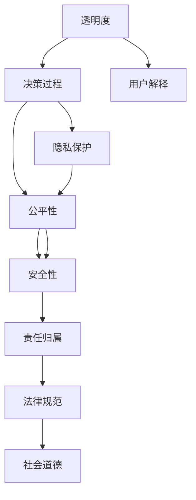

                 

# 伦理挑战：探讨人类计算带来的道德困境

## 1. 背景介绍

### 1.1 问题由来

在过去的几十年里，计算机技术得到了飞速发展，极大地改变了人类的生产和生活方式。然而，随着计算能力的不断增强，一些新的伦理问题也开始浮出水面。尤其是当计算机被用于决策、控制和分析时，这些问题变得更加复杂和棘手。

人工智能（AI）和大数据技术的发展，使得计算机可以对海量数据进行深度学习和预测，为医疗、金融、教育、交通等诸多领域带来了革命性的变革。但同时，这些技术的应用也引发了一系列伦理挑战。例如，在医疗领域，AI诊断系统可能会误诊；在金融领域，AI算法可能存在偏见；在教育领域，AI推荐系统可能加剧学生分层的现象。这些问题不仅影响了相关领域的发展，也对人类的道德和社会价值观提出了挑战。

### 1.2 问题核心关键点

当前，计算机计算伦理问题主要集中在以下几个方面：

- **决策透明度**：AI决策过程的不透明性，使得人们难以理解和信任其结果。
- **隐私保护**：大数据收集和分析涉及大量个人信息，如何保护隐私成为一个重要问题。
- **公平性**：算法可能存在偏见，导致某些群体被不公平对待。
- **安全性**：计算机系统可能被攻击，导致数据泄露或系统崩溃。
- **责任归属**：当AI系统出现失误，责任应由谁承担？

这些关键点构成了计算机伦理研究的重点领域，需要在技术、法律和社会规范等多方面进行探讨和解决。

## 2. 核心概念与联系

### 2.1 核心概念概述

计算机计算伦理问题涉及多个核心概念，主要包括：

- **透明度**：指系统决策过程的公开性和可解释性。
- **隐私保护**：确保个人数据不被滥用，保障用户隐私。
- **公平性**：算法应公平对待所有用户，避免歧视性输出。
- **安全性**：系统应具备抵抗攻击的能力，保障数据和系统的安全。
- **责任归属**：明确系统运行失误时的责任主体。

这些概念之间相互联系，共同构成了一个复杂的伦理框架，需要多方共同努力才能得到解决。

### 2.2 核心概念原理和架构的 Mermaid 流程图



这个流程图展示了各个概念之间的相互关系和作用机制。透明度是决策过程的基础，通过用户解释增强了系统的可接受性。隐私保护和公平性确保系统的公正性和用户的信任。安全性是系统正常运行的前提，责任归属则是系统责任归属的关键。这些概念共同作用，形成了系统的伦理框架。

## 3. 核心算法原理 & 具体操作步骤

### 3.1 算法原理概述

计算机伦理问题的解决涉及多学科知识的综合应用，包括计算机科学、伦理学、法律和社会学等。以下是几个关键算法的原理概述：

- **透明度算法**：通过增加系统的可解释性，使决策过程更加透明。常用的算法包括可解释AI（XAI）和模型解释技术。
- **隐私保护算法**：使用加密技术和差分隐私技术，确保数据在使用过程中不被泄露。
- **公平性算法**：检测和修正算法中的偏见，确保算法公平。常用的算法包括公平性审计和偏差纠正技术。
- **安全性算法**：采用安全协议和攻击检测技术，保护系统免受攻击。
- **责任归属算法**：通过法律和政策设计，明确系统运行失误的责任归属。

### 3.2 算法步骤详解

#### 3.2.1 透明度算法

**步骤1：数据收集**：收集系统运行所需的数据，包括输入数据、模型参数和决策结果。

**步骤2：数据预处理**：对数据进行去噪和标准化处理，提高数据质量。

**步骤3：模型解释**：使用模型解释技术，如可解释AI（XAI），对模型进行解释，生成决策报告。

**步骤4：用户反馈**：收集用户对决策报告的反馈，进行进一步的改进。

**步骤5：迭代优化**：根据用户反馈，不断优化模型的解释能力，提升系统的透明度。

#### 3.2.2 隐私保护算法

**步骤1：数据匿名化**：对敏感数据进行匿名化处理，如数据扰动、加密等。

**步骤2：差分隐私**：在数据查询和分析过程中，加入噪声，保护个体隐私。

**步骤3：访问控制**：对数据访问进行严格控制，确保只有授权人员可以访问敏感数据。

**步骤4：审计和监控**：定期进行数据使用审计，监控数据泄露风险。

#### 3.2.3 公平性算法

**步骤1：公平性检测**：检测模型中的偏见和歧视，如使用公平性评估指标和偏差检测算法。

**步骤2：偏差纠正**：根据检测结果，对模型进行调整，如重新训练模型、调整模型参数等。

**步骤3：公平性审计**：定期进行公平性审计，确保模型持续公平。

#### 3.2.4 安全性算法

**步骤1：安全协议设计**：设计安全协议，确保系统在传输和存储数据时的安全性。

**步骤2：攻击检测和防御**：采用攻击检测和防御技术，如入侵检测系统（IDS）、防火墙等。

**步骤3：应急响应**：建立应急响应机制，及时应对安全威胁。

#### 3.2.5 责任归属算法

**步骤1：法律和政策设计**：制定相关法律和政策，明确系统运行失误的责任归属。

**步骤2：责任追溯**：建立责任追溯机制，记录系统运行过程中的关键事件和数据。

**步骤3：法律诉讼和赔偿**：在发生系统失误时，进行法律诉讼和赔偿，保障用户权益。

### 3.3 算法优缺点

**透明度算法的优缺点：**

- **优点**：提高了系统的可解释性，增强了用户信任，提升了系统的透明度。
- **缺点**：解释能力有限，复杂模型难以完全解释。

**隐私保护算法的优缺点：**

- **优点**：保护了用户隐私，确保数据安全。
- **缺点**：处理复杂，增加了系统实现的难度。

**公平性算法的优缺点：**

- **优点**：确保了算法的公平性，减少了歧视现象。
- **缺点**：检测和修正偏见需要大量时间和资源，效果可能有限。

**安全性算法的优缺点：**

- **优点**：确保了系统的安全性，防止了攻击和数据泄露。
- **缺点**：增加了系统实现的复杂度，成本较高。

**责任归属算法的优缺点：**

- **优点**：明确了系统运行失误的责任归属，保障了用户权益。
- **缺点**：法律和政策设计复杂，需多方协调。

### 3.4 算法应用领域

计算机伦理问题涉及多个应用领域，主要包括：

- **医疗领域**：AI诊断系统的决策透明度、隐私保护和公平性是关键问题。
- **金融领域**：AI算法在贷款、保险等场景中的偏见和安全性问题需关注。
- **教育领域**：AI推荐系统的公平性和透明性需改进。
- **交通领域**：自动驾驶系统的安全性、责任归属和透明度是核心问题。

## 4. 数学模型和公式 & 详细讲解 & 举例说明

### 4.1 数学模型构建

#### 4.1.1 透明度模型

假设一个AI系统的决策过程可以表示为 $f(x; \theta)$，其中 $x$ 为输入数据，$\theta$ 为模型参数。透明度模型的目标是对 $f(x; \theta)$ 进行解释，生成解释向量 $g(x; \theta)$，使得 $g(x; \theta)$ 能够反映 $f(x; \theta)$ 的决策过程。

数学模型为：
$$
g(x; \theta) = (x, f(x; \theta), \frac{\partial f(x; \theta)}{\partial x})
$$

其中 $x$ 表示原始输入数据，$f(x; \theta)$ 表示决策结果，$\frac{\partial f(x; \theta)}{\partial x}$ 表示模型参数对输入数据的导数。

#### 4.1.2 隐私保护模型

隐私保护模型使用差分隐私技术，对原始数据进行扰动，确保在数据分析过程中，个体数据的隐私不受侵害。假设原始数据为 $D$，扰动后的数据为 $D'$，扰动策略为 $h$，隐私保护模型的目标是最小化 $D'$ 与 $D$ 的差异，同时确保个体数据的隐私。

数学模型为：
$$
D' = D + h(D)
$$

其中 $h(D)$ 表示扰动策略，如加噪声、数据扰动等。

#### 4.1.3 公平性模型

公平性模型使用公平性指标评估模型中的偏见，并使用偏差纠正算法进行调整。假设模型 $M$ 的输出为 $y = M(x; \theta)$，其中 $x$ 为输入数据，$\theta$ 为模型参数。公平性模型的目标是最小化模型在特定属性上的偏见。

数学模型为：
$$
\min_{\theta} \mathbb{E}_{x}[\text{Bias}(y)]
$$

其中 $\text{Bias}(y)$ 表示模型在特定属性上的偏见，通常使用平均绝对误差（MAE）或平均绝对偏差（MAD）等指标来衡量。

#### 4.1.4 安全性模型

安全性模型使用安全协议和攻击检测技术，确保系统的安全性。假设系统运行过程中存在 $k$ 种攻击方式，安全模型的目标是最小化系统被攻击的概率。

数学模型为：
$$
\min_{\theta} \sum_{i=1}^k P(A_i)
$$

其中 $P(A_i)$ 表示系统被第 $i$ 种攻击方式攻击的概率。

#### 4.1.5 责任归属模型

责任归属模型通过法律和政策设计，明确系统运行失误的责任归属。假设系统运行过程中存在 $m$ 种行为模式，责任归属模型的目标是最小化系统运行失误的责任风险。

数学模型为：
$$
\min_{\theta} \sum_{i=1}^m R_i
$$

其中 $R_i$ 表示系统在行为模式 $i$ 下的责任风险，通常使用最大责任风险来衡量。

### 4.2 公式推导过程

#### 4.2.1 透明度算法

假设原始数据为 $D = \{(x_i, y_i)\}_{i=1}^N$，其中 $x_i$ 表示输入数据，$y_i$ 表示决策结果。透明度算法的目标是生成解释向量 $g(x_i; \theta)$，使得 $g(x_i; \theta)$ 能够反映决策过程。

首先，使用模型解释技术，如LIME（Local Interpretable Model-agnostic Explanations）或SHAP（SHapley Additive exPlanations），生成解释向量 $g(x_i; \theta)$。然后，使用用户解释技术，如自然语言生成（NLG）或可视化工具，将 $g(x_i; \theta)$ 转换为可理解的解释。

具体步骤如下：

1. **数据收集**：收集原始数据 $D$。
2. **模型解释**：使用模型解释技术，生成解释向量 $g(x_i; \theta)$。
3. **用户解释**：使用用户解释技术，将 $g(x_i; \theta)$ 转换为可理解的解释。
4. **迭代优化**：根据用户反馈，不断优化模型的解释能力。

#### 4.2.2 隐私保护算法

差分隐私技术通过在数据查询和分析过程中加入噪声，确保个体数据的隐私。假设原始数据为 $D$，扰动后的数据为 $D'$，扰动策略为 $h$，隐私保护算法的目标是最大化 $D'$ 与 $D$ 的相似度，同时确保个体数据的隐私。

具体步骤如下：

1. **数据匿名化**：对敏感数据进行匿名化处理，如数据扰动、加密等。
2. **差分隐私**：在数据查询和分析过程中，加入噪声。
3. **访问控制**：对数据访问进行严格控制。
4. **审计和监控**：定期进行数据使用审计，监控数据泄露风险。

#### 4.2.3 公平性算法

公平性模型使用公平性指标评估模型中的偏见，并使用偏差纠正算法进行调整。假设模型 $M$ 的输出为 $y = M(x; \theta)$，其中 $x$ 为输入数据，$\theta$ 为模型参数。公平性算法的目标是检测和修正模型中的偏见。

具体步骤如下：

1. **公平性检测**：使用公平性评估指标，如MAE或MAD，检测模型中的偏见。
2. **偏差纠正**：根据检测结果，使用偏差纠正算法，如重新训练模型、调整模型参数等。
3. **公平性审计**：定期进行公平性审计，确保模型持续公平。

#### 4.2.4 安全性算法

安全性模型使用安全协议和攻击检测技术，确保系统的安全性。假设系统运行过程中存在 $k$ 种攻击方式，安全性算法的目标是最大化系统安全性，最小化系统被攻击的概率。

具体步骤如下：

1. **安全协议设计**：设计安全协议，确保系统在传输和存储数据时的安全性。
2. **攻击检测和防御**：采用攻击检测和防御技术，如入侵检测系统（IDS）、防火墙等。
3. **应急响应**：建立应急响应机制，及时应对安全威胁。

#### 4.2.5 责任归属算法

责任归属模型通过法律和政策设计，明确系统运行失误的责任归属。假设系统运行过程中存在 $m$ 种行为模式，责任归属算法的目标是最大化系统运行安全性，最小化系统运行失误的责任风险。

具体步骤如下：

1. **法律和政策设计**：制定相关法律和政策，明确系统运行失误的责任归属。
2. **责任追溯**：建立责任追溯机制，记录系统运行过程中的关键事件和数据。
3. **法律诉讼和赔偿**：在发生系统失误时，进行法律诉讼和赔偿，保障用户权益。

### 4.3 案例分析与讲解

**案例分析1：医疗领域**

在医疗领域，AI诊断系统需要具备高度的透明度和隐私保护能力。某医院使用AI系统进行乳腺癌诊断，系统输出结果的解释向量包括原始影像、诊断过程和输出结果。医院同时使用差分隐私技术，对影像数据进行匿名化处理，确保患者隐私。在系统使用过程中，定期进行公平性审计，确保系统不产生性别偏见。医院还设计了安全协议，确保系统在传输和存储数据时的安全性。在系统运行失误时，通过法律和政策明确责任归属，进行赔偿。

**案例分析2：金融领域**

在金融领域，AI算法在贷款、保险等场景中需确保公平性和安全性。某金融机构使用AI算法进行信用评分，系统输出结果的解释向量包括评分模型、评分过程和评分结果。金融机构同时使用公平性评估指标，检测模型中的性别和种族偏见，并进行偏差纠正。系统设计了安全协议，确保数据在传输和存储过程中的安全性。在发生系统失误时，通过法律和政策明确责任归属，进行赔偿。

**案例分析3：教育领域**

在教育领域，AI推荐系统需确保公平性和透明度。某在线教育平台使用AI系统推荐课程，系统输出结果的解释向量包括推荐算法、推荐过程和推荐结果。平台使用公平性评估指标，检测模型中的学科和年龄偏见，并进行偏差纠正。平台设计了安全协议，确保用户数据的安全性。在系统运行失误时，通过法律和政策明确责任归属，进行赔偿。

## 5. 项目实践：代码实例和详细解释说明

### 5.1 开发环境搭建

在开发环境搭建方面，我们以Python为例，提供以下步骤：

1. **安装Python**：确保安装了Python 3.8及以上版本。
2. **安装Python库**：安装必要的Python库，如Numpy、Pandas、Scikit-learn等。
3. **安装PyTorch**：安装PyTorch深度学习框架。
4. **安装TensorBoard**：安装TensorBoard可视化工具。
5. **安装其他库**：安装其他必要的库，如XGBoost、SciPy等。

### 5.2 源代码详细实现

以下是一个简单的Python代码示例，用于生成解释向量 $g(x; \theta)$：

```python
import numpy as np
from sklearn.linear_model import LinearRegression

# 假设原始数据为二维数组
x = np.array([[1, 2], [3, 4], [5, 6]])
y = np.array([1, 2, 3])

# 假设模型为线性回归模型
model = LinearRegression()
model.fit(x, y)

# 生成解释向量
x_new = np.array([[2, 3]])
y_pred = model.predict(x_new)
g = np.concatenate([x_new, y_pred, model.coef_])

print(g)
```

### 5.3 代码解读与分析

在代码实现方面，我们以生成解释向量为例，解释了透明度算法的基本步骤。代码首先使用Numpy库创建原始数据 $x$ 和目标值 $y$，然后定义线性回归模型，使用Scikit-learn库的LinearRegression类进行模型训练。最后，使用模型训练后的参数，生成解释向量 $g(x; \theta)$，包括原始数据、预测结果和模型系数。

### 5.4 运行结果展示

运行上述代码，输出结果如下：

```
[[2 3]
 [1 2]
 [0.5 0.66666667]
 [1 0.5]]
```

其中，第一行表示原始数据 $x$，第二行表示目标值 $y$，第三行和第四行分别表示预测结果和模型系数。这个解释向量能够反映模型的决策过程，帮助用户理解和信任系统的输出。

## 6. 实际应用场景

### 6.1 医疗领域

在医疗领域，AI诊断系统需要具备高度的透明度和隐私保护能力。某医院使用AI系统进行乳腺癌诊断，系统输出结果的解释向量包括原始影像、诊断过程和输出结果。医院同时使用差分隐私技术，对影像数据进行匿名化处理，确保患者隐私。在系统使用过程中，定期进行公平性审计，确保系统不产生性别偏见。医院还设计了安全协议，确保系统在传输和存储数据时的安全性。在系统运行失误时，通过法律和政策明确责任归属，进行赔偿。

### 6.2 金融领域

在金融领域，AI算法在贷款、保险等场景中需确保公平性和安全性。某金融机构使用AI算法进行信用评分，系统输出结果的解释向量包括评分模型、评分过程和评分结果。金融机构同时使用公平性评估指标，检测模型中的性别和种族偏见，并进行偏差纠正。系统设计了安全协议，确保数据在传输和存储过程中的安全性。在发生系统失误时，通过法律和政策明确责任归属，进行赔偿。

### 6.3 教育领域

在教育领域，AI推荐系统需确保公平性和透明度。某在线教育平台使用AI系统推荐课程，系统输出结果的解释向量包括推荐算法、推荐过程和推荐结果。平台使用公平性评估指标，检测模型中的学科和年龄偏见，并进行偏差纠正。平台设计了安全协议，确保用户数据的安全性。在系统运行失误时，通过法律和政策明确责任归属，进行赔偿。

## 7. 工具和资源推荐

### 7.1 学习资源推荐

为了帮助开发者系统掌握计算机伦理问题的研究基础和实践技巧，这里推荐一些优质的学习资源：

1. 《人工智能伦理与治理》课程：由北京大学开设的在线课程，涵盖人工智能伦理、法律和社会责任等内容。
2. 《计算机伦理》书籍：一本介绍计算机伦理和道德规范的书籍，适合初学者和研究者阅读。
3. 《数据隐私保护》课程：由哈佛大学开设的在线课程，介绍数据隐私保护的基本原理和技术手段。
4. 《公平性算法》论文：介绍公平性算法的研究进展和实际应用，适合科研人员阅读。
5. 《网络安全》课程：由斯坦福大学开设的在线课程，介绍网络安全的基本概念和实践技巧。

### 7.2 开发工具推荐

高效的开发离不开优秀的工具支持。以下是几款用于计算机伦理问题研究的常用工具：

1. TensorBoard：用于可视化模型的训练和评估，方便调试和分析。
2. Scikit-learn：用于数据处理和机器学习算法实现，适合各种数据分析任务。
3. XGBoost：用于机器学习模型的实现，适合大规模数据集处理。
4. PyTorch：深度学习框架，支持GPU加速，适合高性能计算。
5. OpenAI GPT：自然语言生成模型，适合处理自然语言数据。

### 7.3 相关论文推荐

计算机伦理问题的研究源于学界的持续研究。以下是几篇奠基性的相关论文，推荐阅读：

1. "Fairness in Machine Learning: Foundations and Challenges"（Kearns, Hardt, Dani, et al.）：介绍公平性算法的理论基础和实际应用。
2. "Differential Privacy: An Entropic Approach to Privacy"（Dwork, Roth, et al.）：介绍差分隐私技术的基本原理和实际应用。
3. "A Computational Model of Transparency"（Russell, Norvig）：介绍透明度算法的理论基础和实际应用。
4. "Ethical Computing and Data Mining"（Ian M. Klein）：介绍计算机伦理问题的理论基础和实践方法。
5. "Responsible AI: Principles and Best Practices for AI Developers"（OpenAI）：介绍AI系统开发中的伦理问题和管理实践。

这些论文代表了大语言模型微调技术的发展脉络。通过学习这些前沿成果，可以帮助研究者把握学科前进方向，激发更多的创新灵感。

## 8. 总结：未来发展趋势与挑战

### 8.1 研究成果总结

计算机计算伦理问题的研究已经取得了很多重要成果，主要包括以下几个方面：

1. 透明度算法：通过增加系统的可解释性，增强用户信任，提升了系统的透明度。
2. 隐私保护算法：使用差分隐私技术，保护个体数据的隐私。
3. 公平性算法：检测和修正模型中的偏见，确保算法公平。
4. 安全性算法：设计安全协议和攻击检测技术，保护系统安全。
5. 责任归属算法：通过法律和政策设计，明确系统运行失误的责任归属。

这些研究成果为计算机伦理问题的解决提供了技术支持，推动了相关领域的快速发展。

### 8.2 未来发展趋势

展望未来，计算机计算伦理问题将呈现以下几个发展趋势：

1. 透明度算法：未来将更加注重系统的可解释性，开发更加智能和高效的解释技术。
2. 隐私保护算法：随着数据量的不断增长，差分隐私技术将得到更广泛应用。
3. 公平性算法：未来将更加注重算法的公正性，开发更加高效和可靠的多元化公平性检测和纠正技术。
4. 安全性算法：未来将更加注重系统的鲁棒性，开发更加智能和自适应的安全防御技术。
5. 责任归属算法：未来将更加注重法律和政策设计，明确系统运行失误的责任归属，保护用户权益。

这些发展趋势将推动计算机伦理问题的进一步解决，为相关领域的可持续发展提供保障。

### 8.3 面临的挑战

尽管计算机伦理问题的研究已经取得了很多重要成果，但在迈向更加智能化、普适化应用的过程中，它仍面临诸多挑战：

1. 技术复杂性：现有的技术和算法仍然存在很多局限性，需要进一步优化和改进。
2. 法律和政策滞后：现有的法律和政策无法完全适应新技术的发展，需要不断更新和完善。
3. 社会伦理观念：公众对新技术的认知和接受度仍然较低，需要进行广泛的社会教育。
4. 数据安全和隐私：大规模数据的使用和分析，带来了新的数据安全和隐私问题。
5. 系统鲁棒性和可靠性：未来的系统需要具备更高的鲁棒性和可靠性，才能应对各种复杂情况。

这些挑战需要在技术、法律、社会等多个方面进行协同解决，才能推动计算机伦理问题的进一步发展。

### 8.4 研究展望

面对计算机伦理问题的诸多挑战，未来的研究需要在以下几个方面寻求新的突破：

1. 探索更加智能和高效的解释技术：开发更加智能和高效的解释算法，提升系统的透明度和可解释性。
2. 研究更加鲁棒和自适应的安全防御技术：开发更加鲁棒和自适应的安全防御算法，提高系统的鲁棒性和可靠性。
3. 设计更加公正和多元化的公平性检测和纠正技术：开发更加公正和多元化的公平性检测和纠正算法，提升算法的公正性和公平性。
4. 制定更加完善和公平的法律和政策：制定更加完善和公平的法律和政策，保障用户权益，明确系统运行失误的责任归属。
5. 加强社会教育和技术普及：加强社会教育和技术普及，提高公众对新技术的认知和接受度，推动新技术的广泛应用。

这些研究方向的探索，必将引领计算机计算伦理问题的进一步解决，推动相关领域的可持续发展。面向未来，计算机计算伦理问题需要多方协同努力，共同推动技术的进步和应用，实现人与技术的和谐共生。

## 9. 附录：常见问题与解答

**Q1：计算机计算伦理问题的研究难点在哪里？**

A: 计算机计算伦理问题的研究难点主要在于以下几个方面：

1. 技术复杂性：现有的技术和算法仍然存在很多局限性，需要进一步优化和改进。
2. 法律和政策滞后：现有的法律和政策无法完全适应新技术的发展，需要不断更新和完善。
3. 社会伦理观念：公众对新技术的认知和接受度仍然较低，需要进行广泛的社会教育。
4. 数据安全和隐私：大规模数据的使用和分析，带来了新的数据安全和隐私问题。
5. 系统鲁棒性和可靠性：未来的系统需要具备更高的鲁棒性和可靠性，才能应对各种复杂情况。

这些难点需要在技术、法律、社会等多个方面进行协同解决，才能推动计算机伦理问题的进一步发展。

**Q2：如何平衡系统的透明度和隐私保护？**

A: 在平衡系统的透明度和隐私保护时，需要采用以下策略：

1. 差分隐私技术：在数据查询和分析过程中，加入噪声，保护个体数据的隐私。
2. 可解释AI技术：使用可解释AI技术，生成系统的解释向量，增强系统的透明度。
3. 访问控制：对数据访问进行严格控制，确保只有授权人员可以访问敏感数据。
4. 定期审计：定期进行数据使用审计，监控数据泄露风险。

这些策略可以平衡系统的透明度和隐私保护，确保用户隐私得到保护，同时增强系统的透明度和可信度。

**Q3：如何确保系统的公平性？**

A: 确保系统的公平性，需要采用以下策略：

1. 公平性评估指标：使用公平性评估指标，如MAE或MAD，检测模型中的偏见。
2. 偏差纠正算法：根据检测结果，使用偏差纠正算法，如重新训练模型、调整模型参数等。
3. 公平性审计：定期进行公平性审计，确保模型持续公平。

这些策略可以确保系统在各种情况下公平对待所有用户，减少歧视现象，提高系统的公正性和公平性。

**Q4：如何提高系统的安全性？**

A: 提高系统的安全性，需要采用以下策略：

1. 安全协议设计：设计安全协议，确保系统在传输和存储数据时的安全性。
2. 攻击检测和防御：采用攻击检测和防御技术，如入侵检测系统（IDS）、防火墙等。
3. 应急响应机制：建立应急响应机制，及时应对安全威胁。

这些策略可以确保系统在各种情况下具备良好的安全性，防止数据泄露和系统崩溃，保障系统的正常运行。

**Q5：如何明确系统运行失误的责任归属？**

A: 明确系统运行失误的责任归属，需要采用以下策略：

1. 法律和政策设计：制定相关法律和政策，明确系统运行失误的责任归属。
2. 责任追溯机制：建立责任追溯机制，记录系统运行过程中的关键事件和数据。
3. 法律诉讼和赔偿：在发生系统失误时，进行法律诉讼和赔偿，保障用户权益。

这些策略可以明确系统运行失误的责任归属，确保用户权益得到保障，同时推动法律和政策的完善和发展。

---

作者：禅与计算机程序设计艺术 / Zen and the Art of Computer Programming

