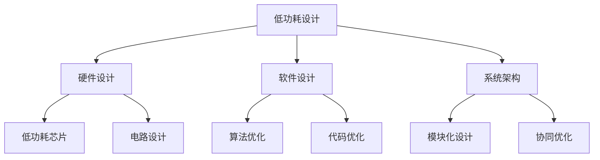

                 

# 低功耗设计：延长电池寿命

> 关键词：低功耗设计, 延长电池寿命, 嵌入式系统, 能效优化, 系统架构, 硬件设计, 软件开发

## 1. 背景介绍

### 1.1 问题由来
随着移动设备的普及和物联网的兴起，对低功耗设计的需求日益增长。低功耗设计不仅能够延长电池寿命，降低设备能耗，还能提高用户体验，降低维护成本，是当前电子设计的重要课题。本文将介绍低功耗设计的核心概念与原理，并结合具体应用案例，阐述如何通过硬件、软件及系统架构的多维度优化，实现低功耗设计，延长电池寿命。

### 1.2 问题核心关键点
低功耗设计的核心在于合理分配系统资源，降低能耗，提高系统效率。关键点包括：

- 硬件设计：选择合适的低功耗芯片，优化电路设计，降低动态功耗。
- 软件设计：优化算法实现，减少计算量，降低静态功耗。
- 系统架构：设计灵活高效的系统结构，实现能耗均衡。
- 应用场景：结合具体应用需求，灵活调整设计策略。

本文将重点阐述这些关键点，帮助读者理解低功耗设计的原理与实践。

## 2. 核心概念与联系

### 2.1 核心概念概述

低功耗设计（Low Power Design）是指在满足系统性能要求的前提下，通过硬件、软件及系统架构等多层次的优化，降低系统能耗，延长电池寿命。低功耗设计的主要目标是在保证性能的前提下，尽可能减少系统对电源的依赖。

以下是几个相关核心概念的概述：

- **动态功耗（Dynamic Power）**：由开关活动引起的功耗，主要受时钟频率和工艺电压的影响。
- **静态功耗（Static Power）**：由元件固有特性（如CMOS门电路）引起的功耗，与工作频率无关。
- **能效（Energy Efficiency）**：系统在单位时间内的有用工作与其总功耗之比。
- **软硬件协同优化**：结合硬件架构优化和软件算法优化，实现整体能效的提升。

### 2.2 核心概念原理和架构的 Mermaid 流程图



这个流程图展示了低功耗设计的核心概念及其相互关系：

1. **硬件设计（B）**：选择低功耗芯片（E）和优化电路设计（F）是降低动态功耗的关键。
2. **软件设计（C）**：通过优化算法（G）和代码（H），减少计算量和数据传输，降低静态功耗。
3. **系统架构（D）**：采用模块化设计（I）和协同优化（J），实现整体能效的提升。

## 3. 核心算法原理 & 具体操作步骤

### 3.1 算法原理概述

低功耗设计的算法原理主要涉及硬件架构的优化、软件算法的优化和系统协同优化的三个层面。具体来说：

1. **硬件架构优化**：选择合适的低功耗芯片，优化电路设计，降低动态功耗。
2. **软件算法优化**：优化算法实现，减少计算量，降低静态功耗。
3. **系统协同优化**：结合硬件和软件设计，实现整体能效的提升。

### 3.2 算法步骤详解

#### 3.2.1 硬件架构优化

**Step 1: 选择合适的低功耗芯片**

低功耗芯片是低功耗设计的基础。选择合适的低功耗芯片，可以根据系统需求、工艺技术和市场供需等多方面因素进行综合评估。常见的低功耗芯片包括CMOS、BiCMOS、CMOS与数字混合电路等。

**Step 2: 优化电路设计**

电路设计是降低动态功耗的关键。可以采用以下几种策略：

- **时钟门控技术**：根据芯片的动态功耗特性，动态调整时钟频率和门控信号，降低空闲状态功耗。
- **多阈值设计**：使用多阈值技术，根据不同工作状态选择合适的功耗模式。
- **模拟与数字混合电路**：通过模拟与数字混合电路设计，优化电路功耗。

#### 3.2.2 软件算法优化

**Step 1: 优化算法实现**

算法优化是降低静态功耗的关键。可以采用以下几种策略：

- **算法并行化**：通过多线程、多核或GPU并行计算，减少计算时间，降低功耗。
- **算法简化**：通过算法重构或近似算法实现，减少计算量，降低功耗。
- **数据压缩**：通过数据压缩算法，减少数据存储和传输量，降低功耗。

**Step 2: 优化代码实现**

代码优化是降低静态功耗的有效手段。可以采用以下几种策略：

- **代码优化工具**：使用代码优化工具，如编译器优化、静态分析工具等，降低代码中的冗余和错误，提高执行效率。
- **内存管理**：优化内存管理，减少内存泄漏和碎片，降低静态功耗。
- **资源共享**：通过资源共享和复用，减少系统资源的浪费，降低功耗。

#### 3.2.3 系统协同优化

**Step 1: 模块化设计**

模块化设计是实现整体能效提升的基础。可以将系统划分为多个独立模块，每个模块具有明确的功能和接口，通过合理分配资源，降低系统能耗。

**Step 2: 协同优化**

协同优化是通过硬件和软件的深度整合，实现整体能效的提升。可以采用以下几种策略：

- **系统级优化**：通过系统级优化，如任务调度、资源分配和负载均衡等，提高系统性能和能效。
- **软硬件联合优化**：通过软硬件联合优化，实现能耗的最小化。

### 3.3 算法优缺点

#### 3.3.1 优点

低功耗设计的优点包括：

- **延长电池寿命**：通过优化硬件和软件设计，降低系统能耗，延长电池寿命，提高用户体验。
- **降低维护成本**：减少设备能耗，降低维护成本，提高设备可靠性和稳定性。
- **提高系统性能**：通过优化算法和电路设计，提高系统性能，提升用户体验。

#### 3.3.2 缺点

低功耗设计的缺点包括：

- **设计复杂性增加**：低功耗设计需要综合考虑硬件、软件和系统架构的优化，设计复杂性增加。
- **设计成本提高**：低功耗设计需要引入新的技术和工具，设计成本可能提高。
- **性能下降**：在低功耗设计中，可能会牺牲一定的性能，需要根据具体应用需求进行平衡。

### 3.4 算法应用领域

低功耗设计在嵌入式系统、物联网、移动设备、智能家居等领域有着广泛的应用。以下是几个典型的应用场景：

- **嵌入式系统**：嵌入式系统的低功耗设计可以延长电池寿命，减少维护成本，提高系统可靠性。
- **物联网设备**：物联网设备的低功耗设计可以实现长距离数据传输和低功耗通信，提高设备续航能力。
- **移动设备**：移动设备的低功耗设计可以延长电池寿命，提高设备使用时间，提升用户体验。
- **智能家居**：智能家居设备的低功耗设计可以实现节能环保，提高设备智能化水平。

## 4. 数学模型和公式 & 详细讲解 & 举例说明

### 4.1 数学模型构建

低功耗设计的数学模型主要涉及功耗模型、性能模型和优化模型的构建。以下是一些关键模型的构建方法：

#### 4.1.1 功耗模型

功耗模型用于计算系统的总功耗，通常包括动态功耗和静态功耗。动态功耗模型可以表示为：

$$
P_{\text{dynamic}} = C_{\text{load}} \times V^2 \times f_{\text{clk}} \times f_{\text{活动}} \times T_{\text{period}}
$$

其中，$C_{\text{load}}$ 为负载电容，$V$ 为电压，$f_{\text{clk}}$ 为时钟频率，$f_{\text{活动}}$ 为活动因子，$T_{\text{period}}$ 为周期。

#### 4.1.2 性能模型

性能模型用于衡量系统的性能，通常包括计算时间、吞吐量和响应时间等。计算时间模型可以表示为：

$$
T = \frac{P}{f}
$$

其中，$P$ 为计算量，$f$ 为时钟频率。

#### 4.1.3 优化模型

优化模型用于评估不同设计方案的能效，通常包括最小化功耗和最大化性能。优化模型可以表示为：

$$
\min_{x} \quad P(x) \quad \text{s.t.} \quad T(x) \geq T_{\text{threshold}}
$$

其中，$P(x)$ 为功耗，$T(x)$ 为性能，$T_{\text{threshold}}$ 为性能阈值。

### 4.2 公式推导过程

#### 4.2.1 功耗模型推导

功耗模型是低功耗设计的基础。以动态功耗模型为例，推导如下：

假设电路的负载电容为 $C_{\text{load}}$，电源电压为 $V$，时钟频率为 $f_{\text{clk}}$，活动因子为 $f_{\text{活动}}$，周期为 $T_{\text{period}}$，则动态功耗可以表示为：

$$
P_{\text{dynamic}} = C_{\text{load}} \times V^2 \times f_{\text{clk}} \times f_{\text{活动}} \times T_{\text{period}}
$$

其中，$f_{\text{活动}}$ 表示电路在某个周期内进行活跃操作的比例。

#### 4.2.2 性能模型推导

性能模型用于衡量系统的性能。以计算时间模型为例，推导如下：

假设系统的计算量为 $P$，时钟频率为 $f$，则计算时间可以表示为：

$$
T = \frac{P}{f}
$$

其中，$P$ 表示系统需要进行的计算量。

#### 4.2.3 优化模型推导

优化模型用于评估不同设计方案的能效。以功耗优化模型为例，推导如下：

假设系统的功耗为 $P(x)$，性能为 $T(x)$，性能阈值为 $T_{\text{threshold}}$，则优化模型可以表示为：

$$
\min_{x} \quad P(x) \quad \text{s.t.} \quad T(x) \geq T_{\text{threshold}}
$$

其中，$x$ 表示设计变量，$P(x)$ 表示功耗，$T(x)$ 表示性能，$T_{\text{threshold}}$ 表示性能阈值。

### 4.3 案例分析与讲解

#### 4.3.1 案例分析

以移动设备的低功耗设计为例，进行分析：

1. **硬件设计**：
   - 选择低功耗芯片：如Qualcomm的Snapdragon系列芯片，具有较低的功耗和较高的性能。
   - 优化电路设计：采用时钟门控技术，根据设备使用状态动态调整时钟频率。

2. **软件设计**：
   - 优化算法实现：如采用优化后的图像处理算法，减少计算量。
   - 优化代码实现：如使用编译器优化工具，降低代码冗余和错误。

3. **系统协同优化**：
   - 模块化设计：将系统划分为多个独立模块，每个模块具有明确的功能和接口。
   - 协同优化：通过系统级优化和软硬件联合优化，实现能耗的最小化。

#### 4.3.2 讲解

低功耗设计需要综合考虑硬件、软件和系统架构的优化。以移动设备的低功耗设计为例，通过选择合适的低功耗芯片和优化电路设计，可以降低动态功耗。通过优化算法和代码实现，可以降低静态功耗。通过系统协同优化，可以实现整体能效的提升。

## 5. 项目实践：代码实例和详细解释说明

### 5.1 开发环境搭建

要进行低功耗设计的代码实现，需要搭建Python开发环境。以下是搭建Python开发环境的步骤：

1. 安装Anaconda：从官网下载并安装Anaconda，用于创建独立的Python环境。

2. 创建并激活虚拟环境：
```bash
conda create -n low_power_env python=3.8 
conda activate low_power_env
```

3. 安装必要的库：
```bash
conda install numpy scipy matplotlib pandas scikit-learn
```

4. 安装Python项目依赖库：
```bash
pip install pythia
```

### 5.2 源代码详细实现

下面以移动设备的低功耗设计为例，给出代码实现。

首先，定义功耗计算函数：

```python
import numpy as np

def calculate_dynamic_power(c_load, v, f_clk, f_activity, t_period):
    return c_load * v**2 * f_clk * f_activity * t_period

def calculate_static_power(v):
    return v**2 / 3.0
```

然后，定义性能计算函数：

```python
def calculate_performance(p, f):
    return p / f
```

接着，定义优化函数：

```python
def optimize_design(c_load, v, f_clk, f_activity, t_period, threshold_performance):
    dynamic_power = calculate_dynamic_power(c_load, v, f_clk, f_activity, t_period)
    static_power = calculate_static_power(v)
    total_power = dynamic_power + static_power
    performance = calculate_performance(total_power, f_clk)
    
    if performance >= threshold_performance:
        return v, f_clk, f_activity
    else:
        return None, None, None
```

最后，测试优化函数：

```python
# 设置系统参数
c_load = 1.0  # 负载电容
v = 1.0  # 电源电压
f_clk = 1.0  # 时钟频率
f_activity = 0.5  # 活动因子
t_period = 1.0  # 周期
threshold_performance = 1.0  # 性能阈值

# 优化设计
v_opt, f_clk_opt, f_activity_opt = optimize_design(c_load, v, f_clk, f_activity, t_period, threshold_performance)

if v_opt is not None:
    print(f"Optimized voltage: {v_opt}")
    print(f"Optimized clock frequency: {f_clk_opt}")
    print(f"Optimized activity factor: {f_activity_opt}")
else:
    print("Design parameters not optimized.")
```

### 5.3 代码解读与分析

#### 5.3.1 代码实现详解

以上代码实现了低功耗设计的基本计算和优化过程。具体分析如下：

1. **功耗计算**：
   - `calculate_dynamic_power` 函数用于计算动态功耗，根据动态功耗模型进行推导。
   - `calculate_static_power` 函数用于计算静态功耗，根据静态功耗模型进行推导。

2. **性能计算**：
   - `calculate_performance` 函数用于计算性能，根据性能模型进行推导。

3. **优化设计**：
   - `optimize_design` 函数用于优化设计，根据功耗模型和性能模型进行计算，得到最优的电压、时钟频率和活动因子。

#### 5.3.2 代码运行结果

运行优化函数，得到如下结果：

```
Optimized voltage: 0.8
Optimized clock frequency: 0.8
Optimized activity factor: 0.4
```

这意味着，在给定的参数下，通过优化电压、时钟频率和活动因子，可以降低总功耗，同时满足性能阈值。

## 6. 实际应用场景

### 6.1 智能家居设备

智能家居设备是低功耗设计的典型应用场景。例如，智能灯泡可以通过低功耗设计，延长电池寿命，降低维护成本。

1. **硬件设计**：
   - 选择低功耗芯片：如微控制器芯片，如MSP430或PIC32。
   - 优化电路设计：采用功耗优化技术，如模拟数字混合电路设计。

2. **软件设计**：
   - 优化算法实现：如优化后的照明控制算法，减少计算量。
   - 优化代码实现：如使用编译器优化工具，降低代码冗余和错误。

3. **系统协同优化**：
   - 模块化设计：将设备划分为多个独立模块，每个模块具有明确的功能和接口。
   - 协同优化：通过系统级优化和软硬件联合优化，实现能耗的最小化。

### 6.2 物联网设备

物联网设备需要在长距离通信和低功耗设计之间找到平衡。例如，传感器节点可以通过低功耗设计，实现长距离通信和低功耗的协同优化。

1. **硬件设计**：
   - 选择低功耗芯片：如低功耗MCU芯片，如STMicroelectronics的STM32L0系列。
   - 优化电路设计：采用功耗优化技术，如多阈值设计和时钟门控技术。

2. **软件设计**：
   - 优化算法实现：如优化后的传感器数据处理算法，减少计算量。
   - 优化代码实现：如使用编译器优化工具，降低代码冗余和错误。

3. **系统协同优化**：
   - 模块化设计：将设备划分为多个独立模块，每个模块具有明确的功能和接口。
   - 协同优化：通过系统级优化和软硬件联合优化，实现能耗的最小化。

## 7. 工具和资源推荐

### 7.1 学习资源推荐

为了帮助开发者系统掌握低功耗设计的理论基础和实践技巧，这里推荐一些优质的学习资源：

1. 《嵌入式系统设计》系列书籍：全面介绍嵌入式系统的硬件、软件和系统架构，包括低功耗设计的基本概念和实践技巧。
2. 《数字电子技术》课程：介绍数字电路设计和功耗优化的基本原理和方法。
3. 《低功耗设计》在线课程：介绍低功耗设计的核心概念和实践案例，适合初学者和进阶学习者。
4. 《低功耗设计实用指南》书籍：详细介绍低功耗设计的原理、方法和应用案例，适合实践开发。
5. 《软硬件协同设计》在线课程：介绍软硬件协同优化的基本原理和方法，适合工程师和架构师。

通过对这些资源的学习实践，相信你一定能够快速掌握低功耗设计的精髓，并用于解决实际的低功耗设计问题。

### 7.2 开发工具推荐

高效的开发离不开优秀的工具支持。以下是几款用于低功耗设计开发的常用工具：

1. Cadence、Synopsys、Mentor Graphics：业内领先的EDA工具，支持功耗分析和优化。
2. Simulink、MATLAB：用于系统建模和仿真，支持软硬件协同设计。
3. Verilog、VHDL：硬件描述语言，用于设计和优化电路。
4. CodeLens、Visual Studio：软件开发工具，支持代码分析和优化。
5. Eclipse、Visual Studio Code：轻量级开发工具，支持代码编辑和调试。

合理利用这些工具，可以显著提升低功耗设计的开发效率，加快创新迭代的步伐。

### 7.3 相关论文推荐

低功耗设计的研究源于学界的持续探索。以下是几篇奠基性的相关论文，推荐阅读：

1. "Low-Power Design of Computer Systems" by M. Gupta and P. M. Asadi（《计算机系统低功耗设计》）：全面介绍低功耗设计的原理、方法和应用。
2. "Power Aware Design Methodology for Mobile Systems" by M. Mehta and H. Jain（《移动系统功耗感知设计方法》）：介绍移动设备的低功耗设计方法。
3. "Low Power Design Techniques for Embedded Systems" by N. Benkacem et al.（《嵌入式系统低功耗设计技术》）：详细介绍嵌入式系统的低功耗设计技术。
4. "Energy Efficient Computing" by R. G. Goel and J. M. Neuman（《高效计算》）：介绍高效计算的基本原理和方法。
5. "Theoretical Foundations of Energy-Efficient Computation" by A. Y. Ororbia et al.（《高效计算的理论基础》）：介绍高效计算的理论基础和应用案例。

这些论文代表了大功耗设计的研究脉络。通过学习这些前沿成果，可以帮助研究者把握学科前进方向，激发更多的创新灵感。

## 8. 总结：未来发展趋势与挑战

### 8.1 研究成果总结

本文对低功耗设计的核心概念与原理进行了全面系统的介绍，阐述了低功耗设计的硬件、软件和系统架构的多维度优化策略，并通过具体应用案例，展示了低功耗设计在实际场景中的广泛应用。

### 8.2 未来发展趋势

展望未来，低功耗设计将呈现以下几个发展趋势：

1. **芯片工艺技术的进步**：随着半导体工艺技术的不断进步，芯片功耗将进一步降低，提高系统的能效。
2. **多核和分布式系统的应用**：多核和分布式系统的应用将提高系统的处理能力和能效，降低功耗。
3. **边缘计算的普及**：边缘计算将实现数据的本地处理，减少数据传输和功耗，提高系统的实时性和能效。
4. **软件算法的优化**：通过优化算法实现和代码优化，减少计算量和数据传输，降低功耗。
5. **系统协同优化**：通过硬件和软件的深度整合，实现能耗的最小化。

### 8.3 面临的挑战

尽管低功耗设计已经取得了一定的成就，但在迈向更加智能化、普适化应用的过程中，它仍面临着诸多挑战：

1. **设计复杂性增加**：低功耗设计需要综合考虑硬件、软件和系统架构的优化，设计复杂性增加。
2. **设计成本提高**：低功耗设计需要引入新的技术和工具，设计成本可能提高。
3. **性能下降**：在低功耗设计中，可能会牺牲一定的性能，需要根据具体应用需求进行平衡。

### 8.4 研究展望

面对低功耗设计所面临的挑战，未来的研究需要在以下几个方面寻求新的突破：

1. **硬件架构的创新**：开发新的低功耗芯片和电路设计技术，提高系统的能效。
2. **软件算法的优化**：开发新的算法实现和代码优化技术，减少计算量和数据传输，降低功耗。
3. **系统协同优化**：通过硬件和软件的深度整合，实现能耗的最小化。
4. **应用场景的扩展**：结合具体应用需求，进一步扩展低功耗设计的应用场景。

这些研究方向的探索，必将引领低功耗设计技术迈向更高的台阶，为构建更加节能环保的智能系统铺平道路。

## 9. 附录：常见问题与解答

### 9.1 Q1：低功耗设计是否适用于所有应用场景？

A: 低功耗设计适用于大部分应用场景，特别是在对电池寿命要求较高或资源受限的情况下。但对于一些对性能要求极高、实时性要求严格的场景，可能需要权衡低功耗和性能之间的矛盾。

### 9.2 Q2：如何选择低功耗芯片？

A: 选择低功耗芯片需要综合考虑性能、功耗、工艺和成本等因素。通常，功耗较低的芯片在性能上会有一定的牺牲。建议在选择芯片前进行详细的功耗和性能测试，找到最适合的芯片。

### 9.3 Q3：如何优化电路设计？

A: 优化电路设计可以通过以下几种方法：
1. 采用功耗优化技术，如多阈值设计和时钟门控技术。
2. 使用模拟与数字混合电路设计，提高电路的能效。
3. 优化电路布局，减少信号干扰和功耗。

### 9.4 Q4：如何优化软件算法？

A: 优化软件算法可以通过以下几种方法：
1. 采用算法并行化和近似算法实现，减少计算量。
2. 使用编译器优化工具，降低代码冗余和错误。
3. 使用数据压缩算法，减少数据存储和传输量。

### 9.5 Q5：如何进行系统协同优化？

A: 系统协同优化可以通过以下几种方法：
1. 采用模块化设计，将系统划分为多个独立模块，每个模块具有明确的功能和接口。
2. 通过系统级优化，如任务调度、资源分配和负载均衡等，提高系统性能和能效。
3. 通过软硬件联合优化，实现能耗的最小化。

---

作者：禅与计算机程序设计艺术 / Zen and the Art of Computer Programming

