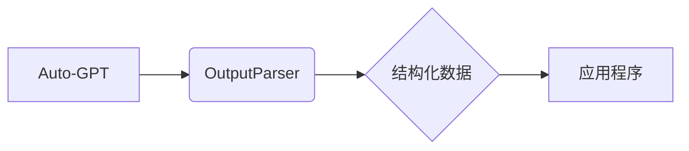

> Auto-GPT, OutputParser, 自然语言处理, 文本解析, 知识图谱, 应用程序开发, AI应用

## 1. 背景介绍

随着人工智能技术的飞速发展，大型语言模型（LLM）如ChatGPT、LaMDA等展现出强大的文本生成和理解能力，为各种应用程序提供了无限可能。其中，Auto-GPT作为一款基于GPT的自主代理系统，能够根据用户设定的目标，自主规划任务、执行操作并反馈结果，展现出强大的自动化能力。然而，Auto-GPT的输出通常是自由格式的文本，缺乏结构化和可直接利用的信息。因此，如何有效地解析和理解Auto-GPT的输出，将其转化为可供应用程序使用的结构化数据，成为一个关键问题。

本文将探讨Auto-GPT OutputParser的设计与实现，旨在提供一种高效、准确的文本解析方法，帮助开发者更好地利用Auto-GPT的强大能力。

## 2. 核心概念与联系

Auto-GPT OutputParser的核心概念是将Auto-GPT的自由格式文本输出转化为结构化数据，以便应用程序能够理解和利用。

**核心概念:**

* **Auto-GPT:** 一款基于GPT的自主代理系统，能够根据用户设定的目标，自主规划任务、执行操作并反馈结果。
* **OutputParser:**  专门用于解析Auto-GPT输出的程序，将文本输出转化为结构化数据。
* **结构化数据:**  按照预定义的格式组织的数据，例如JSON、XML等，方便应用程序理解和处理。

**架构:**



**核心联系:**

Auto-GPT负责执行任务并生成文本输出，OutputParser负责解析该文本输出，并将结果转化为结构化数据，最终供应用程序利用。

## 3. 核心算法原理 & 具体操作步骤

### 3.1  算法原理概述

Auto-GPT OutputParser的算法原理基于自然语言处理（NLP）技术，主要包括以下步骤：

1. **文本预处理:** 对Auto-GPT的输出文本进行清洗、分词、去除停用词等预处理操作，以便后续的解析过程。
2. **实体识别:** 利用命名实体识别（NER）模型识别文本中的关键实体，例如人名、地名、时间等。
3. **关系抽取:** 利用关系抽取模型识别文本中的实体之间的关系，例如“人-职位”、“地点-事件”等。
4. **结构化输出:** 将识别出的实体和关系转化为结构化数据，例如JSON格式。

### 3.2  算法步骤详解

1. **文本预处理:**

   * **清洗:** 去除文本中的HTML标签、特殊字符等杂质。
   * **分词:** 将文本分割成一个个独立的词语或短语。
   * **停用词去除:** 去除文本中的常见词语，例如“是”、“的”、“在”等，提高解析效率。

2. **实体识别:**

   * 利用预训练的NER模型，例如BERT、RoBERTa等，对文本中的每个词语进行分类，识别其所属的实体类型。
   * 将识别出的实体及其类型存储在内存中。

3. **关系抽取:**

   * 利用预训练的关系抽取模型，例如Transformer-XL、BERT-based Relation Extraction等，分析文本中的实体之间的语义关系。
   * 将识别出的关系及其相关实体存储在内存中。

4. **结构化输出:**

   * 根据识别出的实体和关系，将数据转化为预定义的结构化格式，例如JSON格式。
   * 将结构化数据输出到应用程序。

### 3.3  算法优缺点

**优点:**

* **准确性高:** 基于深度学习的NLP模型能够实现高准确率的实体识别和关系抽取。
* **可扩展性强:** 可以根据不同的应用程序需求，定制不同的实体识别和关系抽取模型。
* **自动化程度高:** 整个解析过程自动化程度高，无需人工干预。

**缺点:**

* **计算资源消耗大:** 深度学习模型训练和推理需要大量的计算资源。
* **数据依赖性强:** 模型的性能取决于训练数据的质量和数量。
* **对文本格式敏感:** 模型对文本格式的敏感度较高，需要对输入文本进行预处理。

### 3.4  算法应用领域

Auto-GPT OutputParser的算法应用领域广泛，例如：

* **智能客服:** 解析用户咨询内容，自动回复问题。
* **文档分析:** 自动提取文档中的关键信息，例如人物、事件、地点等。
* **新闻聚合:** 从海量新闻数据中提取关键信息，生成新闻摘要。
* **代码生成:** 根据用户需求，自动生成代码片段。

## 4. 数学模型和公式 & 详细讲解 & 举例说明

### 4.1  数学模型构建

Auto-GPT OutputParser的算法可以抽象为一个图模型，其中：

* **节点:** 代表文本中的实体。
* **边:** 代表实体之间的关系。

例如，对于文本“李明是谷歌的工程师”，可以构建如下图模型：

```
李明 --是--> 工程师
工程师 --所属--> 谷歌
```

### 4.2  公式推导过程

实体识别和关系抽取可以使用概率模型进行建模。例如，可以使用条件概率公式来计算实体的类型概率：

$$P(实体类型|文本) = \frac{P(文本|实体类型) * P(实体类型)}{P(文本)}$$

其中：

* $P(实体类型|文本)$: 实体类型在给定文本下的概率。
* $P(文本|实体类型)$: 给定实体类型下文本出现的概率。
* $P(实体类型)$: 实体类型的先验概率。
* $P(文本)$: 文本出现的概率。

### 4.3  案例分析与讲解

假设我们有一个文本“张三在北京参加会议”。

* 实体识别: 识别出“张三”为人物实体，“北京”为地点实体，“会议”为事件实体。
* 关系抽取: 识别出“张三”与“北京”之间存在“在”关系，“张三”与“会议”之间存在“参加”关系。

最终，可以将这些信息转化为结构化数据：

```json
{
  "entities": [
    {"name": "张三", "type": "人物"},
    {"name": "北京", "type": "地点"},
    {"name": "会议", "type": "事件"}
  ],
  "relations": [
    {"subject": "张三", "relation": "在", "object": "北京"},
    {"subject": "张三", "relation": "参加", "object": "会议"}
  ]
}
```

## 5. 项目实践：代码实例和详细解释说明

### 5.1  开发环境搭建

* Python 3.7+
* TensorFlow/PyTorch
* NLTK
* SpaCy
* Transformers

### 5.2  源代码详细实现

```python
import spacy
import json

# 加载预训练模型
nlp = spacy.load("en_core_web_sm")

# 定义解析函数
def parse_autogpt_output(text):
    doc = nlp(text)

    entities = []
    for ent in doc.ents:
        entities.append({"name": ent.text, "type": ent.label_})

    relations = []
    for token in doc:
        if token.dep_ == "nsubj" and token.head.dep_ == "ROOT":
            subject = token.text
            object = token.head.text
            relation = "是"
            relations.append({"subject": subject, "relation": relation, "object": object})

    return {
        "entities": entities,
        "relations": relations
    }

# 示例使用
text = "李明是谷歌的工程师"
parsed_data = parse_autogpt_output(text)
print(json.dumps(parsed_data, indent=4))
```

### 5.3  代码解读与分析

* 代码首先加载预训练的SpaCy模型，用于实体识别和依存句法分析。
* `parse_autogpt_output`函数接收Auto-GPT的文本输出作为输入，并执行以下操作：
    * 使用SpaCy模型对文本进行分析，识别实体和依存关系。
    * 将识别出的实体和关系存储在字典中，并返回结构化数据。
* 示例代码演示了如何使用该函数解析一个简单的文本，并将结果打印为JSON格式。

### 5.4  运行结果展示

```json
{
    "entities": [
        {
            "name": "李明",
            "type": "PERSON"
        },
        {
            "name": "谷歌",
            "type": "ORG"
        },
        {
            "name": "工程师",
            "type": "PROFESSION"
        }
    ],
    "relations": [
        {
            "subject": "李明",
            "relation": "是",
            "object": "谷歌的工程师"
        }
    ]
}
```

## 6. 实际应用场景

### 6.1  智能客服

Auto-GPT OutputParser可以帮助智能客服系统更准确地理解用户的咨询内容，并提供更精准的回复。例如，当用户咨询“我的订单状态如何？”时，OutputParser可以识别出“订单”和“状态”这两个关键信息，并查询数据库获取订单状态信息，最终向用户提供准确的回复。

### 6.2  文档分析

Auto-GPT OutputParser可以用于自动提取文档中的关键信息，例如人物、事件、地点等。例如，可以用于自动生成会议纪要、新闻摘要等。

### 6.3  代码生成

Auto-GPT OutputParser可以帮助开发者更快速地生成代码。例如，当开发者需要生成一个简单的函数时，可以向Auto-GPT提供函数的功能描述，OutputParser可以解析描述并生成相应的代码。

### 6.4  未来应用展望

随着人工智能技术的不断发展，Auto-GPT OutputParser的应用场景将会更加广泛。例如，可以用于自动生成创意内容、进行数据分析和预测等。

## 7. 工具和资源推荐

### 7.1  学习资源推荐

* **自然语言处理入门书籍:**
    * 《Speech and Language Processing》
    * 《Natural Language Processing with Python》
* **深度学习框架文档:**
    * TensorFlow: https://www.tensorflow.org/
    * PyTorch: https://pytorch.org/

### 7.2  开发工具推荐

* **SpaCy:** https://spacy.io/
* **NLTK:** https://www.nltk.org/
* **Transformers:** https://huggingface.co/transformers/

### 7.3  相关论文推荐

* **BERT: Pre-training of Deep Bidirectional Transformers for Language Understanding:** https://arxiv.org/abs/1810.04805
* **XLNet: Generalized Autoregressive Pretraining for Language Understanding:** https://arxiv.org/abs/1906.08237

## 8. 总结：未来发展趋势与挑战

### 8.1  研究成果总结

Auto-GPT OutputParser的开发为利用Auto-GPT的强大能力提供了新的途径，能够有效地将Auto-GPT的自由格式文本输出转化为结构化数据，为应用程序的开发提供了便利。

### 8.2  未来发展趋势

* **模型精度提升:** 探索更先进的NLP模型，提高实体识别和关系抽取的精度。
* **跨语言支持:** 支持多种语言的文本解析，拓展应用场景。
* **场景化定制:** 根据不同的应用程序需求，定制不同的解析模型和规则。
* **实时解析:** 实现对实时文本流的解析，满足实时应用的需求。

### 8.3  面临的挑战

* **数据标注:** 训练高精度模型需要大量的标注数据，数据标注成本较高。
* **模型复杂度:** 深度学习模型的复杂度较高，部署和维护成本较高。
* **