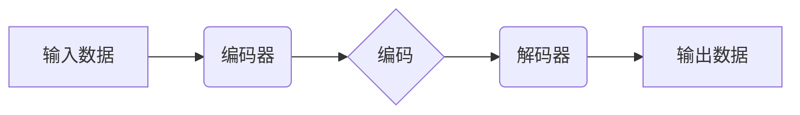

> Autoencoders, 深度学习, 无监督学习, 降维, 重建, 编码器, 解码器, 压缩, 异常检测

## 1. 背景介绍

在深度学习领域，无监督学习方法因其无需人工标注数据而备受关注。Autoencoders（自编码器）作为一种强大的无监督学习模型，在数据压缩、降维、异常检测等领域展现出巨大的潜力。

自编码器是一种神经网络架构，其核心思想是通过学习数据自身的特征表示，并将其压缩成低维空间，然后将其解码回原始数据。这种过程类似于人类对信息的压缩和解压缩，例如，我们通过提取关键词来概括文章内容，并将其存储为更紧凑的文本。

自编码器的应用场景广泛，包括：

* **数据压缩:** 将数据压缩成更小的尺寸，节省存储空间和传输带宽。
* **降维:** 将高维数据降维到低维空间，方便数据可视化和分析。
* **异常检测:** 通过学习正常数据的特征分布，识别异常数据点。
* **图像生成:** 生成新的图像数据，例如，生成人脸图像或风景图像。

## 2. 核心概念与联系

自编码器由两个主要部分组成：编码器和解码器。

* **编码器:** 将输入数据映射到低维空间，称为编码。
* **解码器:** 将编码后的数据映射回原始数据空间，称为解码。

自编码器的训练目标是最小化输入数据与解码输出数据的差异。



## 3. 核心算法原理 & 具体操作步骤

### 3.1  算法原理概述

自编码器的训练过程基于反向传播算法，其目标是通过调整编码器和解码器的参数，使输出数据尽可能接近输入数据。

训练过程如下：

1. 将输入数据输入编码器，得到编码。
2. 将编码输入解码器，得到输出数据。
3. 计算输入数据与输出数据的差异，称为损失函数。
4. 使用反向传播算法更新编码器和解码器的参数，以最小化损失函数。

### 3.2  算法步骤详解

1. **初始化:** 初始化编码器和解码器的参数。
2. **前向传播:** 将输入数据输入编码器，得到编码。将编码输入解码器，得到输出数据。
3. **损失函数计算:** 计算输入数据与输出数据的差异，例如，使用均方误差（MSE）作为损失函数。
4. **反向传播:** 使用反向传播算法更新编码器和解码器的参数，以最小化损失函数。
5. **迭代:** 重复步骤2-4，直到损失函数收敛。

### 3.3  算法优缺点

**优点:**

* 无需人工标注数据，适合于大规模数据处理。
* 可以学习数据自身的特征表示，具有较强的泛化能力。
* 应用场景广泛，包括数据压缩、降维、异常检测等。

**缺点:**

* 训练过程可能比较复杂，需要较强的计算资源。
* 模型的性能取决于编码器和解码器的设计，需要进行大量的实验和调参。

### 3.4  算法应用领域

* **图像处理:** 图像压缩、降噪、图像生成。
* **自然语言处理:** 文本压缩、文本分类、情感分析。
* **语音识别:** 语音压缩、语音增强。
* **推荐系统:** 用户兴趣建模、商品推荐。

## 4. 数学模型和公式 & 详细讲解 & 举例说明

### 4.1  数学模型构建

自编码器的数学模型可以表示为：

* 编码器：$z = f(x; \theta_e)$
* 解码器：$\hat{x} = g(z; \theta_d)$

其中：

* $x$ 是输入数据。
* $z$ 是编码后的数据。
* $\hat{x}$ 是解码后的数据。
* $\theta_e$ 是编码器的参数。
* $\theta_d$ 是解码器的参数。
* $f$ 是编码器的激活函数。
* $g$ 是解码器的激活函数。

### 4.2  公式推导过程

损失函数通常使用均方误差（MSE）来衡量输入数据与输出数据的差异：

$$L = \frac{1}{N} \sum_{i=1}^{N} ||x_i - \hat{x}_i||^2$$

其中：

* $N$ 是样本数量。
* $x_i$ 是第 $i$ 个样本的输入数据。
* $\hat{x}_i$ 是第 $i$ 个样本的输出数据。

通过反向传播算法，可以更新编码器和解码器的参数，以最小化损失函数。

### 4.3  案例分析与讲解

假设我们有一个包含图像数据的训练集。我们可以使用自编码器来学习图像数据的特征表示，并将其压缩成更小的尺寸。

训练完成后，我们可以使用编码器将新的图像数据编码成低维向量，然后将其解码回图像数据。

## 5. 项目实践：代码实例和详细解释说明

### 5.1  开发环境搭建

* Python 3.x
* TensorFlow 或 PyTorch

### 5.2  源代码详细实现

```python
import tensorflow as tf

# 定义编码器
encoder = tf.keras.Sequential([
    tf.keras.layers.Flatten(),
    tf.keras.layers.Dense(128, activation='relu'),
    tf.keras.layers.Dense(64, activation='relu'),
])

# 定义解码器
decoder = tf.keras.Sequential([
    tf.keras.layers.Dense(128, activation='relu'),
    tf.keras.layers.Dense(784, activation='sigmoid'),
])

# 定义自编码器模型
autoencoder = tf.keras.Model(inputs=encoder.input, outputs=decoder(encoder.output))

# 编译模型
autoencoder.compile(optimizer='adam', loss='mse')

# 训练模型
autoencoder.fit(x_train, x_train, epochs=10)

# 保存模型
autoencoder.save('autoencoder_model.h5')
```

### 5.3  代码解读与分析

* 编码器和解码器分别由多个全连接层组成，并使用ReLU和sigmoid激活函数。
* 编码器将输入数据压缩成低维向量，解码器将低维向量解码回原始数据。
* 模型使用均方误差（MSE）作为损失函数，并使用Adam优化器进行训练。

### 5.4  运行结果展示

训练完成后，我们可以使用自编码器对新的图像数据进行压缩和解码。

## 6. 实际应用场景

### 6.1  数据压缩

自编码器可以用于压缩图像、音频、文本等数据，节省存储空间和传输带宽。

### 6.2  降维

自编码器可以将高维数据降维到低维空间，方便数据可视化和分析。

### 6.3  异常检测

自编码器可以学习正常数据的特征分布，识别异常数据点。

### 6.4  未来应用展望

* **生成式模型:** 自编码器可以作为生成式模型的基础，用于生成新的数据，例如，生成人脸图像或风景图像。
* **强化学习:** 自编码器可以用于强化学习的奖励函数设计，提高强化学习算法的效率。
* **医疗诊断:** 自编码器可以用于分析医学图像，辅助医生进行诊断。

## 7. 工具和资源推荐

### 7.1  学习资源推荐

* **书籍:**
    * Deep Learning by Ian Goodfellow, Yoshua Bengio, and Aaron Courville
    * Hands-On Machine Learning with Scikit-Learn, Keras & TensorFlow by Aurélien Géron
* **在线课程:**
    * Coursera: Deep Learning Specialization
    * Udacity: Deep Learning Nanodegree

### 7.2  开发工具推荐

* **TensorFlow:** https://www.tensorflow.org/
* **PyTorch:** https://pytorch.org/

### 7.3  相关论文推荐

* Auto-Encoding Variational Bayes by Diederik P. Kingma and Max Welling
* Convolutional Autoencoders for Dimensionality Reduction by Vincent, P., Larochelle, H., Bengio, Y., & Manzagol, P. A.

## 8. 总结：未来发展趋势与挑战

### 8.1  研究成果总结

自编码器作为一种强大的无监督学习模型，在数据压缩、降维、异常检测等领域取得了显著的成果。

### 8.2  未来发展趋势

* **生成式自编码器:** 探索自编码器的生成式能力，用于生成新的数据。
* **自适应自编码器:** 研究自适应自编码器，使其能够根据不同的数据类型和应用场景进行调整。
* **联邦自编码器:** 研究联邦自编码器，使其能够在分布式数据环境下进行训练。

### 8.3  面临的挑战

* **模型复杂度:** 自编码器的模型复杂度较高，训练过程需要大量的计算资源。
* **超参数调参:** 自编码器的性能取决于超参数的设置，需要进行大量的实验和调参。
* **数据质量:** 自编码器的性能受限于训练数据的质量，需要高质量的数据进行训练。

### 8.4  研究展望

未来，自编码器将在更多领域得到应用，例如，医疗诊断、金融风险控制、自然语言处理等。

## 9. 附录：常见问题与解答

* **Q: 自编码器与主成分分析（PCA）有什么区别？**

* **A:** PCA是一种降维技术，其目标是找到数据的主要成分，并将其作为新的特征表示。而自编码器是一种神经网络模型，其目标是学习数据的特征表示，并将其压缩和解码。

* **Q: 自编码器的编码器和解码器可以是不同的网络架构吗？**

* **A:** 是的，编码器和解码器可以是不同的网络架构。

* **Q: 自编码器的损失函数除了均方误差（MSE）之外，还有哪些选择？**

* **A:** 除了MSE，还可以使用其他损失函数，例如，交叉熵损失函数。


作者：禅与计算机程序设计艺术 / Zen and the Art of Computer Programming 
<end_of_turn>