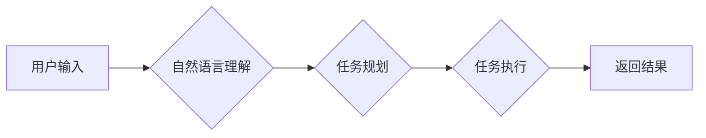

> CUI, 用户目标, 任务实现, 人机交互, 自然语言处理, 认知科学, 用户体验

## 1. 背景介绍

随着人工智能技术的飞速发展，用户界面 (UI) 的设计也迎来了新的挑战和机遇。传统的图形用户界面 (GUI) 已经无法满足用户日益增长的需求，特别是对于复杂的任务和场景。因此，基于文本的命令行界面 (CLI) 和基于语音的语音交互界面 (VUI) 逐渐受到关注。然而，这些界面仍然存在一些局限性，例如：

* **CLI:** 操作复杂，学习成本高，难以处理复杂的任务。
* **VUI:** 语音识别技术尚不成熟，容易出现误识别，难以表达复杂的需求。

为了克服这些局限性，一种新的用户界面类型——基于自然语言的命令行界面 (CUI) 应运而生。CUI 旨在通过自然语言进行交互，使用户能够更直观、更自然地与计算机进行沟通。

## 2. 核心概念与联系

CUI 的核心概念是将用户目标与任务实现技术相结合。用户目标是指用户想要完成的任务或目标，而任务实现技术是指实现用户目标的具体方法和手段。

**CUI 的工作原理:**

1. **用户输入:** 用户使用自然语言描述其目标或需求。
2. **自然语言理解 (NLU):** 系统使用自然语言处理 (NLP) 技术对用户输入进行理解，识别用户的意图和实体。
3. **任务规划:** 系统根据用户的意图和实体，规划出实现用户目标的具体步骤。
4. **任务执行:** 系统执行任务步骤，并返回结果给用户。

**CUI 与其他用户界面类型的联系:**

* **CUI 与 CLI:** CUI 继承了 CLI 的简洁性和效率，同时克服了 CLI 的操作复杂性。
* **CUI 与 GUI:** CUI 结合了 GUI 的直观性和交互性，同时避免了 GUI 的视觉负担和学习成本。
* **CUI 与 VUI:** CUI 可以与 VUI 相结合，提供更灵活和便捷的交互方式。

**Mermaid 流程图:**



## 3. 核心算法原理 & 具体操作步骤

### 3.1  算法原理概述

CUI 的核心算法包括自然语言理解 (NLU)、任务规划和任务执行。

* **自然语言理解 (NLU):** NLU 算法旨在识别用户输入中的意图、实体和关系。常用的 NLU 算法包括词袋模型、隐马尔可夫模型 (HMM)、条件随机场 (CRF) 和深度学习模型。
* **任务规划:** 任务规划算法旨在根据用户的意图和实体，规划出实现用户目标的具体步骤。常用的任务规划算法包括基于规则的规划、基于搜索的规划和基于机器学习的规划。
* **任务执行:** 任务执行算法旨在执行规划出的步骤，并返回结果给用户。任务执行可以涉及到各种操作，例如数据库查询、文件操作、网络请求等。

### 3.2  算法步骤详解

**自然语言理解 (NLU) 算法步骤:**

1. **文本预处理:** 对用户输入进行预处理，例如分词、去停用词、词干提取等。
2. **特征提取:** 从预处理后的文本中提取特征，例如词频、词性、依存关系等。
3. **模型训练:** 使用训练数据训练 NLU 模型，例如使用深度学习模型训练一个意图分类器和实体识别器。
4. **意图识别和实体识别:** 将用户输入输入到训练好的模型中，识别用户的意图和实体。

**任务规划算法步骤:**

1. **状态空间表示:** 将任务分解成一系列状态，并表示成状态空间。
2. **动作定义:** 定义一系列可以执行的动作，这些动作可以改变任务的状态。
3. **规划算法:** 使用规划算法搜索状态空间，找到从初始状态到目标状态的一条路径。

**任务执行算法步骤:**

1. **根据规划路径执行动作:** 执行规划算法找到的步骤，完成任务。
2. **处理异常情况:** 处理任务执行过程中可能出现的异常情况，例如网络错误、数据错误等。
3. **返回结果:** 将任务执行的结果返回给用户。

### 3.3  算法优缺点

**优点:**

* **自然语言交互:** 用户可以使用自然语言与系统进行交互，提高用户体验。
* **灵活性和可扩展性:** CUI 可以轻松扩展到处理新的任务和领域。
* **效率和准确性:** CUI 可以实现高效和准确的任务执行。

**缺点:**

* **NLU 算法的复杂性:** NLU 算法的训练和部署需要大量的计算资源和数据。
* **任务规划的复杂性:** 对于复杂的任务，任务规划算法可能需要很长时间才能找到最优解。
* **安全性问题:** CUI 的开放性可能带来安全性问题，例如恶意代码注入。

### 3.4  算法应用领域

CUI 具有广泛的应用领域，例如：

* **智能客服:** CUI 可以用于构建智能客服系统，帮助用户解决问题和获取信息。
* **自动化办公:** CUI 可以用于自动化办公任务，例如日程安排、邮件发送等。
* **科学研究:** CUI 可以用于科学研究，例如数据分析、模型构建等。
* **教育培训:** CUI 可以用于教育培训，例如在线课程、知识问答等。

## 4. 数学模型和公式 & 详细讲解 & 举例说明

### 4.1  数学模型构建

CUI 的核心算法可以抽象为数学模型，例如：

* **意图分类模型:** 可以使用概率模型，例如贝叶斯网络或条件随机场，来表示用户输入与不同意图之间的概率关系。
* **实体识别模型:** 可以使用序列标注模型，例如隐马尔可夫模型或条件随机场，来识别文本中的实体。
* **任务规划模型:** 可以使用搜索算法，例如A*算法或IDA*算法，来搜索状态空间并找到最优路径。

### 4.2  公式推导过程

例如，对于意图分类模型，可以使用贝叶斯定理来推导分类概率：

$$P(y|x) = \frac{P(x|y)P(y)}{P(x)}$$

其中：

* $P(y|x)$ 是给定输入 $x$ 的情况下，意图 $y$ 的概率。
* $P(x|y)$ 是给定意图 $y$ 的情况下，输入 $x$ 的概率。
* $P(y)$ 是意图 $y$ 的先验概率。
* $P(x)$ 是输入 $x$ 的先验概率。

### 4.3  案例分析与讲解

例如，假设我们有一个意图分类模型，用于识别用户输入的意图，例如“查询天气”、“预订酒店”和“查看航班”。我们可以使用训练数据来训练模型，并使用测试数据来评估模型的性能。

假设用户输入了“明天北京的天气怎么样”，我们可以使用模型来预测用户的意图。根据模型的训练结果，我们可以得到：

* $P($查询天气$|“明天北京的天气怎么样”)$ = 0.9
* $P($预订酒店$|“明天北京的天气怎么样”)$ = 0.05
* $P($查看航班$|“明天北京的天气怎么样”)$ = 0.05

因此，模型预测用户的意图是“查询天气”。

## 5. 项目实践：代码实例和详细解释说明

### 5.1  开发环境搭建

CUI 项目的开发环境可以根据具体需求进行搭建。一般来说，需要以下软件和工具：

* **编程语言:** Python 是 CUI 开发的常用语言，因为它拥有丰富的 NLP 库和框架。
* **NLP 库和框架:** NLTK、spaCy、Transformers 等 NLP 库和框架可以帮助我们进行自然语言处理任务。
* **任务规划库:**例如, RASP、Planners 等等。
* **数据库:** 可以使用 MySQL、PostgreSQL 等数据库来存储用户数据和任务信息。
* **版本控制系统:** Git 是常用的版本控制系统，可以帮助我们管理代码和版本。

### 5.2  源代码详细实现

以下是一个简单的 CUI 项目的代码示例，使用 Python 和 NLTK 库实现一个简单的问答系统：

```python
import nltk

# 下载 NLTK 数据集
nltk.download('punkt')
nltk.download('averaged_perceptron_tagger')

# 定义一个简单的问答字典
qa_dict = {
    "你好": "你好！",
    "今天天气怎么样": "今天天气晴朗。",
    "你叫什么名字": "我叫 CUI。",
}

def process_user_input(user_input):
    # 分词
    tokens = nltk.word_tokenize(user_input)
    # 词性标注
    pos_tags = nltk.pos_tag(tokens)
    # ... 其他 NLP 处理步骤 ...
    # 返回意图和实体
    return intent, entities

def get_response(intent, entities):
    # 根据意图和实体从问答字典中获取响应
    response = qa_dict.get(intent, "对不起，我不明白你的意思。")
    return response

# 主循环
while True:
    user_input = input("用户输入: ")
    intent, entities = process_user_input(user_input)
    response = get_response(intent, entities)
    print("系统响应:", response)
```

### 5.3  代码解读与分析

这段代码实现了一个简单的 CUI 问答系统。

* **数据预处理:** 使用 NLTK 库对用户输入进行分词和词性标注。
* **意图识别:** 根据用户输入识别用户的意图，例如“查询天气”、“预订酒店”等。
* **实体识别:** 从用户输入中识别出相关的实体，例如日期、地点、物品等。
* **响应生成:** 根据用户的意图和实体，从问答字典中获取相应的响应。

### 5.4  运行结果展示

当用户输入“你好”时，系统会输出“你好！”。当用户输入“今天天气怎么样”时，系统会输出“今天天气晴朗。”。

## 6. 实际应用场景

CUI 在许多实际应用场景中都有着广泛的应用，例如：

### 6.1  智能客服

CUI 可以用于构建智能客服系统，帮助用户解决问题和获取信息。例如，用户可以使用自然语言询问产品信息、订单状态或售后服务等。

### 6.2  自动化办公

CUI 可以用于自动化办公任务，例如日程安排、邮件发送、文档处理等。例如，用户可以使用自然语言安排会议、发送邮件或创建文档。

### 6.3  科学研究

CUI 可以用于科学研究，例如数据分析、模型构建、实验控制等。例如，用户可以使用自然语言查询数据库、构建机器学习模型或控制实验设备。

### 6.4  未来应用展望

随着人工智能技术的不断发展，CUI 的应用场景将会更加广泛。例如：

* **个性化学习:** CUI 可以根据用户的学习进度和需求，提供个性化的学习内容和指导。
* **医疗诊断:** CUI 可以帮助医生进行疾病诊断，并提供个性化的治疗方案。
* **智能家居:** CUI 可以用于控制智能家居设备，例如灯光、空调、电视等。

## 7. 工具和资源推荐

### 7.1  学习资源推荐

* **书籍:**
    * 《自然语言处理》 by Jurafsky & Martin
    * 《深度学习》 by Goodfellow, Bengio & Courville
* **在线课程:**
    * Coursera: Natural Language Processing Specialization
    * edX: Artificial Intelligence
* **博客和网站:**
    * Stanford NLP Group: https://nlp.stanford.edu/
    * Google AI Blog: https://ai.googleblog.com/

### 7.2  开发工具推荐

* **编程语言:** Python
* **NLP 库和框架:** NLTK, spaCy, Transformers
* **任务规划库:** RASP, Planners
* **