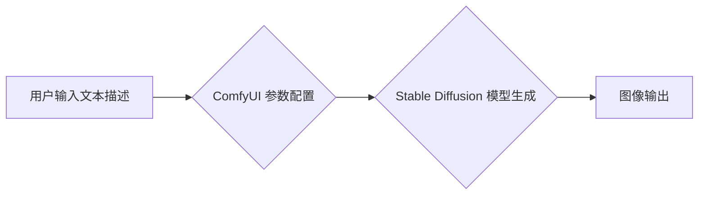

> ComfyUI, Stable Diffusion, AI图像生成, 扩散模型, 界面交互, 优化流程, 创作工具

## 1. 背景介绍

近年来，人工智能领域取得了令人瞩目的进展，其中，文本到图像的生成模型尤为引人注目。Stable Diffusion 作为开源的文本到图像生成模型，凭借其强大的生成能力和易于部署的特点，迅速成为了研究和应用的热点。然而，Stable Diffusion 的原版命令行界面操作较为复杂，对于非技术人员来说，使用门槛较高。为了降低使用门槛，提高用户体验，ComfyUI 应运而生。

ComfyUI 是一款基于 Stable Diffusion 的图形用户界面 (GUI) 工具，它提供了一个直观、易于使用的界面，让用户可以更方便地进行图像生成、参数调整和模型训练。ComfyUI 的出现，极大地降低了使用 Stable Diffusion 的门槛，使得更多人能够参与到 AI 图像生成领域。

## 2. 核心概念与联系

### 2.1  Stable Diffusion

Stable Diffusion 是一种基于扩散模型的文本到图像生成模型。其工作原理是通过逐步添加噪声将图像转换为纯噪声，然后反向训练一个生成器模型，学习从纯噪声中恢复出图像的过程。

### 2.2  ComfyUI

ComfyUI 是一款基于 Python 开发的 GUI 工具，它封装了 Stable Diffusion 的核心功能，并提供了一个友好的用户界面。用户可以通过 ComfyUI 的界面输入文本描述，选择模型参数，并生成相应的图像。

**ComfyUI 与 Stable Diffusion 的关系**

ComfyUI 作为 Stable Diffusion 的前端工具，负责用户界面交互和参数配置，而 Stable Diffusion 则负责图像生成的核心逻辑。两者协同工作，使得用户能够更方便地使用 Stable Diffusion 进行图像生成。

**Mermaid 流程图**

## 3. 核心算法原理 & 具体操作步骤

### 3.1  算法原理概述

Stable Diffusion 的核心算法是基于扩散模型的文本到图像生成。其工作原理可以概括为以下几个步骤：

1. **前向扩散:** 将图像逐步添加噪声，直到变成纯噪声。
2. **反向扩散:** 从纯噪声开始，逐步去除噪声，恢复出图像。
3. **文本编码:** 将文本描述编码成向量表示。
4. **条件生成:** 在反向扩散过程中，根据文本编码向量，引导图像生成过程，生成符合文本描述的图像。

### 3.2  算法步骤详解

1. **前向扩散:**

   - 从一张真实图像开始，逐步添加高斯噪声。
   - 每次添加噪声的程度由一个预设的衰减因子控制。
   - 经过多次迭代后，图像最终变成纯噪声。

2. **反向扩散:**

   - 从纯噪声开始，逐步去除噪声。
   - 每次去除噪声的程度由一个预设的衰减因子控制。
   - 在去除噪声的过程中，会根据文本编码向量进行条件生成，引导图像生成过程。

3. **文本编码:**

   - 使用预训练的文本编码模型，将文本描述编码成一个向量表示。

4. **条件生成:**

   - 在反向扩散过程中，将文本编码向量作为条件输入，引导图像生成过程。
   - 通过调整文本编码向量，可以控制生成的图像的风格、内容和细节。

### 3.3  算法优缺点

**优点:**

- 生成图像质量高，细节丰富。
- 模型开源，可自由修改和训练。
- 能够生成多种风格的图像。

**缺点:**

- 训练模型需要大量的计算资源和数据。
- 生成图像速度相对较慢。
- 对于一些复杂的概念描述，生成效果可能不理想。

### 3.4  算法应用领域

- 艺术创作
- 游戏开发
- 广告设计
- 教育培训
- 科学研究

## 4. 数学模型和公式 & 详细讲解 & 举例说明

### 4.1  数学模型构建

Stable Diffusion 的数学模型主要包括以下几个部分:

- **扩散模型:** 使用马尔可夫链来描述图像的噪声添加和去除过程。
- **文本编码器:** 使用 Transformer 网络来将文本描述编码成向量表示。
- **图像生成器:** 使用 U-Net 等卷积神经网络来生成图像。

### 4.2  公式推导过程

由于篇幅限制，这里只列举一些关键公式，详细推导过程可以参考相关论文。

- **噪声添加过程:**

$$
x_t = \sqrt{1-\beta_t}x_{t-1} + \sqrt{\beta_t}\epsilon_t
$$

其中:

- $x_t$ 表示时间步 t 的图像。
- $\beta_t$ 表示时间步 t 的噪声添加系数。
- $\epsilon_t$ 表示时间步 t 的高斯噪声。

- **文本编码过程:**

$$
h = Transformer(text)
$$

其中:

- $h$ 表示文本编码后的向量表示。
- $Transformer$ 表示 Transformer 网络。

- **图像生成过程:**

$$
x_{t-1} = \frac{1}{\sqrt{1-\beta_t}}(x_t - \sqrt{\beta_t} \epsilon_t)
$$

其中:

- $x_{t-1}$ 表示时间步 t-1 的图像。
- $x_t$ 表示时间步 t 的图像。
- $\beta_t$ 表示时间步 t 的噪声添加系数。
- $\epsilon_t$ 表示时间步 t 的高斯噪声。

### 4.3  案例分析与讲解

假设我们想要生成一张“一只可爱的猫在草地上玩耍”的图像。

1. 用户输入文本描述：“一只可爱的猫在草地上玩耍”。
2. 文本编码器将文本描述编码成一个向量表示 $h$.
3. 扩散模型根据 $h$ 和噪声添加过程，逐步去除噪声，生成最终的图像。

## 5. 项目实践：代码实例和详细解释说明

### 5.1  开发环境搭建

ComfyUI 的开发环境搭建相对简单，主要需要安装 Python 和相关的库。

- Python 3.8 或更高版本
- PyTorch
- Transformers
- Pillow
- OpenCV

### 5.2  源代码详细实现

ComfyUI 的源代码主要位于 GitHub 上，可以参考官方文档进行学习和修改。

### 5.3  代码解读与分析

ComfyUI 的代码主要包含以下几个部分:

- **用户界面:** 使用 PyQT 或 Tkinter 等库构建用户界面。
- **参数配置:** 提供一个界面，用户可以配置 Stable Diffusion 的各种参数，例如学习率、步长、批大小等。
- **图像生成:** 调用 Stable Diffusion 的 API 进行图像生成。
- **结果展示:** 将生成的图像显示在用户界面中。

### 5.4  运行结果展示

运行 ComfyUI 后，用户可以输入文本描述，选择模型参数，并生成相应的图像。生成的图像质量和细节丰富度取决于文本描述的清晰度和模型参数的设置。

## 6. 实际应用场景

### 6.1  艺术创作

ComfyUI 可以帮助艺术家快速生成创意素材，例如人物、场景、构图等，并进行风格化处理，激发创作灵感。

### 6.2  游戏开发

ComfyUI 可以帮助游戏开发者快速生成游戏场景、角色、道具等资产，节省开发时间和成本。

### 6.3  广告设计

ComfyUI 可以帮助广告设计师快速生成创意广告素材，例如人物、场景、产品等，并进行风格化处理，提升广告效果。

### 6.4  未来应用展望

随着 AI 技术的不断发展，ComfyUI 将有更多新的应用场景，例如：

- 个性化教育：根据学生的学习情况生成个性化的学习内容。
- 医疗诊断：辅助医生进行疾病诊断和治疗方案制定。
- 科学研究：加速科学研究的进程，例如药物研发、材料设计等。

## 7. 工具和资源推荐

### 7.1  学习资源推荐

- Stable Diffusion 官方文档: https://stability.ai/blog/stable-diffusion-v1-release
- ComfyUI 官方文档: https://github.com/AUTOMATIC1111/stable-diffusion-webui
- 扩散模型相关论文: https://arxiv.org/abs/2006.11239

### 7.2  开发工具推荐

- Python 3.8 或更高版本
- PyTorch
- Transformers
- Pillow
- OpenCV

### 7.3  相关论文推荐

- Denoising Diffusion Probabilistic Models (DDPM): https://arxiv.org/abs/2006.11239
- Imagen: Text-to-Image Diffusion Models: https://arxiv.org/abs/2205.11487
- Stable Diffusion: https://arxiv.org/abs/2112.10752

## 8. 总结：未来发展趋势与挑战

### 8.1  研究成果总结

ComfyUI 的出现，极大地降低了使用 Stable Diffusion 的门槛，使得更多人能够参与到 AI 图像生成领域。

### 8.2  未来发展趋势

- **更易于使用的界面:** 未来 ComfyUI 将会更加注重用户体验，提供更直观、更易于使用的界面。
- **更强大的功能:** ComfyUI 将会不断添加新的功能，例如图像编辑、动画生成等。
- **更个性化的体验:** ComfyUI 将会支持用户自定义模型参数和风格，提供更个性化的图像生成体验。

### 8.3  面临的挑战

- **模型训练成本:** 训练大型扩散模型需要大量的计算资源和数据，这对于个人开发者来说是一个挑战。
- **伦理问题:** AI 图像生成技术可能会被用于生成虚假信息或进行恶意攻击，需要认真考虑伦理问题。

### 8.4  研究展望

未来，ComfyUI 将会继续朝着更易用、更强大、更个性化的方向发展，并与其他 AI 技术相结合，为人们带来更多创新的应用场景。

## 9. 附录：常见问题与解答

### 9.1  Q: 如何安装 ComfyUI？

A: 可以参考 ComfyUI 官方文档中的安装步骤。

### 9.2  Q: 如何使用 ComfyUI 生成图像？

A: 可以参考 ComfyUI 官方文档中的使用指南。

### 9.3  Q: ComfyUI 支持哪些模型？

A: ComfyUI 支持多种 Stable Diffusion 模型，可以根据需要选择。

### 9.4  Q: ComfyUI 的开源许可证是什么？

A: ComfyUI 的开源许可证是 MIT 许可证。

作者：禅与计算机程序设计艺术 / Zen and the Art of Computer Programming

<end_of_turn>