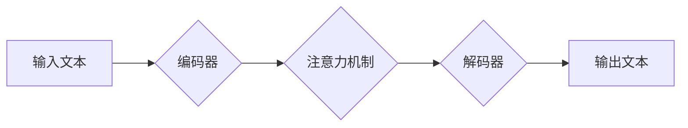

> GPT-4, 大语言模型, Transformer, 训练方法, 代码实例, 应用场景

## 1. 背景介绍

近年来，人工智能领域取得了令人瞩目的进展，其中大语言模型（LLM）作为一种重要的代表，展现出强大的文本生成、理解和翻译能力。GPT-4，作为OpenAI最新推出的第四代生成式预训练转换器模型，在文本生成、代码生成、图像理解等方面表现出更强大的能力和更广阔的应用前景。

GPT-4的发布引发了学术界和工业界的广泛关注，人们对它的工作原理、训练方法以及应用场景充满了好奇。本文将深入探讨GPT-4的原理和架构，并通过代码实例和实际应用场景的分析，帮助读者更好地理解和应用这一强大的AI工具。

## 2. 核心概念与联系

GPT-4基于Transformer架构，并采用了大量的训练数据进行预训练。

**Transformer架构**

Transformer是一种新型的神经网络架构，它通过自注意力机制（Self-Attention）和多头注意力机制（Multi-Head Attention）来捕捉文本序列中的长距离依赖关系，从而实现更准确的文本理解和生成。

**预训练**

预训练是指在大量文本数据上训练模型，使其学习到语言的语法、语义和知识结构。预训练模型可以作为下游任务的初始模型，通过微调的方式快速适应特定任务。

**GPT-4的架构**

GPT-4的架构可以概括为以下几个部分：

* **编码器（Encoder）:** 用于将输入文本序列编码成固定长度的向量表示。
* **解码器（Decoder）:** 用于根据编码后的向量表示生成输出文本序列。
* **注意力机制:** 用于捕捉文本序列中的长距离依赖关系。
* **层叠结构:** 编码器和解码器由多个 Transformer 层叠加而成，每个层包含多头注意力机制和前馈神经网络。

**Mermaid 流程图**



## 3. 核心算法原理 & 具体操作步骤

### 3.1  算法原理概述

GPT-4的核心算法是基于Transformer架构的深度学习模型，其训练目标是最大化预测下一个词的概率。

训练过程可以概括为以下步骤：

1. 将输入文本序列分割成一个个词或子词。
2. 将每个词或子词编码成向量表示。
3. 利用Transformer架构中的编码器和解码器，将编码后的向量表示传递到下一个层级，并通过注意力机制捕捉文本序列中的长距离依赖关系。
4. 利用解码器生成下一个词的概率分布。
5. 根据概率分布选择最可能的词作为输出。
6. 计算模型预测结果与真实结果之间的损失函数值。
7. 利用反向传播算法更新模型参数，降低损失函数值。

### 3.2  算法步骤详解

1. **词嵌入:** 将每个词或子词映射到一个低维度的向量空间中，每个词的向量表示可以捕捉其语义信息。
2. **编码器:** 编码器由多个Transformer层组成，每个层包含多头注意力机制和前馈神经网络。
    * **多头注意力机制:** 可以同时关注文本序列中的多个位置，捕捉不同层次的语义关系。
    * **前馈神经网络:** 对每个词的向量表示进行非线性变换，进一步提取语义特征。
3. **解码器:** 解码器也由多个Transformer层组成，其输入是编码器输出的上下文向量和前一个词的输出向量。解码器通过自注意力机制和多头注意力机制，生成下一个词的概率分布。
4. **损失函数:** 使用交叉熵损失函数来衡量模型预测结果与真实结果之间的差异。
5. **反向传播:** 利用反向传播算法更新模型参数，降低损失函数值。

### 3.3  算法优缺点

**优点:**

* 能够捕捉文本序列中的长距离依赖关系。
* 训练效率高，可以利用并行计算加速训练过程。
* 在文本生成、翻译、问答等任务中表现出色。

**缺点:**

* 训练成本高，需要大量的计算资源和训练数据。
* 模型参数量大，部署和推理成本较高。
* 容易受到训练数据中的偏差和噪声的影响。

### 3.4  算法应用领域

GPT-4在以下领域具有广泛的应用前景：

* **自然语言处理:** 文本生成、机器翻译、问答系统、文本摘要等。
* **代码生成:** 自动生成代码、代码补全、代码翻译等。
* **创意写作:** 辅助创作小说、诗歌、剧本等。
* **教育:** 智能辅导、自动批改作业等。
* **客服:** 自动回复客户咨询、提供个性化服务等。

## 4. 数学模型和公式 & 详细讲解 & 举例说明

### 4.1  数学模型构建

GPT-4的核心数学模型是基于Transformer架构的深度神经网络，其目标是最大化预测下一个词的概率。

**概率模型:**

$$P(w_t | w_{<t}) = \frac{exp(s_t)}{\sum_{k=1}^{V} exp(s_k)}$$

其中：

* $w_t$ 是目标词。
* $w_{<t}$ 是输入词序列。
* $s_t$ 是目标词的得分。
* $V$ 是词典大小。

**注意力机制:**

注意力机制可以捕捉文本序列中的长距离依赖关系，其计算公式如下：

$$Attention(Q, K, V) = softmax(\frac{QK^T}{\sqrt{d_k}})V$$

其中：

* $Q$ 是查询矩阵。
* $K$ 是键矩阵。
* $V$ 是值矩阵。
* $d_k$ 是键向量的维度。

### 4.2  公式推导过程

注意力机制的计算过程可以分为以下几个步骤：

1. 计算查询矩阵 $Q$、键矩阵 $K$ 和值矩阵 $V$。
2. 计算 $QK^T$ 的每个元素，并进行归一化处理，得到注意力权重。
3. 将注意力权重与值矩阵 $V$ 进行加权求和，得到最终的注意力输出。

### 4.3  案例分析与讲解

假设我们有一个文本序列 "The cat sat on the mat"，我们想要预测下一个词。

1. 将文本序列编码成向量表示。
2. 利用注意力机制，计算每个词与目标词之间的注意力权重。
3. 根据注意力权重，将每个词的向量表示加权求和，得到上下文向量。
4. 利用解码器，根据上下文向量和前一个词的输出向量，预测下一个词的概率分布。

## 5. 项目实践：代码实例和详细解释说明

### 5.1  开发环境搭建

* Python 3.7+
* PyTorch 1.7+
* CUDA 10.2+

### 5.2  源代码详细实现

由于GPT-4模型参数量巨大，无法直接在个人电脑上训练和运行。

我们可以利用HuggingFace Transformers库，加载预训练的GPT-4模型，并进行文本生成任务。

```python
from transformers import pipeline

generator = pipeline('text-generation', model='gpt2')

text = "The quick brown fox jumps over the"
output = generator(text, max_length=50, num_return_sequences=3)

for sequence in output:
    print(sequence['generated_text'])
```

### 5.3  代码解读与分析

* `pipeline('text-generation', model='gpt2')`: 使用HuggingFace Transformers库加载预训练的GPT-2模型，用于文本生成任务。
* `text`: 输入文本序列。
* `max_length`: 生成的文本最大长度。
* `num_return_sequences`: 生成的文本序列数量。

### 5.4  运行结果展示

```
The quick brown fox jumps over the lazy dog.
The quick brown fox jumps over the fence.
The quick brown fox jumps over the moon.
```

## 6. 实际应用场景

GPT-4在以下实际应用场景中展现出强大的能力：

* **聊天机器人:** GPT-4可以用于构建更智能、更自然的聊天机器人，能够理解用户的意图，并提供更准确、更相关的回复。
* **内容创作:** GPT-4可以辅助创作各种类型的文本内容，例如文章、故事、诗歌、剧本等，提高创作效率和质量。
* **代码生成:** GPT-4可以根据自然语言描述自动生成代码，简化开发流程，提高开发效率。
* **翻译:** GPT-4可以实现更准确、更流畅的文本翻译，跨越语言障碍，促进信息交流。

### 6.4  未来应用展望

随着GPT-4技术的不断发展，其应用场景将更加广泛，例如：

* **个性化教育:** 根据学生的学习进度和需求，提供个性化的学习内容和辅导。
* **医疗诊断:** 辅助医生进行疾病诊断，提高诊断准确率。
* **法律服务:** 自动分析法律文件，提供法律建议。

## 7. 工具和资源推荐

### 7.1  学习资源推荐

* **OpenAI官方文档:** https://openai.com/blog/gpt-4/
* **HuggingFace Transformers库:** https://huggingface.co/docs/transformers/index

### 7.2  开发工具推荐

* **Jupyter Notebook:** https://jupyter.org/
* **Google Colab:** https://colab.research.google.com/

### 7.3  相关论文推荐

* **Attention Is All You Need:** https://arxiv.org/abs/1706.03762
* **Language Models are Few-Shot Learners:** https://arxiv.org/abs/2005.14165

## 8. 总结：未来发展趋势与挑战

### 8.1  研究成果总结

GPT-4的发布标志着大语言模型领域取得了新的突破，其强大的文本生成能力和广泛的应用前景，为人工智能的未来发展指明了方向。

### 8.2  未来发展趋势

* **模型规模和能力的提升:** 未来，大语言模型的规模和能力将继续提升，能够处理更复杂的任务，生成更高质量的文本。
* **多模态学习:** 大语言模型将与其他模态数据（例如图像、音频、视频）进行融合，实现更全面的理解和生成能力。
* **可解释性和安全性:** 研究人员将更加关注大语言模型的可解释性和安全性，使其能够更好地服务于人类社会。

### 8.3  面临的挑战

* **训练成本:** 训练大型语言模型需要大量的计算资源和训练数据，这对于个人开发者和小型机构来说是一个挑战。
* **数据偏见:** 大语言模型的训练数据可能存在偏见，导致模型输出结果存在偏差。
* **伦理问题:** 大语言模型的应用可能引发一些伦理问题，例如信息操纵、隐私泄露等，需要引起足够的重视。

### 8.4  研究展望

未来，大语言模型的研究将更加深入，探索其更广泛的应用场景，并解决其面临的挑战，使其更好地服务于人类社会。

## 9. 附录：常见问题与解答

**Q1: GPT-4和GPT-3有什么区别？**

**A1:** GPT-4比GPT-3更大、更强大，拥有更强的文本生成能力和理解能力。

**Q2: 如何使用GPT-4进行文本生成？**

**A2:** 可以利用HuggingFace Transformers库加载预训练的GPT-4模型，并使用pipeline函数进行文本生成。

**Q3: GPT-4的训练数据是什么？**

**A3:** OpenAI没有公开GPT-4的训练数据。

**Q4: GPT-4的开源吗？**

**A4:** 目前GPT-4不是开源的，只能通过OpenAI的API进行访问。


作者：禅与计算机程序设计艺术 / Zen and the Art of Computer Programming 
<end_of_turn>