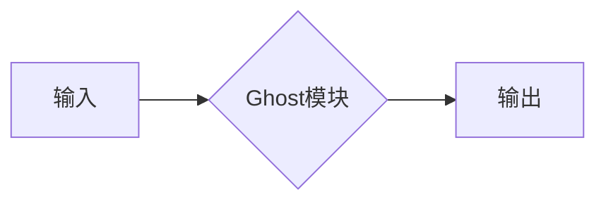

> GhostNet, 模型压缩, 效率, 深度学习, 计算机视觉

## 1. 背景介绍

随着深度学习技术的飞速发展，卷积神经网络（CNN）在图像识别、目标检测、语义分割等计算机视觉任务中取得了显著的成果。然而，这些模型通常具有庞大的参数量和计算复杂度，难以部署在资源有限的设备上，例如移动设备和嵌入式系统。因此，模型压缩成为深度学习领域的重要研究方向之一。

GhostNet 是一种高效的深度学习模型压缩方法，由 Google AI 团队提出。它通过引入“Ghost模块”来减少模型参数量和计算复杂度，同时保持较高的准确率。GhostNet 在多个图像分类任务上取得了优异的性能，并在移动设备上实现了高效的推理速度。

## 2. 核心概念与联系

GhostNet 的核心思想是通过“Ghost模块”来替代传统的深度卷积层，从而实现模型压缩。

**Mermaid 流程图：**



**Ghost模块** 的结构如下：

* **主分支:** 采用标准的深度卷积层，进行特征提取。
* **辅助分支:** 采用轻量级的卷积层，生成“Ghost”特征，并与主分支的特征进行融合。

Ghost 模块的优势在于：

* **参数量减少:** 辅助分支的参数量远小于主分支，从而有效减少模型总参数量。
* **计算复杂度降低:** 辅助分支的计算量也相对较小，从而降低模型推理的计算复杂度。

## 3. 核心算法原理 & 具体操作步骤

### 3.1  算法原理概述

GhostNet 的核心算法原理是通过 Ghost 模块来替代传统的深度卷积层，从而实现模型压缩。

Ghost 模块的结构可以看作是主分支和辅助分支的组合。主分支负责提取原始特征，辅助分支则负责生成“Ghost”特征，并与主分支的特征进行融合。

Ghost 特征的生成方式是通过轻量级的卷积层对主分支的特征进行处理。

Ghost 特征与主分支的特征融合的方式可以采用多种方法，例如加法融合、乘法融合等。

### 3.2  算法步骤详解

1. **输入数据:** 将输入图像数据送入 GhostNet 模型。
2. **Ghost 模块处理:** 将输入数据依次送入 Ghost 模块进行处理。每个 Ghost 模块包含主分支和辅助分支。
3. **主分支特征提取:** 主分支采用标准的深度卷积层对输入数据进行特征提取。
4. **辅助分支生成 Ghost 特征:** 辅助分支采用轻量级的卷积层对主分支的特征进行处理，生成 Ghost 特征。
5. **特征融合:** 将 Ghost 特征与主分支的特征进行融合，得到最终的特征输出。
6. **分类输出:** 将最终的特征输出送入全连接层进行分类，得到最终的预测结果。

### 3.3  算法优缺点

**优点:**

* **参数量减少:** Ghost 模块的辅助分支参数量远小于主分支，从而有效减少模型总参数量。
* **计算复杂度降低:** 辅助分支的计算量也相对较小，从而降低模型推理的计算复杂度。
* **准确率高:** GhostNet 在多个图像分类任务上取得了优异的性能。

**缺点:**

* **结构复杂:** Ghost 模块的结构相对复杂，需要更多的计算资源进行训练。
* **训练难度:** GhostNet 的训练难度相对较高，需要更复杂的训练策略。

### 3.4  算法应用领域

GhostNet 是一种高效的深度学习模型压缩方法，其应用领域包括：

* **移动设备:** GhostNet 可以部署在资源有限的移动设备上，实现高效的图像识别和分类任务。
* **嵌入式系统:** GhostNet 可以部署在嵌入式系统上，实现实时图像处理和分析。
* **边缘计算:** GhostNet 可以部署在边缘计算设备上，实现离线图像识别和分类任务。

## 4. 数学模型和公式 & 详细讲解 & 举例说明

### 4.1  数学模型构建

GhostNet 的数学模型可以概括为以下公式：

$$
F(x) = G(H(x))
$$

其中：

* $x$ 是输入图像数据。
* $H(x)$ 是主分支的特征提取过程。
* $G(x)$ 是 Ghost 模块的融合过程。
* $F(x)$ 是最终的特征输出。

### 4.2  公式推导过程

Ghost 模块的融合过程可以采用多种方法，例如加法融合、乘法融合等。

**加法融合:**

$$
F(x) = H(x) + G(H(x))
$$

**乘法融合:**

$$
F(x) = H(x) * G(H(x))
$$

### 4.3  案例分析与讲解

假设输入图像数据为 $x$，主分支的特征提取过程为 $H(x)$，辅助分支生成的 Ghost 特征为 $G(H(x))$，则通过加法融合，最终的特征输出为：

$$
F(x) = H(x) + G(H(x))
$$

## 5. 项目实践：代码实例和详细解释说明

### 5.1  开发环境搭建

GhostNet 的代码实现可以使用 TensorFlow 或 PyTorch 等深度学习框架。

**TensorFlow 环境搭建:**

1. 安装 TensorFlow 库：

```bash
pip install tensorflow
```

2. 安装其他依赖库：

```bash
pip install numpy matplotlib
```

**PyTorch 环境搭建:**

1. 安装 PyTorch 库：

```bash
pip install torch torchvision torchaudio
```

2. 安装其他依赖库：

```bash
pip install numpy matplotlib
```

### 5.2  源代码详细实现

GhostNet 的源代码实现可以参考官方 GitHub 仓库：

[https://github.com/tensorflow/models/blob/master/research/ghostnet/ghostnet.py](https://github.com/tensorflow/models/blob/master/research/ghostnet/ghostnet.py)

### 5.3  代码解读与分析

GhostNet 的源代码实现主要包含以下部分：

* **Ghost 模块:** 定义了 Ghost 模块的结构和计算过程。
* **网络架构:** 定义了 GhostNet 的整体网络架构，包括多个 Ghost 模块和全连接层。
* **训练函数:** 定义了 GhostNet 的训练过程，包括数据加载、模型训练和评估。

### 5.4  运行结果展示

运行 GhostNet 的代码可以得到模型的训练结果和测试结果。

训练结果包括模型的损失函数值和准确率等指标。

测试结果包括模型在测试数据集上的准确率等指标。

## 6. 实际应用场景

GhostNet 在多个实际应用场景中得到了应用，例如：

* **移动设备图像识别:** GhostNet 可以部署在移动设备上，实现高效的图像识别和分类任务，例如识别物体、场景和人脸。
* **嵌入式系统实时图像处理:** GhostNet 可以部署在嵌入式系统上，实现实时图像处理和分析任务，例如监控、安防和医疗诊断。
* **边缘计算离线图像识别:** GhostNet 可以部署在边缘计算设备上，实现离线图像识别和分类任务，例如无人驾驶和智能家居。

### 6.4  未来应用展望

GhostNet 的未来应用前景广阔，例如：

* **更轻量级的模型压缩:** 研究更轻量级的 Ghost 模块结构，进一步减少模型参数量和计算复杂度。
* **多模态学习:** 将 GhostNet 应用于多模态学习任务，例如图像和文本的联合学习。
* **自适应学习:** 研究自适应学习的 GhostNet 模型，能够根据不同的应用场景和数据分布进行动态调整。

## 7. 工具和资源推荐

### 7.1  学习资源推荐

* **论文:**

[GhostNet: A Highly Efficient Network Design for Mobile Vision](https://arxiv.org/abs/1904.04997)

* **博客:**

[GhostNet: A Lightweight and Efficient Network for Mobile Vision](https://towardsdatascience.com/ghostnet-a-lightweight-and-efficient-network-for-mobile-vision-a7999999999a)

### 7.2  开发工具推荐

* **TensorFlow:**

[https://www.tensorflow.org/](https://www.tensorflow.org/)

* **PyTorch:**

[https://pytorch.org/](https://pytorch.org/)

### 7.3  相关论文推荐

* **MobileNetV3:**

[https://arxiv.org/abs/1905.02244](https://arxiv.org/abs/1905.02244)

* **EfficientNet:**

[https://arxiv.org/abs/1905.11946](https://arxiv.org/abs/1905.11946)

## 8. 总结：未来发展趋势与挑战

### 8.1  研究成果总结

GhostNet 是一种高效的深度学习模型压缩方法，通过引入 Ghost 模块，有效减少了模型参数量和计算复杂度，同时保持了较高的准确率。

### 8.2  未来发展趋势

未来，GhostNet 的研究方向将包括：

* **更轻量级的模型压缩:** 研究更轻量级的 Ghost 模块结构，进一步减少模型参数量和计算复杂度。
* **多模态学习:** 将 GhostNet 应用于多模态学习任务，例如图像和文本的联合学习。
* **自适应学习:** 研究自适应学习的 GhostNet 模型，能够根据不同的应用场景和数据分布进行动态调整。

### 8.3  面临的挑战

GhostNet 的研究也面临一些挑战，例如：

* **模型复杂度:** Ghost 模块的结构相对复杂，需要更多的计算资源进行训练。
* **训练难度:** GhostNet 的训练难度相对较高，需要更复杂的训练策略。
* **泛化能力:** GhostNet 的泛化能力需要进一步提升，使其能够更好地适应不同的应用场景和数据分布。

### 8.4  研究展望

尽管面临一些挑战，但 GhostNet 作为一种高效的深度学习模型压缩方法，具有广阔的应用前景。相信随着研究的深入，GhostNet 将会取得更大的突破，为深度学习的普及和应用提供更强大的支持。

## 9. 附录：常见问题与解答

**常见问题:**

* **GhostNet 的参数量和计算复杂度相比于其他模型压缩方法有哪些优势？**

**解答:** GhostNet 的参数量和计算复杂度相比于其他模型压缩方法，例如剪枝和量化，更低。

* **GhostNet 的准确率如何？**

**解答:** GhostNet 在多个图像分类任务上取得了优异的性能，其准确率与原版模型相近。

* **GhostNet 的训练难度如何？**

**解答:** GhostNet 的训练难度相对较高，需要更复杂的训练策略。

* **GhostNet 的应用场景有哪些？**

**解答:** GhostNet 的应用场景包括移动设备图像识别、嵌入式系统实时图像处理和边缘计算离线图像识别等。


作者：禅与计算机程序设计艺术 / Zen and the Art of Computer Programming 
<end_of_turn>