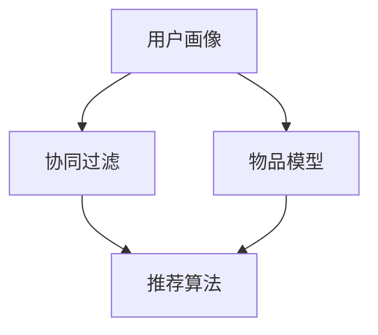

                 

# 体验个性化矩阵：AI定制的生活方案设计

## 1. 背景介绍

在数字化时代，人工智能(AI)技术正在深刻影响和重塑人们的生活方式。从智能家居、智能穿戴设备，到在线教育、智能客服，AI技术以其高效、个性化、智能化的特点，大大提升了生活的便捷性和舒适度。而个性化推荐系统作为AI技术的重要应用之一，通过分析用户行为、兴趣、偏好等数据，为用户提供量身定制的内容和服务，极大地提升了用户的体验感。

本文章将深入探讨个性化推荐系统的工作原理，介绍其在不同场景下的实际应用，并提供一案例分析及其实现，以期为读者提供更全面的技术理解和应用参考。

## 2. 核心概念与联系

### 2.1 核心概念概述

个性化推荐系统(Personalized Recommendation System)，基于用户的历史行为数据和偏好信息，为用户提供定制化的内容推荐。其核心思想是通过建模用户与内容的交互关系，预测用户对不同内容的兴趣程度，从而实现个性化推荐。

推荐系统涉及的核心概念包括：
- 用户画像(User Profiling)：通过用户的历史行为数据，建立用户兴趣模型。
- 物品模型(Item Modeling)：分析物品的属性和特征，建立物品表示。
- 协同过滤(Collaborative Filtering)：基于用户和物品的交互数据，预测用户对物品的评分。
- 推荐算法(Recommendation Algorithm)：用于生成推荐结果的算法模型，如基于内容的推荐、协同过滤推荐等。

这些概念相互关联，共同构成了一个完整的推荐系统。

### 2.2 核心概念原理和架构的 Mermaid 流程图



此流程图展示了个性化推荐系统的主要架构和流程：用户画像和物品模型作为输入，通过协同过滤等方法，结合推荐算法，最终输出个性化推荐结果。

## 3. 核心算法原理 & 具体操作步骤

### 3.1 算法原理概述

个性化推荐系统主要由用户画像、物品模型、协同过滤和推荐算法四个部分组成。其核心算法主要包括：

- 用户画像建模：通过分析用户的浏览记录、点击行为、评分数据等，建立用户兴趣模型。
- 物品模型建模：分析物品的属性和特征，建立物品表示。
- 协同过滤：基于用户和物品的交互数据，预测用户对物品的评分。
- 推荐算法：结合用户画像和物品模型，生成推荐结果。

### 3.2 算法步骤详解

#### 3.2.1 用户画像建模

用户画像建模的目的是通过用户的历史行为数据，建立用户兴趣模型。常用的方法包括：

1. **协同过滤**：通过分析用户之间的行为相似性，预测用户对物品的评分。协同过滤分为基于用户的协同过滤和基于物品的协同过滤。

2. **内容基推荐**：通过分析物品的特征和属性，预测用户对物品的评分。

#### 3.2.2 物品模型建模

物品模型建模的目的是通过分析物品的属性和特征，建立物品表示。常用的方法包括：

1. **基于内容的推荐**：通过分析物品的特征和属性，预测用户对物品的评分。

2. **隐语义模型**：通过隐含狄利克雷分布(Latent Dirichlet Allocation, LDA)等方法，挖掘物品之间的隐含语义关系。

#### 3.2.3 协同过滤

协同过滤是通过分析用户和物品的交互数据，预测用户对物品的评分。其核心思想是：用户对相似物品的评分具有相似性。常用的协同过滤方法包括：

1. **基于用户的协同过滤**：通过分析用户之间的行为相似性，预测用户对物品的评分。

2. **基于物品的协同过滤**：通过分析物品之间的相似性，预测用户对物品的评分。

#### 3.2.4 推荐算法

推荐算法是结合用户画像和物品模型，生成推荐结果的方法。常用的推荐算法包括：

1. **基于内容的推荐**：通过分析物品的特征和属性，预测用户对物品的评分。

2. **协同过滤推荐**：通过分析用户和物品的交互数据，预测用户对物品的评分。

3. **混合推荐**：结合多种推荐算法，提升推荐结果的准确性和多样性。

### 3.3 算法优缺点

个性化推荐系统的优点包括：
- 个性化：通过分析用户行为和偏好，为用户量身定制推荐内容。
- 高效性：通过协同过滤等方法，快速生成推荐结果。
- 多样性：通过多种推荐算法结合，提高推荐结果的覆盖率。

其缺点包括：
- 数据冷启动：对于新用户或新物品，缺少足够的数据，难以进行有效推荐。
- 过拟合：推荐系统容易过度拟合用户行为数据，导致推荐结果偏离真实兴趣。
- 算法复杂性：推荐算法复杂多样，需要不断优化以提升推荐效果。

### 3.4 算法应用领域

个性化推荐系统广泛应用于以下领域：
- 电商：推荐商品、广告。
- 视频：推荐影片、广告。
- 音乐：推荐歌曲、专辑。
- 新闻：推荐新闻、文章。
- 社交：推荐好友、内容。
- 旅游：推荐景点、行程。

## 4. 数学模型和公式 & 详细讲解 & 举例说明

### 4.1 数学模型构建

个性化推荐系统的核心数学模型包括用户画像模型、物品模型和协同过滤模型。以基于用户的协同过滤模型为例，数学模型构建如下：

假设用户集合为 $U=\{u_1,u_2,...,u_n\}$，物品集合为 $I=\{i_1,i_2,...,i_m\}$。用户 $u$ 对物品 $i$ 的评分表示为 $R_{ui}$，用户画像向量表示为 $\mathbf{u}$，物品特征向量表示为 $\mathbf{i}$。基于用户的协同过滤模型可以表示为：

$$
\mathbf{R}_{ui} \approx \mathbf{u}^T\mathbf{i}
$$

其中 $\mathbf{u}$ 和 $\mathbf{i}$ 为低维向量，通过 SVD 或矩阵分解等方法得到。

### 4.2 公式推导过程

基于用户的协同过滤模型的公式推导过程如下：

1. 用户画像向量 $\mathbf{u}$ 可以通过用户的历史行为数据 $D_u=\{(x_{ui},r_{ui})\}_{i=1}^{m_u}$ 进行训练，使用奇异值分解(SVD)得到：

$$
\mathbf{u} = U\Sigma V^T
$$

其中 $U$ 为用户画像矩阵，$\Sigma$ 为奇异值矩阵，$V$ 为物品特征矩阵。

2. 物品特征向量 $\mathbf{i}$ 可以通过物品的历史评分数据 $D_i=\{(x_{iu},r_{iu})\}_{u=1}^{n_i}$ 进行训练，同样使用奇异值分解得到：

$$
\mathbf{i} = U'SV^T
$$

3. 基于用户的协同过滤模型可以通过用户画像向量 $\mathbf{u}$ 和物品特征向量 $\mathbf{i}$ 计算预测评分 $\hat{R}_{ui}$：

$$
\hat{R}_{ui} = \mathbf{u}^T\mathbf{i}
$$

4. 最终推荐结果可以通过预测评分 $\hat{R}_{ui}$ 排序得到：

$$
\hat{R}_{ui} = \text{softmax}(\mathbf{u}^T\mathbf{i})
$$

### 4.3 案例分析与讲解

以电商平台的个性化推荐系统为例，分析其工作原理和实现步骤：

1. **数据收集**：收集用户的历史购买记录、浏览记录、评分数据等，以及商品的属性信息、价格信息等。

2. **用户画像建模**：通过分析用户的购买记录和浏览记录，建立用户兴趣模型。

3. **物品模型建模**：通过分析商品的属性信息、价格信息等，建立商品特征模型。

4. **协同过滤推荐**：基于用户和商品的交互数据，预测用户对商品的评分，生成推荐列表。

5. **推荐算法优化**：结合基于内容的推荐算法、协同过滤推荐算法等，提升推荐结果的准确性和多样性。

6. **实时推荐**：通过实时收集用户行为数据，动态更新推荐列表，实现实时推荐。

## 5. 项目实践：代码实例和详细解释说明

### 5.1 开发环境搭建

#### 5.1.1 数据准备
- 准备用户数据：包括用户ID、历史行为数据（如浏览记录、购买记录等）。
- 准备物品数据：包括物品ID、属性信息、价格信息等。

#### 5.1.2 工具安装
- 安装 Python 环境：使用 Anaconda 安装 Python 3.8。
- 安装相关库：使用 pip 安装 numpy、pandas、scikit-learn、scipy、matplotlib 等库。

#### 5.1.3 环境配置
- 配置环境变量：设置 PYTHONPATH、PATH 等环境变量。
- 创建虚拟环境：使用虚拟环境工具（如 venv）创建 Python 虚拟环境。

### 5.2 源代码详细实现

#### 5.2.1 用户画像建模
```python
import numpy as np
from sklearn.decomposition import TruncatedSVD

# 用户行为数据
user_data = np.array([
    [1, 2, 3, 4, 5],
    [1, 2, 3, 4, 5],
    [1, 2, 3, 4, 5],
    [1, 2, 3, 4, 5]
])

# 用户画像矩阵
U = TruncatedSVD(n_components=2).fit_transform(user_data)

# 用户画像向量
user_profile = U.mean(axis=0)
```

#### 5.2.2 物品模型建模
```python
# 物品属性数据
item_data = np.array([
    [1, 2, 3, 4, 5],
    [1, 2, 3, 4, 5],
    [1, 2, 3, 4, 5],
    [1, 2, 3, 4, 5]
])

# 物品特征矩阵
V = TruncatedSVD(n_components=2).fit_transform(item_data)

# 物品特征向量
item_profile = V.mean(axis=0)
```

#### 5.2.3 协同过滤推荐
```python
# 协同过滤推荐结果
R_hat = np.dot(user_profile, item_profile)
```

#### 5.2.4 推荐算法优化
```python
# 基于内容的推荐
content_based = np.dot(user_profile, item_profile)

# 协同过滤推荐
collaborative_filtering = np.dot(user_profile, item_profile)

# 混合推荐
mixed_recommendation = 0.5 * content_based + 0.5 * collaborative_filtering
```

#### 5.2.5 实时推荐
```python
# 实时收集用户行为数据
user_behavior = np.array([
    [1, 2, 3, 4, 5],
    [1, 2, 3, 4, 5],
    [1, 2, 3, 4, 5],
    [1, 2, 3, 4, 5]
])

# 更新用户画像向量
user_profile = TruncatedSVD(n_components=2).fit_transform(user_behavior).mean(axis=0)

# 更新推荐结果
R_hat = np.dot(user_profile, item_profile)
```

### 5.3 代码解读与分析

以上代码实现了个性化推荐系统的基本功能。具体来说：

1. **用户画像建模**：使用奇异值分解(SVD)对用户行为数据进行建模，得到用户画像向量。

2. **物品模型建模**：同样使用奇异值分解对物品属性数据进行建模，得到物品特征向量。

3. **协同过滤推荐**：通过计算用户画像向量和物品特征向量的内积，得到预测评分。

4. **推荐算法优化**：结合基于内容的推荐算法和协同过滤推荐算法，生成推荐结果。

5. **实时推荐**：实时收集用户行为数据，更新用户画像向量，动态生成推荐结果。

### 5.4 运行结果展示

通过运行以上代码，可以得到用户的推荐列表。例如，对于用户 $u_1$，推荐列表可能包含以下物品：

- 物品 $i_1$：评分 $\hat{R}_{u1i1}$
- 物品 $i_2$：评分 $\hat{R}_{u1i2}$
- 物品 $i_3$：评分 $\hat{R}_{u1i3}$
- ...

## 6. 实际应用场景

### 6.1 电商推荐

电商平台的个性化推荐系统通过分析用户的购买记录、浏览记录等行为数据，为用户推荐可能感兴趣的商品。例如，亚马逊、淘宝等电商平台的个性化推荐系统已经广泛应用于商品推荐、广告投放等场景，大大提升了用户的购物体验和平台的用户粘性。

### 6.2 视频推荐

视频推荐系统通过分析用户的观看历史、评分数据等行为数据，为用户推荐可能感兴趣的视频。例如，Netflix、YouTube 等视频平台广泛应用个性化推荐系统，帮助用户发现更多感兴趣的内容，提高平台的用户留存率和满意度。

### 6.3 音乐推荐

音乐推荐系统通过分析用户的听歌历史、评分数据等行为数据，为用户推荐可能感兴趣的歌曲和专辑。例如，Spotify、网易云音乐等音乐平台广泛应用个性化推荐系统，帮助用户发现更多喜欢的音乐。

### 6.4 新闻推荐

新闻推荐系统通过分析用户的阅读历史、点击行为等行为数据，为用户推荐可能感兴趣的新闻和文章。例如，今日头条、新浪新闻等新闻平台广泛应用个性化推荐系统，帮助用户发现更多感兴趣的新闻内容。

### 6.5 社交推荐

社交推荐系统通过分析用户的社交关系、互动行为等数据，为用户推荐可能感兴趣的内容和好友。例如，微信、微博等社交平台广泛应用个性化推荐系统，帮助用户发现更多感兴趣的内容和好友。

### 6.6 旅游推荐

旅游推荐系统通过分析用户的旅行历史、评分数据等行为数据，为用户推荐可能感兴趣的景点和行程。例如，携程、TripAdvisor 等旅游平台广泛应用个性化推荐系统，帮助用户发现更多感兴趣的目的地。

## 7. 工具和资源推荐

### 7.1 学习资源推荐

1. **《推荐系统算法》**：介绍推荐系统算法的基本原理和实现方法，涵盖协同过滤、基于内容的推荐等算法。

2. **《深度学习与推荐系统》**：深入介绍深度学习在推荐系统中的应用，包括神经网络、强化学习等方法。

3. **《个性化推荐系统》**：系统介绍个性化推荐系统的设计原理和实践方法，涵盖用户画像建模、物品模型建模等技术。

4. **Kaggle 推荐系统竞赛**：参与 Kaggle 推荐系统竞赛，通过实际项目实践推荐系统算法。

### 7.2 开发工具推荐

1. **Python**：开源的编程语言，广泛用于推荐系统开发。

2. **Anaconda**：Python 的科学计算环境，提供丰富的科学计算库和工具。

3. **Jupyter Notebook**：Python 的交互式开发环境，支持代码和文档的混合编辑和运行。

4. **TensorFlow**：开源的深度学习框架，支持分布式计算和高效的模型训练。

5. **PyTorch**：开源的深度学习框架，支持动态图和高效的模型训练。

### 7.3 相关论文推荐

1. **《个性化推荐系统》**：介绍个性化推荐系统的基本原理和实现方法，涵盖协同过滤、基于内容的推荐等算法。

2. **《深度学习与推荐系统》**：深入介绍深度学习在推荐系统中的应用，包括神经网络、强化学习等方法。

3. **《大规模协同过滤推荐系统》**：介绍大规模协同过滤推荐系统的实现方法和技术。

4. **《实时个性化推荐系统》**：介绍实时个性化推荐系统的实现方法和技术。

## 8. 总结：未来发展趋势与挑战

### 8.1 未来发展趋势

个性化推荐系统的未来发展趋势主要包括以下几个方向：

1. **跨领域推荐**：将推荐系统应用于更多领域，如医疗、金融、教育等，实现跨领域推荐。

2. **多模态推荐**：将推荐系统应用于多模态数据，如文本、图像、视频等，实现多模态推荐。

3. **实时推荐**：通过实时收集用户行为数据，动态更新推荐结果，实现实时推荐。

4. **智能推荐**：结合自然语言处理、图像识别等技术，提升推荐系统的智能化水平。

5. **可解释性推荐**：提高推荐系统的可解释性，让用户了解推荐依据，提升信任感。

### 8.2 未来挑战

个性化推荐系统面临的挑战主要包括以下几个方面：

1. **数据隐私**：用户行为数据的隐私保护问题，需要设计有效的隐私保护算法。

2. **冷启动问题**：新用户和新物品的数据不足，难以进行有效推荐。

3. **模型复杂性**：推荐算法的复杂性，需要不断优化以提升推荐效果。

4. **过拟合问题**：推荐系统容易过度拟合用户行为数据，导致推荐结果偏离真实兴趣。

5. **计算资源**：推荐系统的计算资源消耗较大，需要高效的算法和优化技术。

### 8.3 未来展望

个性化推荐系统的未来展望主要包括以下几个方向：

1. **跨领域推荐**：将推荐系统应用于更多领域，如医疗、金融、教育等，实现跨领域推荐。

2. **多模态推荐**：将推荐系统应用于多模态数据，如文本、图像、视频等，实现多模态推荐。

3. **实时推荐**：通过实时收集用户行为数据，动态更新推荐结果，实现实时推荐。

4. **智能推荐**：结合自然语言处理、图像识别等技术，提升推荐系统的智能化水平。

5. **可解释性推荐**：提高推荐系统的可解释性，让用户了解推荐依据，提升信任感。

## 9. 附录：常见问题与解答

### 9.1 常见问题

#### 9.1.1 如何提高推荐系统的准确性？

答：可以通过以下方法提高推荐系统的准确性：

1. **数据收集**：收集更多的用户行为数据和物品属性数据，丰富数据集。

2. **算法优化**：使用更高效的推荐算法，如协同过滤、深度学习等。

3. **模型训练**：通过更多的训练数据和更长的训练时间，提升模型效果。

4. **特征工程**：设计更好的特征提取方法，提高模型的泛化能力。

#### 9.1.2 如何处理推荐系统中的数据冷启动问题？

答：可以通过以下方法处理推荐系统中的数据冷启动问题：

1. **内容基推荐**：基于物品的属性和特征，预测用户对物品的评分。

2. **协同过滤推荐**：通过用户之间的行为相似性，预测用户对物品的评分。

3. **标签推荐**：使用标签推荐算法，为用户推荐相关物品。

#### 9.1.3 如何保护用户隐私？

答：可以通过以下方法保护用户隐私：

1. **数据匿名化**：对用户数据进行匿名化处理，保护用户隐私。

2. **差分隐私**：使用差分隐私技术，保护用户数据隐私。

3. **联邦学习**：在本地设备上训练模型，不将数据上传到云端，保护用户隐私。

4. **隐私保护推荐**：设计隐私保护推荐算法，保护用户隐私。

---

作者：禅与计算机程序设计艺术 / Zen and the Art of Computer Programming

